

### 257

|Name|RAJ2000[deg]|DEJ2000[deg] |Ext[arcmin]| Ext,ml | z | z_src| C|GC(XSZ,Delta_z<0.01)| GC(OPT,Delta_z<0.01)|GC| R_sig[arcmin] | R500[arcmin] | R500[Mpc]| CRsig[c/s] | CR500[c/s] |L500[1E44 erg/s]|F500[1E-12 erg/s/cm^2]| M500[1E14 Msun]|Tx[keV]|Cnt_sig|Beta|Rc[arcmin]|Comment|Alias|
|---|---|---|---|---|---|------|---|--------|---------|----------|---|---|---|---|---|---|---|---|---|---|---|---|---|---|
|257| 106.091| 63.313| 2.41| 90.49| 0.0924(0.009)| z1, z_xsz| B| MCXC, PSZ2, Tar, XB| A, W| A, MCXC, N, PSZ2, Tar, W, XB| 14.825| 9.457| 0.975| 0.354(0.063)| 0.334(0.059)| 1.318(0.112)| 6.153(0.525)| 2.88(0.12)| 4.24(0.11)| 132.8| 0.813(-0.089+0.103)| 4.105(-0.751+0.776)| -| k285|

|[RASS image](../image/257/257_img.pdf)|[filtered image](../image/257/257_fil.pdf)|[Segment image](../image/257/257_seg.pdf)|
|-------------------|--------------------|-------------------|
| 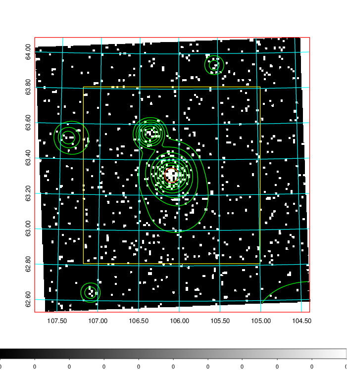  | 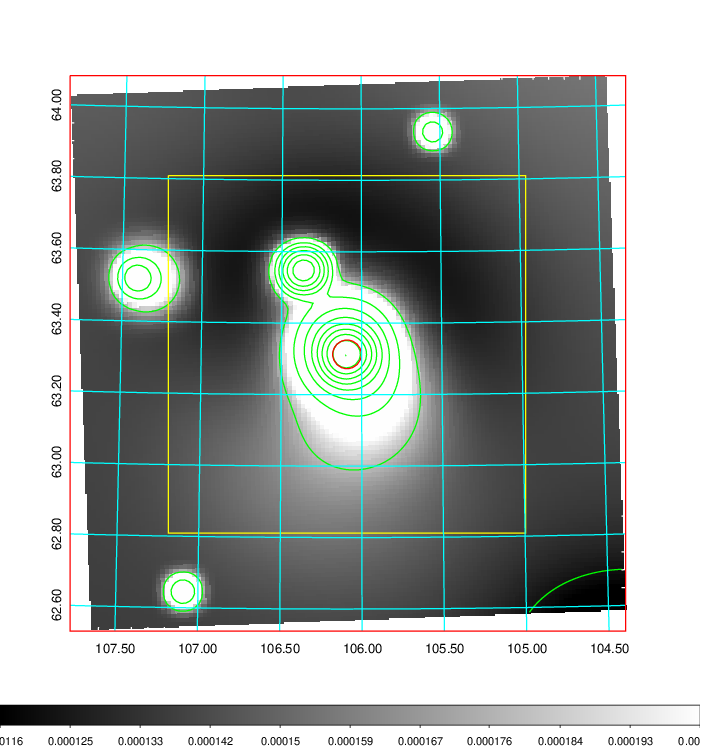   | 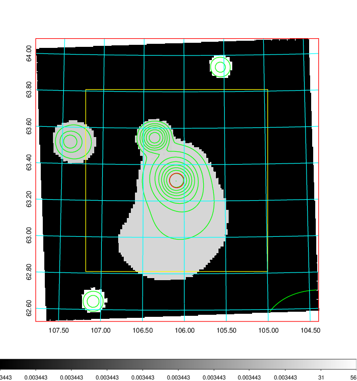  |

|[Exposure image](../image/257/257_mex.pdf)| [nH image](../image/257/257_nh.pdf)| [Planck image](../image/257/257_p.pdf)|
|-------------------|--------------------|-------------------|
|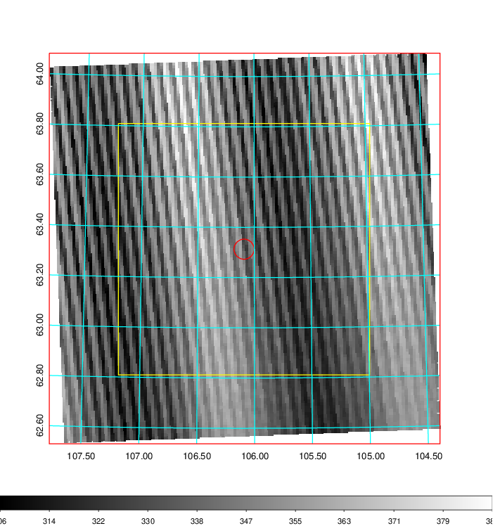   | 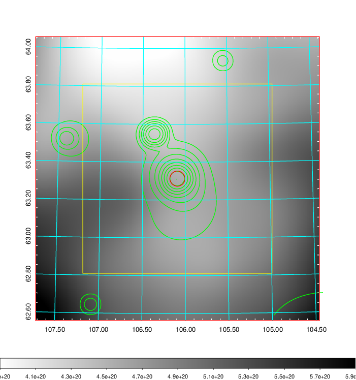    | 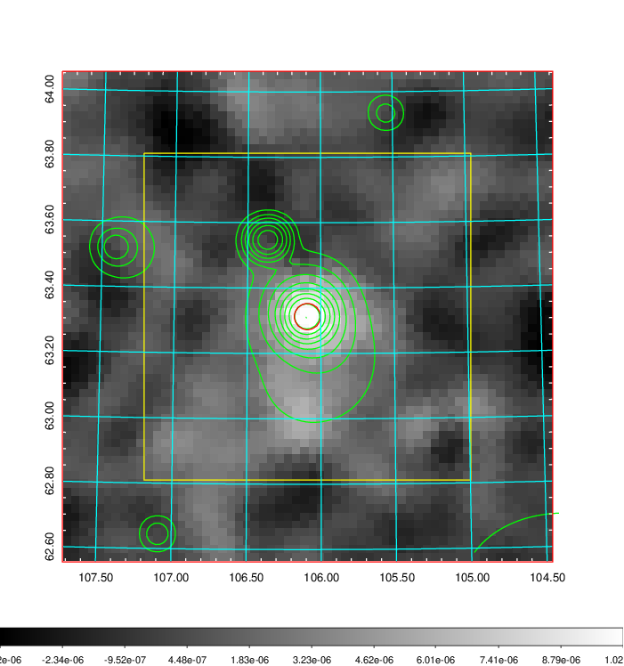 |

|[Redshift Histogram](../image/257/257_zg.pdf) | [DSS image(z1)](../image/257/257_dss_z1.pdf)      |  [DSS image(z2)](../image/257/257_dss_z2.pdf)    |
|-------------------|--------------------|-------------------|
|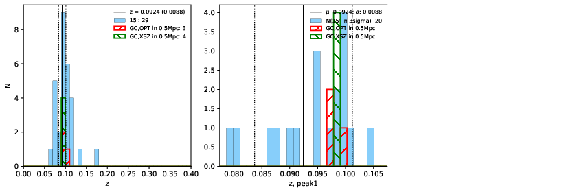 |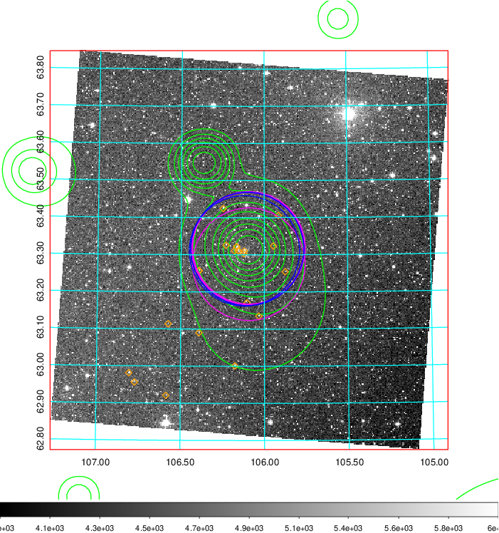  Blue circle for optical clusters;  Magenta circle for XSZ clusters;  all with r=1Mpc;  Only GC with Delta_z<0.01 are shown. | 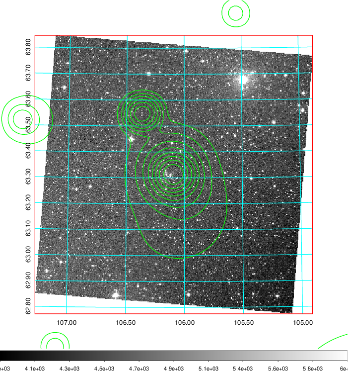 Blue circle for optical clusters;  Magenta circle for XSZ clusters;  all with r=1Mpc;  Only GC with Delta_z<0.01 are shown.  |

|[Previous-identified clusters](../image/257/257_gc.pdf) | [2MASS image](../image/257/257_2mass.pdf)      |
|-------------------|-------------------|
|  Green, magenta, and blue circles  for optical, X-ray and SZ clusters  respectively, with redshift of clusters  labelled. The radius of circles  are 1Mpc.|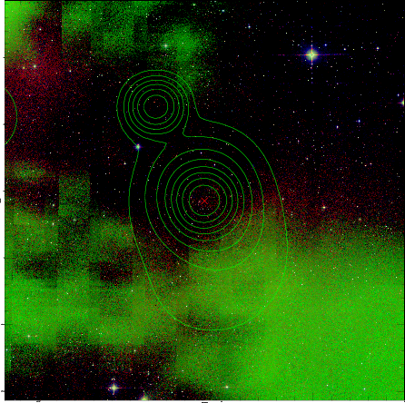  |

|[PS1 image](../image/257/257_ps1.pdf)            |
|-------------------|
| 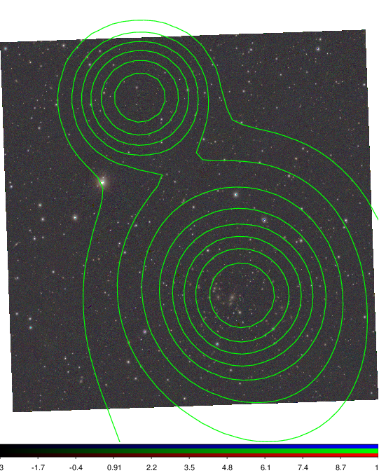  |
