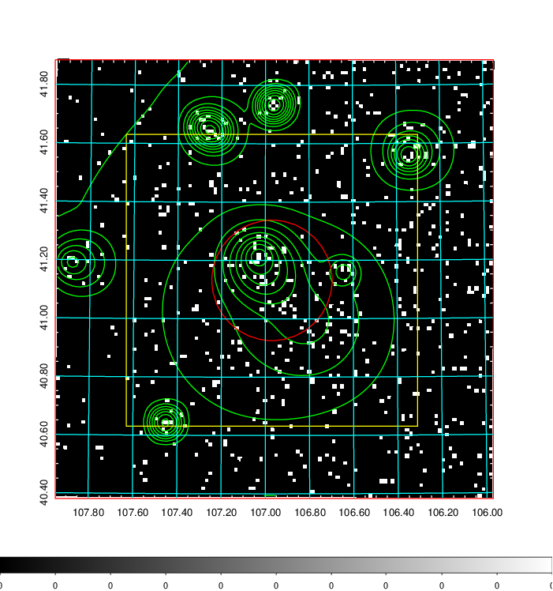
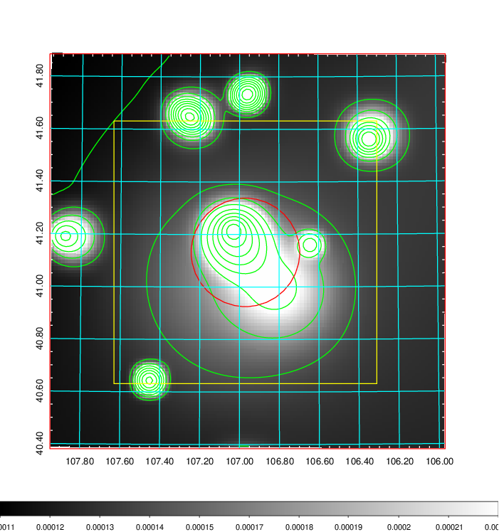
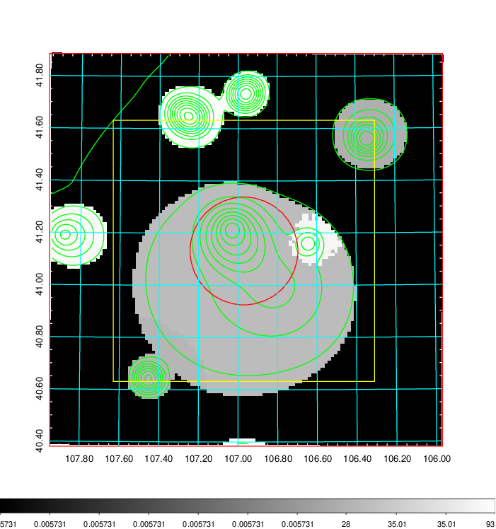
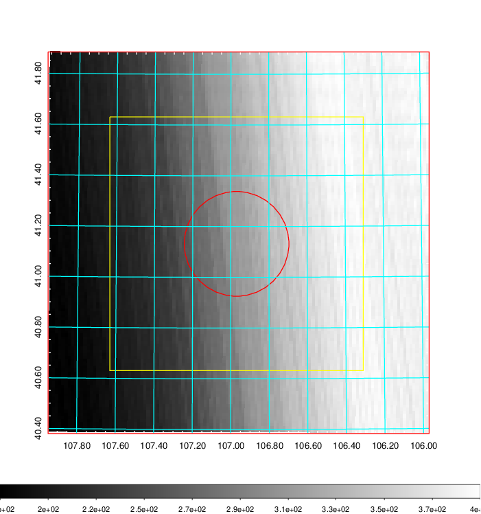
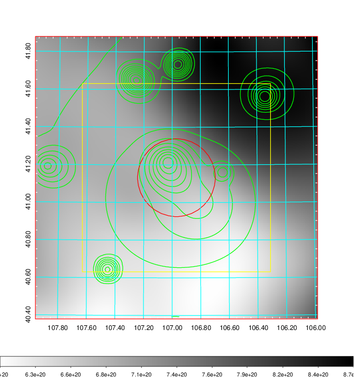
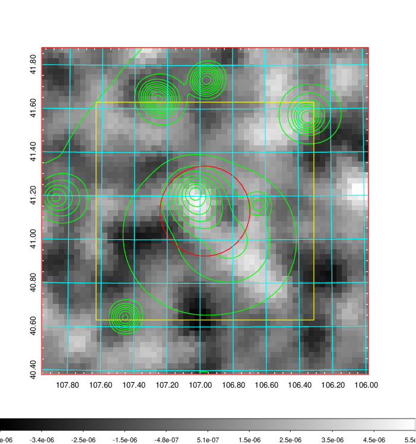
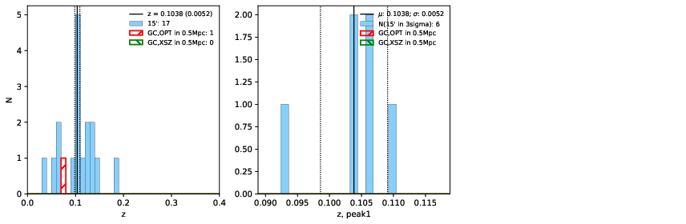
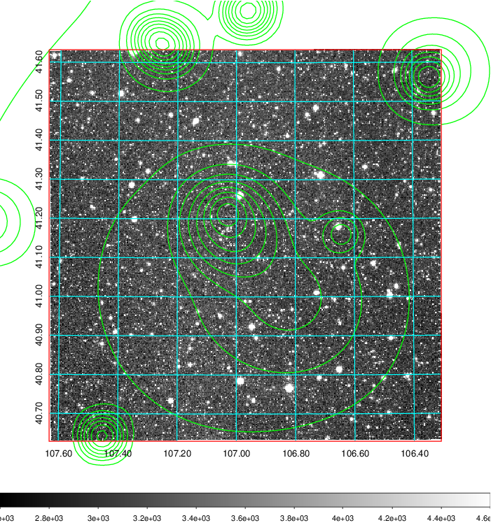
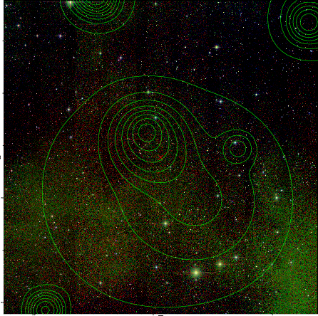

### 258

|Name|RAJ2000[deg]|DEJ2000[deg] |Ext[arcmin]| Ext,ml | z | z_src| C|GC(XSZ,Delta_z<0.01)| GC(OPT,Delta_z<0.01)|GC| R_sig[arcmin] | R500[arcmin] | R500[Mpc]| CRsig[c/s] | CR500[c/s] |L500[1E44 erg/s]|F500[1E-12 erg/s/cm^2]| M500[1E14 Msun]|Tx[keV]|Cnt_sig|Beta|Rc[arcmin]|Comment|Alias|
|---|---|---|---|---|---|------|---|--------|---------|----------|---|---|---|---|---|---|---|---|---|---|---|---|---|---|
|258| 106.970| 41.132| 12.39| 40.62| 0.1038(0.005)| z1,| G| -| -| Tar, W| 37.135| 9.026| 1.032| 0.380(0.095)| 0.338(0.085)| 1.669(0.540)| 6.081(1.965)| 3.46(0.55)| 4.75(0.48)| 123.5| 0.506(-0.004+0.010)| 7.987(-0.340+0.309)| An SZ cluster with no $z$ and offset = 0.23 Mpc| t499|

|[RASS image](../image/258/258_img.pdf)|[filtered image](../image/258/258_fil.pdf)|[Segment image](../image/258/258_seg.pdf)|
|-------------------|--------------------|-------------------|
|   |    |   |

|[Exposure image](../image/258/258_mex.pdf)| [nH image](../image/258/258_nh.pdf)| [Planck image](../image/258/258_p.pdf)|
|-------------------|--------------------|-------------------|
|   |     |  |

|[Redshift Histogram](../image/258/258_zg.pdf) | [DSS image(z1)](../image/258/258_dss_z1.pdf)      |  [DSS image(z2)](../image/258/258_dss_z2.pdf)    |
|-------------------|--------------------|-------------------|
| |  Blue circle for optical clusters;  Magenta circle for XSZ clusters;  all with r=1Mpc;  Only GC with Delta_z<0.01 are shown. |  Blue circle for optical clusters;  Magenta circle for XSZ clusters;  all with r=1Mpc;  Only GC with Delta_z<0.01 are shown.  |

|[known Abell/XSZ clusters](../image/258/258_gc.pdf) | [2MASS image](../image/258/258_2mass.pdf)      |
|-------------------|-------------------|
|  Magenta, blue and green circles  for optical, X-ray and SZ clusters  respectively, with redshift of clusters  labelled. The radius of circles  are 1Mpc.|  |

|[PS1 image](../image/258/258_ps1.pdf)            |
|-------------------|
|   |
