

### 260

|Name|RAJ2000[deg]|DEJ2000[deg] |Ext[arcmin]| Ext,ml | z | z_src| C|GC(XSZ,Delta_z<0.01)| GC(OPT,Delta_z<0.01)|GC| R_sig[arcmin] | R500[arcmin] | R500[Mpc]| CRsig[c/s] | CR500[c/s] |L500[1E44 erg/s]|F500[1E-12 erg/s/cm^2]| M500[1E14 Msun]|Tx[keV]|Cnt_sig|Beta|Rc[arcmin]|Comment|Alias|
|---|---|---|---|---|---|------|---|--------|---------|----------|---|---|---|---|---|---|---|---|---|---|---|---|---|---|
|260| 107.780| 50.176| 6.27| 59.18| 0.0197(0.005)| z1, z_opt| S| -| N| N, Tar, W| 34.165| 24.641| 0.590| 0.641(0.096)| 0.613(0.092)| 0.078(0.008)| 8.889(0.899)| 0.60(0.03)| 1.57(0.05)| 289.0| 0.863(-0.117+0.094)| 19.798(-3.264+2.383)| An SZ cluster with no $z$ and offset = 0.01 Mpc| t321|

|[RASS image](../image/260/260_img.pdf)|[filtered image](../image/260/260_fil.pdf)|[Segment image](../image/260/260_seg.pdf)|
|-------------------|--------------------|-------------------|
| 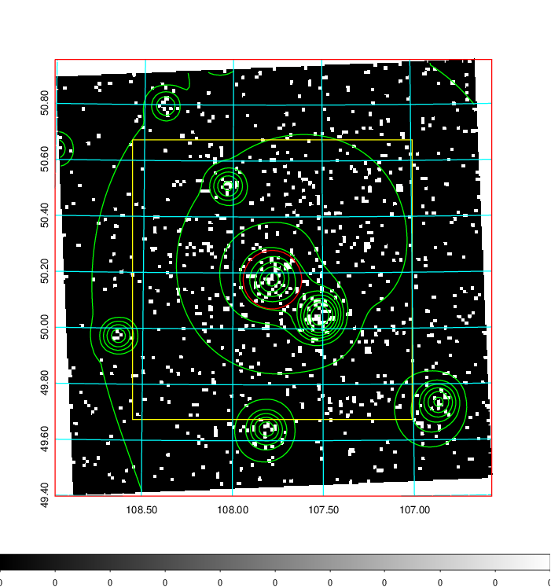  | 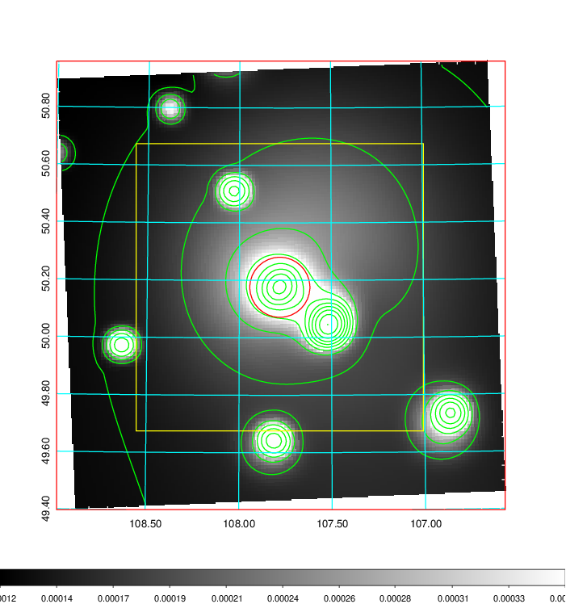   | 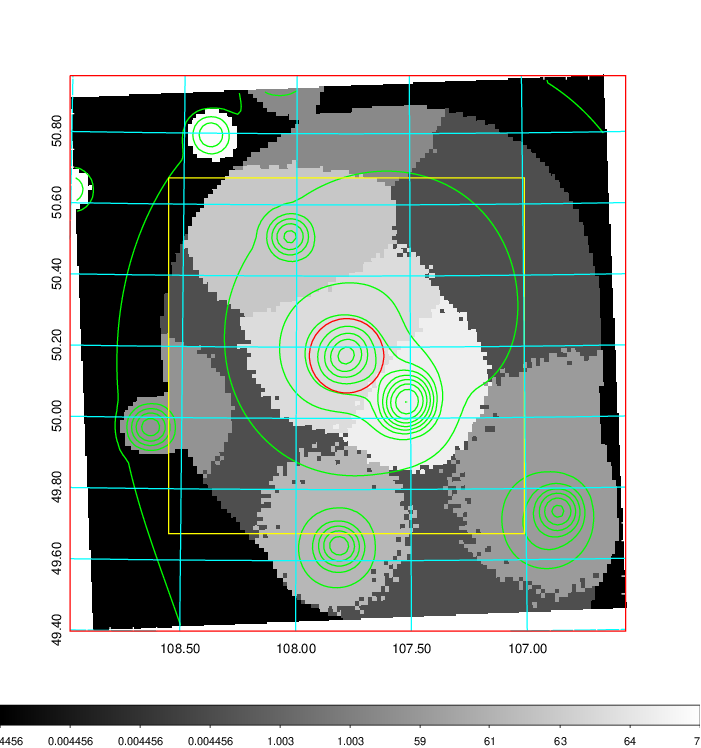  |

|[Exposure image](../image/260/260_mex.pdf)| [nH image](../image/260/260_nh.pdf)| [Planck image](../image/260/260_p.pdf)|
|-------------------|--------------------|-------------------|
|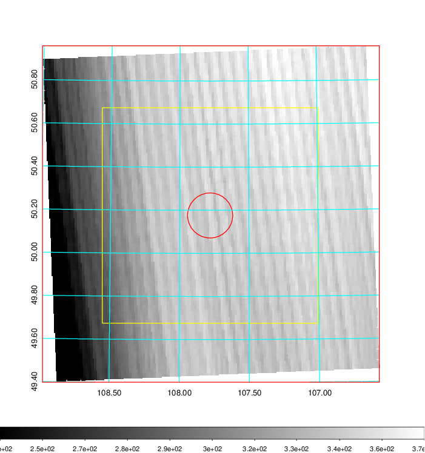   | 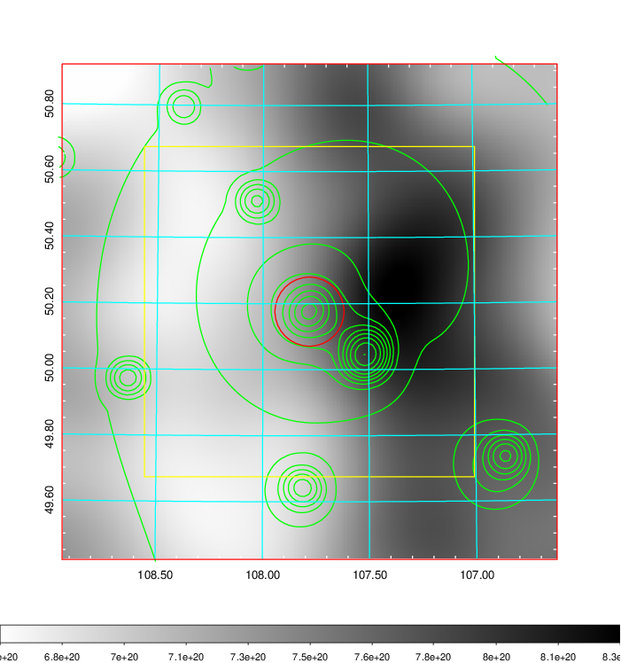    | 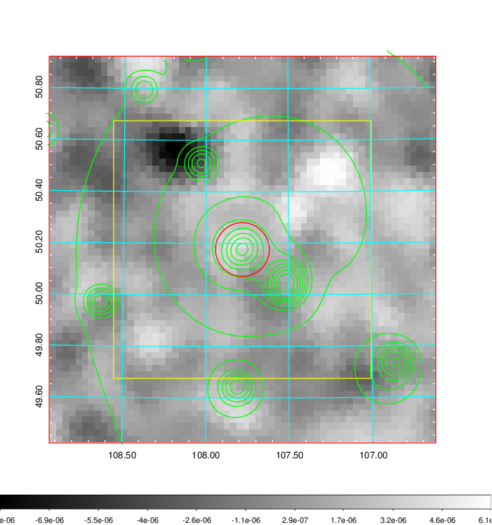 |

|[Redshift Histogram](../image/260/260_zg.pdf) | [DSS image(z1)](../image/260/260_dss_z1.pdf)      |  [DSS image(z2)](../image/260/260_dss_z2.pdf)    |
|-------------------|--------------------|-------------------|
|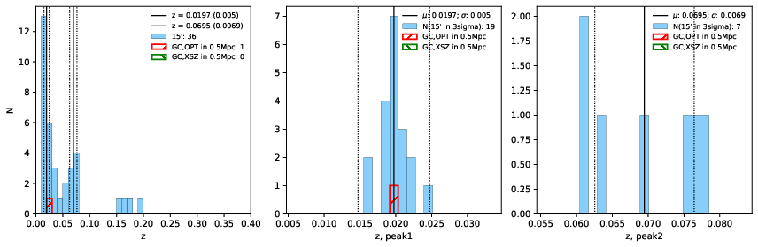 |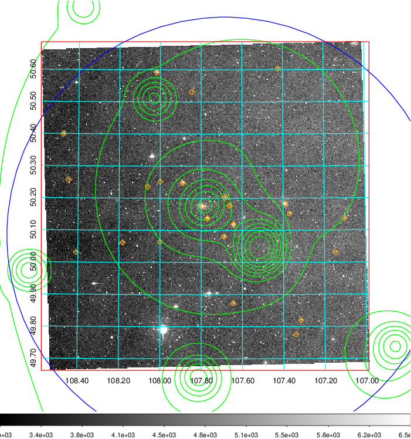  Blue circle for optical clusters;  Magenta circle for XSZ clusters;  all with r=1Mpc;  Only GC with Delta_z<0.01 are shown. | 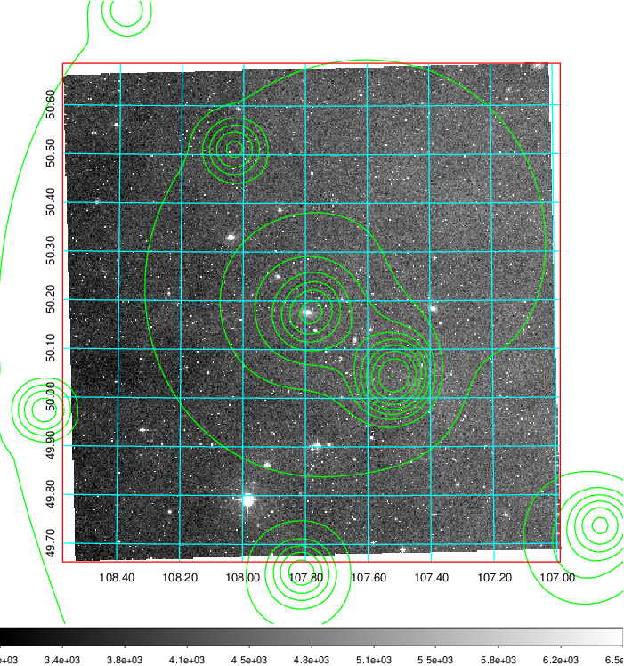 Blue circle for optical clusters;  Magenta circle for XSZ clusters;  all with r=1Mpc;  Only GC with Delta_z<0.01 are shown.  |

|[Previous-identified clusters](../image/260/260_gc.pdf) | [2MASS image](../image/260/260_2mass.pdf)      |
|-------------------|-------------------|
|  Green, magenta, and blue circles  for optical, X-ray and SZ clusters  respectively, with redshift of clusters  labelled. The radius of circles  are 1Mpc.|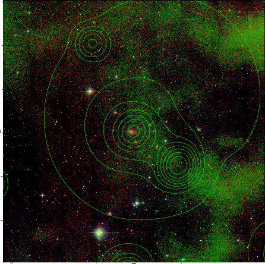  |

|[PS1 image](../image/260/260_ps1.pdf)            |
|-------------------|
| 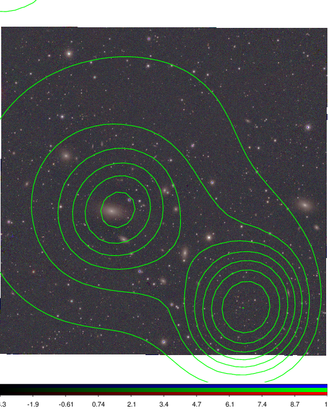  |
