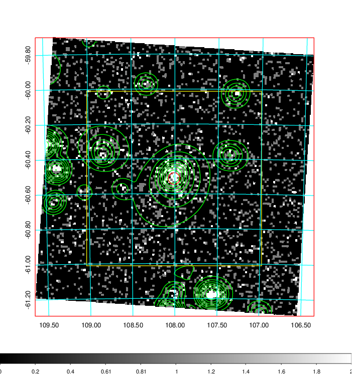
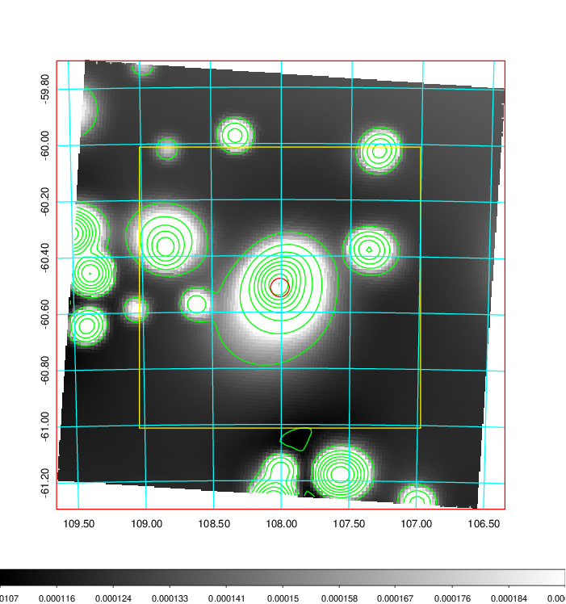
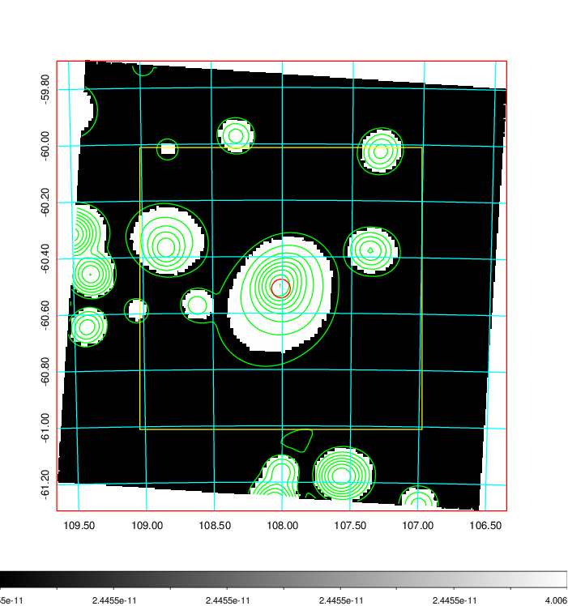
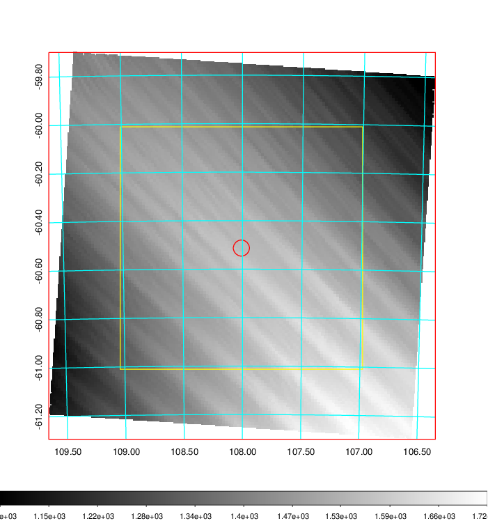
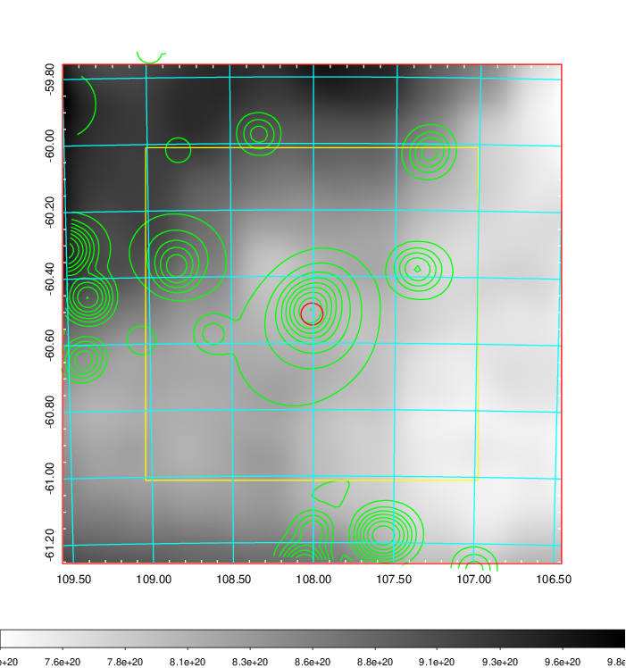
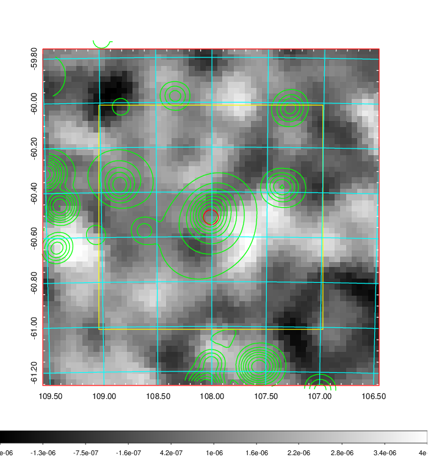
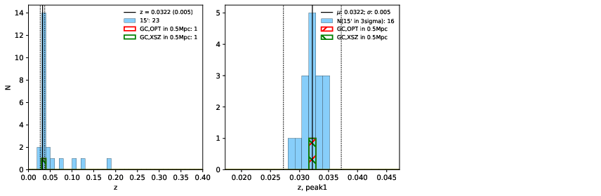
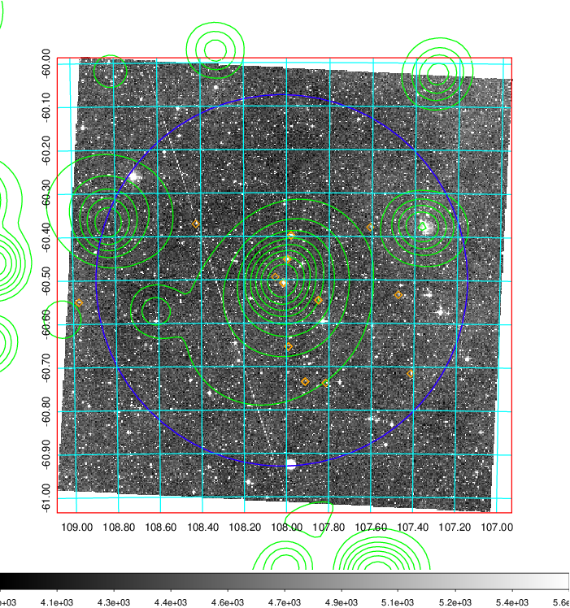
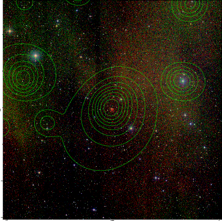

### 261

|Name|RAJ2000[deg]|DEJ2000[deg] |Ext[arcmin]| Ext,ml | z | z_src| C|GC(XSZ,Delta_z<0.01)| GC(OPT,Delta_z<0.01)|GC| R_sig[arcmin] | R500[arcmin] | R500[Mpc]| CRsig[c/s] | CR500[c/s] |L500[1E44 erg/s]|F500[1E-12 erg/s/cm^2]| M500[1E14 Msun]|Tx[keV]|Cnt_sig|Beta|Rc[arcmin]|Comment|Alias|
|---|---|---|---|---|---|------|---|--------|---------|----------|---|---|---|---|---|---|---|---|---|---|---|---|---|---|
|261| 108.009| -60.513| 1.99| 108.73| 0.0322(0.005)| z1, z_xsz| B| MCXC| N| MCXC, N| 14.650| 14.609| 0.564| 0.177(0.018)| 0.177(0.018)| 0.062(0.003)| 2.602(0.145)| 0.53(0.02)| 1.45(0.03)| 267.4| 0.682(-0.077+0.112)| 3.099(-0.671+0.844)| -| k218|

|[RASS image](../image/261/261_img.pdf)|[filtered image](../image/261/261_fil.pdf)|[Segment image](../image/261/261_seg.pdf)|
|-------------------|--------------------|-------------------|
|   |    |   |

|[Exposure image](../image/261/261_mex.pdf)| [nH image](../image/261/261_nh.pdf)| [Planck image](../image/261/261_p.pdf)|
|-------------------|--------------------|-------------------|
|   |     |  |

|[Redshift Histogram](../image/261/261_zg.pdf) | [DSS image(z1)](../image/261/261_dss_z1.pdf)      |  [DSS image(z2)](../image/261/261_dss_z2.pdf)    |
|-------------------|--------------------|-------------------|
| |  Blue circle for optical clusters;  Magenta circle for XSZ clusters;  all with r=1Mpc;  Only GC with Delta_z<0.01 are shown. |  Blue circle for optical clusters;  Magenta circle for XSZ clusters;  all with r=1Mpc;  Only GC with Delta_z<0.01 are shown.  |

|[Previous-identified clusters](../image/261/261_gc.pdf) | [2MASS image](../image/261/261_2mass.pdf)      |
|-------------------|-------------------|
|  Green, magenta, and blue circles  for optical, X-ray and SZ clusters  respectively, with redshift of clusters  labelled. The radius of circles  are 1Mpc.|  |

