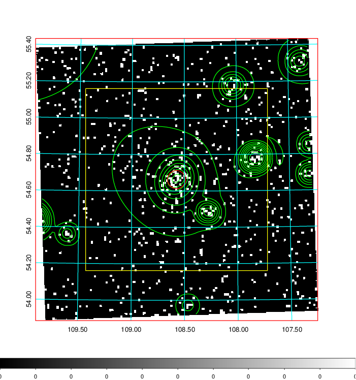
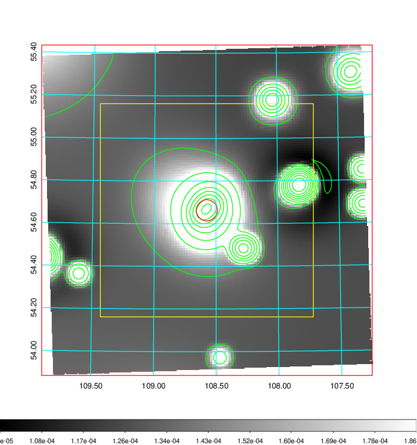
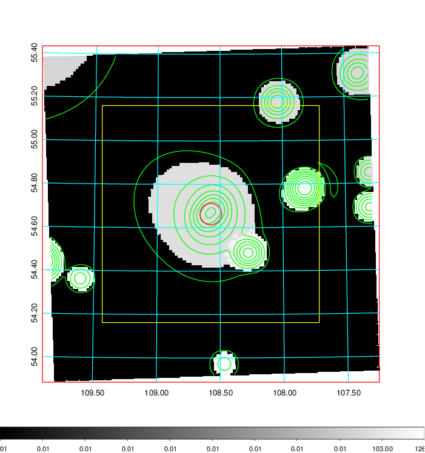
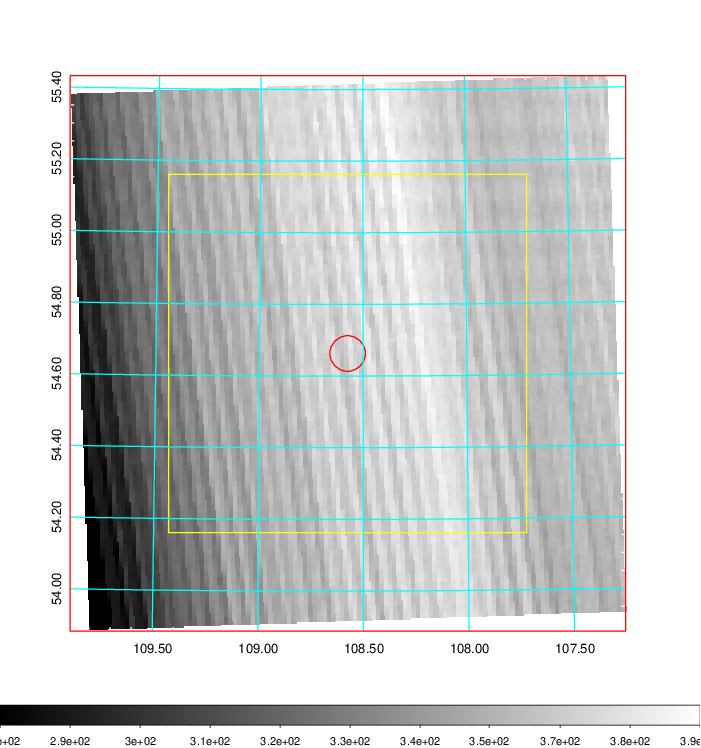
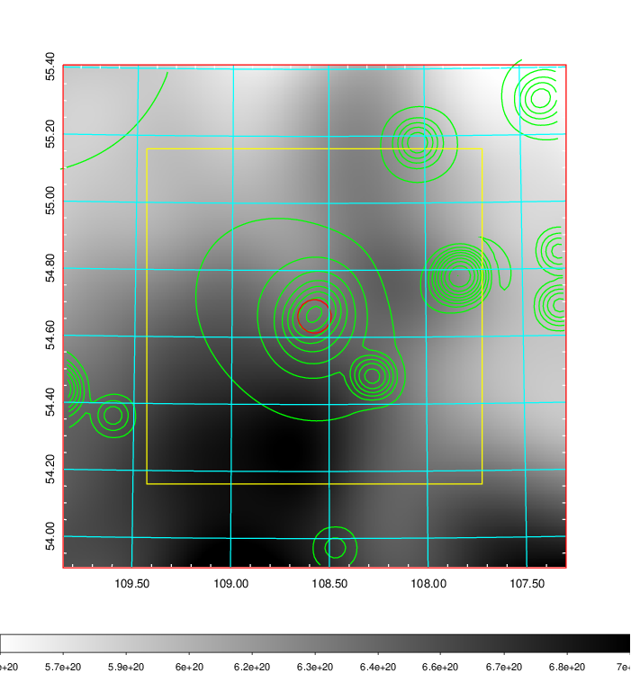
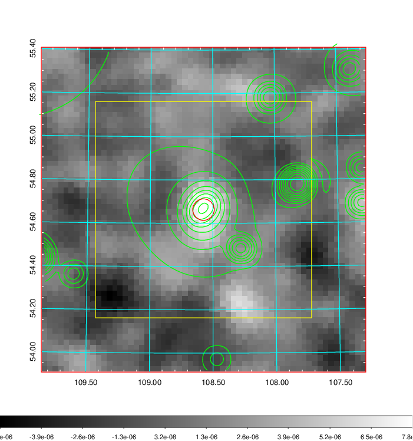
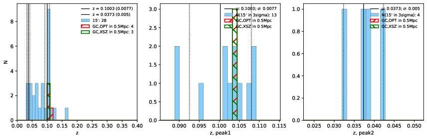
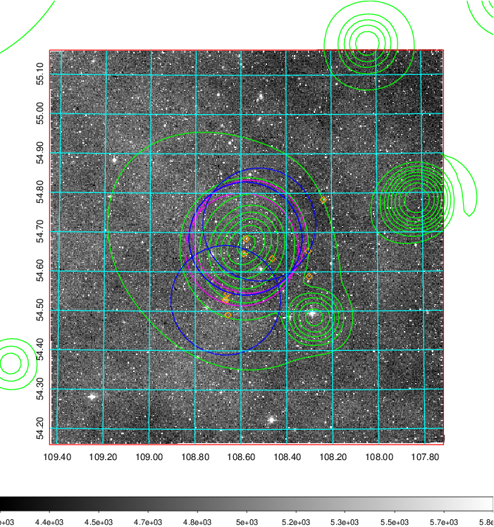
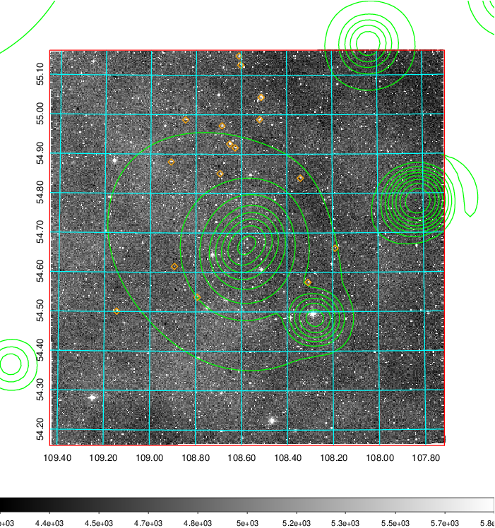
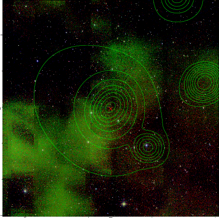

### 262

|Name|RAJ2000[deg]|DEJ2000[deg] |Ext[arcmin]| Ext,ml | z | z_src| C|GC(XSZ,Delta_z<0.01)| GC(OPT,Delta_z<0.01)|GC| R_sig[arcmin] | R500[arcmin] | R500[Mpc]| CRsig[c/s] | CR500[c/s] |L500[1E44 erg/s]|F500[1E-12 erg/s/cm^2]| M500[1E14 Msun]|Tx[keV]|Cnt_sig|Beta|Rc[arcmin]|Comment|Alias|
|---|---|---|---|---|---|------|---|--------|---------|----------|---|---|---|---|---|---|---|---|---|---|---|---|---|---|
|262| 108.575| 54.663| 2.98| 53.21| 0.1003(0.008)| z1, z_xsz| B| MCXC, PSZ2, Tar| A, N| A, MCXC, N, PSZ2, Tar, W| 14.162| 8.405| 0.933| 0.238(0.038)| 0.223(0.035)| 1.017(0.091)| 3.987(0.355)| 2.54(0.11)| 3.93(0.11)| 76.7| 0.674(-0.110+0.165)| 4.197(-1.163+1.451)| -| k375|

|[RASS image](../image/262/262_img.pdf)|[filtered image](../image/262/262_fil.pdf)|[Segment image](../image/262/262_seg.pdf)|
|-------------------|--------------------|-------------------|
|   |    |   |

|[Exposure image](../image/262/262_mex.pdf)| [nH image](../image/262/262_nh.pdf)| [Planck image](../image/262/262_p.pdf)|
|-------------------|--------------------|-------------------|
|   |     |  |

|[Redshift Histogram](../image/262/262_zg.pdf) | [DSS image(z1)](../image/262/262_dss_z1.pdf)      |  [DSS image(z2)](../image/262/262_dss_z2.pdf)    |
|-------------------|--------------------|-------------------|
| |  Blue circle for optical clusters;  Magenta circle for XSZ clusters;  all with r=1Mpc;  Only GC with Delta_z<0.01 are shown. |  Blue circle for optical clusters;  Magenta circle for XSZ clusters;  all with r=1Mpc;  Only GC with Delta_z<0.01 are shown.  |

|[known Abell/XSZ clusters](../image/262/262_gc.pdf) | [2MASS image](../image/262/262_2mass.pdf)      |
|-------------------|-------------------|
|  Magenta, blue and green circles  for optical, X-ray and SZ clusters  respectively, with redshift of clusters  labelled. The radius of circles  are 1Mpc.|  |

|[PS1 image](../image/262/262_ps1.pdf)            |
|-------------------|
|   |
