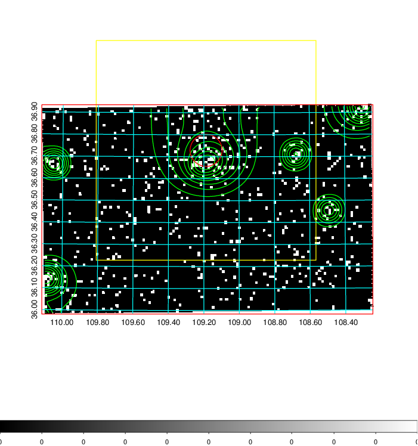
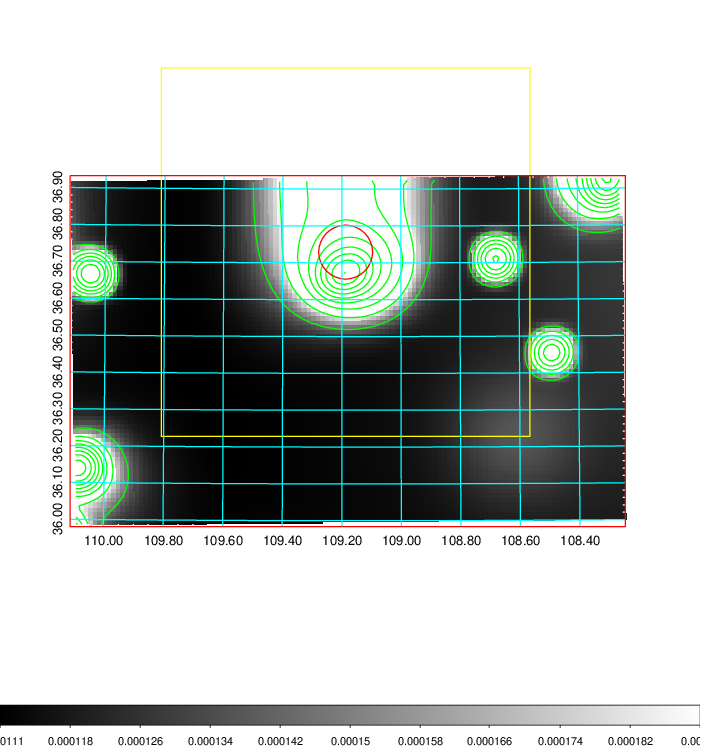
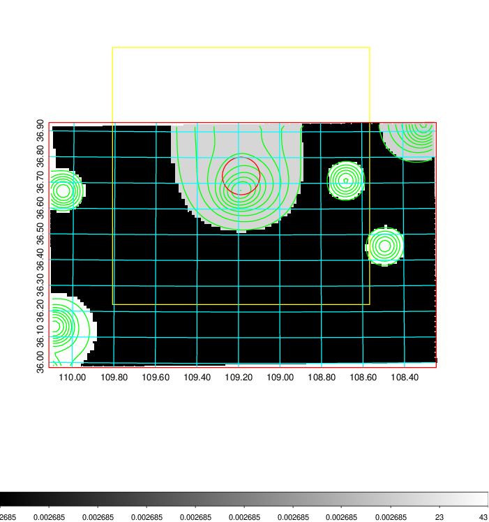
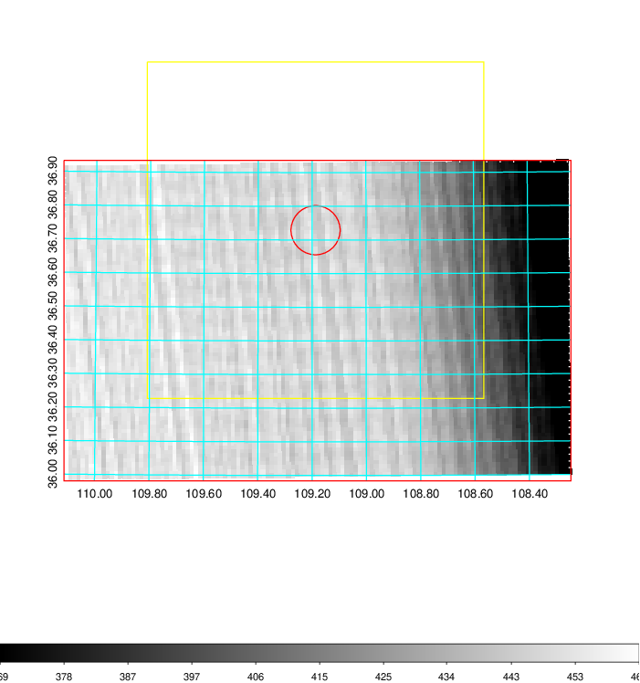
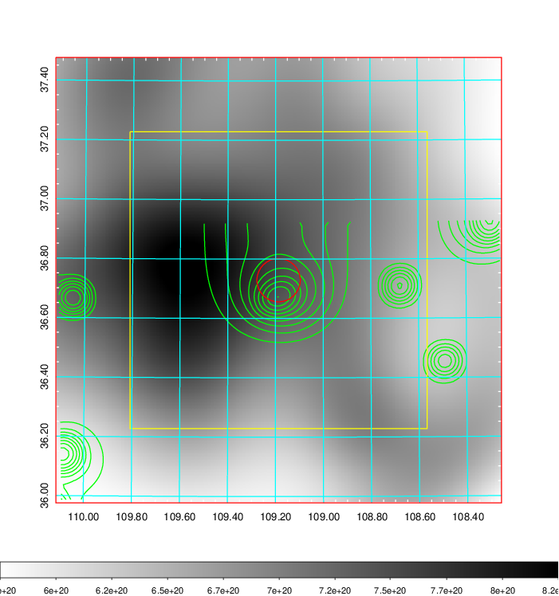
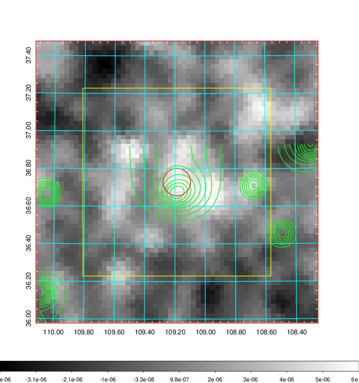
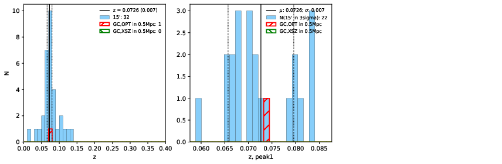
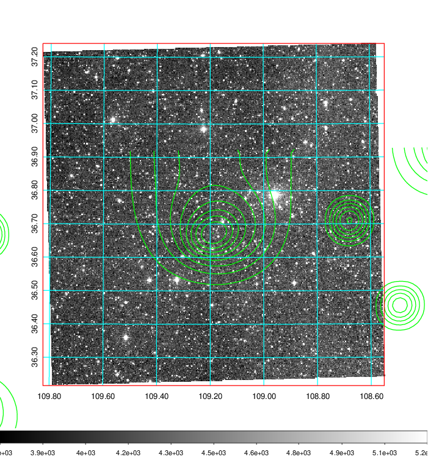
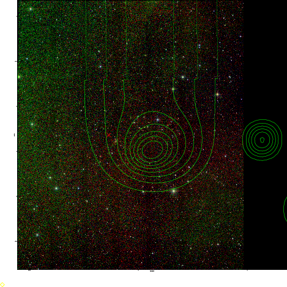
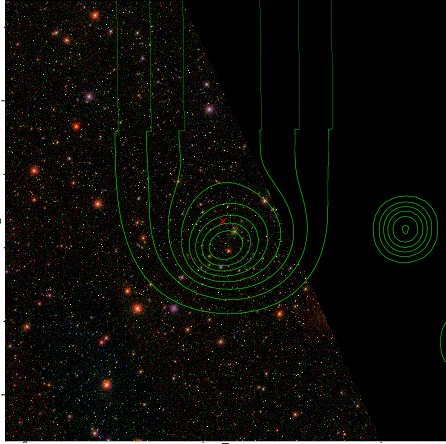

### 264

|Name|RAJ2000[deg]|DEJ2000[deg] |Ext[arcmin]| Ext,ml | z | z_src| C|GC(XSZ,Delta_z<0.01)| GC(OPT,Delta_z<0.01)|GC| R_sig[arcmin] | R500[arcmin] | R500[Mpc]| CRsig[c/s] | CR500[c/s] |L500[1E44 erg/s]|F500[1E-12 erg/s/cm^2]| M500[1E14 Msun]|Tx[keV]|Cnt_sig|Beta|Rc[arcmin]|Comment|Alias|
|---|---|---|---|---|---|------|---|--------|---------|----------|---|---|---|---|---|---|---|---|---|---|---|---|---|---|
|264| 109.187| 36.729| 4.38| 50.84| 0.0726(0.007)| z1, z_opt| S| -| W| W| 14.650| 8.063| 0.669| 0.087(0.027)| 0.081(0.025)| 0.169(0.019)| 1.316(0.146)| 0.91(0.05)| 2.07(0.07)| 79.7| 0.943(-0.078+0.042)| 6.314(-0.653+0.601)| -| t225|

|[RASS image](../image/264/264_img.pdf)|[filtered image](../image/264/264_fil.pdf)|[Segment image](../image/264/264_seg.pdf)|
|-------------------|--------------------|-------------------|
|   |    |   |

|[Exposure image](../image/264/264_mex.pdf)| [nH image](../image/264/264_nh.pdf)| [Planck image](../image/264/264_p.pdf)|
|-------------------|--------------------|-------------------|
|   |     |  |

|[Redshift Histogram](../image/264/264_zg.pdf) | [DSS image(z1)](../image/264/264_dss_z1.pdf)      |  [DSS image(z2)](../image/264/264_dss_z2.pdf)    |
|-------------------|--------------------|-------------------|
| |  Blue circle for optical clusters;  Magenta circle for XSZ clusters;  all with r=1Mpc;  Only GC with Delta_z<0.01 are shown. |  Blue circle for optical clusters;  Magenta circle for XSZ clusters;  all with r=1Mpc;  Only GC with Delta_z<0.01 are shown.  |

|[known Abell/XSZ clusters](../image/264/264_gc.pdf) | [2MASS image](../image/264/264_2mass.pdf)      |[SDSS image](../image/264/264_sdss.pdf)   |
|-------------------|-------------------|-------------------|
|  Magenta, blue and green circles  for optical, X-ray and SZ clusters  respectively, with redshift of clusters  labelled. The radius of circles  are 1Mpc.|  |   |

