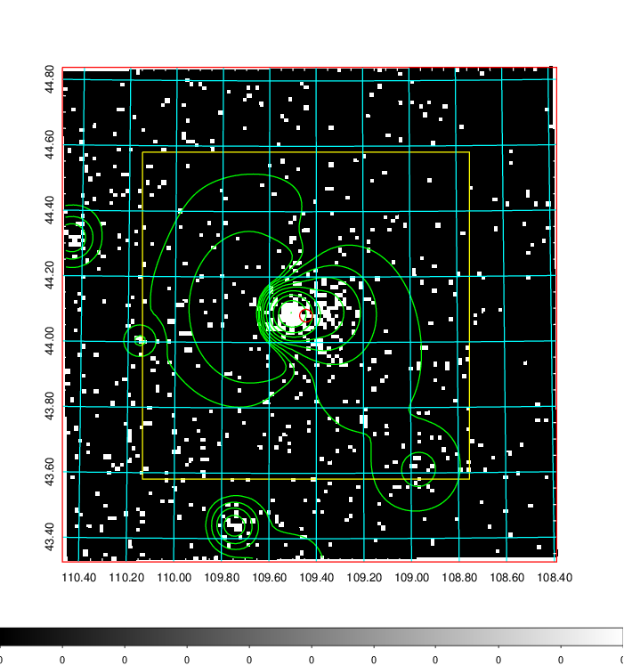
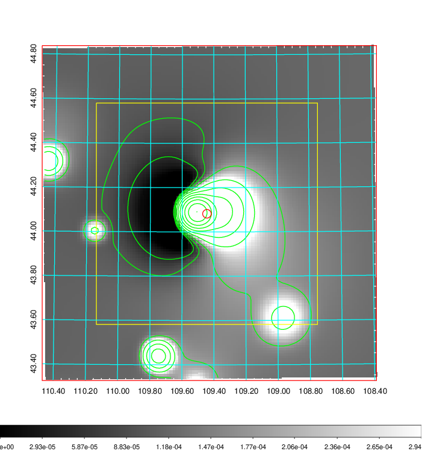
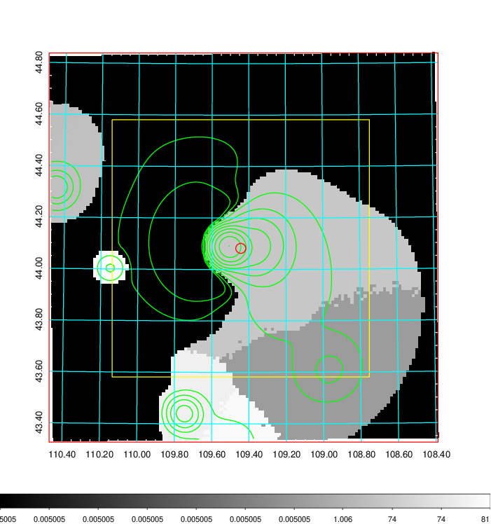
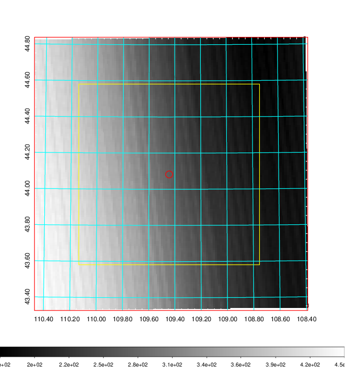
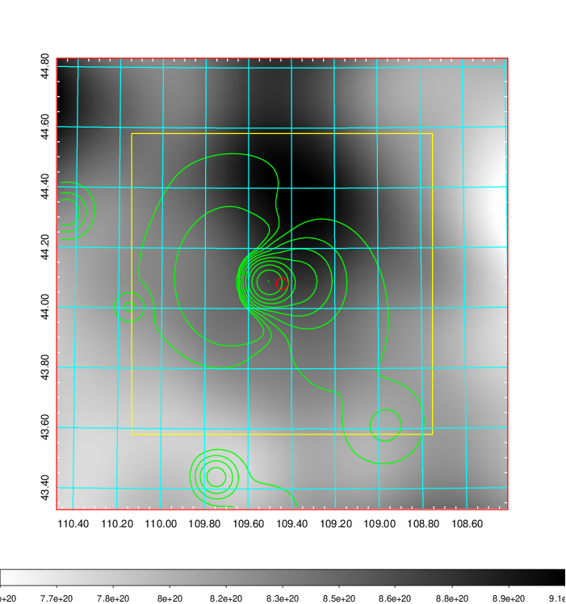
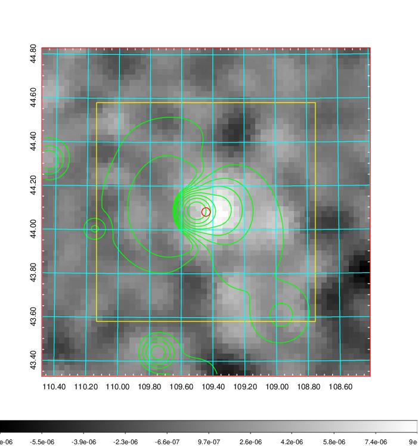
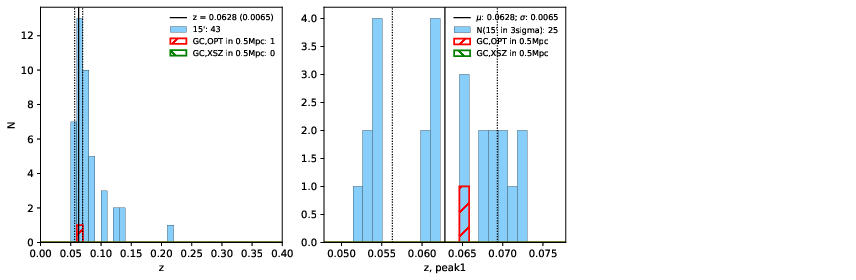
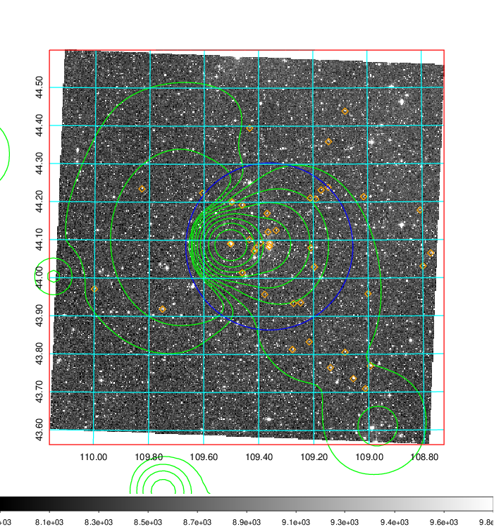
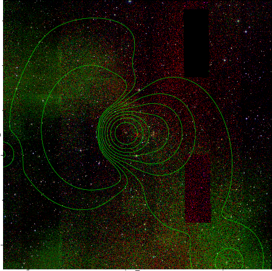

### 265

|Name|RAJ2000[deg]|DEJ2000[deg] |Ext[arcmin]| Ext,ml | z | z_src| C|GC(XSZ,Delta_z<0.01)| GC(OPT,Delta_z<0.01)|GC| R_sig[arcmin] | R500[arcmin] | R500[Mpc]| CRsig[c/s] | CR500[c/s] |L500[1E44 erg/s]|F500[1E-12 erg/s/cm^2]| M500[1E14 Msun]|Tx[keV]|Cnt_sig|Beta|Rc[arcmin]|Comment|Alias|
|---|---|---|---|---|---|------|---|--------|---------|----------|---|---|---|---|---|---|---|---|---|---|---|---|---|---|
|265| 109.444| 44.082| 1.16| 111.59| 0.0628(0.006)| z1, z_opt| S| -| W| PSZ2, W| 11.725| 14.667| 1.064| 0.943(0.066)| 0.984(0.069)| 1.632(0.043)| 17.179(0.451)| 3.64(0.05)| 4.85(0.04)| 282.3| 0.967(-0.044+0.024)| 5.963(-0.308+0.253)| An SZ cluster with no $z$ and offset = 0.26 Mpc| k054|

|[RASS image](../image/265/265_img.pdf)|[filtered image](../image/265/265_fil.pdf)|[Segment image](../image/265/265_seg.pdf)|
|-------------------|--------------------|-------------------|
|   |    |   |

|[Exposure image](../image/265/265_mex.pdf)| [nH image](../image/265/265_nh.pdf)| [Planck image](../image/265/265_p.pdf)|
|-------------------|--------------------|-------------------|
|   |     |  |

|[Redshift Histogram](../image/265/265_zg.pdf) | [DSS image(z1)](../image/265/265_dss_z1.pdf)      |  [DSS image(z2)](../image/265/265_dss_z2.pdf)    |
|-------------------|--------------------|-------------------|
| |  Blue circle for optical clusters;  Magenta circle for XSZ clusters;  all with r=1Mpc;  Only GC with Delta_z<0.01 are shown. |  Blue circle for optical clusters;  Magenta circle for XSZ clusters;  all with r=1Mpc;  Only GC with Delta_z<0.01 are shown.  |

|[known Abell/XSZ clusters](../image/265/265_gc.pdf) | [2MASS image](../image/265/265_2mass.pdf)      |
|-------------------|-------------------|
|  Magenta, blue and green circles  for optical, X-ray and SZ clusters  respectively, with redshift of clusters  labelled. The radius of circles  are 1Mpc.|  |

|[PS1 image](../image/265/265_ps1.pdf)            |
|-------------------|
|   |
