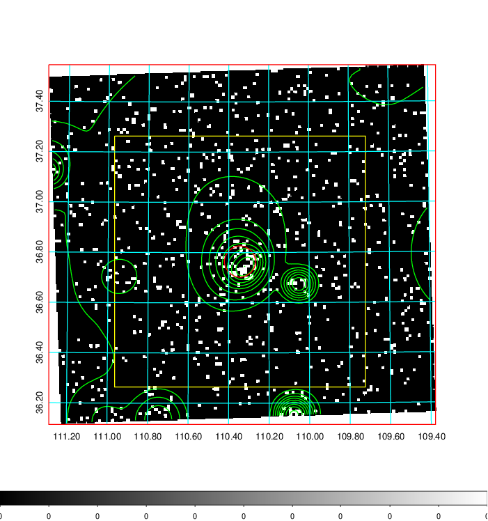
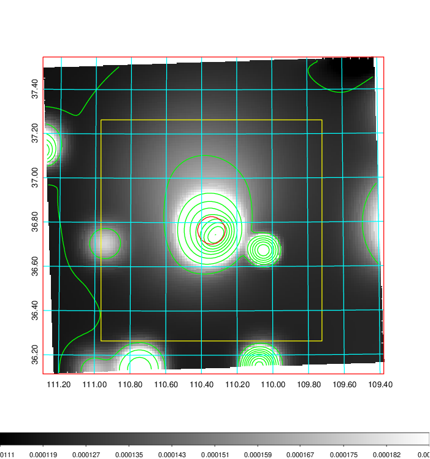
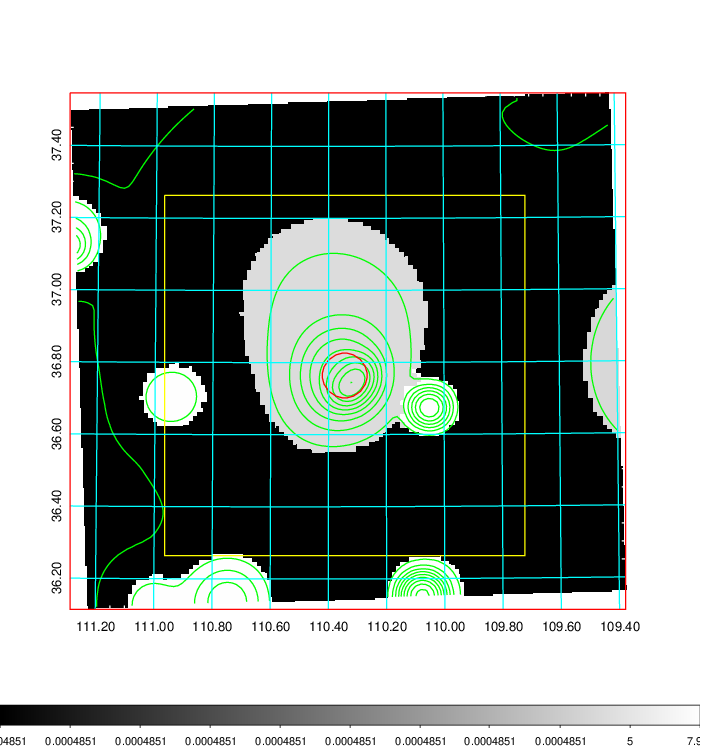
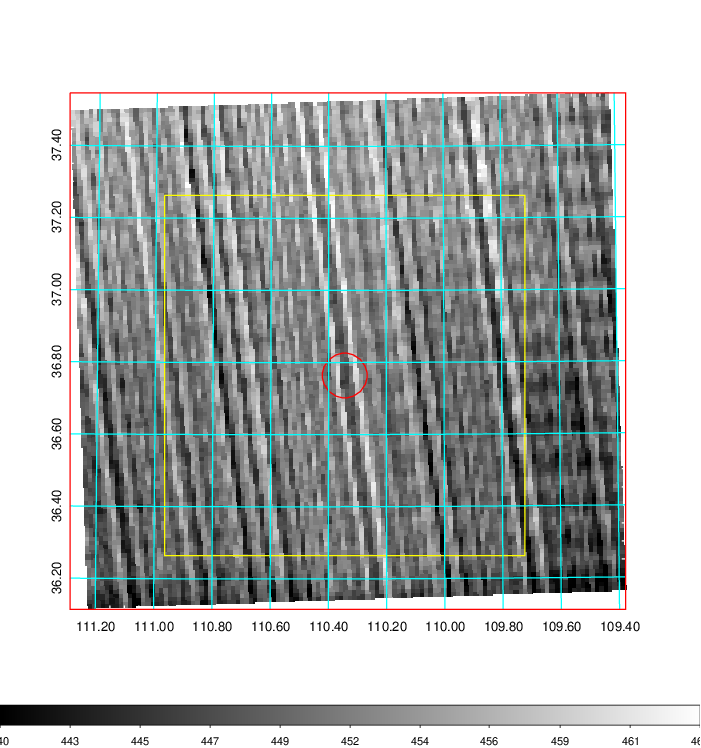
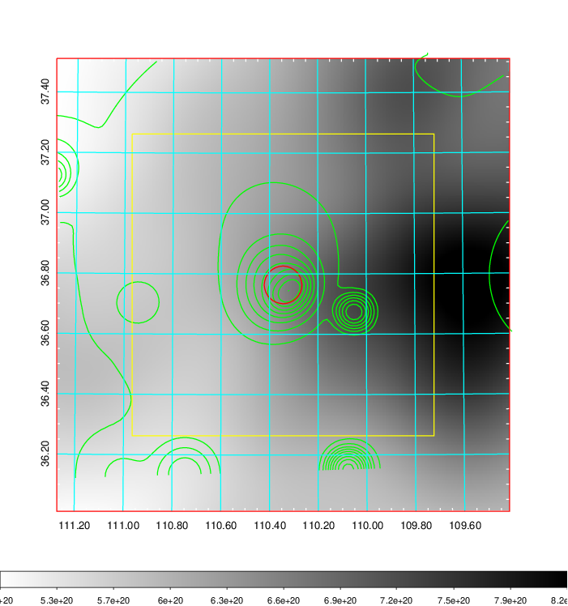
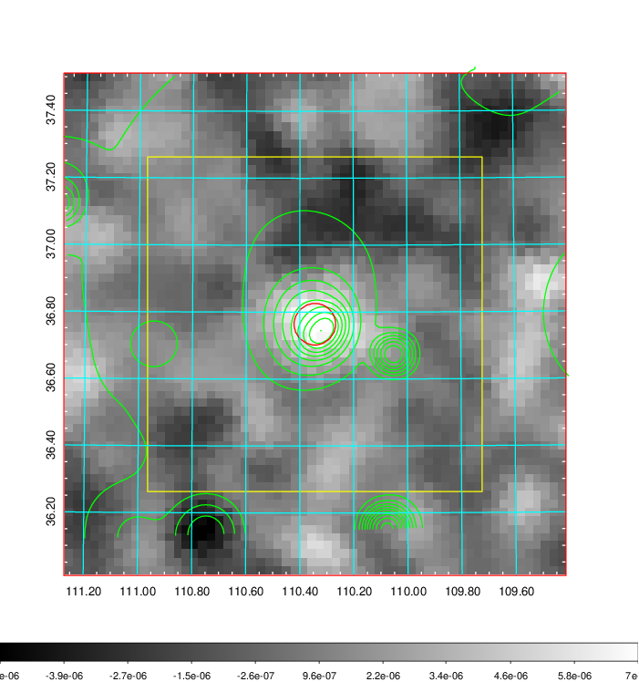
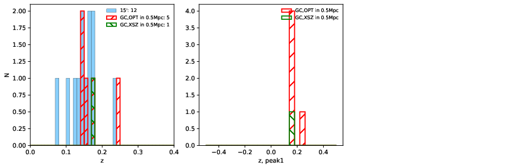
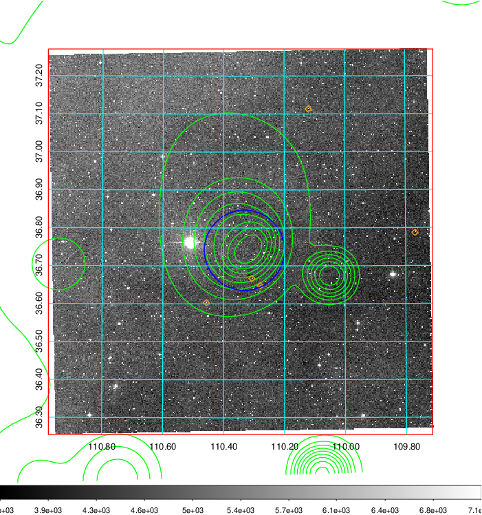
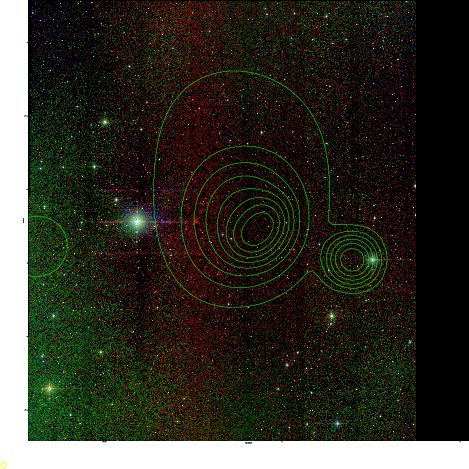
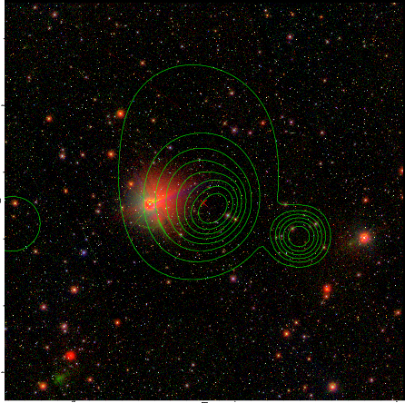

### 266

|Name|RAJ2000[deg]|DEJ2000[deg] |Ext[arcmin]| Ext,ml | z | z_src| C|GC(XSZ,Delta_z<0.01)| GC(OPT,Delta_z<0.01)|GC| R_sig[arcmin] | R500[arcmin] | R500[Mpc]| CRsig[c/s] | CR500[c/s] |L500[1E44 erg/s]|F500[1E-12 erg/s/cm^2]| M500[1E14 Msun]|Tx[keV]|Cnt_sig|Beta|Rc[arcmin]|Comment|Alias|
|---|---|---|---|---|---|------|---|--------|---------|----------|---|---|---|---|---|---|---|---|---|---|---|---|---|---|
|266| 110.344| 36.764| 3.73| 46.78| 0.1750(0.000)| z_xsz| B| Tar| W| A, C, N, Tar, W| 18.775| 5.836| 1.039| 0.150(0.050)| 0.135(0.045)| 2.108(0.386)| 2.468(0.452)| 3.79(0.34)| 5.15(0.29)| 84.4| 0.686(-0.095+0.137)| 5.132(-1.366+1.649)| An SZ cluster with $z$ = 0.175 and offset = 0.28 Mpc| t176|

|[RASS image](../image/266/266_img.pdf)|[filtered image](../image/266/266_fil.pdf)|[Segment image](../image/266/266_seg.pdf)|
|-------------------|--------------------|-------------------|
|   |    |   |

|[Exposure image](../image/266/266_mex.pdf)| [nH image](../image/266/266_nh.pdf)| [Planck image](../image/266/266_p.pdf)|
|-------------------|--------------------|-------------------|
|   |     |  |

|[Redshift Histogram](../image/266/266_zg.pdf) | [DSS image(z1)](../image/266/266_dss_z1.pdf)      |  [DSS image(z2)](../image/266/266_dss_z2.pdf)    |
|-------------------|--------------------|-------------------|
| |  Blue circle for optical clusters;  Magenta circle for XSZ clusters;  all with r=1Mpc;  Only GC with Delta_z<0.01 are shown. |  Blue circle for optical clusters;  Magenta circle for XSZ clusters;  all with r=1Mpc;  Only GC with Delta_z<0.01 are shown.  |

|[known Abell/XSZ clusters](../image/266/266_gc.pdf) | [2MASS image](../image/266/266_2mass.pdf)      |[SDSS image](../image/266/266_sdss.pdf)   |
|-------------------|-------------------|-------------------|
|  Magenta, blue and green circles  for optical, X-ray and SZ clusters  respectively, with redshift of clusters  labelled. The radius of circles  are 1Mpc.|  |   |

