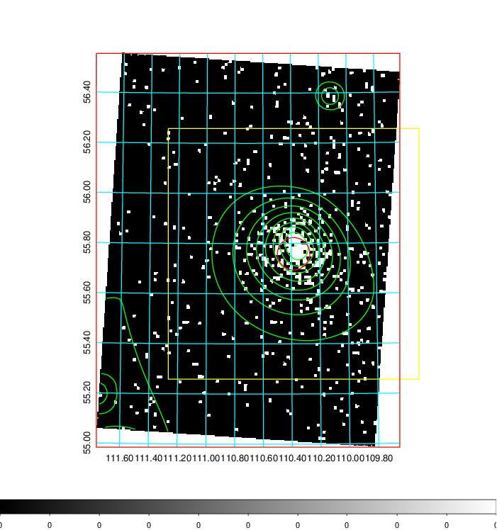
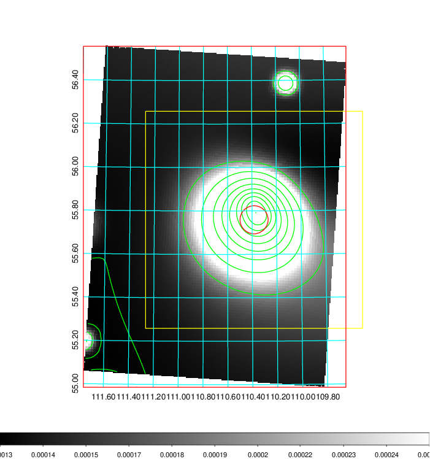
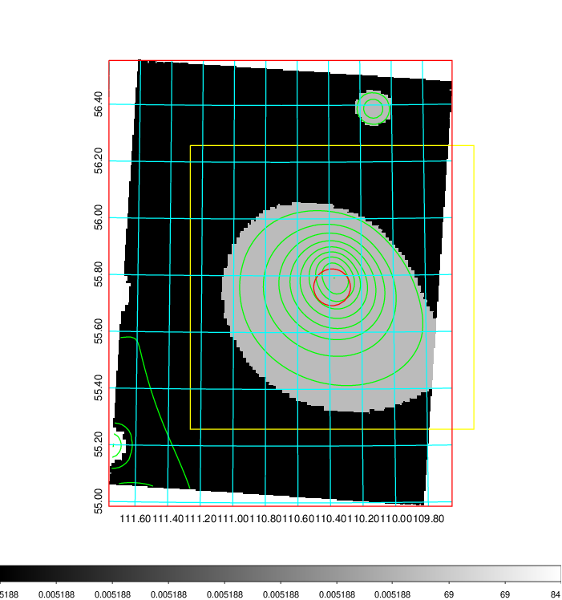
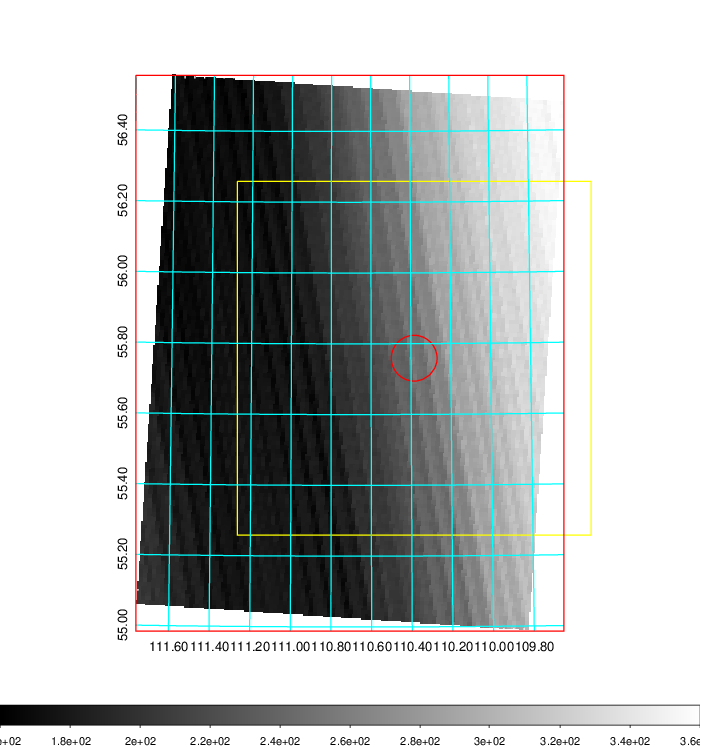
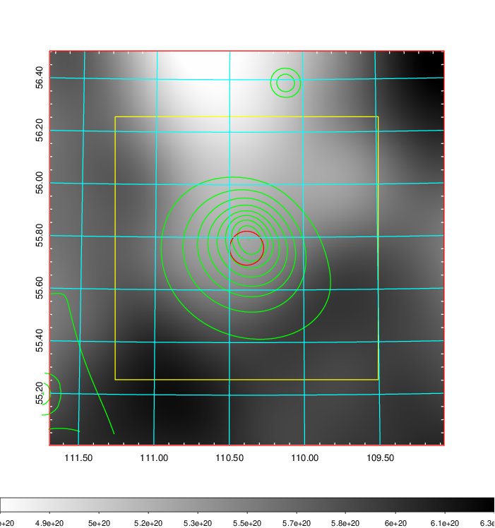
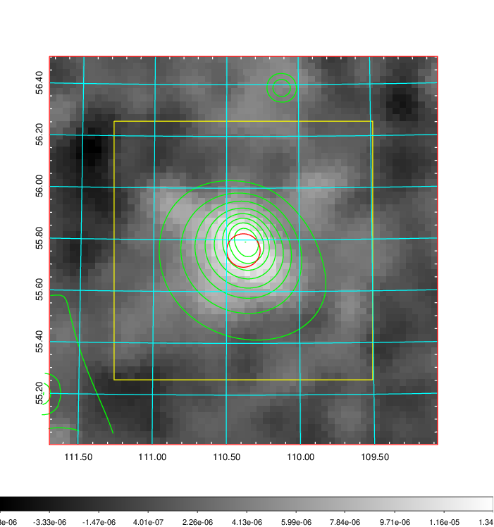
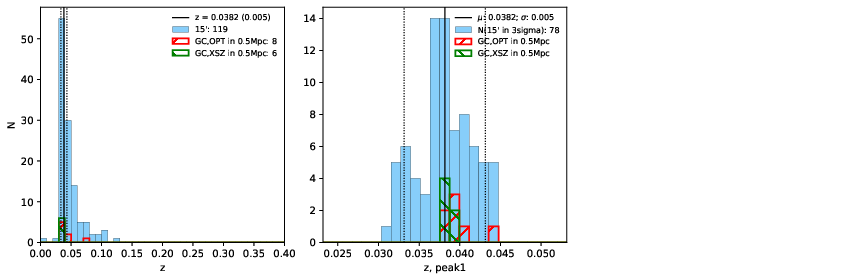
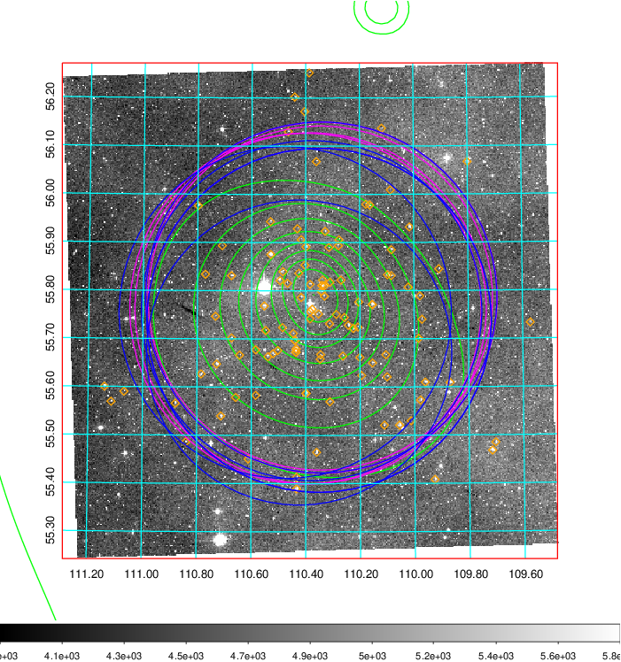
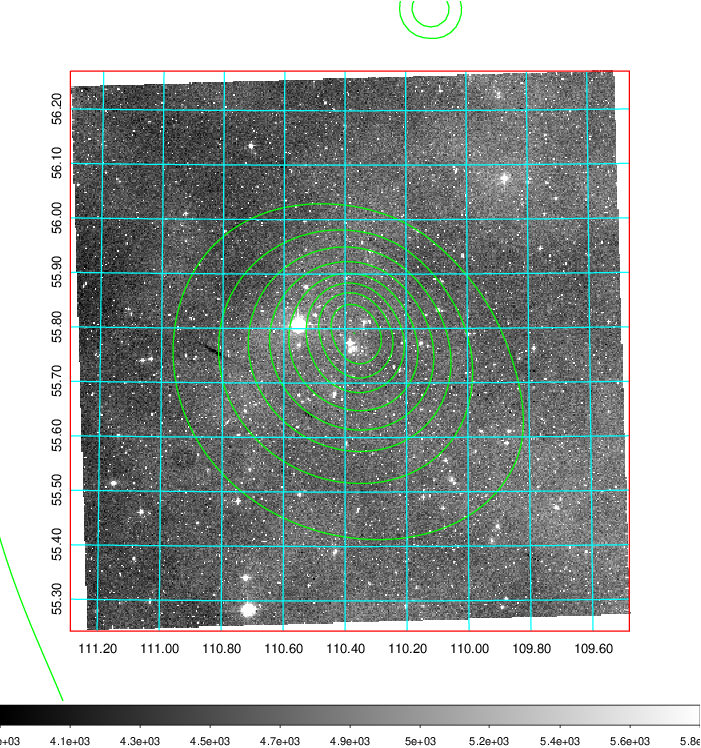
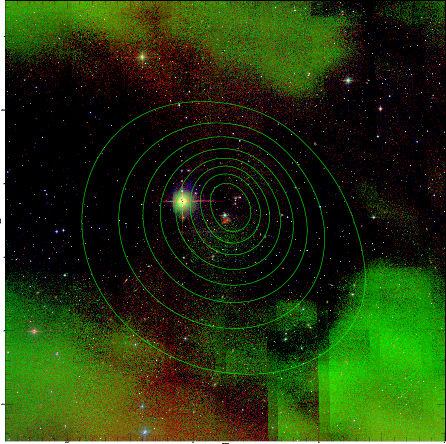

### 267

|Name|RAJ2000[deg]|DEJ2000[deg] |Ext[arcmin]| Ext,ml | z | z_src| C|GC(XSZ,Delta_z<0.01)| GC(OPT,Delta_z<0.01)|GC| R_sig[arcmin] | R500[arcmin] | R500[Mpc]| CRsig[c/s] | CR500[c/s] |L500[1E44 erg/s]|F500[1E-12 erg/s/cm^2]| M500[1E14 Msun]|Tx[keV]|Cnt_sig|Beta|Rc[arcmin]|Comment|Alias|
|---|---|---|---|---|---|------|---|--------|---------|----------|---|---|---|---|---|---|---|---|---|---|---|---|---|---|
|267| 110.384| 55.759| 3.88| 433.45| 0.0382(0.005)| z1, z_xsz| B| L03, MCXC, PSZ2, Tar, XB| A, N| A, L03, MCXC, N, PSZ2, Tar, W, XB| 25.255| 19.113| 0.869| 1.087(0.111)| 1.045(0.107)| 0.627(0.029)| 18.496(0.855)| 1.93(0.05)| 3.25(0.05)| 302.2| 0.963(-0.043+0.027)| 7.734(-0.436+0.314)| -| k469|

|[RASS image](../image/267/267_img.pdf)|[filtered image](../image/267/267_fil.pdf)|[Segment image](../image/267/267_seg.pdf)|
|-------------------|--------------------|-------------------|
|   |    |   |

|[Exposure image](../image/267/267_mex.pdf)| [nH image](../image/267/267_nh.pdf)| [Planck image](../image/267/267_p.pdf)|
|-------------------|--------------------|-------------------|
|   |     |  |

|[Redshift Histogram](../image/267/267_zg.pdf) | [DSS image(z1)](../image/267/267_dss_z1.pdf)      |  [DSS image(z2)](../image/267/267_dss_z2.pdf)    |
|-------------------|--------------------|-------------------|
| |  Blue circle for optical clusters;  Magenta circle for XSZ clusters;  all with r=1Mpc;  Only GC with Delta_z<0.01 are shown. |  Blue circle for optical clusters;  Magenta circle for XSZ clusters;  all with r=1Mpc;  Only GC with Delta_z<0.01 are shown.  |

|[known Abell/XSZ clusters](../image/267/267_gc.pdf) | [2MASS image](../image/267/267_2mass.pdf)      |
|-------------------|-------------------|
|  Magenta, blue and green circles  for optical, X-ray and SZ clusters  respectively, with redshift of clusters  labelled. The radius of circles  are 1Mpc.|  |

|[PS1 image](../image/267/267_ps1.pdf)            |
|-------------------|
|   |
