

### 268

|Name|RAJ2000[deg]|DEJ2000[deg] |Ext[arcmin]| Ext,ml | z | z_src| C|GC(XSZ,Delta_z<0.01)| GC(OPT,Delta_z<0.01)|GC| R_sig[arcmin] | R500[arcmin] | R500[Mpc]| CRsig[c/s] | CR500[c/s] |L500[1E44 erg/s]|F500[1E-12 erg/s/cm^2]| M500[1E14 Msun]|Tx[keV]|Cnt_sig|Beta|Rc[arcmin]|Comment|Alias|
|---|---|---|---|---|---|------|---|--------|---------|----------|---|---|---|---|---|---|---|---|---|---|---|---|---|---|
|268| 111.214| 66.960| 2.97| 27.10| 0.0889(0.005)| z1, z_xsz| B| L03, MCXC| A, W| A, C, L03, MCXC, N, W| 9.288| 7.680| 0.765| 0.117(0.031)| 0.114(0.031)| 0.393(0.053)| 1.989(0.268)| 1.39(0.09)| 2.69(0.12)| 53.9| 0.908(-0.110+0.067)| 5.703(-0.825+0.681)| -| k374|

|[RASS image](../image/268/268_img.pdf)|[filtered image](../image/268/268_fil.pdf)|[Segment image](../image/268/268_seg.pdf)|
|-------------------|--------------------|-------------------|
| 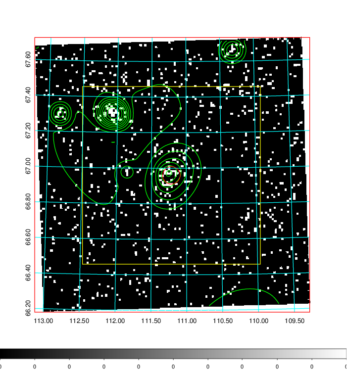  | 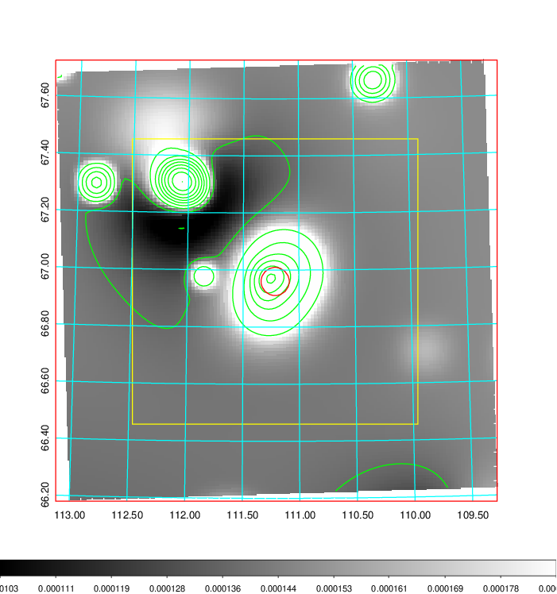   | 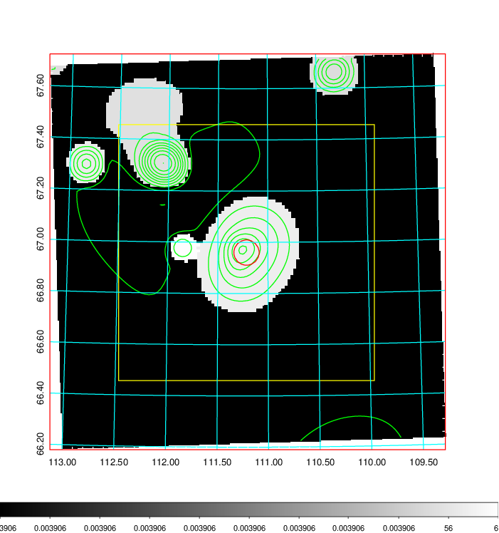  |

|[Exposure image](../image/268/268_mex.pdf)| [nH image](../image/268/268_nh.pdf)| [Planck image](../image/268/268_p.pdf)|
|-------------------|--------------------|-------------------|
|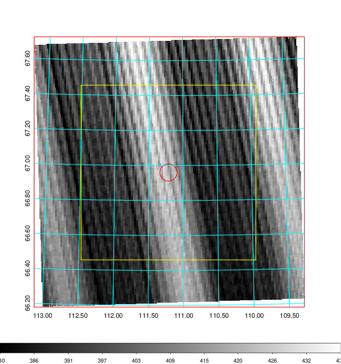   | 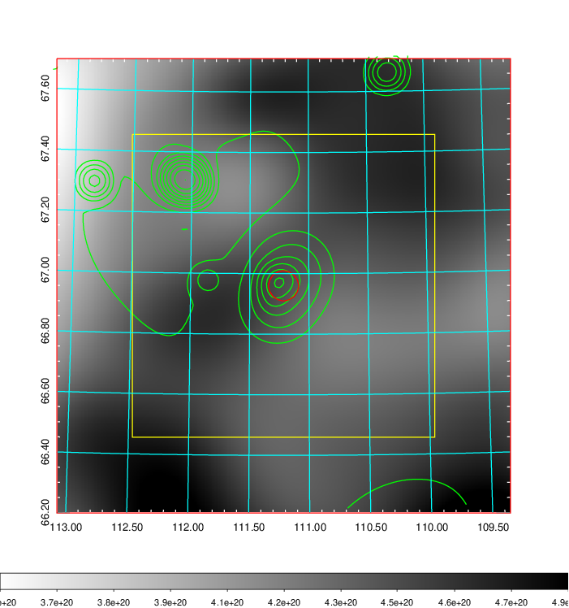    | 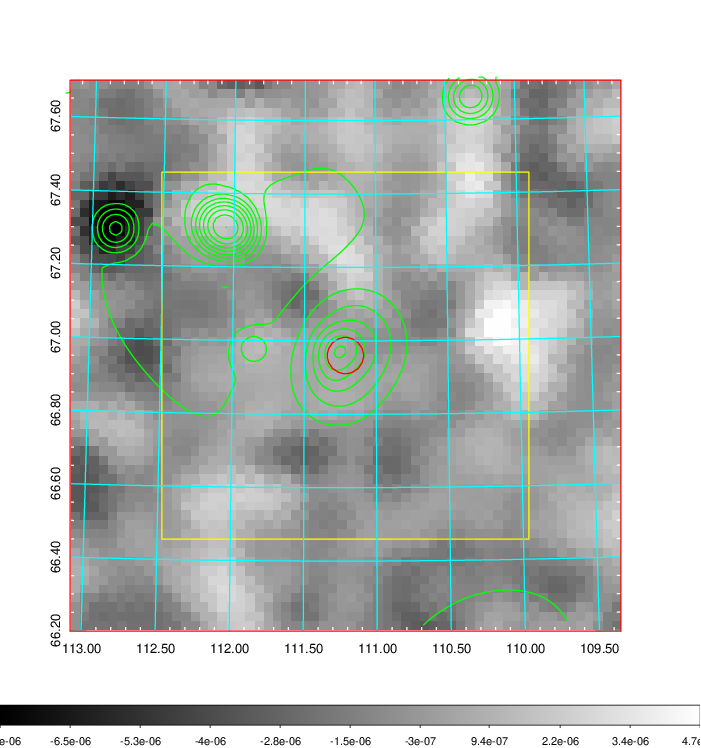 |

|[Redshift Histogram](../image/268/268_zg.pdf) | [DSS image(z1)](../image/268/268_dss_z1.pdf)      |  [DSS image(z2)](../image/268/268_dss_z2.pdf)    |
|-------------------|--------------------|-------------------|
|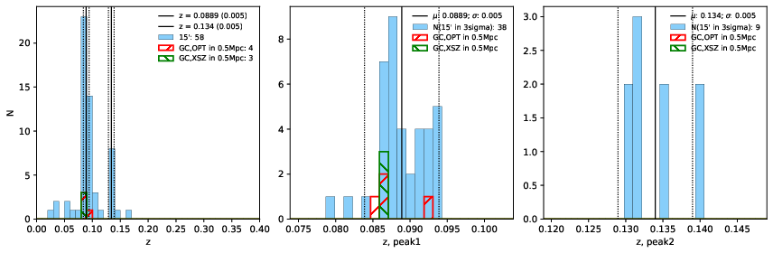 |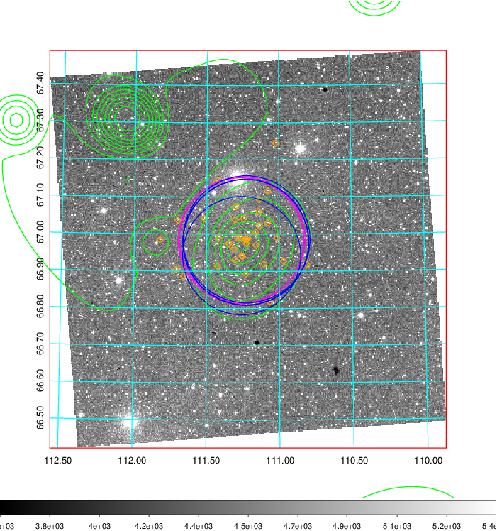  Blue circle for optical clusters;  Magenta circle for XSZ clusters;  all with r=1Mpc;  Only GC with Delta_z<0.01 are shown. | 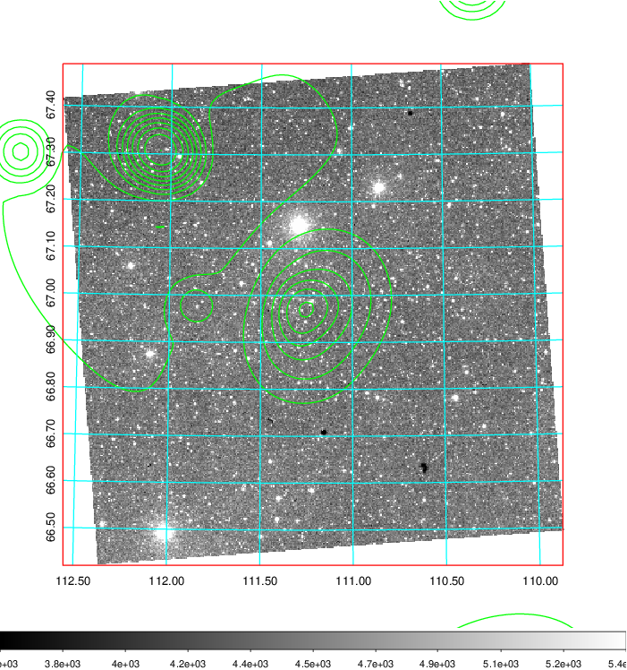 Blue circle for optical clusters;  Magenta circle for XSZ clusters;  all with r=1Mpc;  Only GC with Delta_z<0.01 are shown.  |

|[known Abell/XSZ clusters](../image/268/268_gc.pdf) | [2MASS image](../image/268/268_2mass.pdf)      |[SDSS image](../image/268/268_sdss.pdf)   |
|-------------------|-------------------|-------------------|
|  Magenta, blue and green circles  for optical, X-ray and SZ clusters  respectively, with redshift of clusters  labelled. The radius of circles  are 1Mpc.|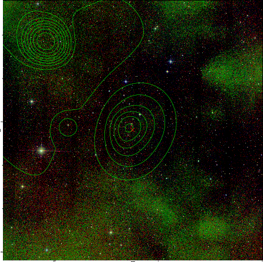  | 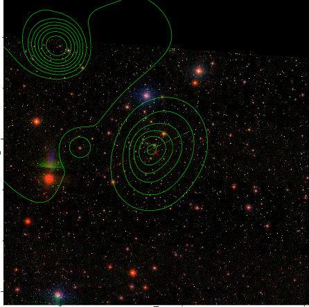  |

