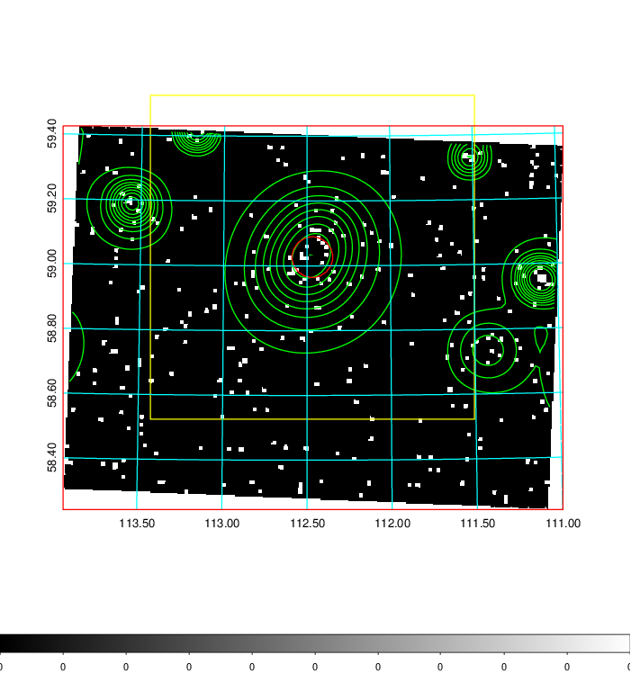
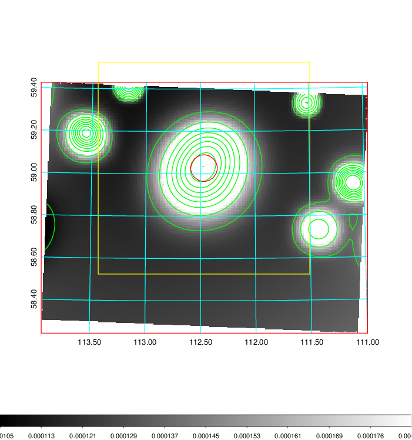
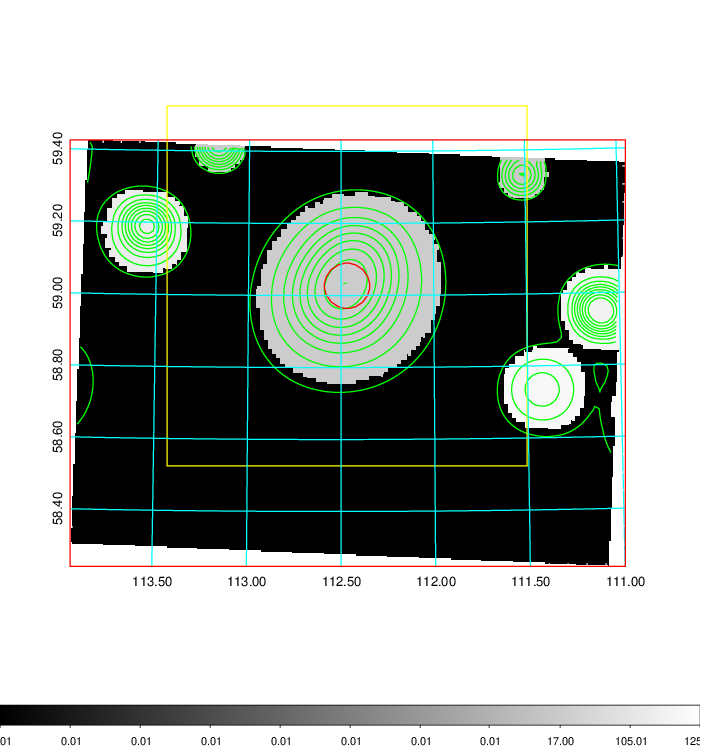
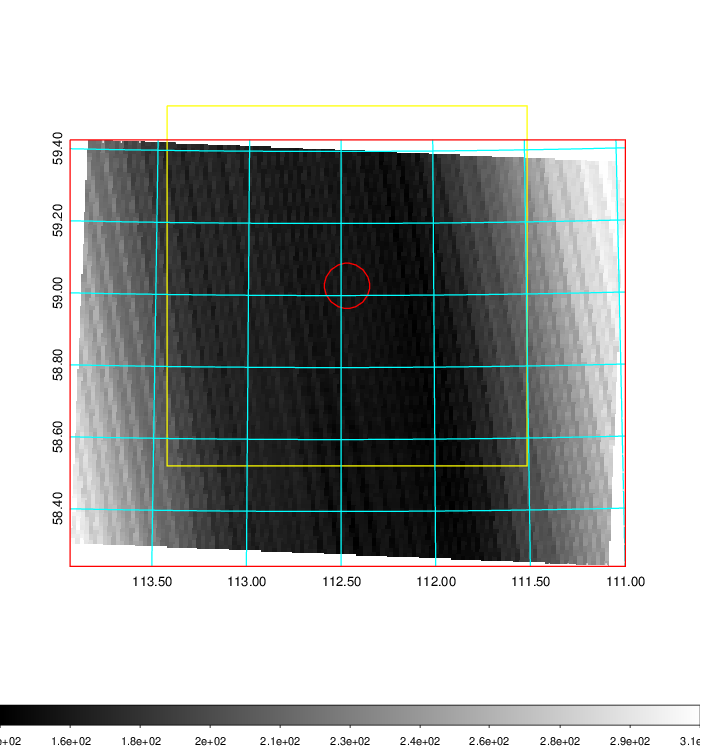
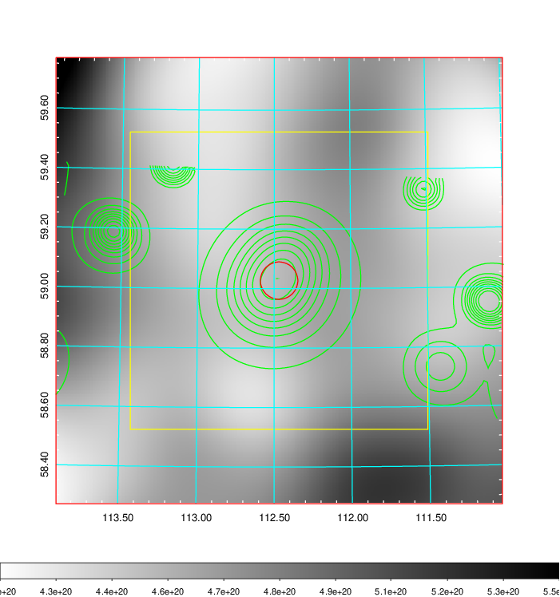
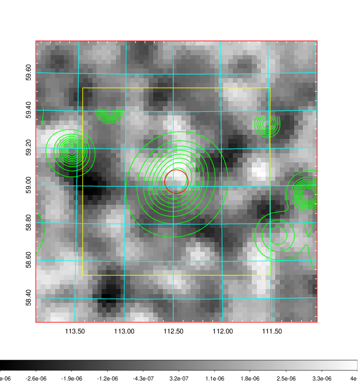
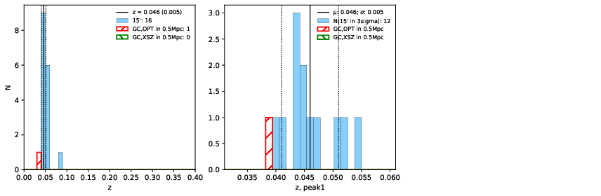
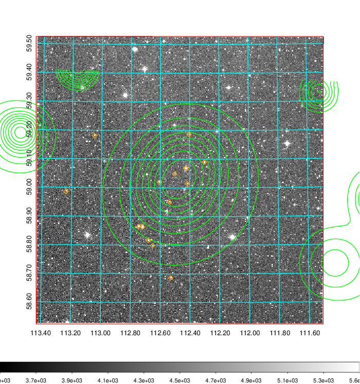
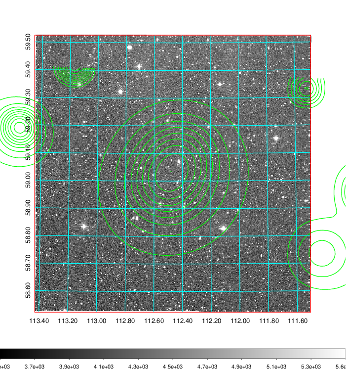
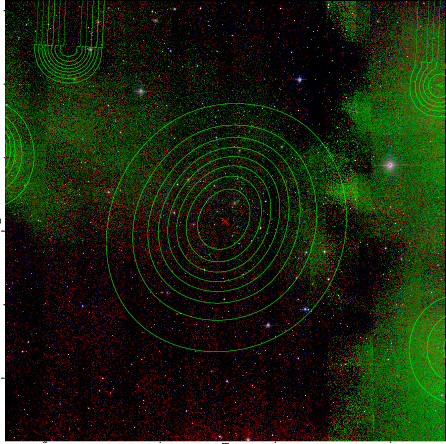

### 269

|Name|RAJ2000[deg]|DEJ2000[deg] |Ext[arcmin]| Ext,ml | z | z_src| C|GC(XSZ,Delta_z<0.01)| GC(OPT,Delta_z<0.01)|GC| R_sig[arcmin] | R500[arcmin] | R500[Mpc]| CRsig[c/s] | CR500[c/s] |L500[1E44 erg/s]|F500[1E-12 erg/s/cm^2]| M500[1E14 Msun]|Tx[keV]|Cnt_sig|Beta|Rc[arcmin]|Comment|Alias|
|---|---|---|---|---|---|------|---|--------|---------|----------|---|---|---|---|---|---|---|---|---|---|---|---|---|---|
|269| 112.468| 59.027| 3.77| 25.80| 0.0460(0.005)| z1, z_opt| S| -| N| N| 10.262| 11.580| 0.628| 0.154(0.051)| 0.157(0.052)| 0.128(0.022)| 2.563(0.450)| 0.74(0.07)| 1.80(0.10)| 25.4| 0.881(-0.137+0.086)| 7.728(-1.344+1.163)| -| t180|

|[RASS image](../image/269/269_img.pdf)|[filtered image](../image/269/269_fil.pdf)|[Segment image](../image/269/269_seg.pdf)|
|-------------------|--------------------|-------------------|
|   |    |   |

|[Exposure image](../image/269/269_mex.pdf)| [nH image](../image/269/269_nh.pdf)| [Planck image](../image/269/269_p.pdf)|
|-------------------|--------------------|-------------------|
|   |     |  |

|[Redshift Histogram](../image/269/269_zg.pdf) | [DSS image(z1)](../image/269/269_dss_z1.pdf)      |  [DSS image(z2)](../image/269/269_dss_z2.pdf)    |
|-------------------|--------------------|-------------------|
| |  Blue circle for optical clusters;  Magenta circle for XSZ clusters;  all with r=1Mpc;  Only GC with Delta_z<0.01 are shown. |  Blue circle for optical clusters;  Magenta circle for XSZ clusters;  all with r=1Mpc;  Only GC with Delta_z<0.01 are shown.  |

|[known Abell/XSZ clusters](../image/269/269_gc.pdf) | [2MASS image](../image/269/269_2mass.pdf)      |
|-------------------|-------------------|
|  Magenta, blue and green circles  for optical, X-ray and SZ clusters  respectively, with redshift of clusters  labelled. The radius of circles  are 1Mpc.|  |

|[PS1 image](../image/269/269_ps1.pdf)            |
|-------------------|
|   |
