

### 27

|Name|RAJ2000[deg]|DEJ2000[deg] |Ext[arcmin]| Ext,ml | z | z_src| C|GC(XSZ,Delta_z<0.01)| GC(OPT,Delta_z<0.01)|GC| R_sig[arcmin] | R500[arcmin] | R500[Mpc]| CRsig[c/s] | CR500[c/s] |L500[1E44 erg/s]|F500[1E-12 erg/s/cm^2]| M500[1E14 Msun]|Tx[keV]|Cnt_sig|Beta|Rc[arcmin]|Comment|Alias|
|---|---|---|---|---|---|------|---|--------|---------|----------|---|---|---|---|---|---|---|---|---|---|---|---|---|---|
|27| 8.554| -2.129| 5.49| 212.26| 0.0557(0.005)| z1, z_opt| S| -| W| C, F20, MCXC, N, PSZ2, SPI, Tar, W| 18.281| 12.630| 0.820| 0.422(0.053)| 0.402(0.050)| 0.545(0.044)| 7.368(0.589)| 1.65(0.07)| 2.97(0.08)| 274.0| 0.955(-0.058+0.033)| 10.583(-0.731+0.503)| -| k529|

|[RASS image](../image/27/27_img.pdf)|[filtered image](../image/27/27_fil.pdf)|[Segment image](../image/27/27_seg.pdf)|
|-------------------|--------------------|-------------------|
| 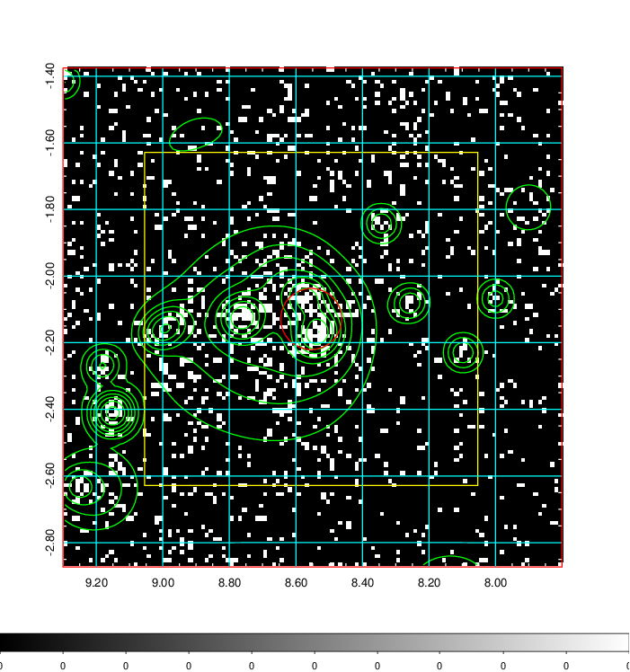  | 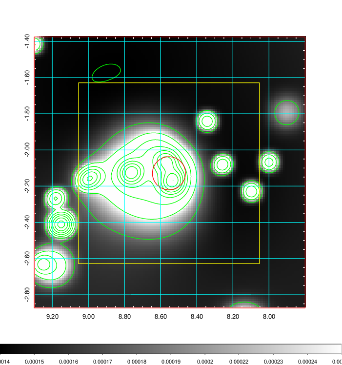   | 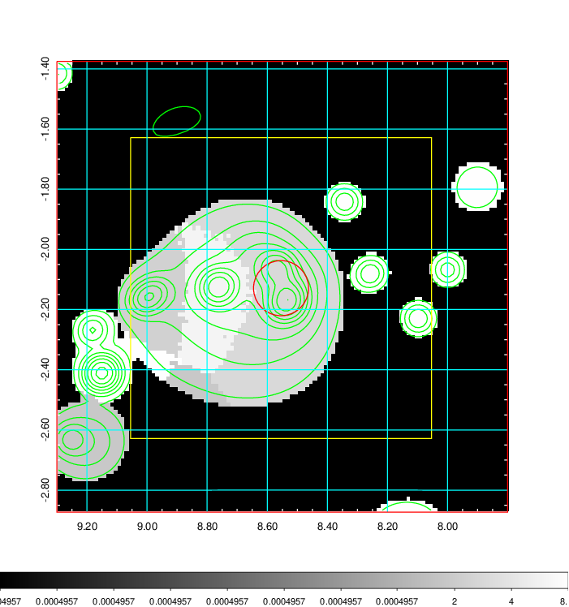  |

|[Exposure image](../image/27/27_mex.pdf)| [nH image](../image/27/27_nh.pdf)| [Planck image](../image/27/27_p.pdf)|
|-------------------|--------------------|-------------------|
|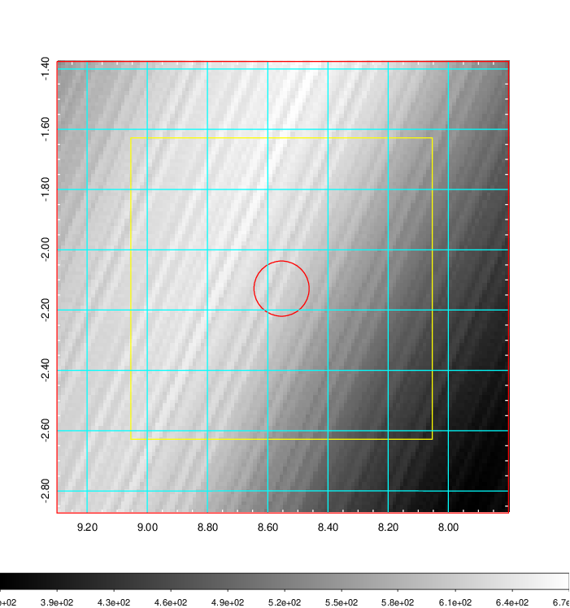   | 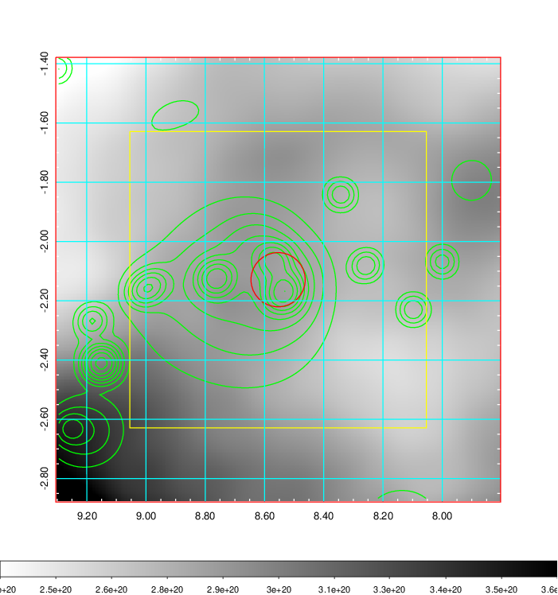    | 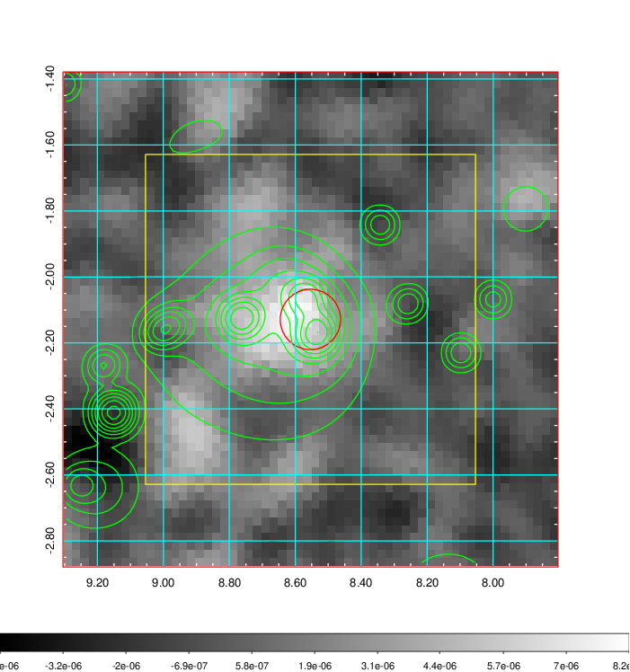 |

|[Redshift Histogram](../image/27/27_zg.pdf) | [DSS image(z1)](../image/27/27_dss_z1.pdf)      |  [DSS image(z2)](../image/27/27_dss_z2.pdf)    |
|-------------------|--------------------|-------------------|
|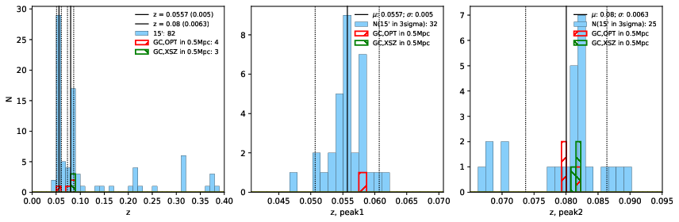 |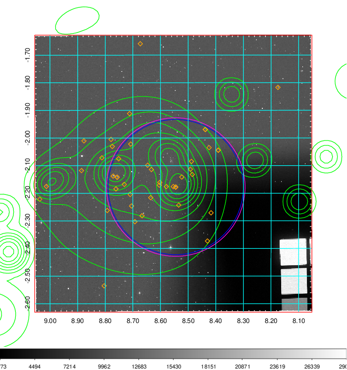  Blue circle for optical clusters;  Magenta circle for XSZ clusters;  all with r=1Mpc;  Only GC with Delta_z<0.01 are shown. | 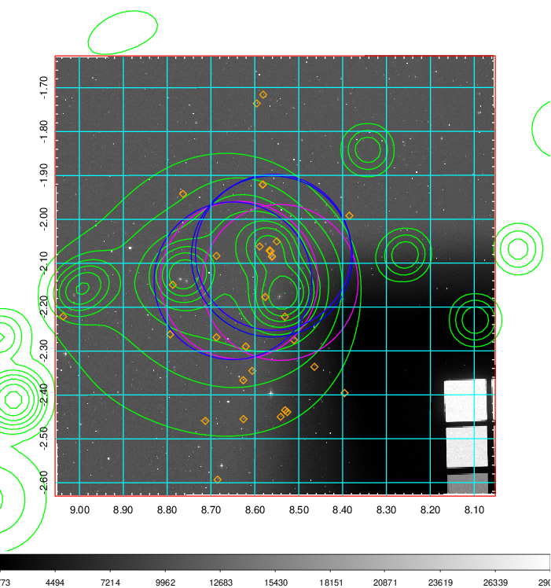 Blue circle for optical clusters;  Magenta circle for XSZ clusters;  all with r=1Mpc;  Only GC with Delta_z<0.01 are shown.  |

|[Previous-identified clusters](../image/27/27_gc.pdf) | [2MASS image](../image/27/27_2mass.pdf)      |[SDSS image](../image/27/27_sdss.pdf)   |
|-------------------|-------------------|-------------------|
|  Green, magenta, and blue circles  for optical, X-ray and SZ clusters  respectively, with redshift of clusters  labelled. The radius of circles  are 1Mpc.|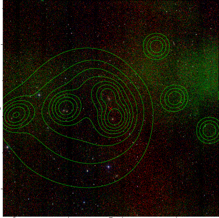  | 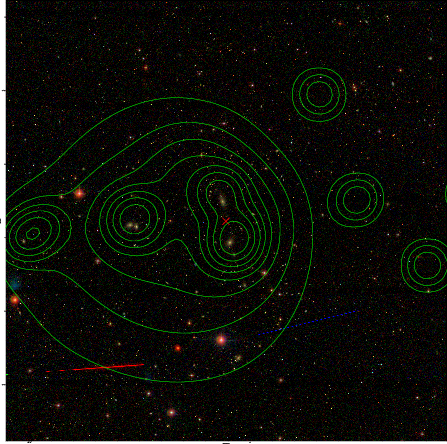  |

|[DES image](../image/27/27_des.pdf)   |
|-------------------|
| 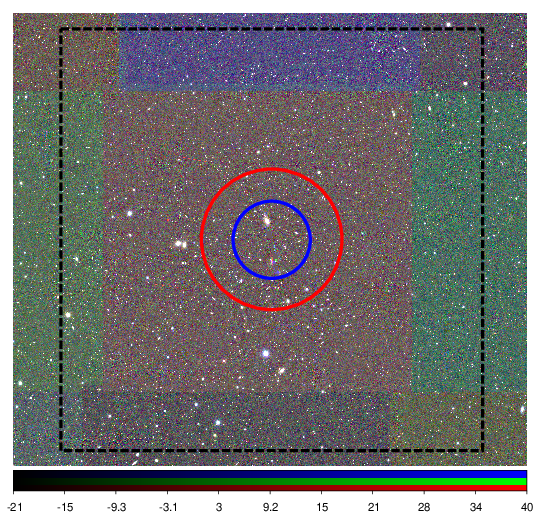  |
