

### 270

|Name|RAJ2000[deg]|DEJ2000[deg] |Ext[arcmin]| Ext,ml | z | z_src| C|GC(XSZ,Delta_z<0.01)| GC(OPT,Delta_z<0.01)|GC| R_sig[arcmin] | R500[arcmin] | R500[Mpc]| CRsig[c/s] | CR500[c/s] |L500[1E44 erg/s]|F500[1E-12 erg/s/cm^2]| M500[1E14 Msun]|Tx[keV]|Cnt_sig|Beta|Rc[arcmin]|Comment|Alias|
|---|---|---|---|---|---|------|---|--------|---------|----------|---|---|---|---|---|---|---|---|---|---|---|---|---|---|
|270| 113.091| 31.633| 0.80| 37.08| 0.1707(0.005)| z1, z_xsz| B| F20, MCXC, PSZ2, Tar, XB| A, N, RM, W| A, C, F20, MCXC, N, PSZ2, Tar, W, XB| 6.850| 7.145| 1.247| 0.345(0.038)| 0.347(0.039)| 5.250(0.203)| 6.494(0.251)| 6.51(0.12)| 7.19(0.08)| 156.6| 0.899(-0.102+0.072)| 2.459(-0.447+0.319)| -| k010|

|[RASS image](../image/270/270_img.pdf)|[filtered image](../image/270/270_fil.pdf)|[Segment image](../image/270/270_seg.pdf)|
|-------------------|--------------------|-------------------|
| 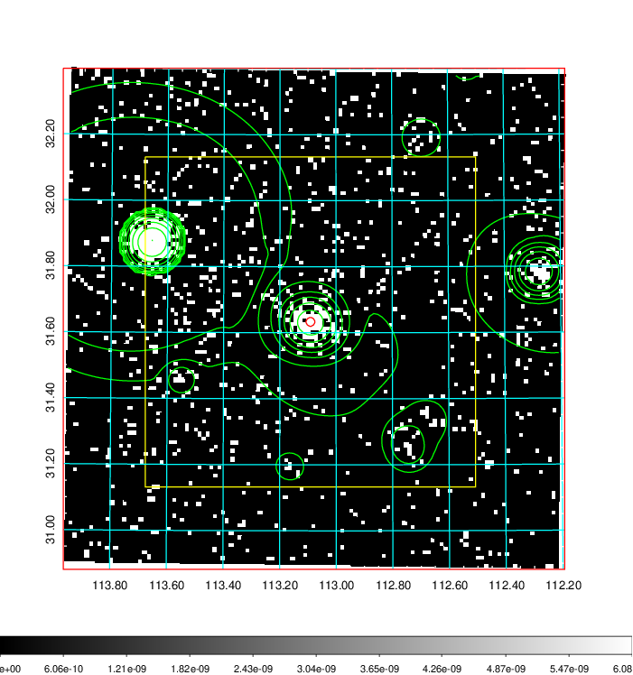  | 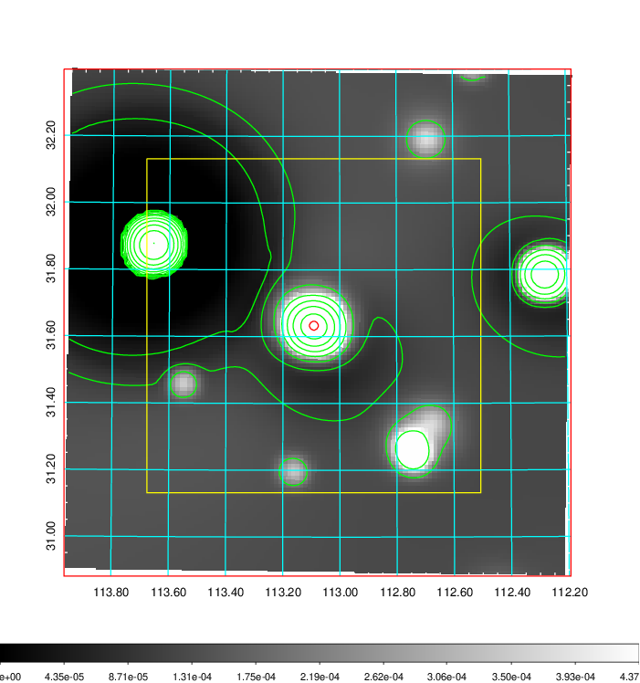   | 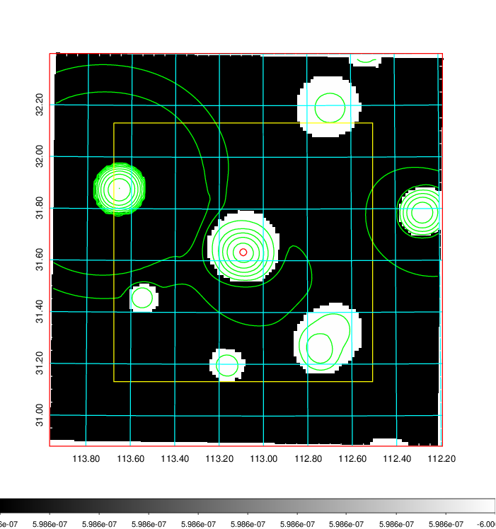  |

|[Exposure image](../image/270/270_mex.pdf)| [nH image](../image/270/270_nh.pdf)| [Planck image](../image/270/270_p.pdf)|
|-------------------|--------------------|-------------------|
|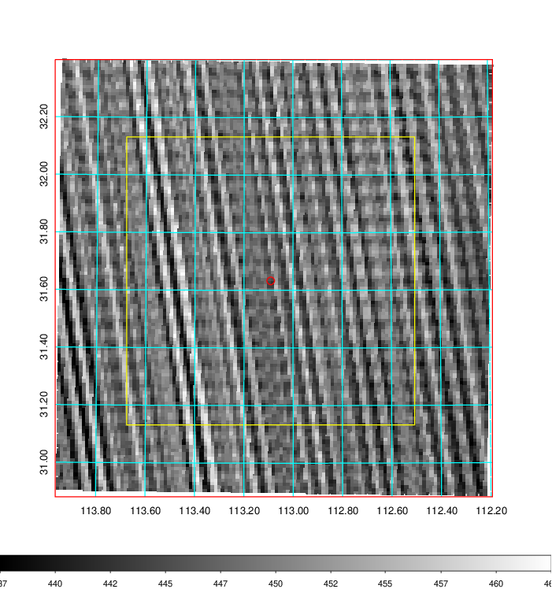   | 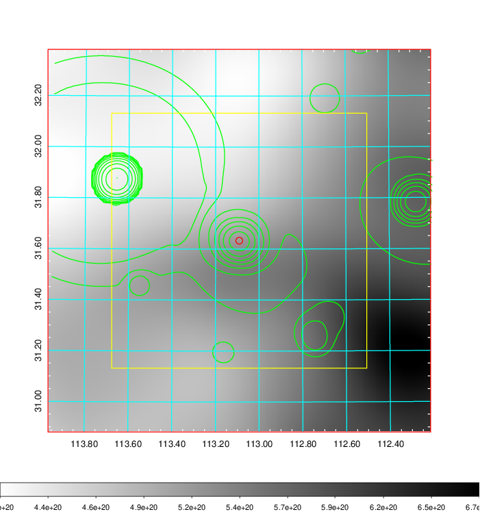    | 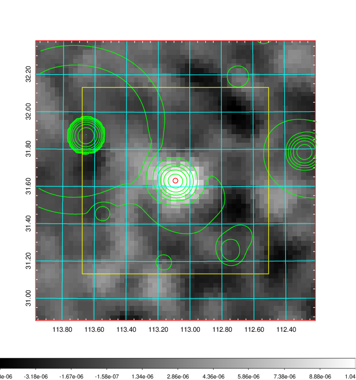 |

|[Redshift Histogram](../image/270/270_zg.pdf) | [DSS image(z1)](../image/270/270_dss_z1.pdf)      |  [DSS image(z2)](../image/270/270_dss_z2.pdf)    |
|-------------------|--------------------|-------------------|
|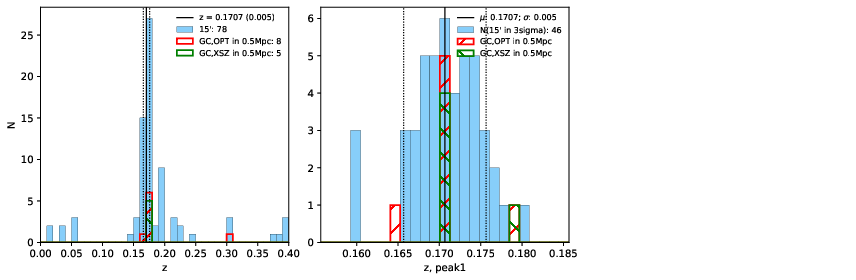 |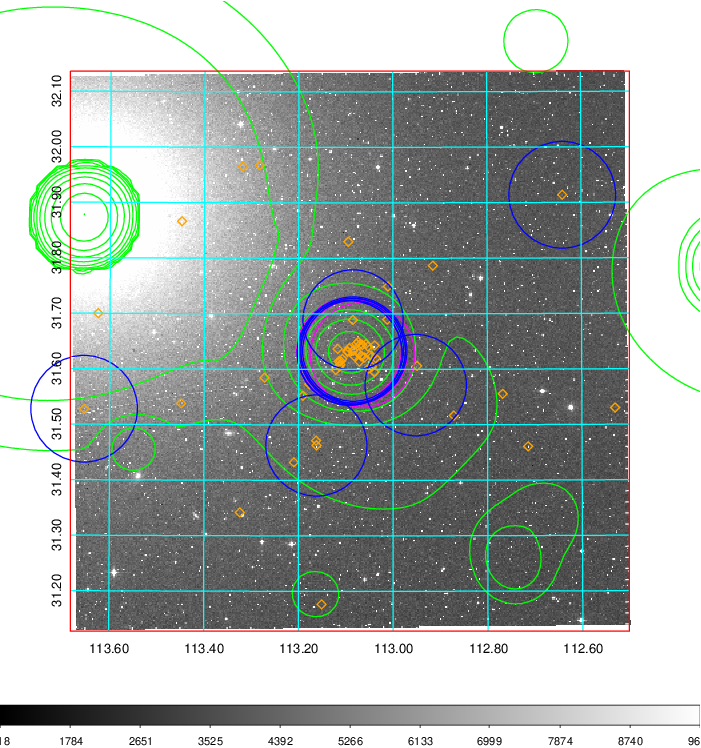  Blue circle for optical clusters;  Magenta circle for XSZ clusters;  all with r=1Mpc;  Only GC with Delta_z<0.01 are shown. | 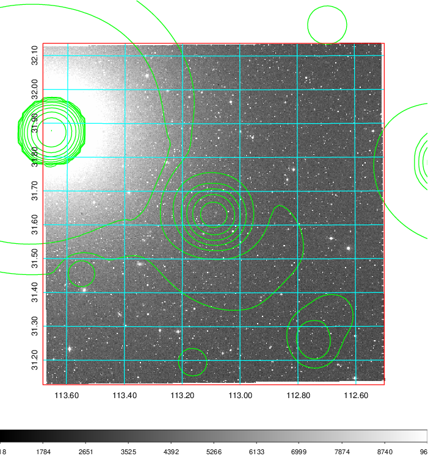 Blue circle for optical clusters;  Magenta circle for XSZ clusters;  all with r=1Mpc;  Only GC with Delta_z<0.01 are shown.  |

|[known Abell/XSZ clusters](../image/270/270_gc.pdf) | [2MASS image](../image/270/270_2mass.pdf)      |[SDSS image](../image/270/270_sdss.pdf)   |
|-------------------|-------------------|-------------------|
|  Magenta, blue and green circles  for optical, X-ray and SZ clusters  respectively, with redshift of clusters  labelled. The radius of circles  are 1Mpc.|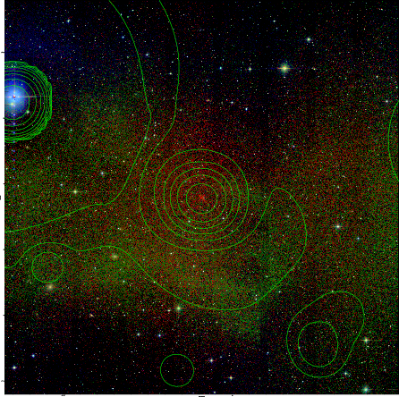  | 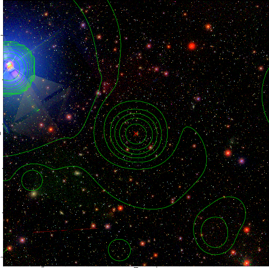  |

