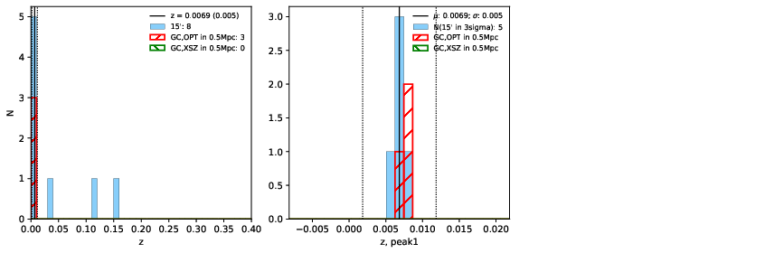

### 271

|Name|RAJ2000[deg]|DEJ2000[deg] |Ext[arcmin]| Ext,ml | z | z_src| C|GC(XSZ,Delta_z<0.01)| GC(OPT,Delta_z<0.01)|GC| R_sig[arcmin] | R500[arcmin] | R500[Mpc]| CRsig[c/s] | CR500[c/s] |L500[1E44 erg/s]|F500[1E-12 erg/s/cm^2]| M500[1E14 Msun]|Tx[keV]|Cnt_sig|Beta|Rc[arcmin]|Comment|Alias|
|---|---|---|---|---|---|------|---|--------|---------|----------|---|---|---|---|---|---|---|---|---|---|---|---|---|---|
|271| 113.161| 85.705| 4.39| 43.06| 0.0069(0.005)| z1, z_opt| S| -| N| N| 24.206| 43.177| 0.368| 0.360(0.047)| 0.414(0.054)| 0.006(0.001)| 5.473(0.511)| 0.14(0.01)| 0.65(0.02)| 326.2| 0.509(-0.007+0.015)| 3.598(-0.275+0.384)| -| t226|

|[RASS image](../image/271/271_img.pdf)|[filtered image](../image/271/271_fil.pdf)|[Segment image](../image/271/271_seg.pdf)|
|-------------------|--------------------|-------------------|
|   |    |   |

|[Exposure image](../image/271/271_mex.pdf)| [nH image](../image/271/271_nh.pdf)| [Planck image](../image/271/271_p.pdf)|
|-------------------|--------------------|-------------------|
|   |     |  |

|[Redshift Histogram](../image/271/271_zg.pdf) | [DSS image(z1)](../image/271/271_dss_z1.pdf)      |  [DSS image(z2)](../image/271/271_dss_z2.pdf)    |
|-------------------|--------------------|-------------------|
| |  Blue circle for optical clusters;  Magenta circle for XSZ clusters;  all with r=1Mpc;  Only GC with Delta_z<0.01 are shown. |  Blue circle for optical clusters;  Magenta circle for XSZ clusters;  all with r=1Mpc;  Only GC with Delta_z<0.01 are shown.  |

|[known Abell/XSZ clusters](../image/271/271_gc.pdf) | [2MASS image](../image/271/271_2mass.pdf)      |
|-------------------|-------------------|
|  Magenta, blue and green circles  for optical, X-ray and SZ clusters  respectively, with redshift of clusters  labelled. The radius of circles  are 1Mpc.|  |

|[PS1 image](../image/271/271_ps1.pdf)            |
|-------------------|
|   |
