

### 272

|Name|RAJ2000[deg]|DEJ2000[deg] |Ext[arcmin]| Ext,ml | z | z_src| C|GC(XSZ,Delta_z<0.01)| GC(OPT,Delta_z<0.01)|GC| R_sig[arcmin] | R500[arcmin] | R500[Mpc]| CRsig[c/s] | CR500[c/s] |L500[1E44 erg/s]|F500[1E-12 erg/s/cm^2]| M500[1E14 Msun]|Tx[keV]|Cnt_sig|Beta|Rc[arcmin]|Comment|Alias|
|---|---|---|---|---|---|------|---|--------|---------|----------|---|---|---|---|---|---|---|---|---|---|---|---|---|---|
|272| 114.119| 39.430| 0.74| 28.09| 0.1128(0.008)| z1, z_xsz| B| F20, MCXC, SPI| N, RM, W| C, F20, MCXC, N, SPI, W| 7.338| 8.681| 1.068| 0.340(0.035)| 0.351(0.036)| 2.096(0.088)| 6.389(0.268)| 3.86(0.08)| 5.11(0.07)| 158.1| 0.819(-0.115+0.113)| 2.080(-0.569+0.473)| -| k006|

|[RASS image](../image/272/272_img.pdf)|[filtered image](../image/272/272_fil.pdf)|[Segment image](../image/272/272_seg.pdf)|
|-------------------|--------------------|-------------------|
| 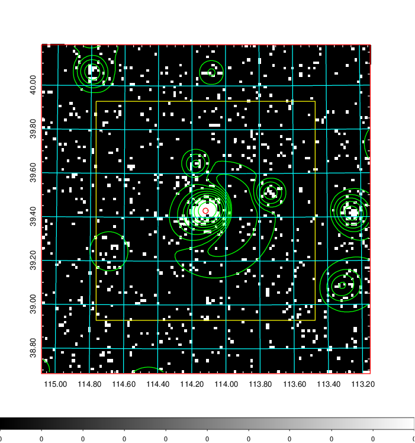  | 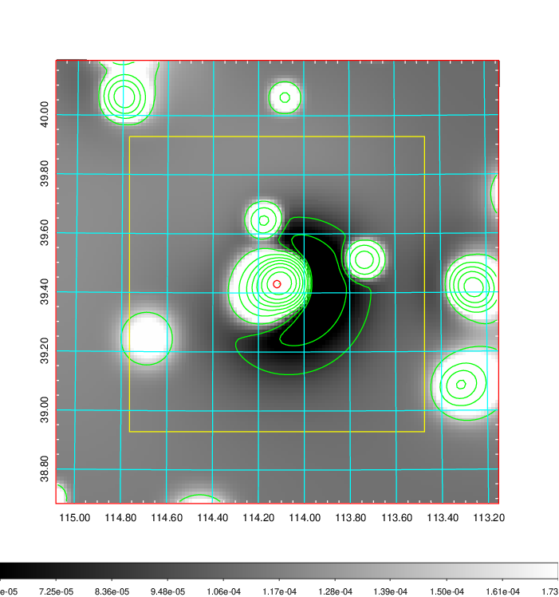   | 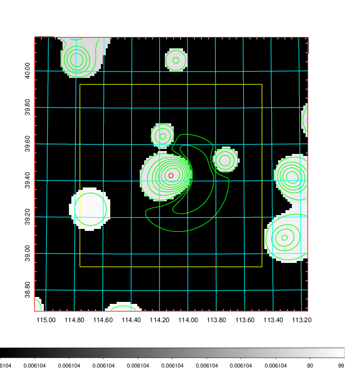  |

|[Exposure image](../image/272/272_mex.pdf)| [nH image](../image/272/272_nh.pdf)| [Planck image](../image/272/272_p.pdf)|
|-------------------|--------------------|-------------------|
|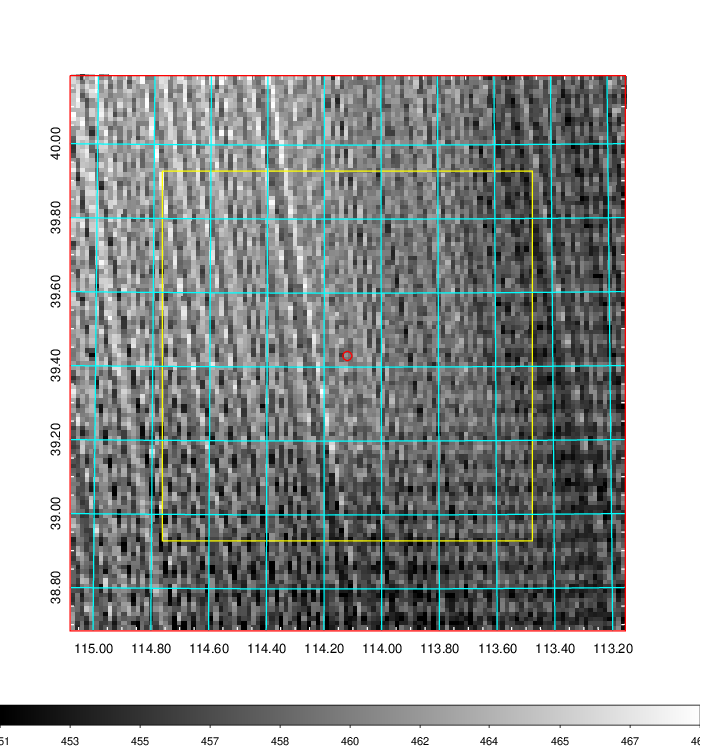   | 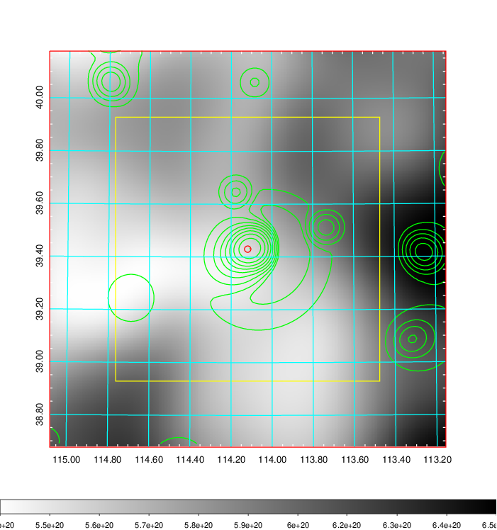    | 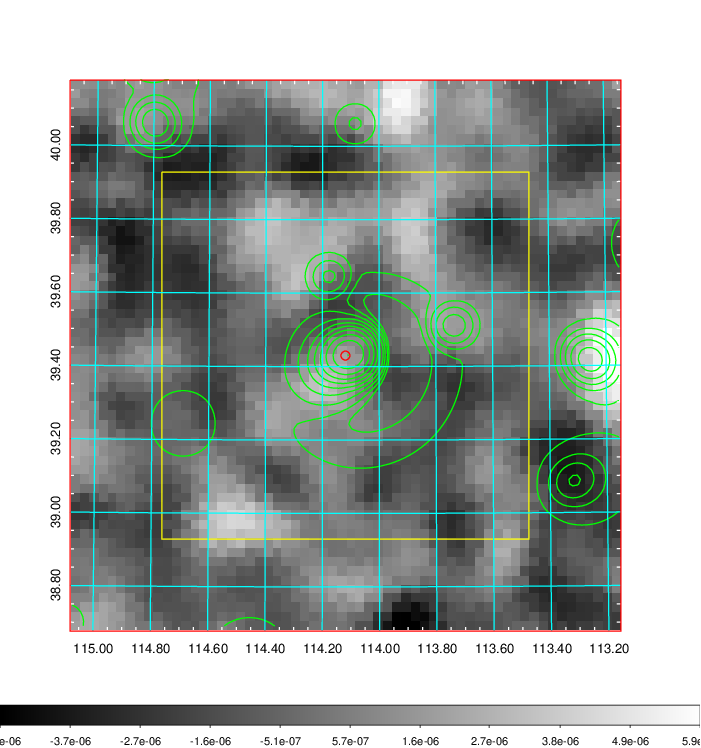 |

|[Redshift Histogram](../image/272/272_zg.pdf) | [DSS image(z1)](../image/272/272_dss_z1.pdf)      |  [DSS image(z2)](../image/272/272_dss_z2.pdf)    |
|-------------------|--------------------|-------------------|
|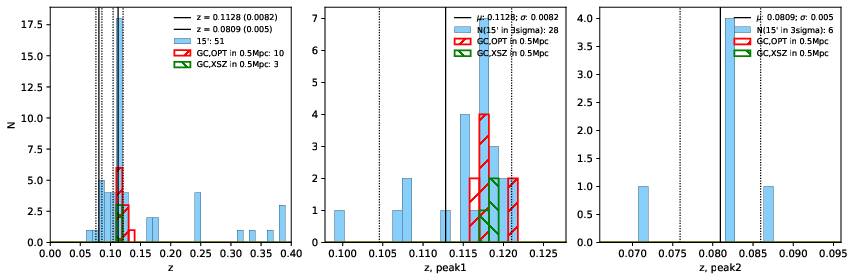 |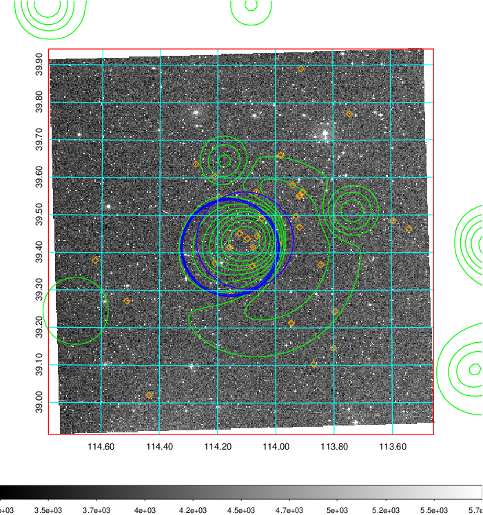  Blue circle for optical clusters;  Magenta circle for XSZ clusters;  all with r=1Mpc;  Only GC with Delta_z<0.01 are shown. | 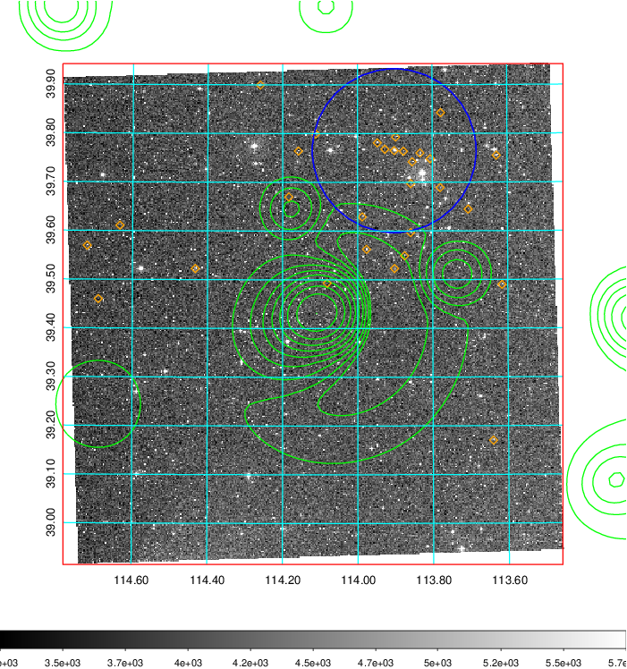 Blue circle for optical clusters;  Magenta circle for XSZ clusters;  all with r=1Mpc;  Only GC with Delta_z<0.01 are shown.  |

|[known Abell/XSZ clusters](../image/272/272_gc.pdf) | [2MASS image](../image/272/272_2mass.pdf)      |[SDSS image](../image/272/272_sdss.pdf)   |
|-------------------|-------------------|-------------------|
|  Magenta, blue and green circles  for optical, X-ray and SZ clusters  respectively, with redshift of clusters  labelled. The radius of circles  are 1Mpc.|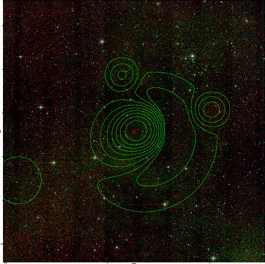  | 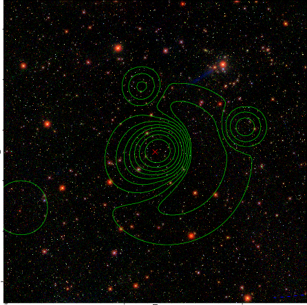  |

