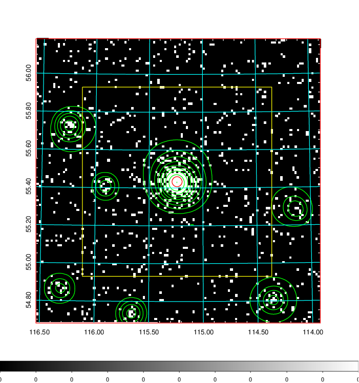
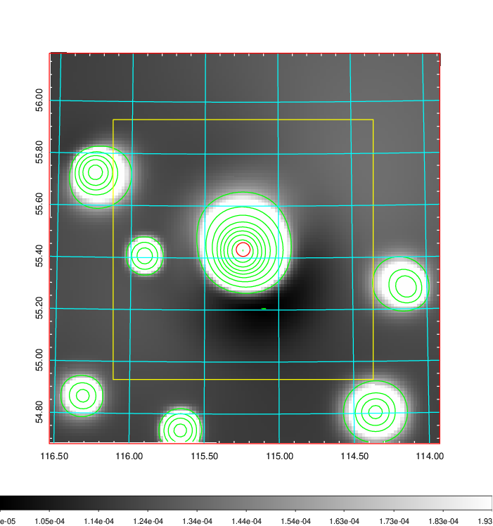
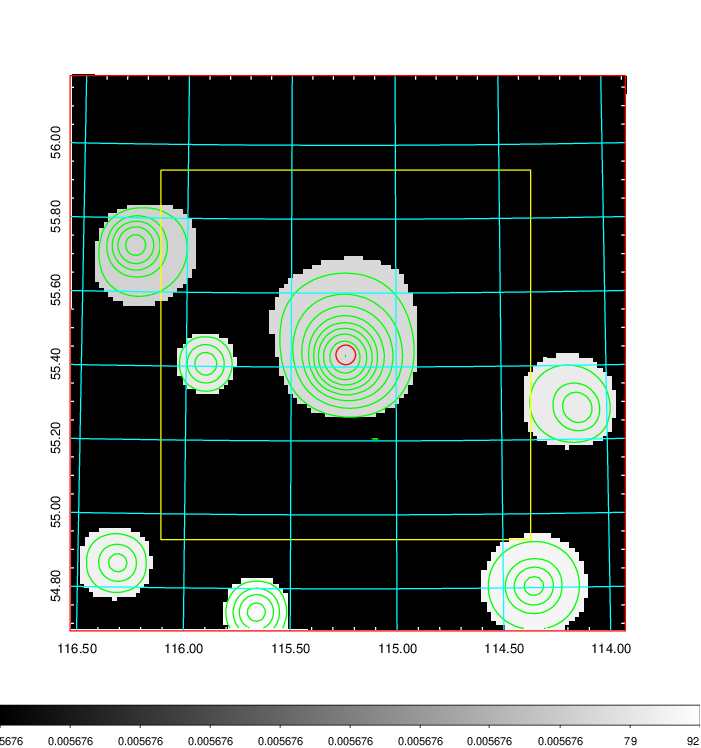
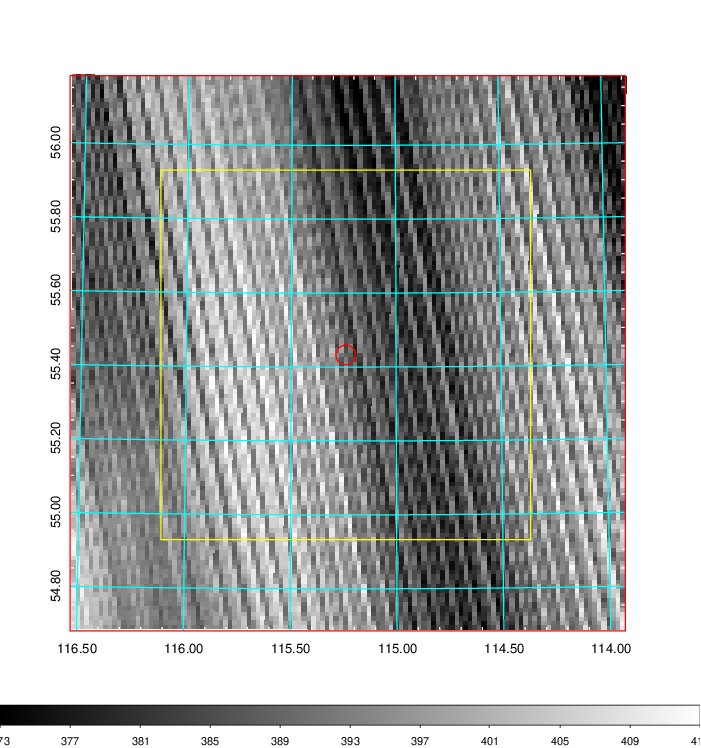
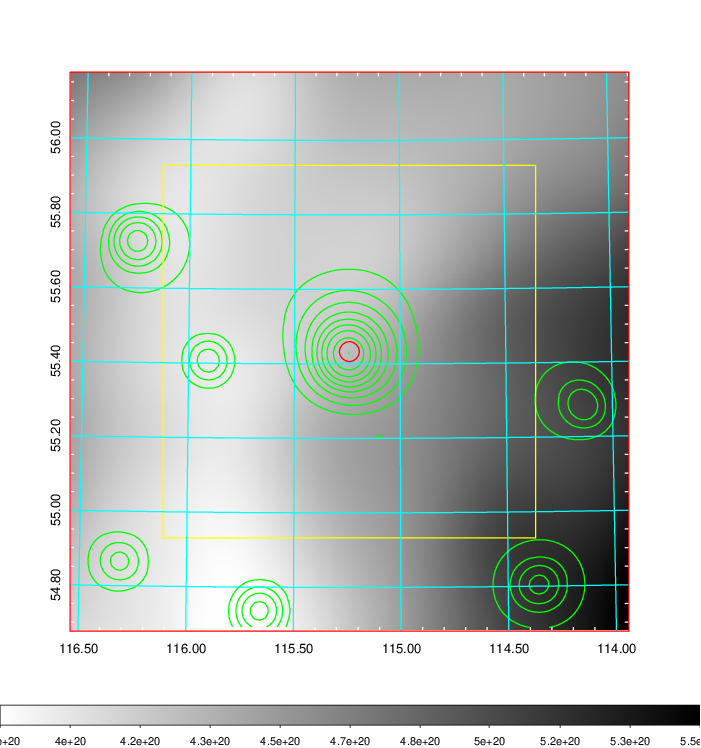
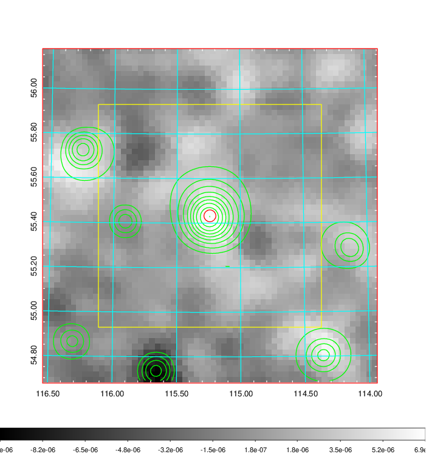
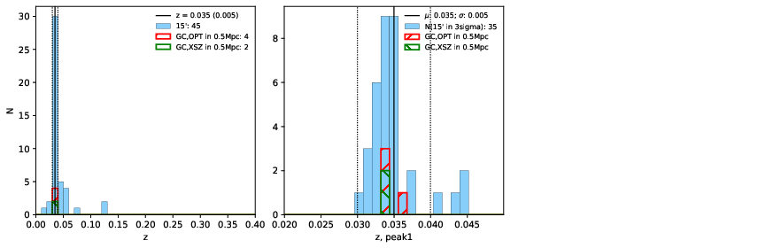
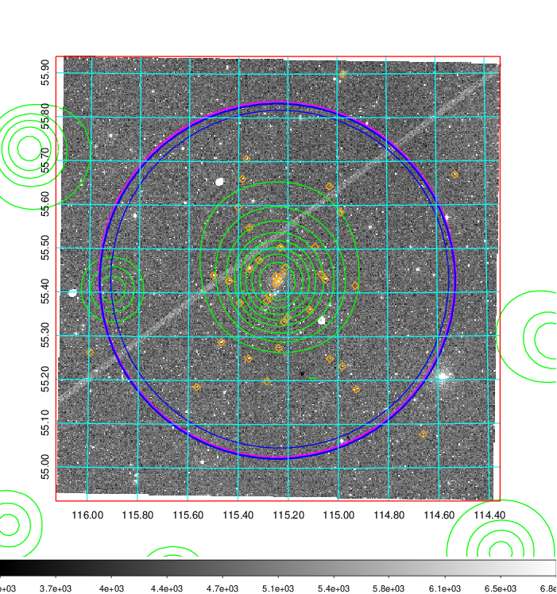
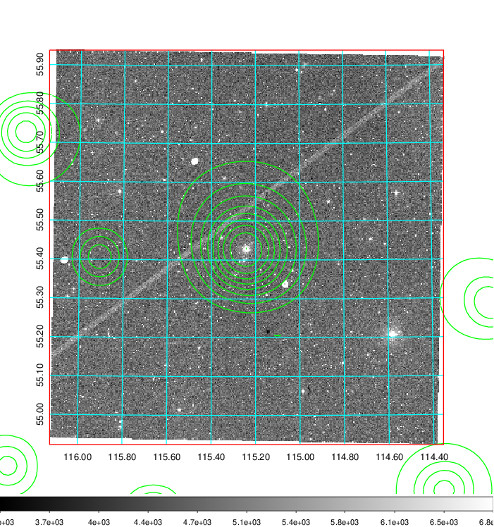
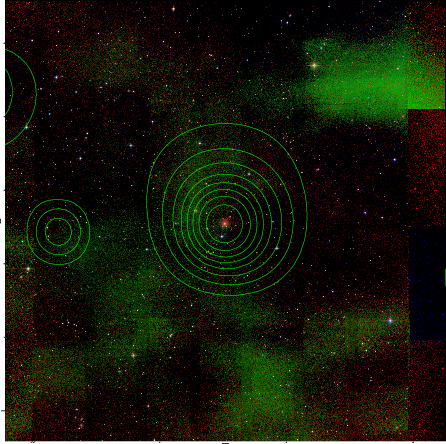

### 273

|Name|RAJ2000[deg]|DEJ2000[deg] |Ext[arcmin]| Ext,ml | z | z_src| C|GC(XSZ,Delta_z<0.01)| GC(OPT,Delta_z<0.01)|GC| R_sig[arcmin] | R500[arcmin] | R500[Mpc]| CRsig[c/s] | CR500[c/s] |L500[1E44 erg/s]|F500[1E-12 erg/s/cm^2]| M500[1E14 Msun]|Tx[keV]|Cnt_sig|Beta|Rc[arcmin]|Comment|Alias|
|---|---|---|---|---|---|------|---|--------|---------|----------|---|---|---|---|---|---|---|---|---|---|---|---|---|---|
|273| 115.240| 55.433| 1.60| 211.37| 0.0350(0.005)| z1, z_xsz| B| MCXC, Tar| N, W| MCXC, N, Tar, W| 12.700| 19.482| 0.814| 0.854(0.055)| 0.937(0.060)| 0.470(0.016)| 16.565(0.569)| 1.59(0.03)| 2.88(0.03)| 327.1| 0.757(-0.069+0.091)| 3.033(-0.481+0.563)| -| k137|

|[RASS image](../image/273/273_img.pdf)|[filtered image](../image/273/273_fil.pdf)|[Segment image](../image/273/273_seg.pdf)|
|-------------------|--------------------|-------------------|
|   |    |   |

|[Exposure image](../image/273/273_mex.pdf)| [nH image](../image/273/273_nh.pdf)| [Planck image](../image/273/273_p.pdf)|
|-------------------|--------------------|-------------------|
|   |     |  |

|[Redshift Histogram](../image/273/273_zg.pdf) | [DSS image(z1)](../image/273/273_dss_z1.pdf)      |  [DSS image(z2)](../image/273/273_dss_z2.pdf)    |
|-------------------|--------------------|-------------------|
| |  Blue circle for optical clusters;  Magenta circle for XSZ clusters;  all with r=1Mpc;  Only GC with Delta_z<0.01 are shown. |  Blue circle for optical clusters;  Magenta circle for XSZ clusters;  all with r=1Mpc;  Only GC with Delta_z<0.01 are shown.  |

|[known Abell/XSZ clusters](../image/273/273_gc.pdf) | [2MASS image](../image/273/273_2mass.pdf)      |
|-------------------|-------------------|
|  Magenta, blue and green circles  for optical, X-ray and SZ clusters  respectively, with redshift of clusters  labelled. The radius of circles  are 1Mpc.|  |

|[PS1 image](../image/273/273_ps1.pdf)            |
|-------------------|
|   |
