

### 274

|Name|RAJ2000[deg]|DEJ2000[deg] |Ext[arcmin]| Ext,ml | z | z_src| C|GC(XSZ,Delta_z<0.01)| GC(OPT,Delta_z<0.01)|GC| R_sig[arcmin] | R500[arcmin] | R500[Mpc]| CRsig[c/s] | CR500[c/s] |L500[1E44 erg/s]|F500[1E-12 erg/s/cm^2]| M500[1E14 Msun]|Tx[keV]|Cnt_sig|Beta|Rc[arcmin]|Comment|Alias|
|---|---|---|---|---|---|------|---|--------|---------|----------|---|---|---|---|---|---|---|---|---|---|---|---|---|---|
|274| 116.656| 30.985| 3.48| 30.40| 0.0579(0.005)| z1, z_xsz| B| F20, MCXC, SPI| N, W, Zw| C, F20, MCXC, N, SPI, Tak, W, XCS| 9.775| 9.802| 0.659| 0.128(0.031)| 0.128(0.031)| 0.172(0.024)| 2.141(0.298)| 0.86(0.06)| 1.99(0.09)| 50.9| 0.881(-0.134+0.086)| 5.834(-1.045+0.839)| -| k429|

|[RASS image](../image/274/274_img.pdf)|[filtered image](../image/274/274_fil.pdf)|[Segment image](../image/274/274_seg.pdf)|
|-------------------|--------------------|-------------------|
| 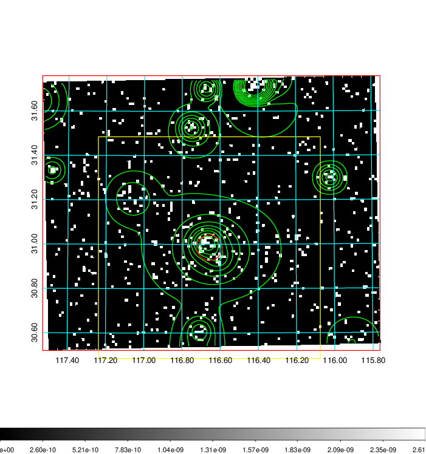  | 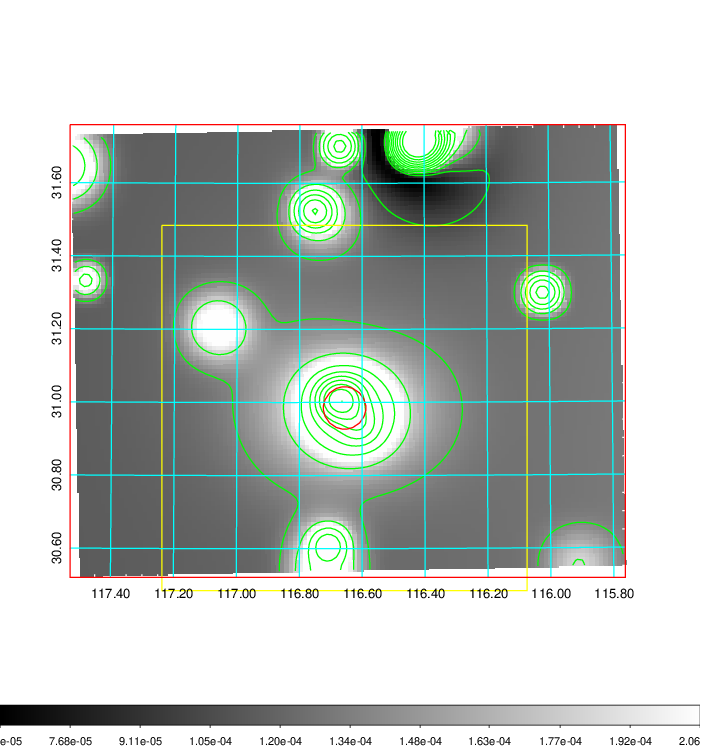   | 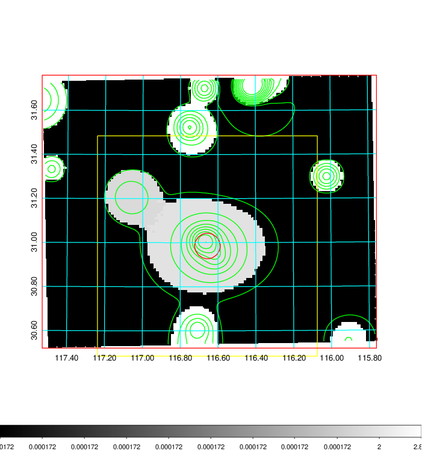  |

|[Exposure image](../image/274/274_mex.pdf)| [nH image](../image/274/274_nh.pdf)| [Planck image](../image/274/274_p.pdf)|
|-------------------|--------------------|-------------------|
|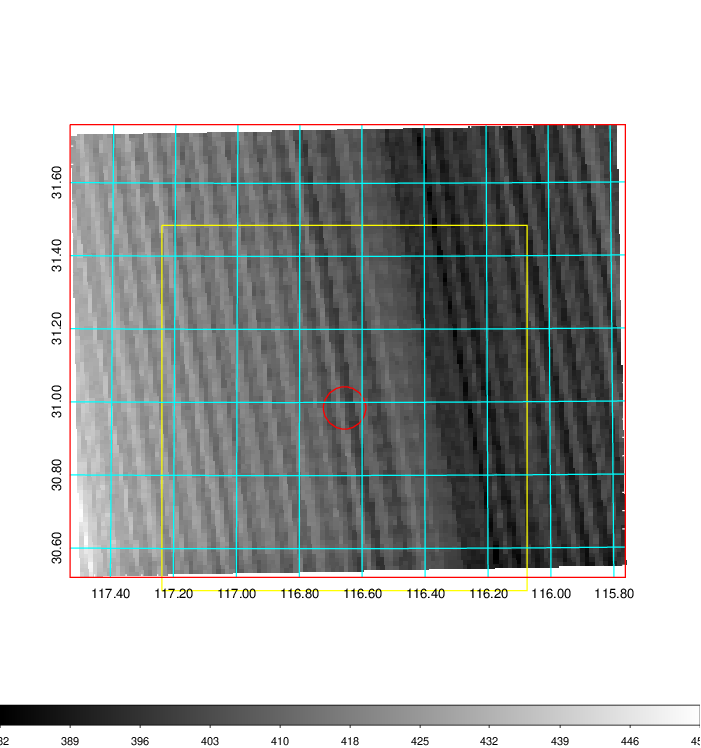   | 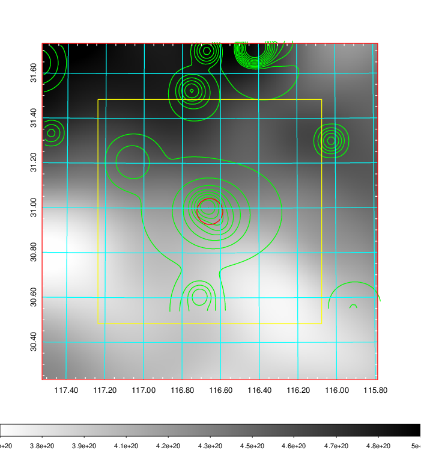    | 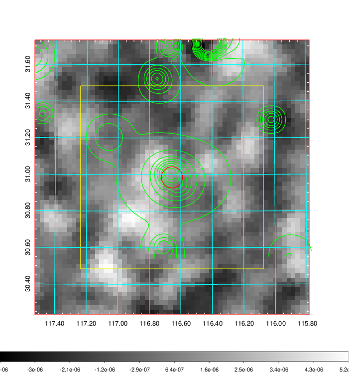 |

|[Redshift Histogram](../image/274/274_zg.pdf) | [DSS image(z1)](../image/274/274_dss_z1.pdf)      |  [DSS image(z2)](../image/274/274_dss_z2.pdf)    |
|-------------------|--------------------|-------------------|
|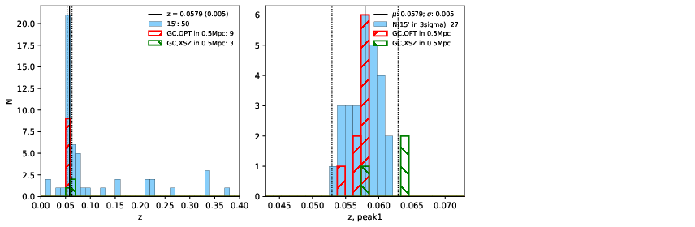 |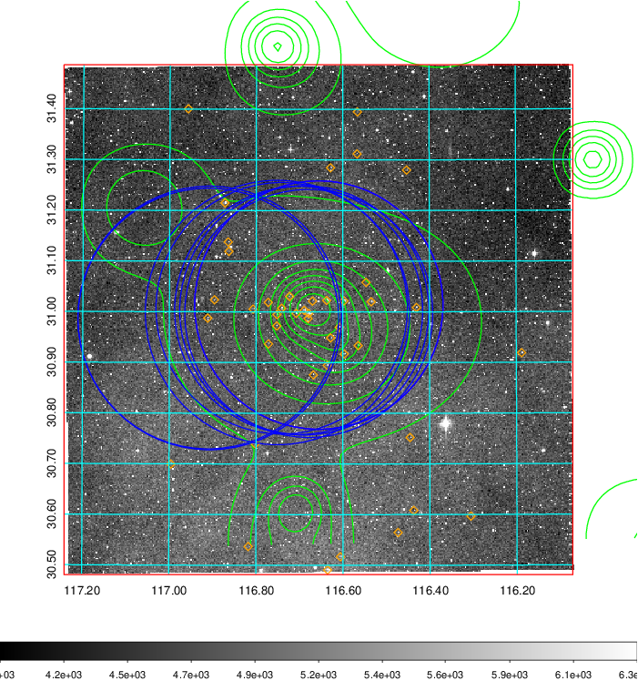  Blue circle for optical clusters;  Magenta circle for XSZ clusters;  all with r=1Mpc;  Only GC with Delta_z<0.01 are shown. | 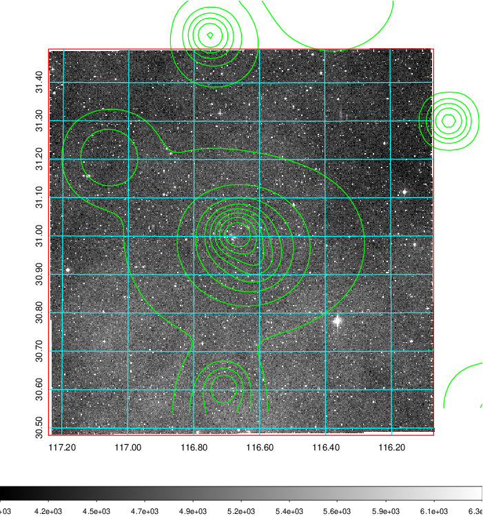 Blue circle for optical clusters;  Magenta circle for XSZ clusters;  all with r=1Mpc;  Only GC with Delta_z<0.01 are shown.  |

|[Previous-identified clusters](../image/274/274_gc.pdf) | [2MASS image](../image/274/274_2mass.pdf)      |[SDSS image](../image/274/274_sdss.pdf)   |
|-------------------|-------------------|-------------------|
|  Green, magenta, and blue circles  for optical, X-ray and SZ clusters  respectively, with redshift of clusters  labelled. The radius of circles  are 1Mpc.|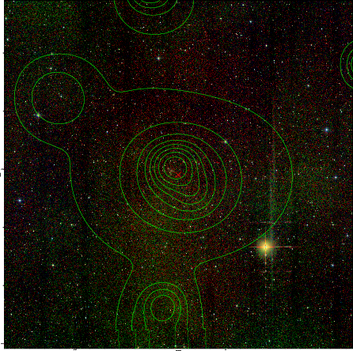  | 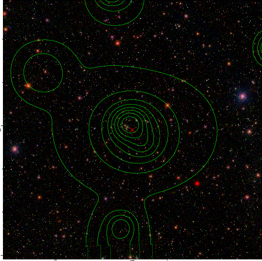  |

