

### 275

|Name|RAJ2000[deg]|DEJ2000[deg] |Ext[arcmin]| Ext,ml | z | z_src| C|GC(XSZ,Delta_z<0.01)| GC(OPT,Delta_z<0.01)|GC| R_sig[arcmin] | R500[arcmin] | R500[Mpc]| CRsig[c/s] | CR500[c/s] |L500[1E44 erg/s]|F500[1E-12 erg/s/cm^2]| M500[1E14 Msun]|Tx[keV]|Cnt_sig|Beta|Rc[arcmin]|Comment|Alias|
|---|---|---|---|---|---|------|---|--------|---------|----------|---|---|---|---|---|---|---|---|---|---|---|---|---|---|
|275| 117.062| 18.559| 2.66| 54.23| 0.0467(0.005)| z1, z_xsz| B| MCXC, Tar| N| F20, MCXC, N, Tar, W| 32.680| 14.099| 0.775| 0.452(0.090)| 0.413(0.082)| 0.364(0.067)| 7.093(1.312)| 1.39(0.13)| 2.66(0.16)| 264.3| 0.504(-0.003+0.006)| 2.891(-0.213+0.241)| -| k329|

|[RASS image](../image/275/275_img.pdf)|[filtered image](../image/275/275_fil.pdf)|[Segment image](../image/275/275_seg.pdf)|
|-------------------|--------------------|-------------------|
| 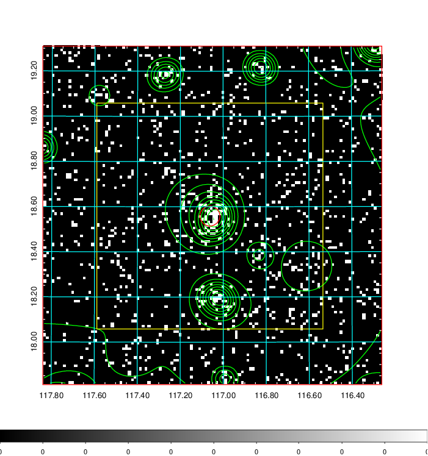  | 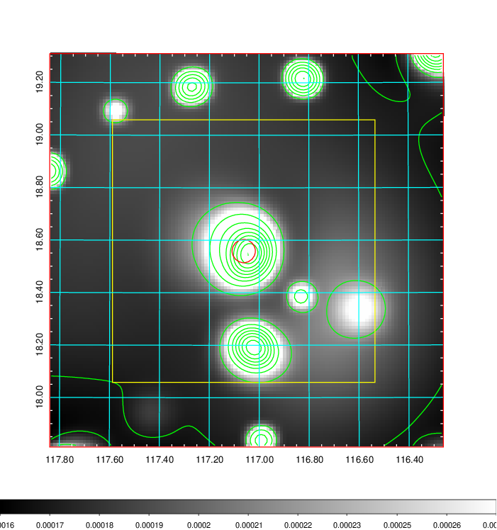   | 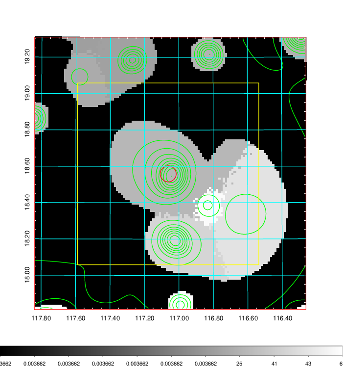  |

|[Exposure image](../image/275/275_mex.pdf)| [nH image](../image/275/275_nh.pdf)| [Planck image](../image/275/275_p.pdf)|
|-------------------|--------------------|-------------------|
|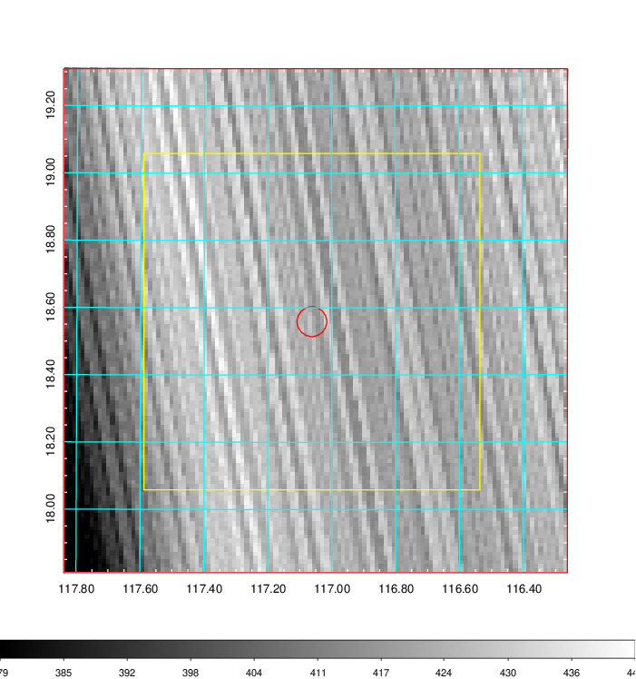   | 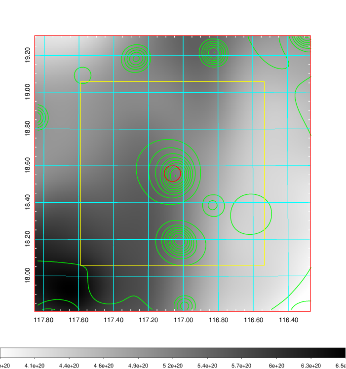    | 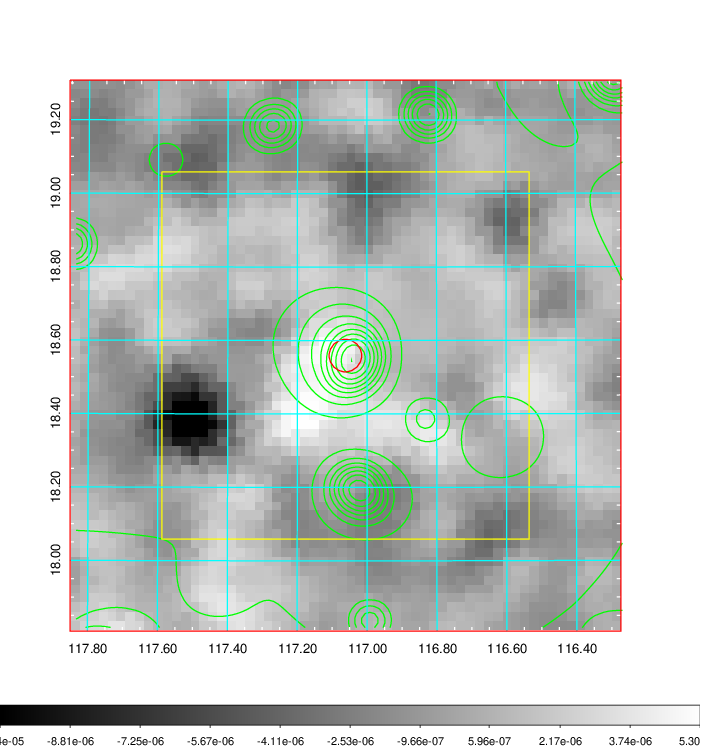 |

|[Redshift Histogram](../image/275/275_zg.pdf) | [DSS image(z1)](../image/275/275_dss_z1.pdf)      |  [DSS image(z2)](../image/275/275_dss_z2.pdf)    |
|-------------------|--------------------|-------------------|
|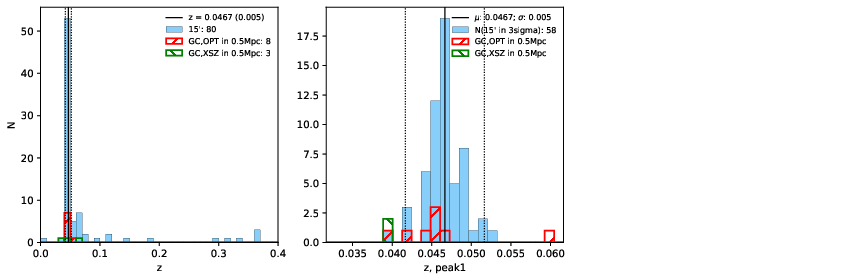 |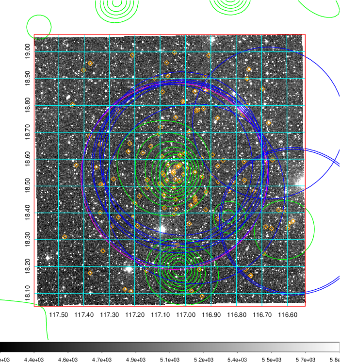  Blue circle for optical clusters;  Magenta circle for XSZ clusters;  all with r=1Mpc;  Only GC with Delta_z<0.01 are shown. | 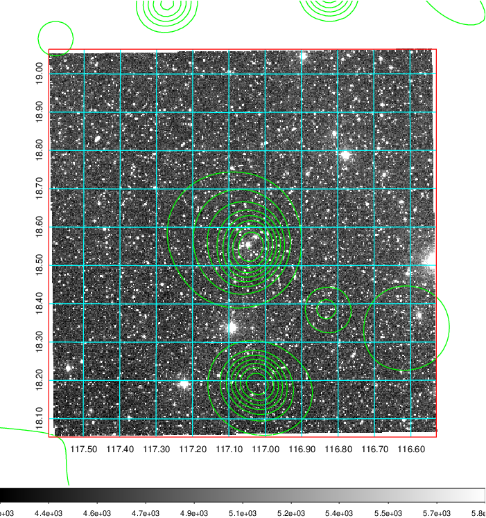 Blue circle for optical clusters;  Magenta circle for XSZ clusters;  all with r=1Mpc;  Only GC with Delta_z<0.01 are shown.  |

|[Previous-identified clusters](../image/275/275_gc.pdf) | [2MASS image](../image/275/275_2mass.pdf)      |[SDSS image](../image/275/275_sdss.pdf)   |
|-------------------|-------------------|-------------------|
|  Green, magenta, and blue circles  for optical, X-ray and SZ clusters  respectively, with redshift of clusters  labelled. The radius of circles  are 1Mpc.|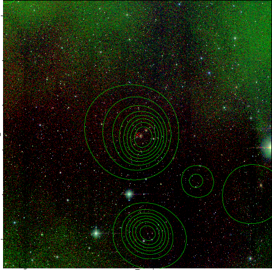  | 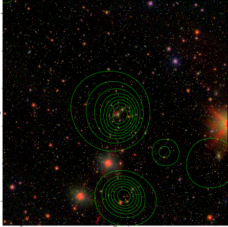  |

