

### 276

|Name|RAJ2000[deg]|DEJ2000[deg] |Ext[arcmin]| Ext,ml | z | z_src| C|GC(XSZ,Delta_z<0.01)| GC(OPT,Delta_z<0.01)|GC| R_sig[arcmin] | R500[arcmin] | R500[Mpc]| CRsig[c/s] | CR500[c/s] |L500[1E44 erg/s]|F500[1E-12 erg/s/cm^2]| M500[1E14 Msun]|Tx[keV]|Cnt_sig|Beta|Rc[arcmin]|Comment|Alias|
|---|---|---|---|---|---|------|---|--------|---------|----------|---|---|---|---|---|---|---|---|---|---|---|---|---|---|
|276| 117.859| 50.220| 3.29| 134.47| 0.0222(0.005)| z1, z_xsz| B| MCXC| N| C, F20, MCXC, N, SPI, W, XCS| 16.800| 21.346| 0.575| 0.416(0.056)| 0.435(0.059)| 0.073(0.006)| 6.490(0.534)| 0.55(0.02)| 1.49(0.04)| 193.4| 0.725(-0.058+0.076)| 4.796(-0.715+0.880)| -| k405|

|[RASS image](../image/276/276_img.pdf)|[filtered image](../image/276/276_fil.pdf)|[Segment image](../image/276/276_seg.pdf)|
|-------------------|--------------------|-------------------|
| 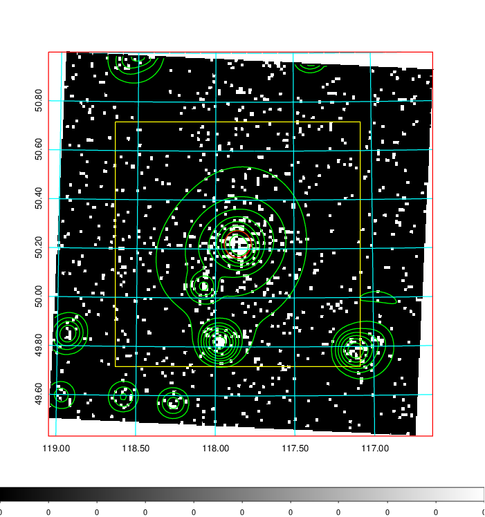  | 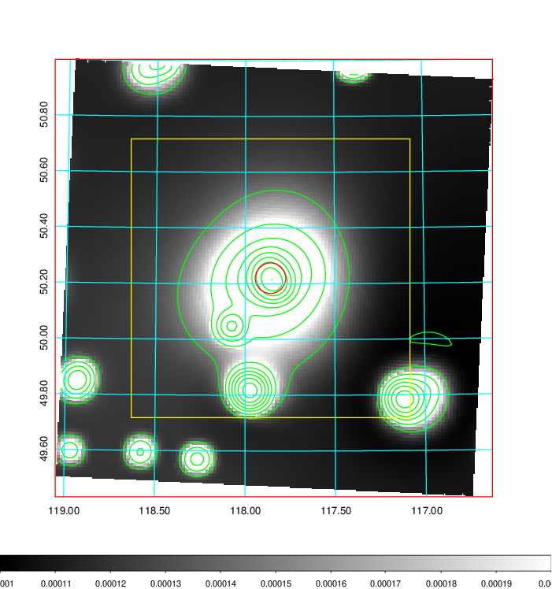   | 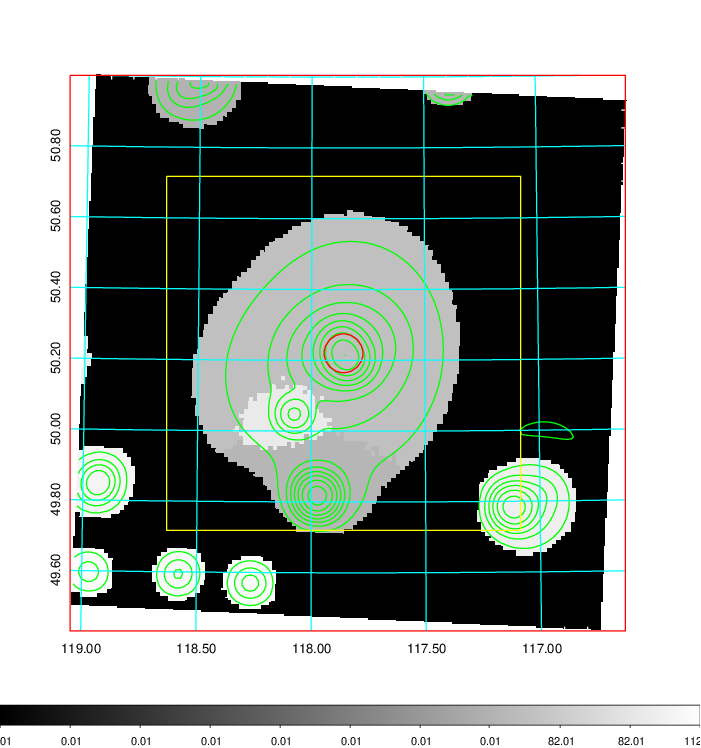  |

|[Exposure image](../image/276/276_mex.pdf)| [nH image](../image/276/276_nh.pdf)| [Planck image](../image/276/276_p.pdf)|
|-------------------|--------------------|-------------------|
|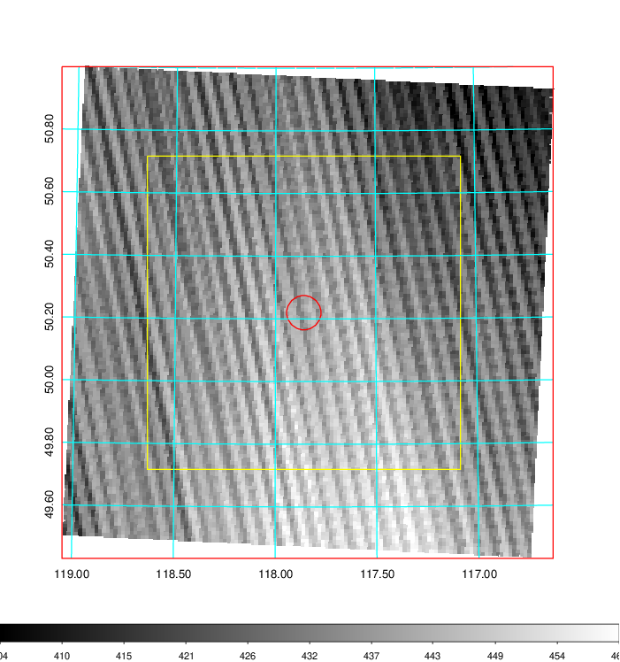   | 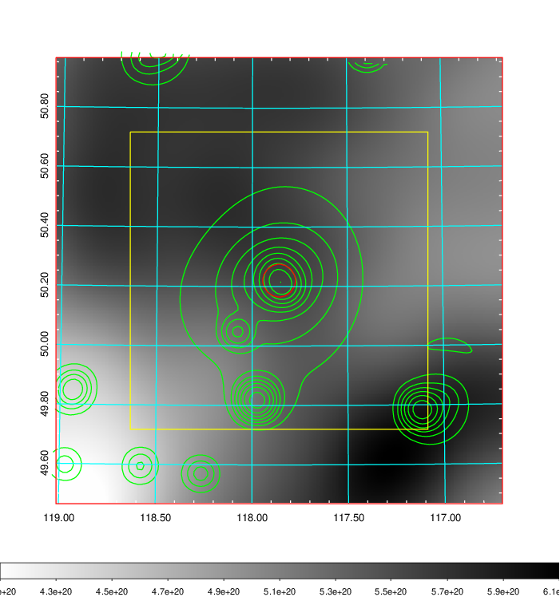    | 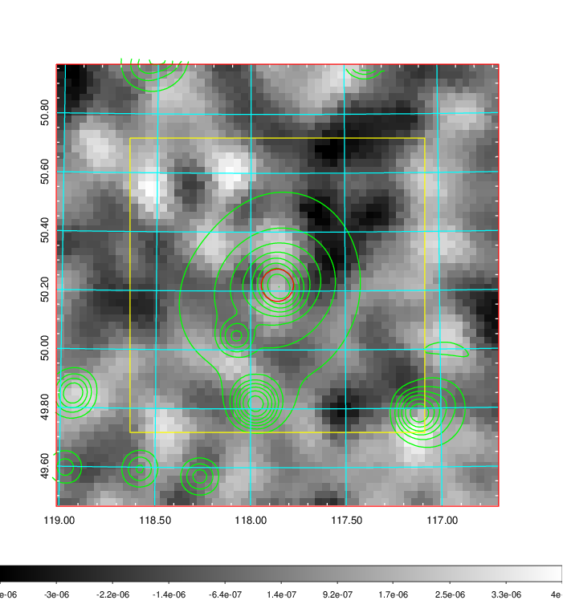 |

|[Redshift Histogram](../image/276/276_zg.pdf) | [DSS image(z1)](../image/276/276_dss_z1.pdf)      |  [DSS image(z2)](../image/276/276_dss_z2.pdf)    |
|-------------------|--------------------|-------------------|
|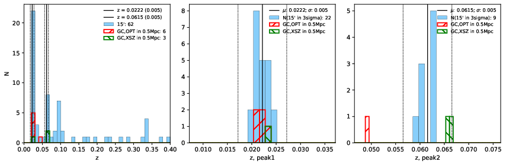 |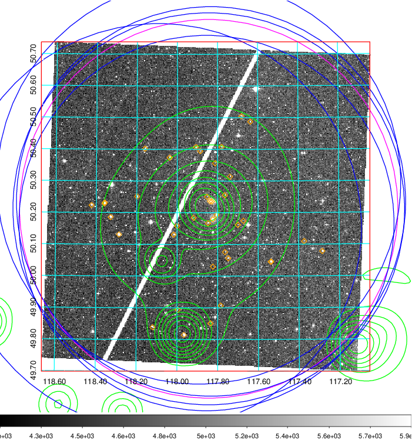  Blue circle for optical clusters;  Magenta circle for XSZ clusters;  all with r=1Mpc;  Only GC with Delta_z<0.01 are shown. | 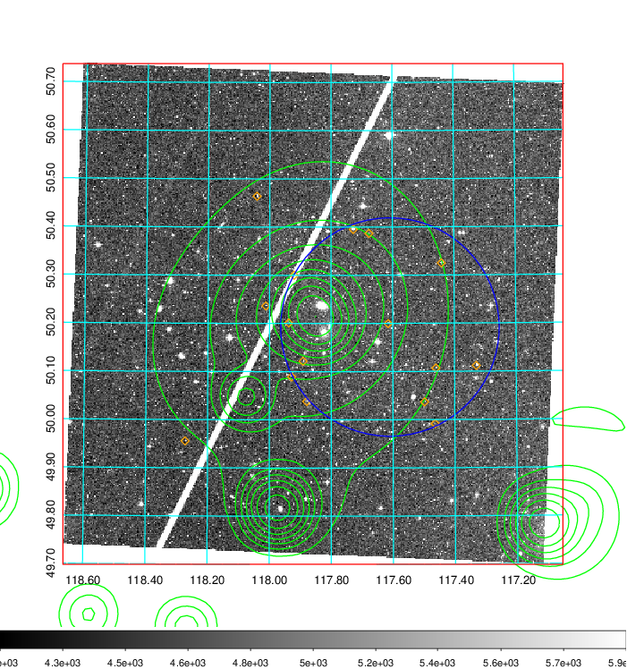 Blue circle for optical clusters;  Magenta circle for XSZ clusters;  all with r=1Mpc;  Only GC with Delta_z<0.01 are shown.  |

|[known Abell/XSZ clusters](../image/276/276_gc.pdf) | [2MASS image](../image/276/276_2mass.pdf)      |[SDSS image](../image/276/276_sdss.pdf)   |
|-------------------|-------------------|-------------------|
|  Magenta, blue and green circles  for optical, X-ray and SZ clusters  respectively, with redshift of clusters  labelled. The radius of circles  are 1Mpc.|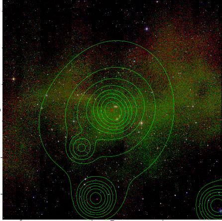  | 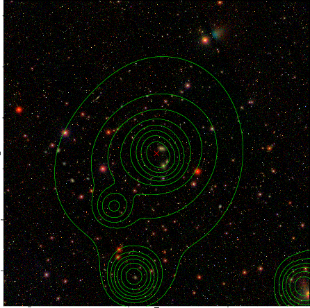  |

