

### 278

|Name|RAJ2000[deg]|DEJ2000[deg] |Ext[arcmin]| Ext,ml | z | z_src| C|GC(XSZ,Delta_z<0.01)| GC(OPT,Delta_z<0.01)|GC| R_sig[arcmin] | R500[arcmin] | R500[Mpc]| CRsig[c/s] | CR500[c/s] |L500[1E44 erg/s]|F500[1E-12 erg/s/cm^2]| M500[1E14 Msun]|Tx[keV]|Cnt_sig|Beta|Rc[arcmin]|Comment|Alias|
|---|---|---|---|---|---|------|---|--------|---------|----------|---|---|---|---|---|---|---|---|---|---|---|---|---|---|
|278| 119.797| 14.180| 8.84| 36.90| 0.2058(0.005)| z1,| G| -| -| F20, N, W| 11.238| 5.455| 1.104| 0.160(0.046)| 0.147(0.042)| 3.479(0.817)| 2.840(0.667)| 4.70(0.53)| 5.95(0.42)| 34.5| 0.823(-0.169+0.125)| 8.494(-1.995+1.681)| -| t411|

|[RASS image](../image/278/278_img.pdf)|[filtered image](../image/278/278_fil.pdf)|[Segment image](../image/278/278_seg.pdf)|
|-------------------|--------------------|-------------------|
| 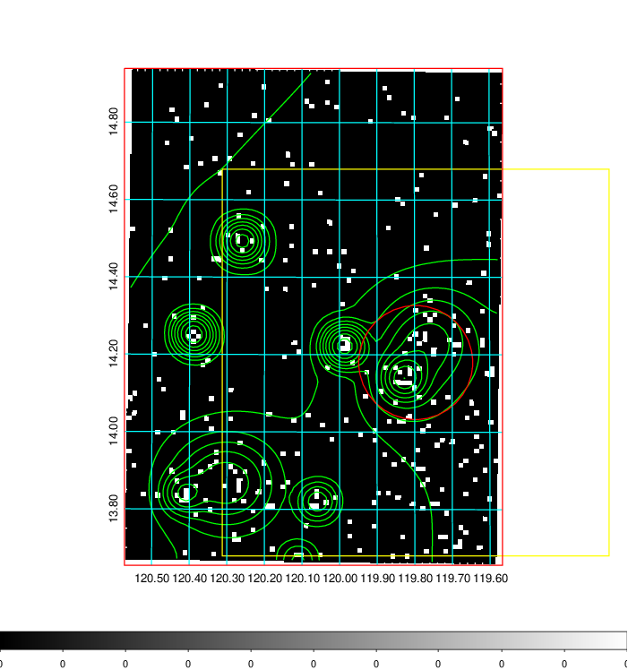  | 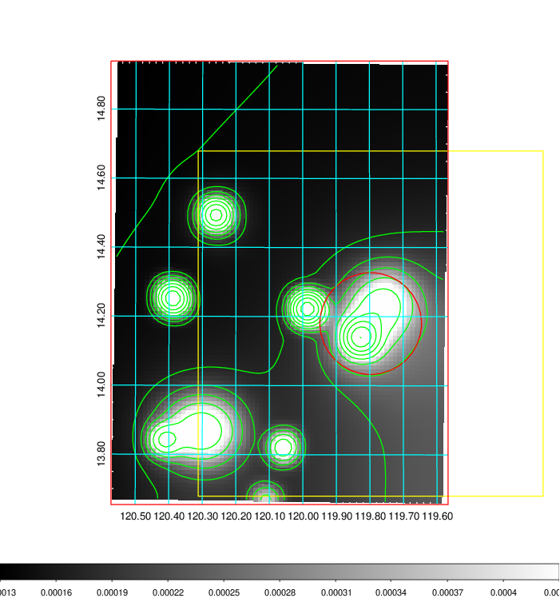   | 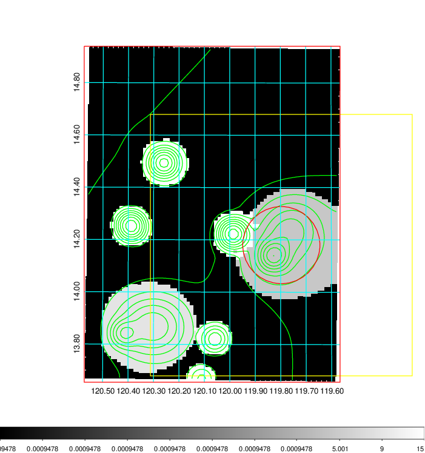  |

|[Exposure image](../image/278/278_mex.pdf)| [nH image](../image/278/278_nh.pdf)| [Planck image](../image/278/278_p.pdf)|
|-------------------|--------------------|-------------------|
|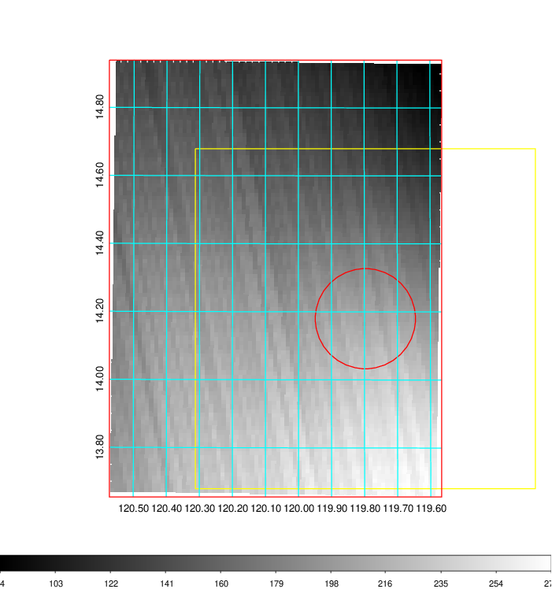   | 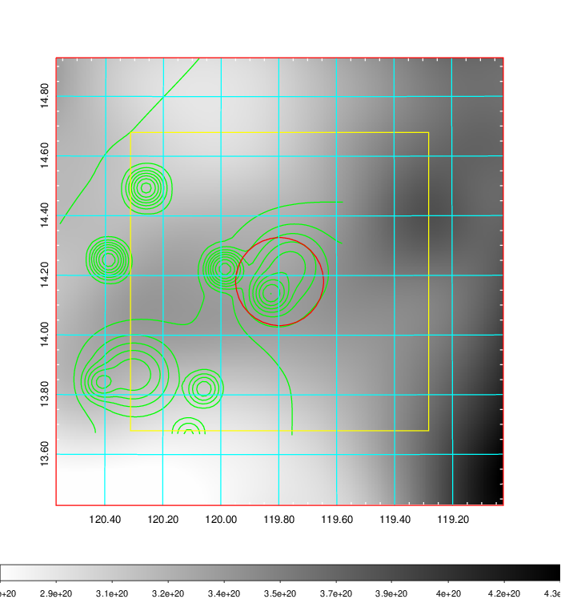    | 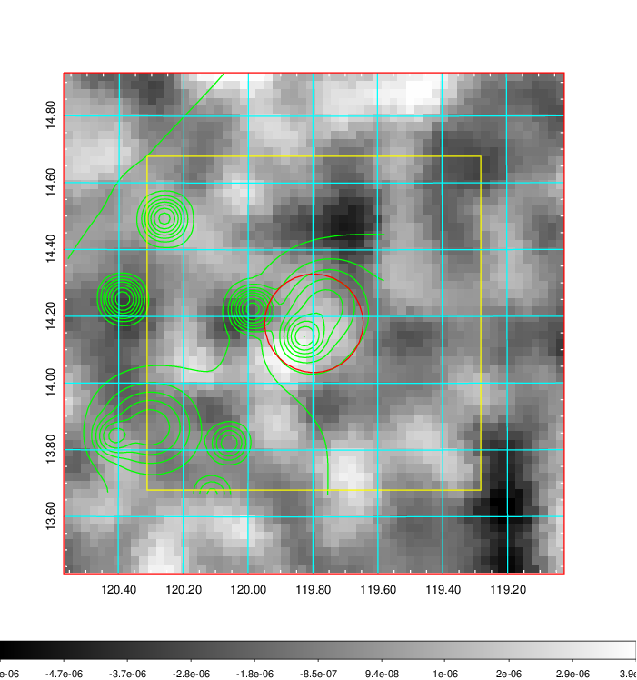 |

|[Redshift Histogram](../image/278/278_zg.pdf) | [DSS image(z1)](../image/278/278_dss_z1.pdf)      |  [DSS image(z2)](../image/278/278_dss_z2.pdf)    |
|-------------------|--------------------|-------------------|
|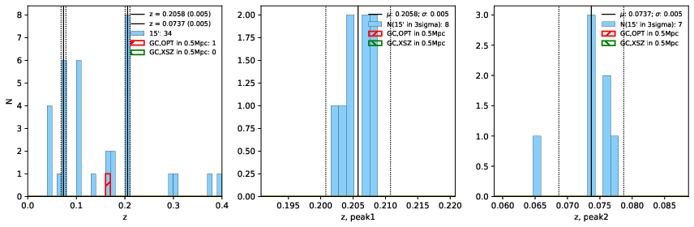 |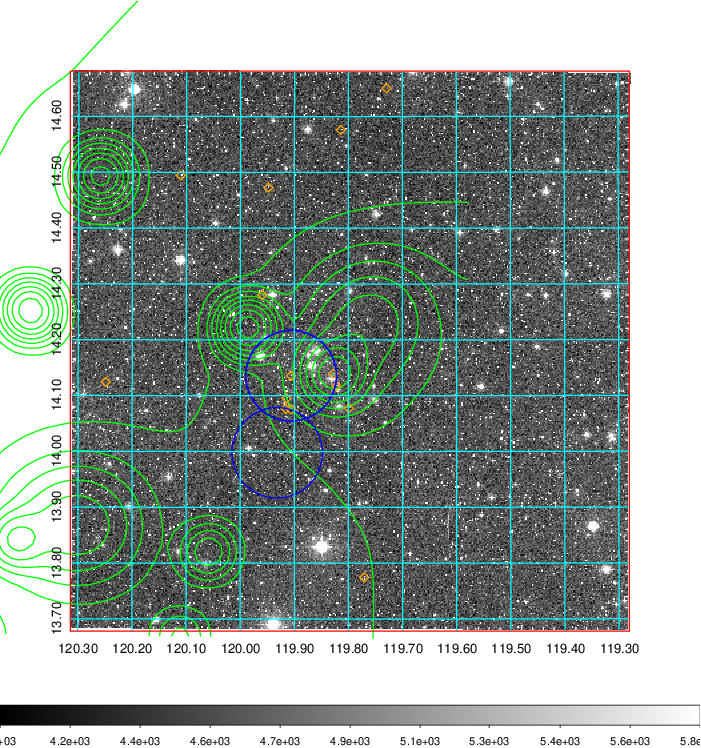  Blue circle for optical clusters;  Magenta circle for XSZ clusters;  all with r=1Mpc;  Only GC with Delta_z<0.01 are shown. | 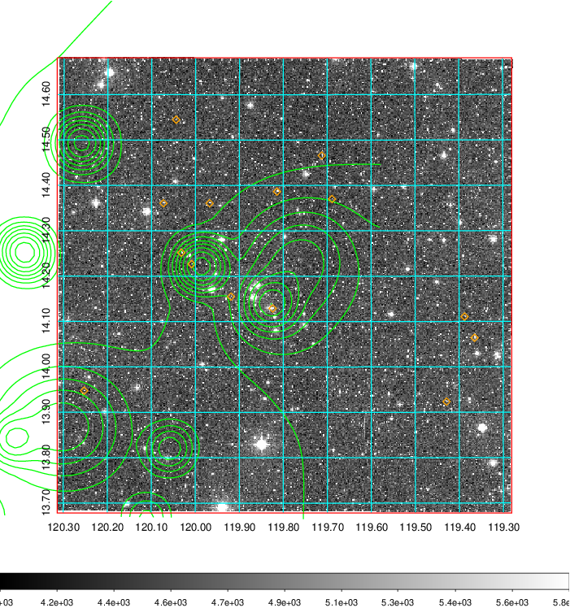 Blue circle for optical clusters;  Magenta circle for XSZ clusters;  all with r=1Mpc;  Only GC with Delta_z<0.01 are shown.  |

|[Previous-identified clusters](../image/278/278_gc.pdf) | [2MASS image](../image/278/278_2mass.pdf)      |[SDSS image](../image/278/278_sdss.pdf)   |
|-------------------|-------------------|-------------------|
|  Green, magenta, and blue circles  for optical, X-ray and SZ clusters  respectively, with redshift of clusters  labelled. The radius of circles  are 1Mpc.|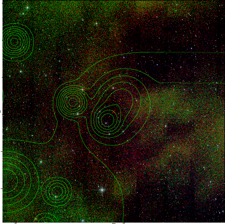  | 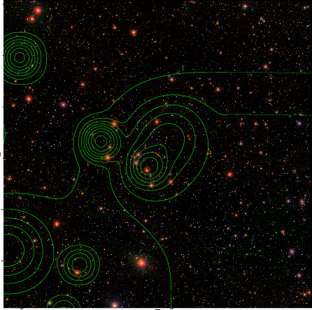  |

