

### 279

|Name|RAJ2000[deg]|DEJ2000[deg] |Ext[arcmin]| Ext,ml | z | z_src| C|GC(XSZ,Delta_z<0.01)| GC(OPT,Delta_z<0.01)|GC| R_sig[arcmin] | R500[arcmin] | R500[Mpc]| CRsig[c/s] | CR500[c/s] |L500[1E44 erg/s]|F500[1E-12 erg/s/cm^2]| M500[1E14 Msun]|Tx[keV]|Cnt_sig|Beta|Rc[arcmin]|Comment|Alias|
|---|---|---|---|---|---|------|---|--------|---------|----------|---|---|---|---|---|---|---|---|---|---|---|---|---|---|
|279| 119.934| 54.009| 1.57| 39.50| 0.1025(0.005)| z1, z_xsz| B| F20, MCXC, SPI| N, RM, W, Zw| C, F20, MCXC, N, SPI, W| 11.725| 8.278| 0.936| 0.244(0.034)| 0.233(0.032)| 1.175(0.095)| 4.398(0.356)| 2.58(0.10)| 3.96(0.10)| 101.7| 0.618(-0.072+0.114)| 2.273(-0.695+0.877)| -| k129|

|[RASS image](../image/279/279_img.pdf)|[filtered image](../image/279/279_fil.pdf)|[Segment image](../image/279/279_seg.pdf)|
|-------------------|--------------------|-------------------|
| 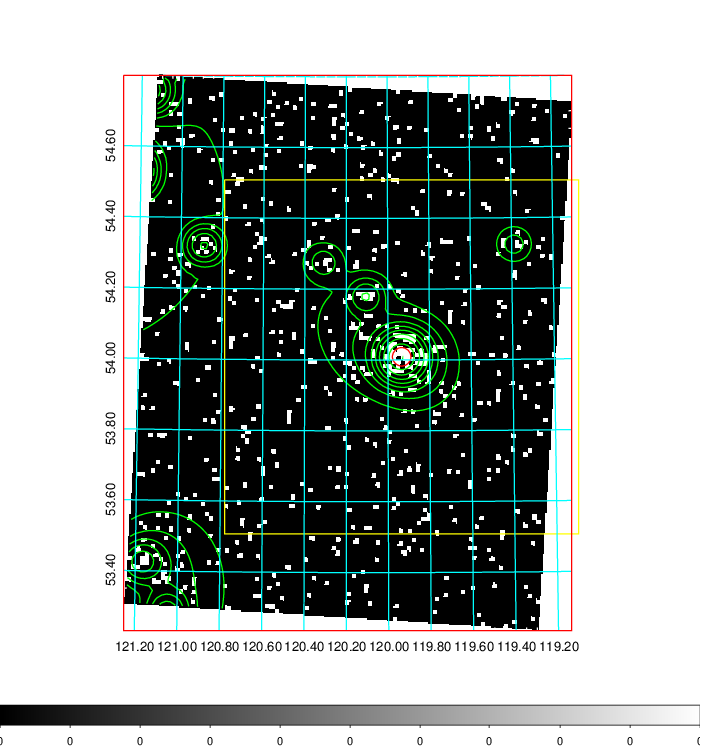  | 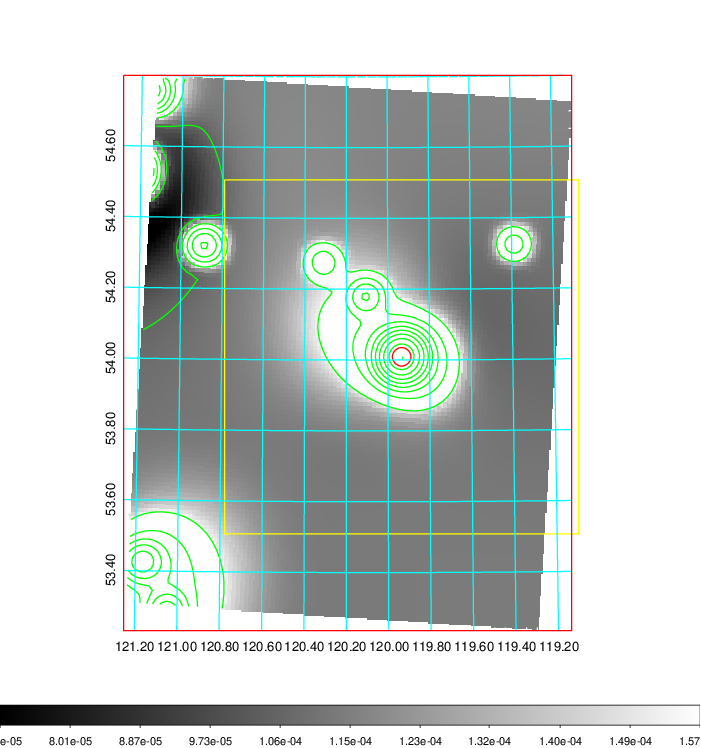   | 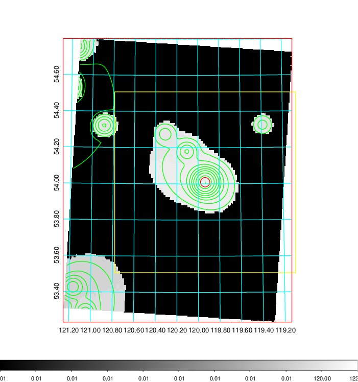  |

|[Exposure image](../image/279/279_mex.pdf)| [nH image](../image/279/279_nh.pdf)| [Planck image](../image/279/279_p.pdf)|
|-------------------|--------------------|-------------------|
|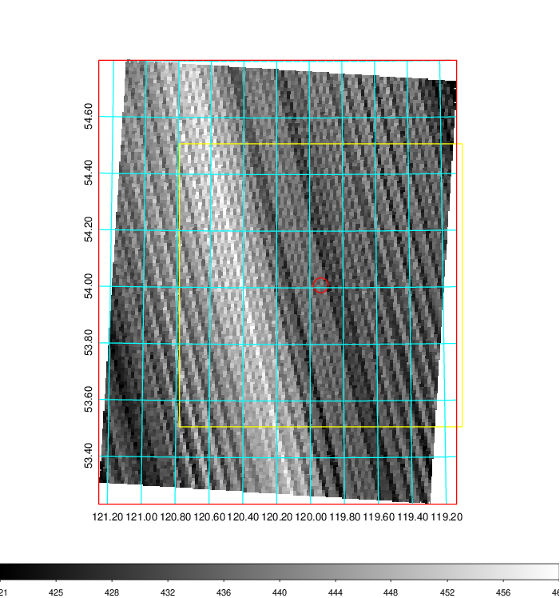   | 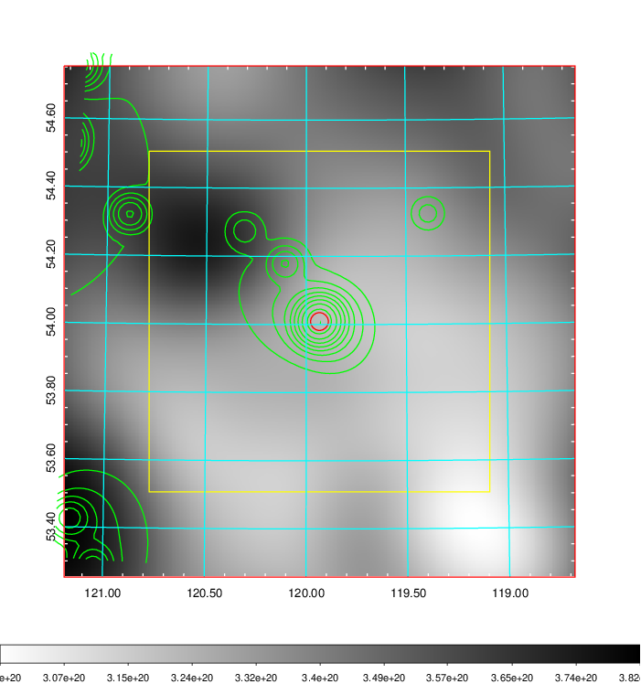    | 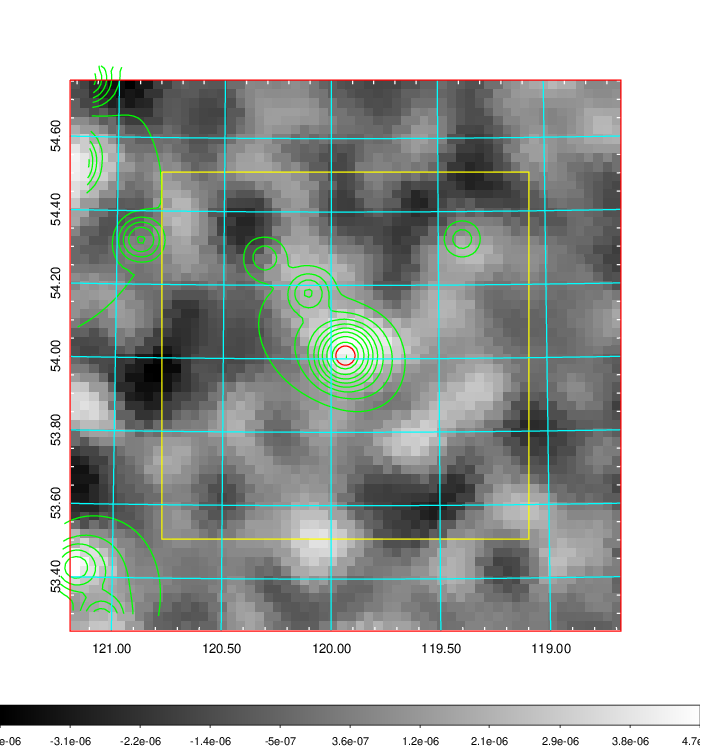 |

|[Redshift Histogram](../image/279/279_zg.pdf) | [DSS image(z1)](../image/279/279_dss_z1.pdf)      |  [DSS image(z2)](../image/279/279_dss_z2.pdf)    |
|-------------------|--------------------|-------------------|
|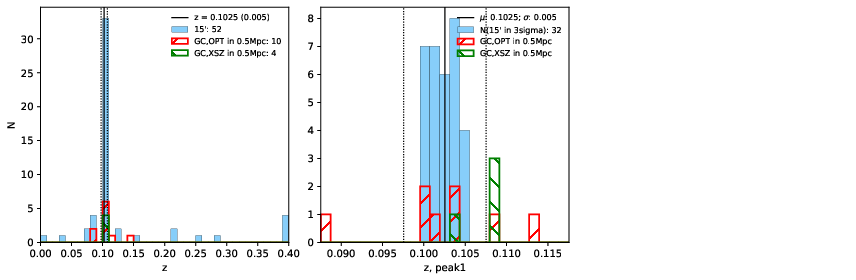 |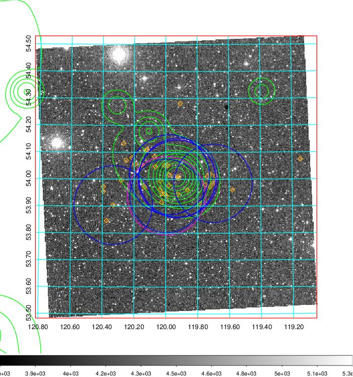  Blue circle for optical clusters;  Magenta circle for XSZ clusters;  all with r=1Mpc;  Only GC with Delta_z<0.01 are shown. | 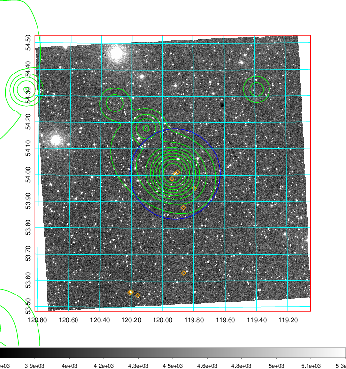 Blue circle for optical clusters;  Magenta circle for XSZ clusters;  all with r=1Mpc;  Only GC with Delta_z<0.01 are shown.  |

|[known Abell/XSZ clusters](../image/279/279_gc.pdf) | [2MASS image](../image/279/279_2mass.pdf)      |[SDSS image](../image/279/279_sdss.pdf)   |
|-------------------|-------------------|-------------------|
|  Magenta, blue and green circles  for optical, X-ray and SZ clusters  respectively, with redshift of clusters  labelled. The radius of circles  are 1Mpc.|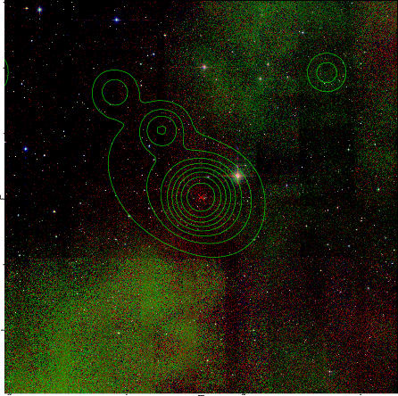  | 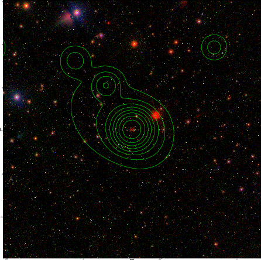  |

