

### 28

|Name|RAJ2000[deg]|DEJ2000[deg] |Ext[arcmin]| Ext,ml | z | z_src| C|GC(XSZ,Delta_z<0.01)| GC(OPT,Delta_z<0.01)|GC| R_sig[arcmin] | R500[arcmin] | R500[Mpc]| CRsig[c/s] | CR500[c/s] |L500[1E44 erg/s]|F500[1E-12 erg/s/cm^2]| M500[1E14 Msun]|Tx[keV]|Cnt_sig|Beta|Rc[arcmin]|Comment|Alias|
|---|---|---|---|---|---|------|---|--------|---------|----------|---|---|---|---|---|---|---|---|---|---|---|---|---|---|
|28| 9.998| 6.848| 11.24| 87.62| 0.0389(0.005)| z1, z_xsz| B| L03, MCXC, PSZ2, XB| A, N, W| A, L03, MCXC, N, PSZ2, W, XB| 22.231| 18.098| 0.837| 0.907(0.136)| 0.880(0.132)| 0.559(0.053)| 15.861(1.493)| 1.73(0.08)| 3.04(0.09)| 85.7| 0.942(-0.081+0.043)| 19.384(-1.682+1.244)| -| k572|

|[RASS image](../image/28/28_img.pdf)|[filtered image](../image/28/28_fil.pdf)|[Segment image](../image/28/28_seg.pdf)|
|-------------------|--------------------|-------------------|
| 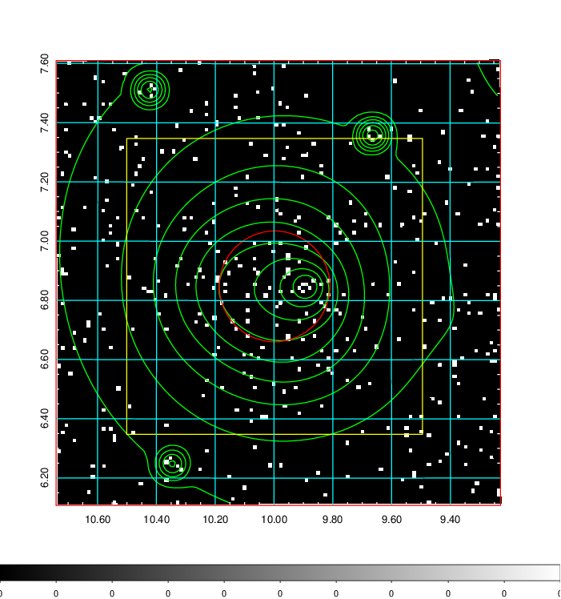  | 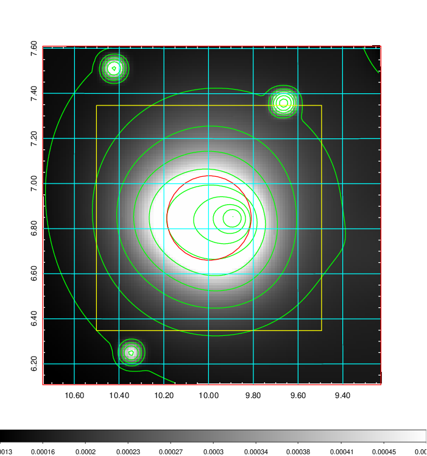   | 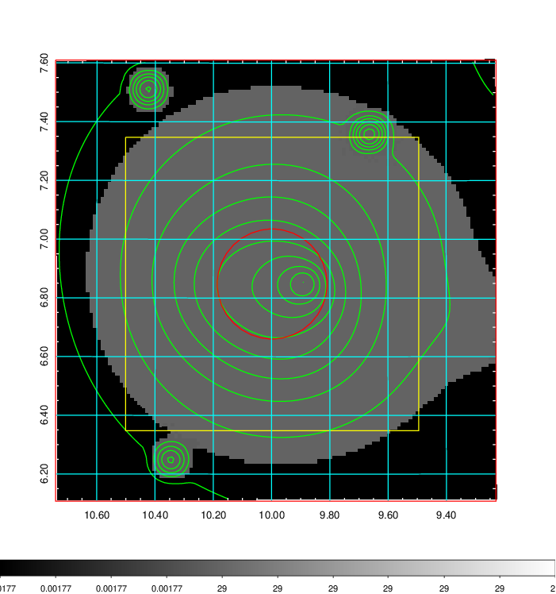  |

|[Exposure image](../image/28/28_mex.pdf)| [nH image](../image/28/28_nh.pdf)| [Planck image](../image/28/28_p.pdf)|
|-------------------|--------------------|-------------------|
|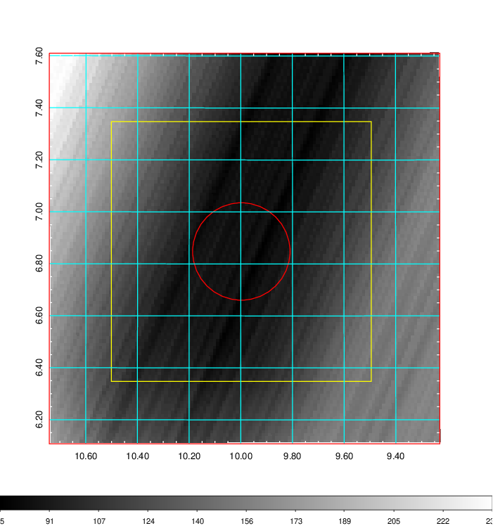   | 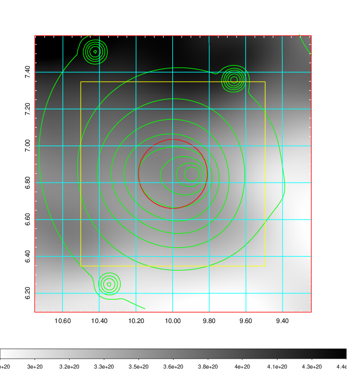    | 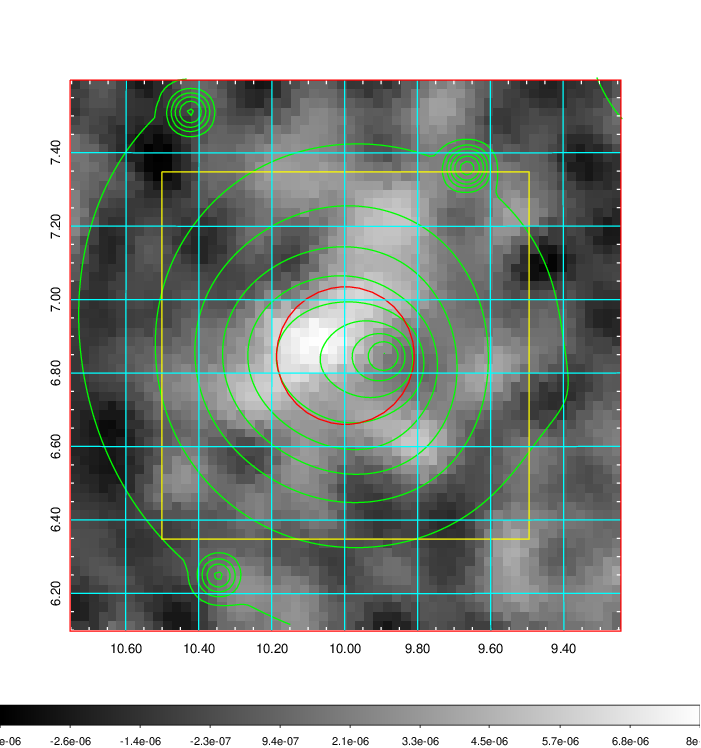 |

|[Redshift Histogram](../image/28/28_zg.pdf) | [DSS image(z1)](../image/28/28_dss_z1.pdf)      |  [DSS image(z2)](../image/28/28_dss_z2.pdf)    |
|-------------------|--------------------|-------------------|
|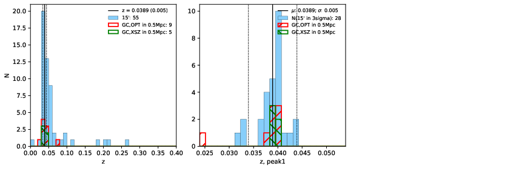 |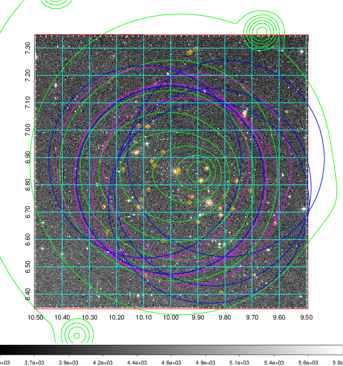  Blue circle for optical clusters;  Magenta circle for XSZ clusters;  all with r=1Mpc;  Only GC with Delta_z<0.01 are shown. | 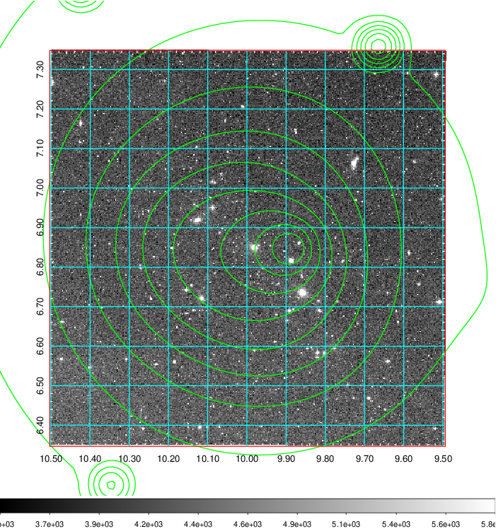 Blue circle for optical clusters;  Magenta circle for XSZ clusters;  all with r=1Mpc;  Only GC with Delta_z<0.01 are shown.  |

|[known Abell/XSZ clusters](../image/28/28_gc.pdf) | [2MASS image](../image/28/28_2mass.pdf)      |[SDSS image](../image/28/28_sdss.pdf)   |
|-------------------|-------------------|-------------------|
|  Magenta, blue and green circles  for optical, X-ray and SZ clusters  respectively, with redshift of clusters  labelled. The radius of circles  are 1Mpc.|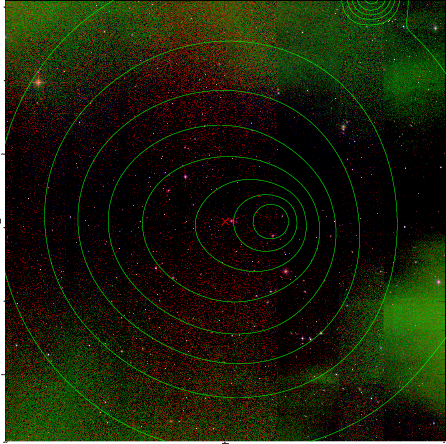  | 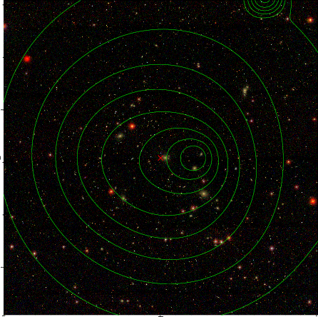  |

