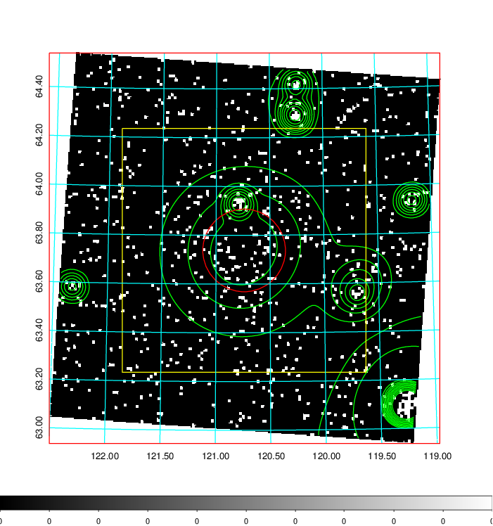
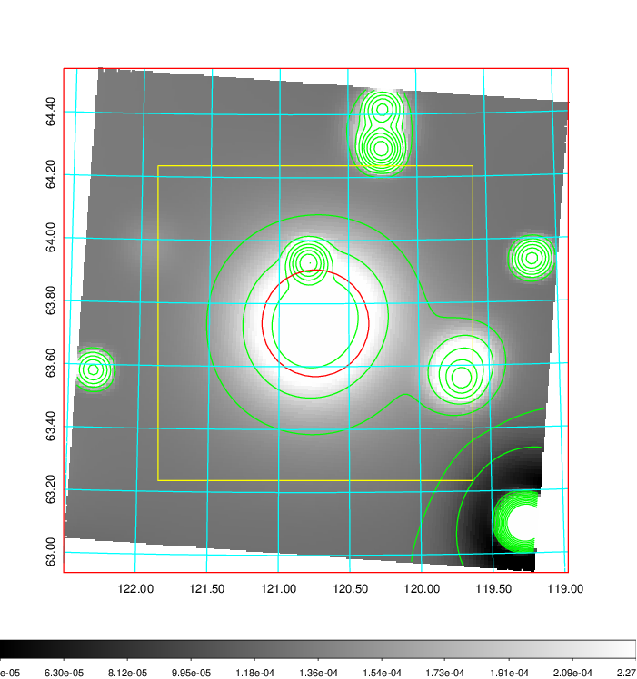
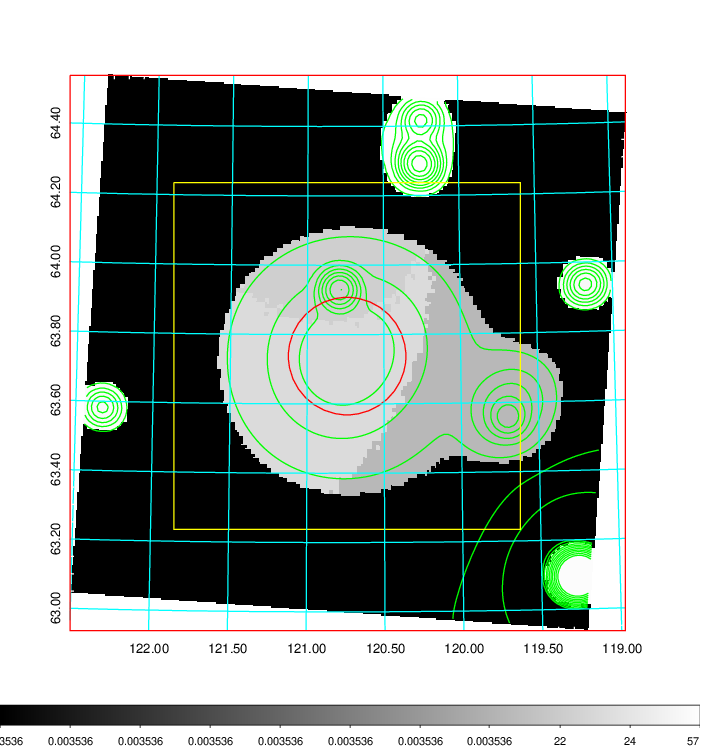
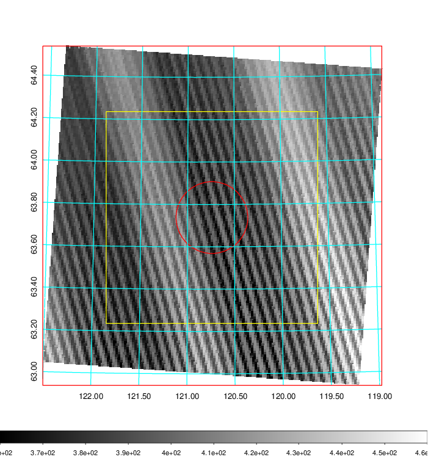
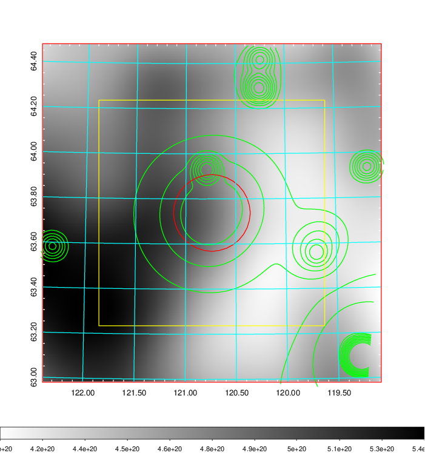
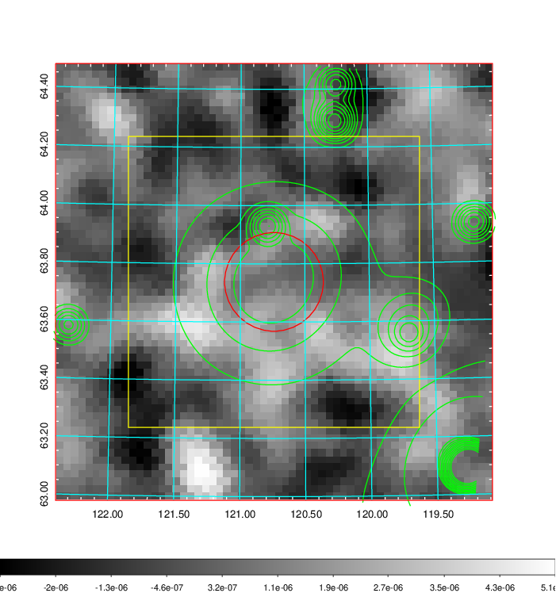
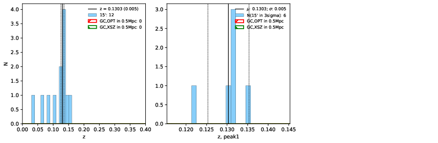
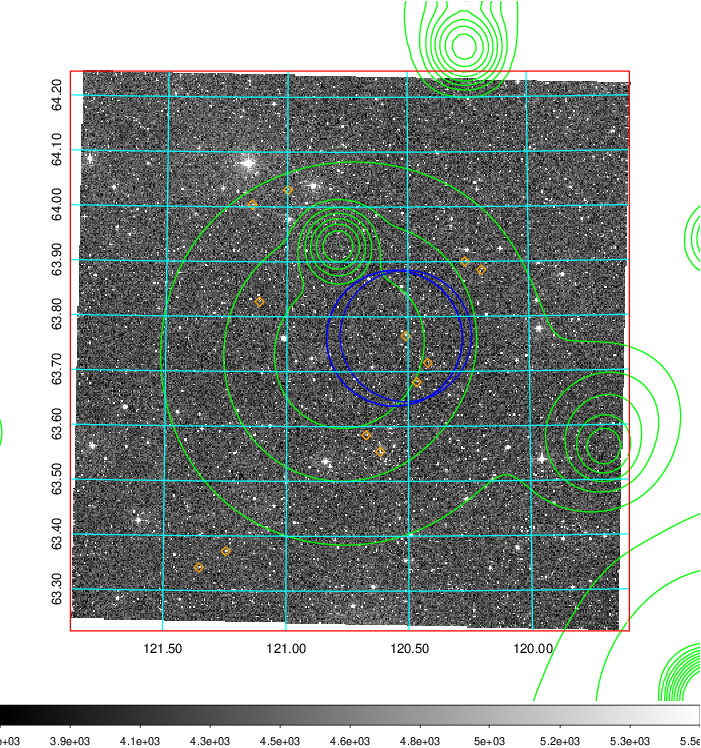
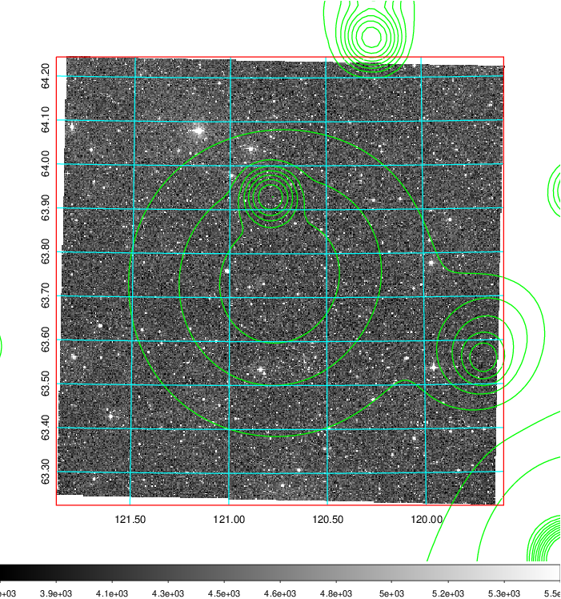
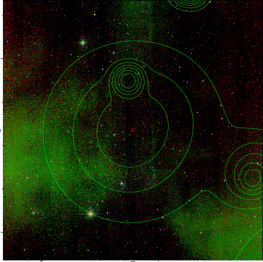

### 281

|Name|RAJ2000[deg]|DEJ2000[deg] |Ext[arcmin]| Ext,ml | z | z_src| C|GC(XSZ,Delta_z<0.01)| GC(OPT,Delta_z<0.01)|GC| R_sig[arcmin] | R500[arcmin] | R500[Mpc]| CRsig[c/s] | CR500[c/s] |L500[1E44 erg/s]|F500[1E-12 erg/s/cm^2]| M500[1E14 Msun]|Tx[keV]|Cnt_sig|Beta|Rc[arcmin]|Comment|Alias|
|---|---|---|---|---|---|------|---|--------|---------|----------|---|---|---|---|---|---|---|---|---|---|---|---|---|---|
|281| 120.740| 63.738| 10.17| 30.34| 0.1303(0.005)| z1,| G| -| -| A, N, W| 19.762| 7.154| 0.997| 0.215(0.054)| 0.195(0.049)| 1.609(0.717)| 3.593(1.602)| 3.19(0.70)| 4.57(0.64)| 93.3| 0.724(-0.125+0.276)| 10.836(-2.144+4.052)| An Abell cluster with z-0.1236 and offset = 0.69 Mpc(5.07 arcmin)| t444|

|[RASS image](../image/281/281_img.pdf)|[filtered image](../image/281/281_fil.pdf)|[Segment image](../image/281/281_seg.pdf)|
|-------------------|--------------------|-------------------|
|   |    |   |

|[Exposure image](../image/281/281_mex.pdf)| [nH image](../image/281/281_nh.pdf)| [Planck image](../image/281/281_p.pdf)|
|-------------------|--------------------|-------------------|
|   |     |  |

|[Redshift Histogram](../image/281/281_zg.pdf) | [DSS image(z1)](../image/281/281_dss_z1.pdf)      |  [DSS image(z2)](../image/281/281_dss_z2.pdf)    |
|-------------------|--------------------|-------------------|
| |  Blue circle for optical clusters;  Magenta circle for XSZ clusters;  all with r=1Mpc;  Only GC with Delta_z<0.01 are shown. |  Blue circle for optical clusters;  Magenta circle for XSZ clusters;  all with r=1Mpc;  Only GC with Delta_z<0.01 are shown.  |

|[known Abell/XSZ clusters](../image/281/281_gc.pdf) | [2MASS image](../image/281/281_2mass.pdf)      |
|-------------------|-------------------|
|  Magenta, blue and green circles  for optical, X-ray and SZ clusters  respectively, with redshift of clusters  labelled. The radius of circles  are 1Mpc.|  |

|[PS1 image](../image/281/281_ps1.pdf)            |
|-------------------|
|   |
