

### 282

|Name|RAJ2000[deg]|DEJ2000[deg] |Ext[arcmin]| Ext,ml | z | z_src| C|GC(XSZ,Delta_z<0.01)| GC(OPT,Delta_z<0.01)|GC| R_sig[arcmin] | R500[arcmin] | R500[Mpc]| CRsig[c/s] | CR500[c/s] |L500[1E44 erg/s]|F500[1E-12 erg/s/cm^2]| M500[1E14 Msun]|Tx[keV]|Cnt_sig|Beta|Rc[arcmin]|Comment|Alias|
|---|---|---|---|---|---|------|---|--------|---------|----------|---|---|---|---|---|---|---|---|---|---|---|---|---|---|
|282| 120.864| 30.594| 14.52| 27.29| 0.1407(0.006)| z2, z_opt| S| -| N, W| F20, N, W| 19.762| 6.618| 0.984| 0.181(0.060)| 0.163(0.054)| 1.630(3.938)| 3.081(7.442)| 3.11(3.68)| 4.50(3.39)| 62.7| 0.507(-0.005+0.017)| 5.850(-0.239+0.370)| -| t526|

|[RASS image](../image/282/282_img.pdf)|[filtered image](../image/282/282_fil.pdf)|[Segment image](../image/282/282_seg.pdf)|
|-------------------|--------------------|-------------------|
| 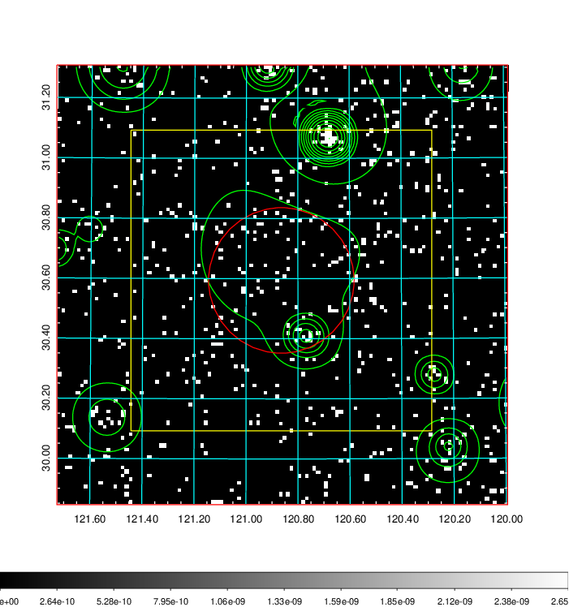  | 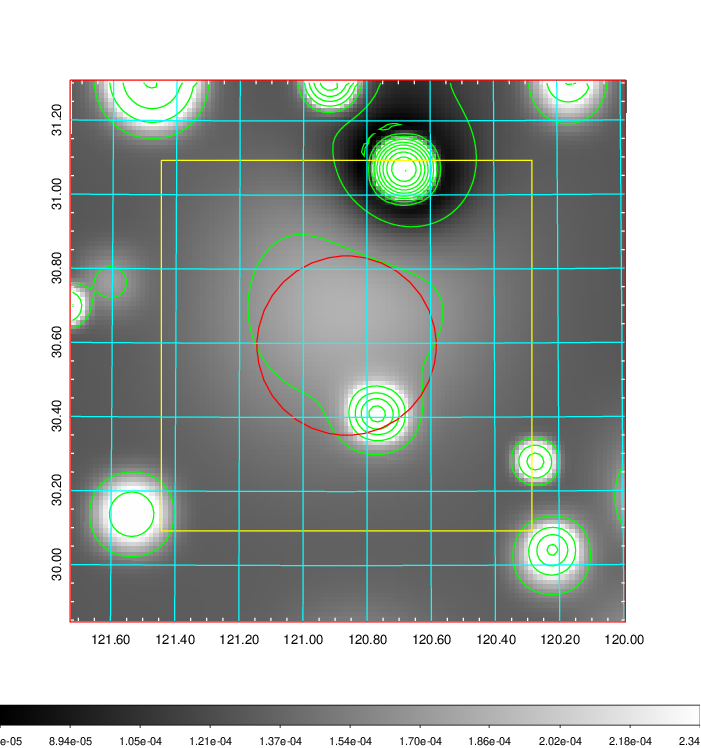   | 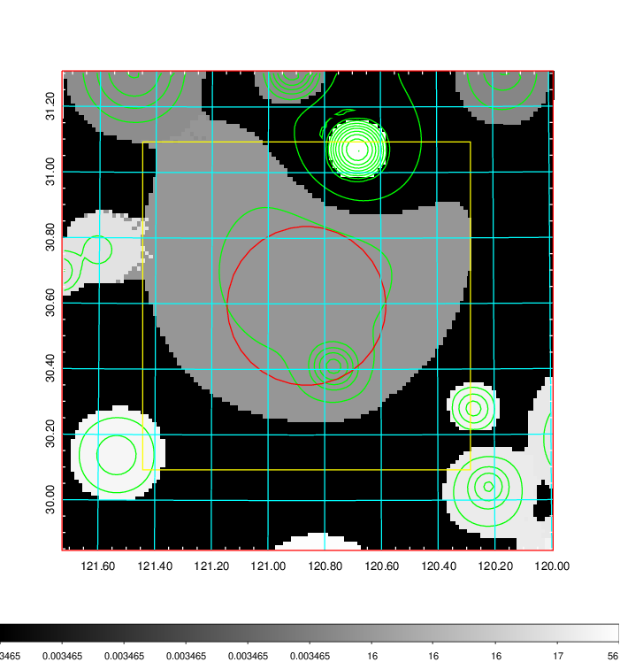  |

|[Exposure image](../image/282/282_mex.pdf)| [nH image](../image/282/282_nh.pdf)| [Planck image](../image/282/282_p.pdf)|
|-------------------|--------------------|-------------------|
|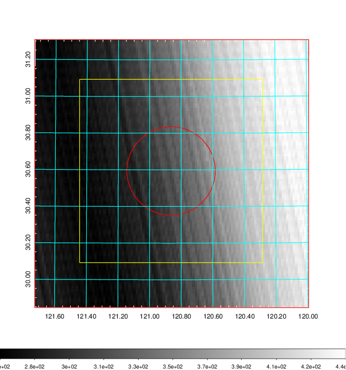   | 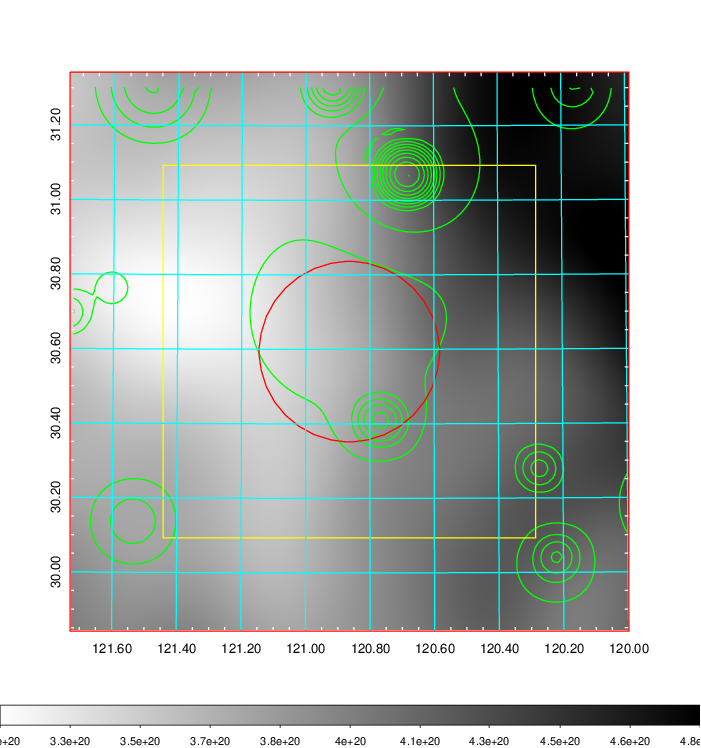    | 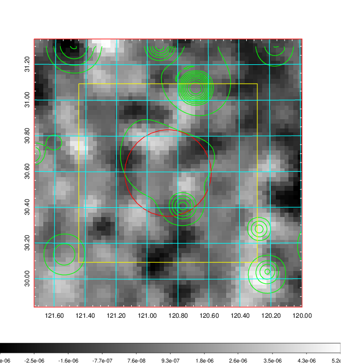 |

|[Redshift Histogram](../image/282/282_zg.pdf) | [DSS image(z1)](../image/282/282_dss_z1.pdf)      |  [DSS image(z2)](../image/282/282_dss_z2.pdf)    |
|-------------------|--------------------|-------------------|
|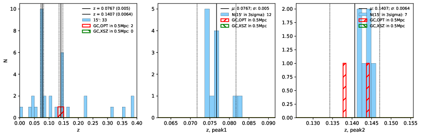 |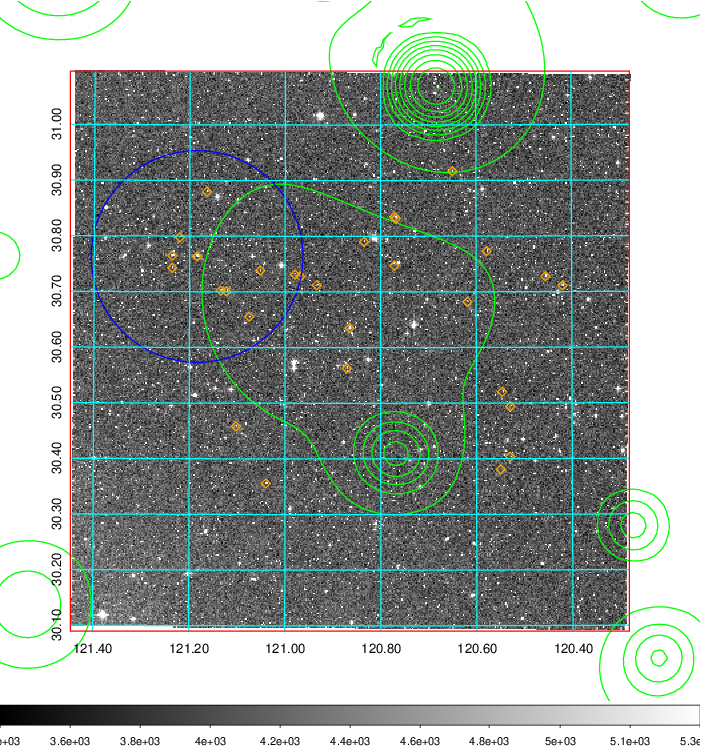  Blue circle for optical clusters;  Magenta circle for XSZ clusters;  all with r=1Mpc;  Only GC with Delta_z<0.01 are shown. | 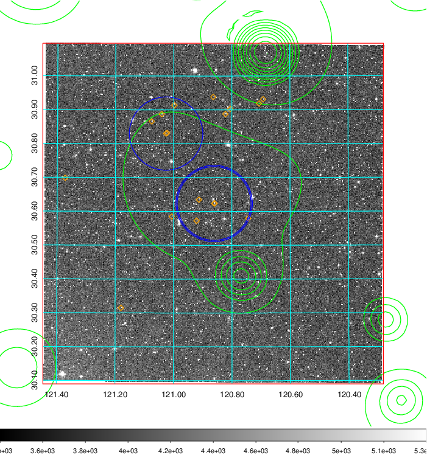 Blue circle for optical clusters;  Magenta circle for XSZ clusters;  all with r=1Mpc;  Only GC with Delta_z<0.01 are shown.  |

|[known Abell/XSZ clusters](../image/282/282_gc.pdf) | [2MASS image](../image/282/282_2mass.pdf)      |[SDSS image](../image/282/282_sdss.pdf)   |
|-------------------|-------------------|-------------------|
|  Magenta, blue and green circles  for optical, X-ray and SZ clusters  respectively, with redshift of clusters  labelled. The radius of circles  are 1Mpc.|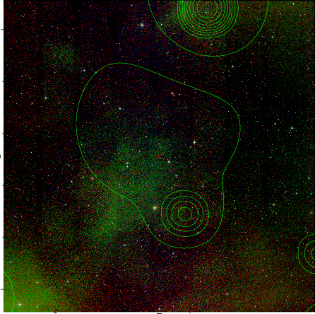  | 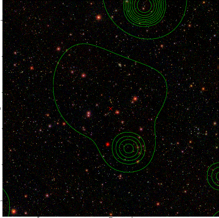  |

