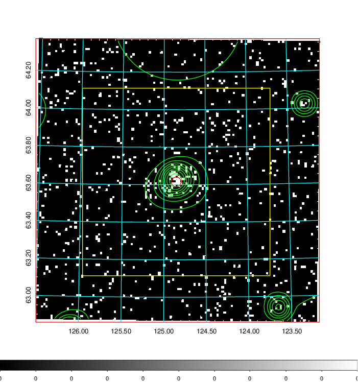
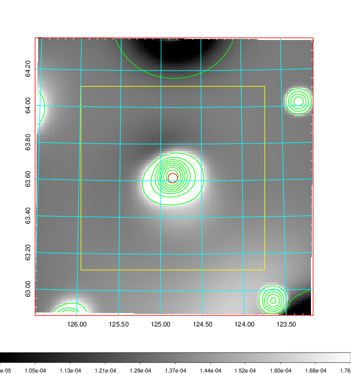
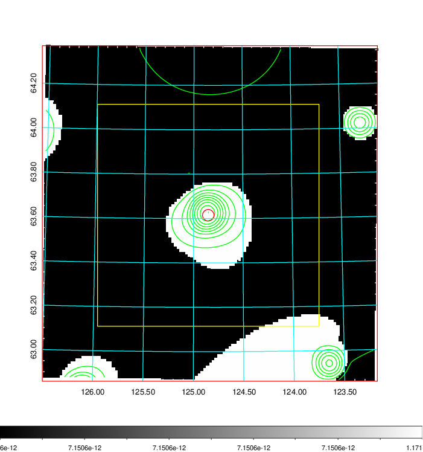
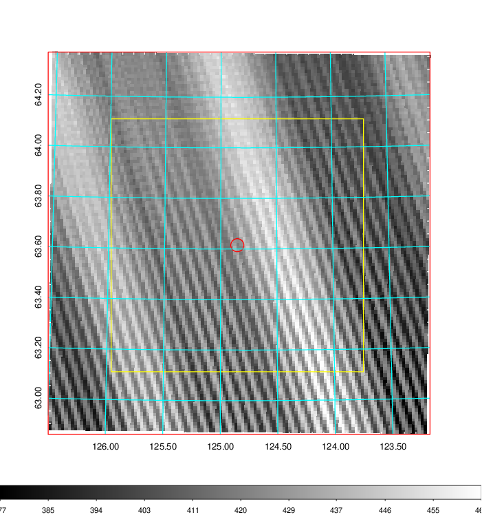
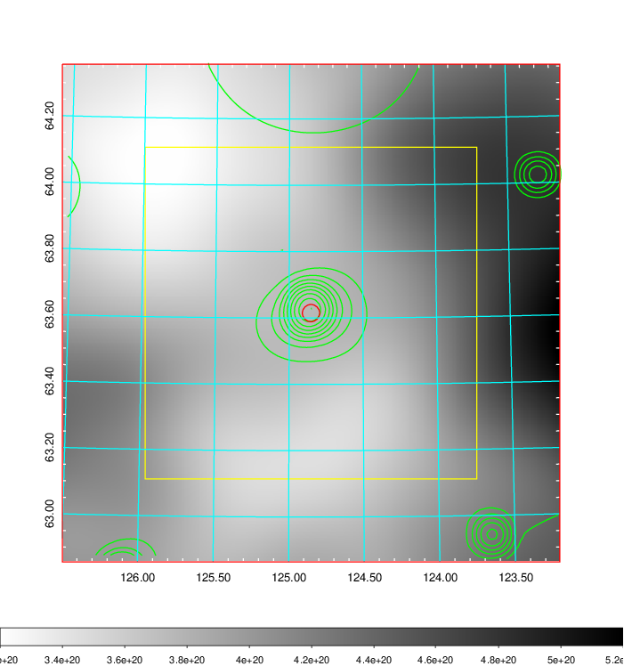
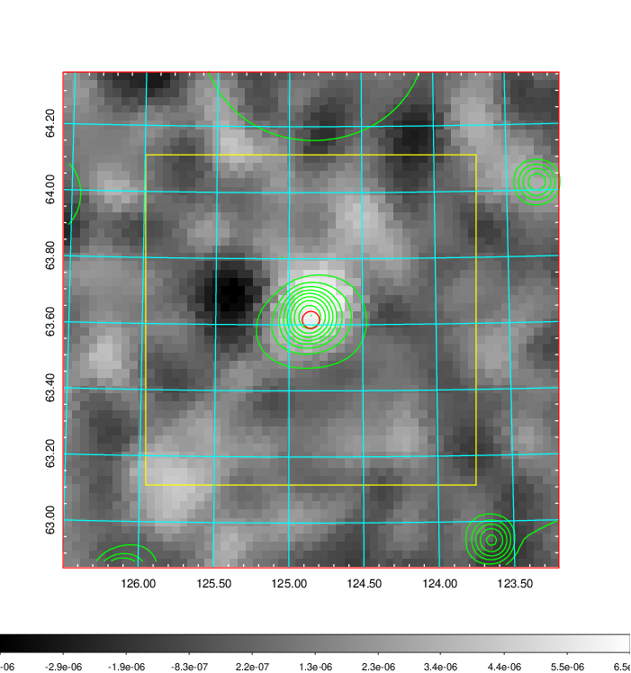
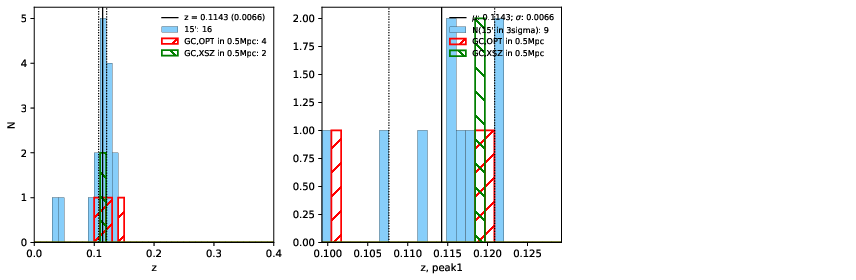
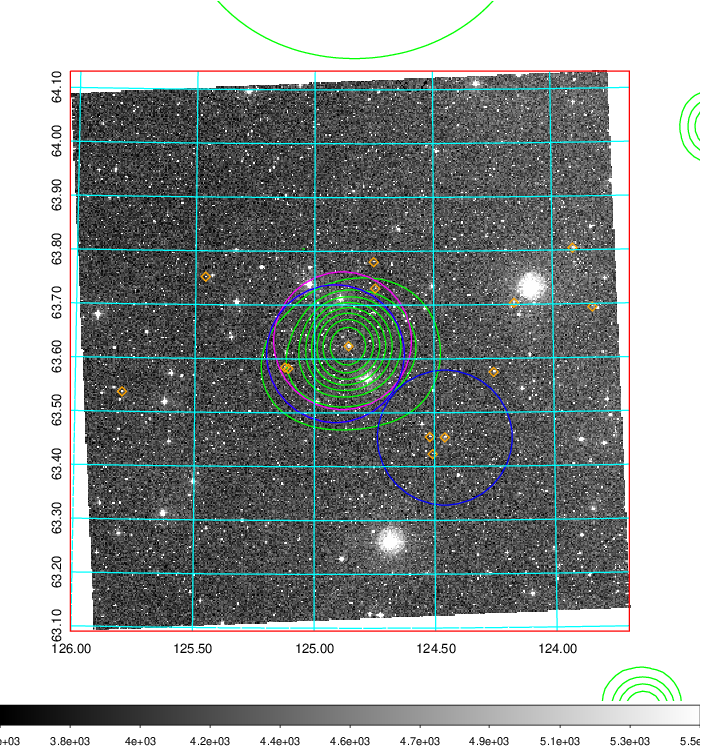
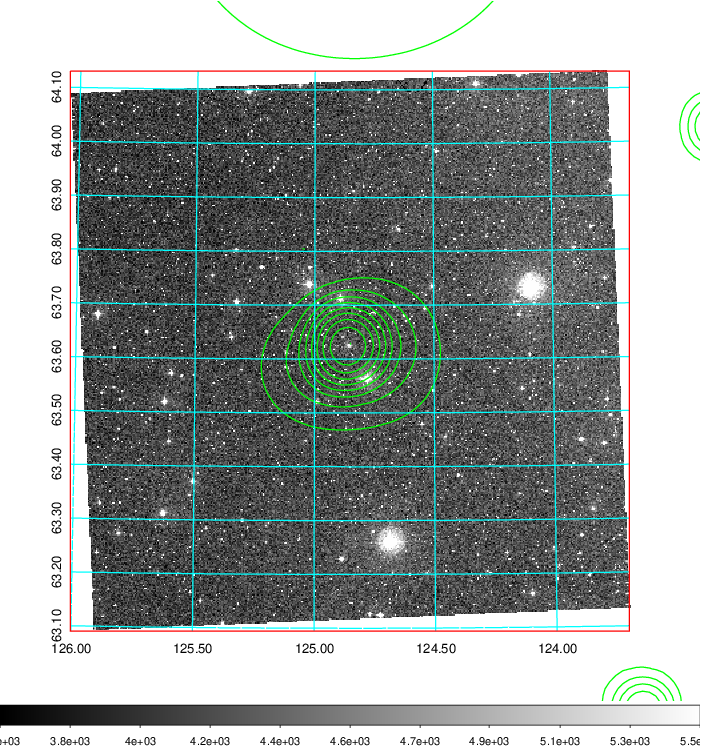
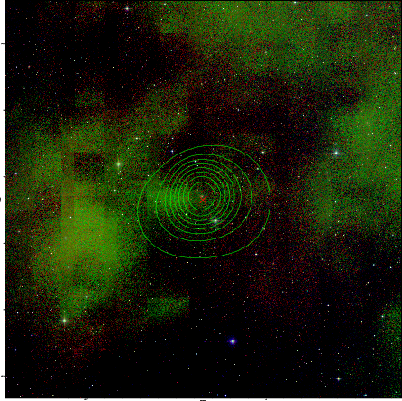

### 284

|Name|RAJ2000[deg]|DEJ2000[deg] |Ext[arcmin]| Ext,ml | z | z_src| C|GC(XSZ,Delta_z<0.01)| GC(OPT,Delta_z<0.01)|GC| R_sig[arcmin] | R500[arcmin] | R500[Mpc]| CRsig[c/s] | CR500[c/s] |L500[1E44 erg/s]|F500[1E-12 erg/s/cm^2]| M500[1E14 Msun]|Tx[keV]|Cnt_sig|Beta|Rc[arcmin]|Comment|Alias|
|---|---|---|---|---|---|------|---|--------|---------|----------|---|---|---|---|---|---|---|---|---|---|---|---|---|---|
|284| 124.852| 63.615| 1.56| 28.62| 0.1143(0.007)| z1, z_xsz| B| MCXC, Tar| N| MCXC, N, Tar, W| 9.775| 7.273| 0.905| 0.167(0.031)| 0.160(0.030)| 1.003(0.101)| 2.972(0.299)| 2.35(0.12)| 3.76(0.12)| 72.1| 0.737(-0.124+0.158)| 2.604(-0.868+0.882)| -| k125|

|[RASS image](../image/284/284_img.pdf)|[filtered image](../image/284/284_fil.pdf)|[Segment image](../image/284/284_seg.pdf)|
|-------------------|--------------------|-------------------|
|   |    |   |

|[Exposure image](../image/284/284_mex.pdf)| [nH image](../image/284/284_nh.pdf)| [Planck image](../image/284/284_p.pdf)|
|-------------------|--------------------|-------------------|
|   |     |  |

|[Redshift Histogram](../image/284/284_zg.pdf) | [DSS image(z1)](../image/284/284_dss_z1.pdf)      |  [DSS image(z2)](../image/284/284_dss_z2.pdf)    |
|-------------------|--------------------|-------------------|
| |  Blue circle for optical clusters;  Magenta circle for XSZ clusters;  all with r=1Mpc;  Only GC with Delta_z<0.01 are shown. |  Blue circle for optical clusters;  Magenta circle for XSZ clusters;  all with r=1Mpc;  Only GC with Delta_z<0.01 are shown.  |

|[known Abell/XSZ clusters](../image/284/284_gc.pdf) | [2MASS image](../image/284/284_2mass.pdf)      |
|-------------------|-------------------|
|  Magenta, blue and green circles  for optical, X-ray and SZ clusters  respectively, with redshift of clusters  labelled. The radius of circles  are 1Mpc.|  |

|[PS1 image](../image/284/284_ps1.pdf)            |
|-------------------|
|   |
