

### 285

|Name|RAJ2000[deg]|DEJ2000[deg] |Ext[arcmin]| Ext,ml | z | z_src| C|GC(XSZ,Delta_z<0.01)| GC(OPT,Delta_z<0.01)|GC| R_sig[arcmin] | R500[arcmin] | R500[Mpc]| CRsig[c/s] | CR500[c/s] |L500[1E44 erg/s]|F500[1E-12 erg/s/cm^2]| M500[1E14 Msun]|Tx[keV]|Cnt_sig|Beta|Rc[arcmin]|Comment|Alias|
|---|---|---|---|---|---|------|---|--------|---------|----------|---|---|---|---|---|---|---|---|---|---|---|---|---|---|
|285| 125.099| 7.619| 10.61| 28.71| 0.2228(0.005)| z2, z_opt| S| -| RM, W| A, C, F20, N, W| 9.775| 4.607| 0.991| 0.086(0.043)| 0.079(0.040)| 2.338(1.042)| 1.597(0.712)| 3.46(0.74)| 4.95(0.68)| 42.4| 0.753(-0.167+0.168)| 5.581(-1.799+1.754)| -| t459|

|[RASS image](../image/285/285_img.pdf)|[filtered image](../image/285/285_fil.pdf)|[Segment image](../image/285/285_seg.pdf)|
|-------------------|--------------------|-------------------|
| 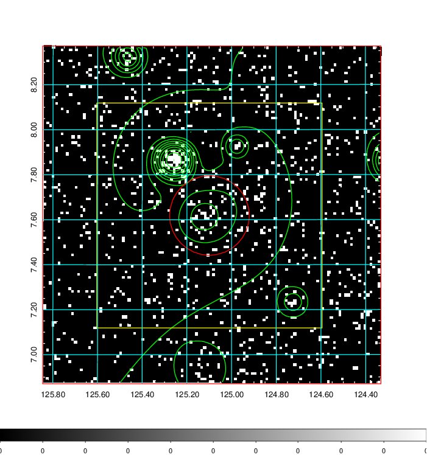  | 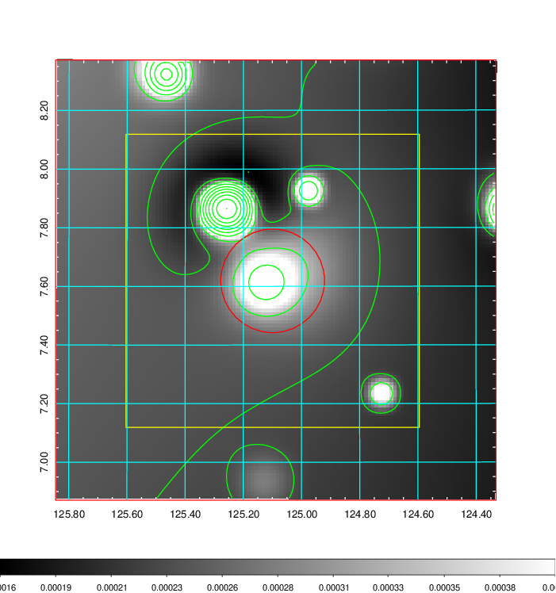   | 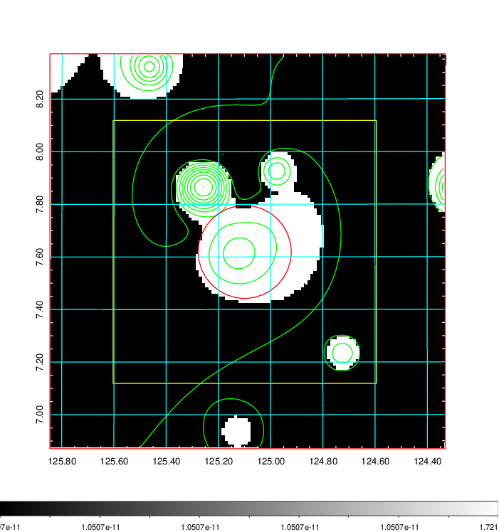  |

|[Exposure image](../image/285/285_mex.pdf)| [nH image](../image/285/285_nh.pdf)| [Planck image](../image/285/285_p.pdf)|
|-------------------|--------------------|-------------------|
|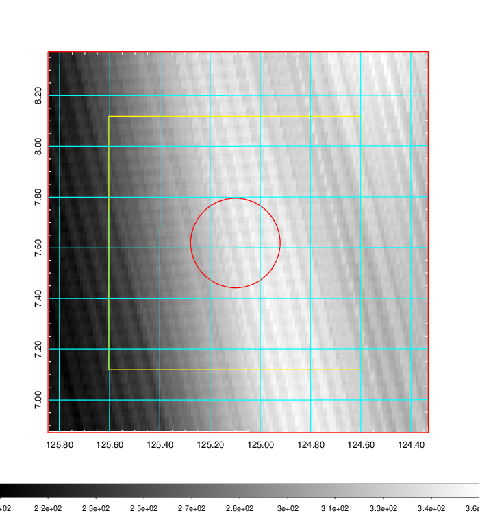   | 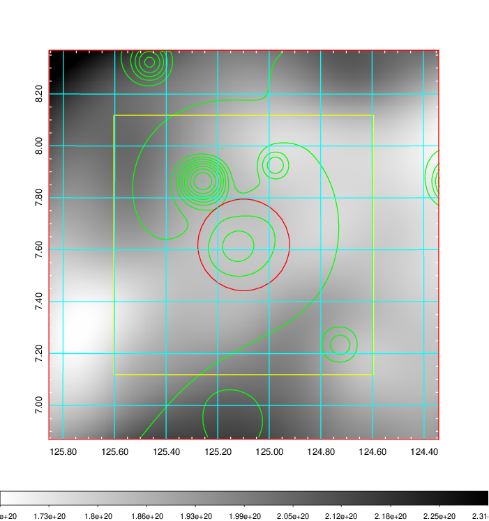    | 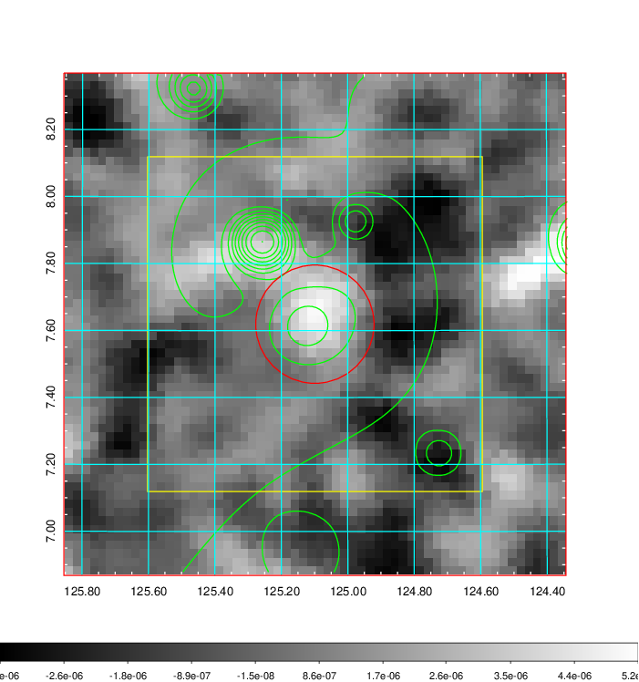 |

|[Redshift Histogram](../image/285/285_zg.pdf) | [DSS image(z1)](../image/285/285_dss_z1.pdf)      |  [DSS image(z2)](../image/285/285_dss_z2.pdf)    |
|-------------------|--------------------|-------------------|
|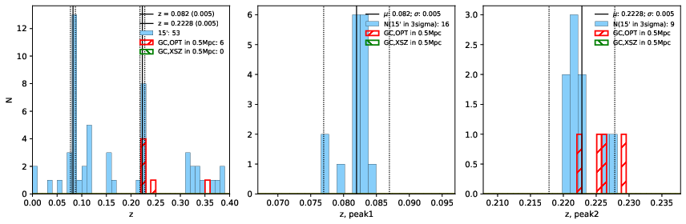 |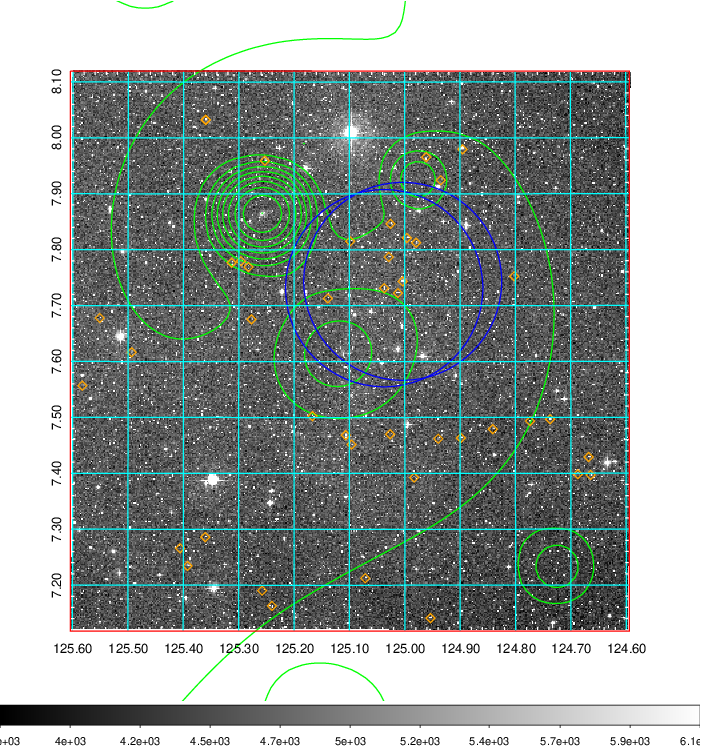  Blue circle for optical clusters;  Magenta circle for XSZ clusters;  all with r=1Mpc;  Only GC with Delta_z<0.01 are shown. | 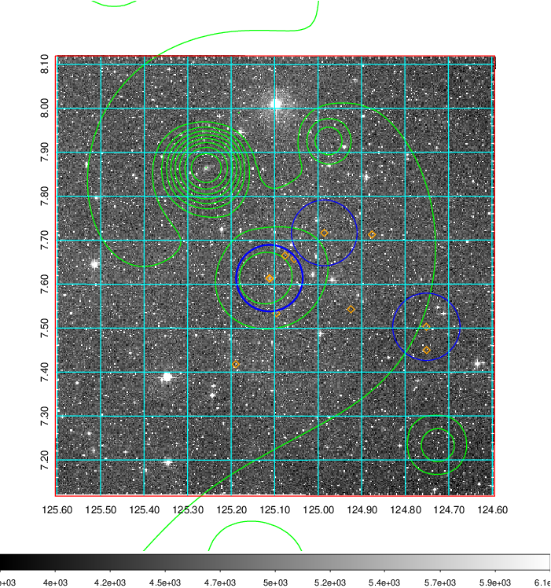 Blue circle for optical clusters;  Magenta circle for XSZ clusters;  all with r=1Mpc;  Only GC with Delta_z<0.01 are shown.  |

|[Previous-identified clusters](../image/285/285_gc.pdf) | [2MASS image](../image/285/285_2mass.pdf)      |[SDSS image](../image/285/285_sdss.pdf)   |
|-------------------|-------------------|-------------------|
|  Green, magenta, and blue circles  for optical, X-ray and SZ clusters  respectively, with redshift of clusters  labelled. The radius of circles  are 1Mpc.|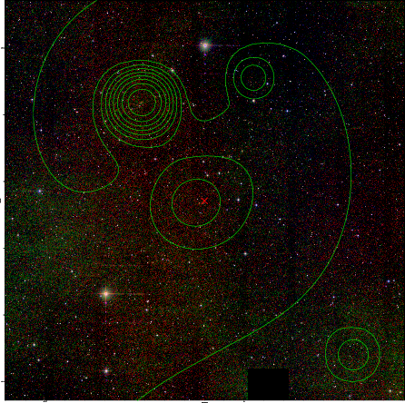  | 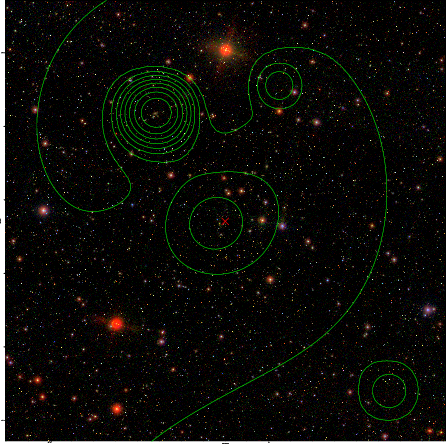  |

