

### 286

|Name|RAJ2000[deg]|DEJ2000[deg] |Ext[arcmin]| Ext,ml | z | z_src| C|GC(XSZ,Delta_z<0.01)| GC(OPT,Delta_z<0.01)|GC| R_sig[arcmin] | R500[arcmin] | R500[Mpc]| CRsig[c/s] | CR500[c/s] |L500[1E44 erg/s]|F500[1E-12 erg/s/cm^2]| M500[1E14 Msun]|Tx[keV]|Cnt_sig|Beta|Rc[arcmin]|Comment|Alias|
|---|---|---|---|---|---|------|---|--------|---------|----------|---|---|---|---|---|---|---|---|---|---|---|---|---|---|
|286| 125.457| 1.207| 4.12| 36.54| 0.0851(0.006)| z1, z_xsz| B| F20, MCXC, PSZ2, Tar| A, N, RM, W| A, C, F20, MCXC, N, PSZ2, SPI, Tak, Tar, W, XCS| 46.540| 9.811| 0.940| 0.375(0.122)| 0.408(0.108)| 1.286(0.487)| 7.148(2.705)| 2.56(0.48)| 3.93(0.47)| 193.2| 0.523(-0.017+0.030)| 3.272(-0.449+0.631)| -| k486|

|[RASS image](../image/286/286_img.pdf)|[filtered image](../image/286/286_fil.pdf)|[Segment image](../image/286/286_seg.pdf)|
|-------------------|--------------------|-------------------|
| 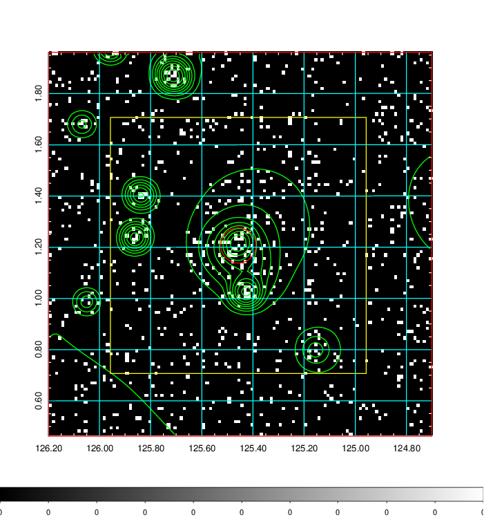  | 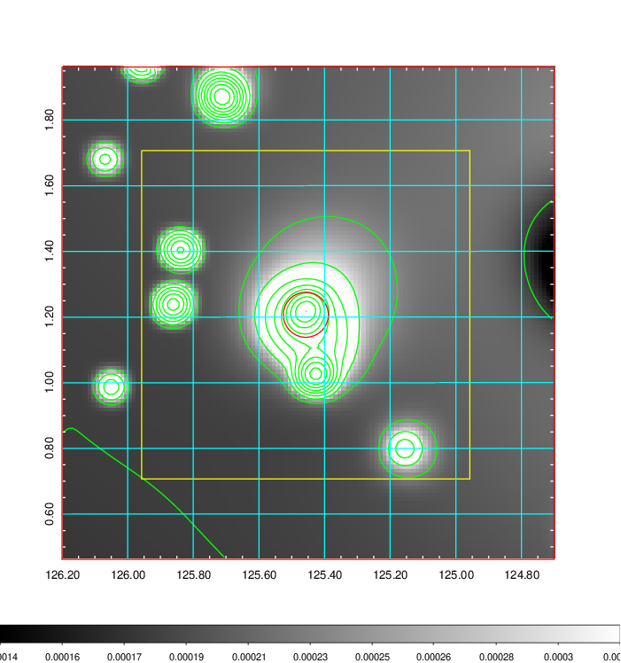   | 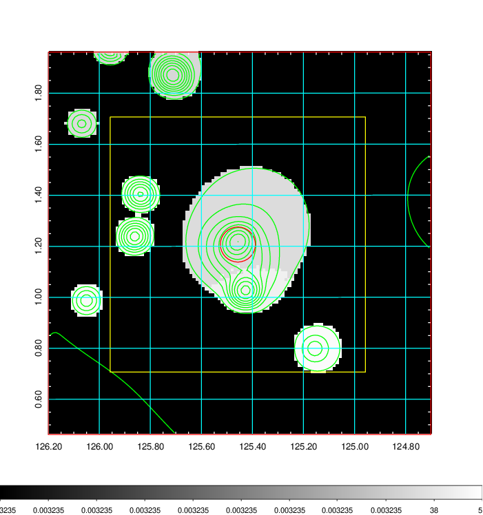  |

|[Exposure image](../image/286/286_mex.pdf)| [nH image](../image/286/286_nh.pdf)| [Planck image](../image/286/286_p.pdf)|
|-------------------|--------------------|-------------------|
|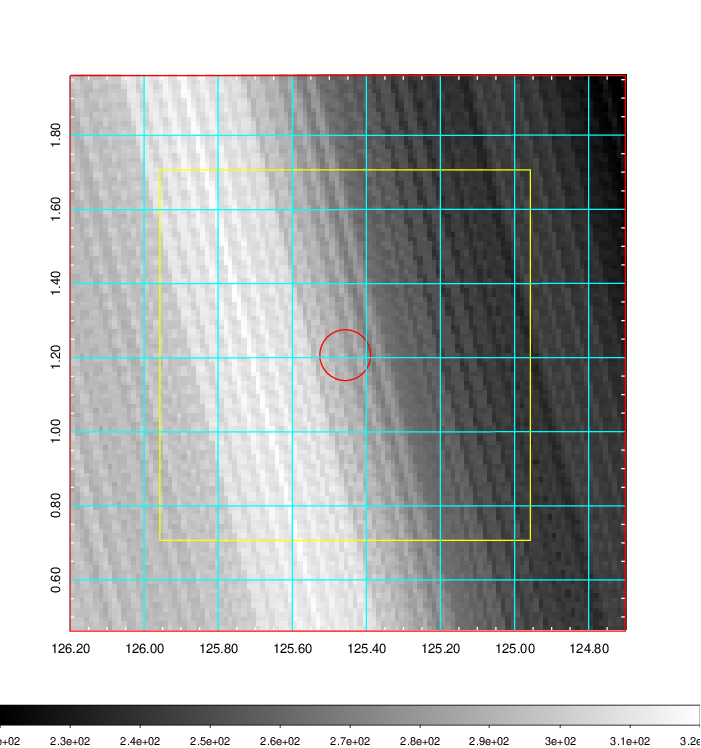   | 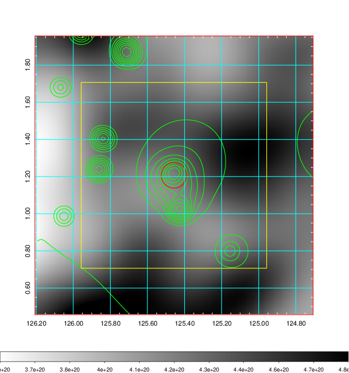    | 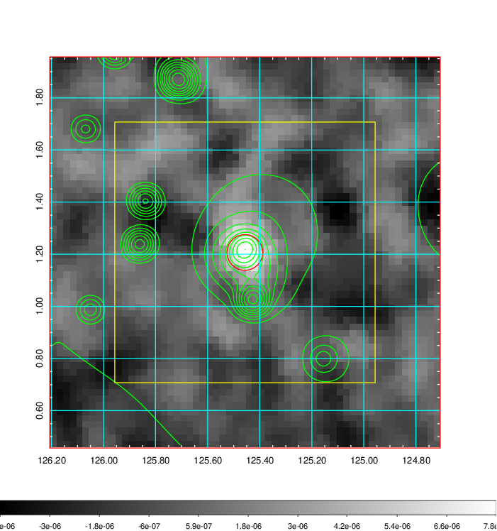 |

|[Redshift Histogram](../image/286/286_zg.pdf) | [DSS image(z1)](../image/286/286_dss_z1.pdf)      |  [DSS image(z2)](../image/286/286_dss_z2.pdf)    |
|-------------------|--------------------|-------------------|
|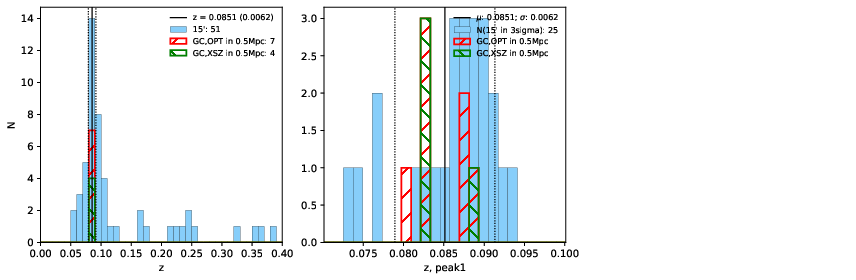 |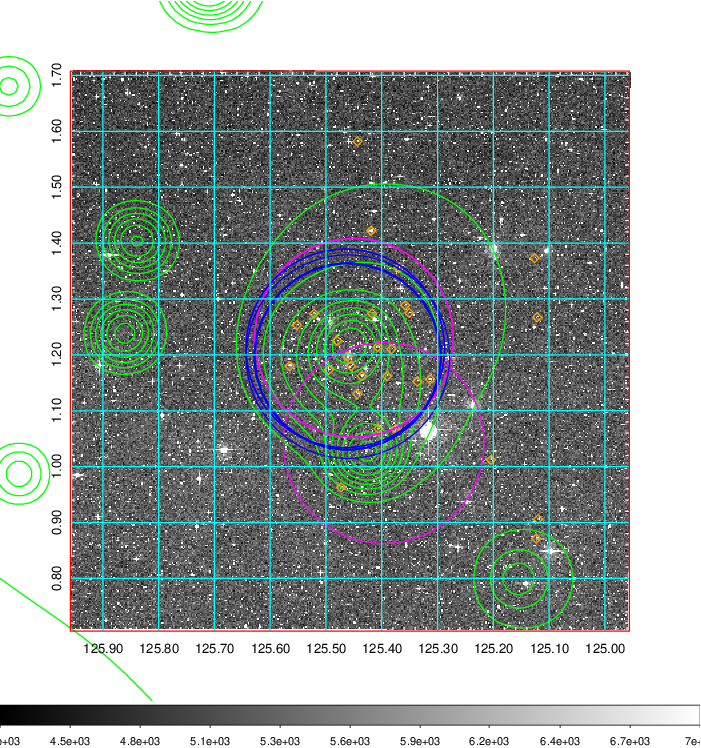  Blue circle for optical clusters;  Magenta circle for XSZ clusters;  all with r=1Mpc;  Only GC with Delta_z<0.01 are shown. | 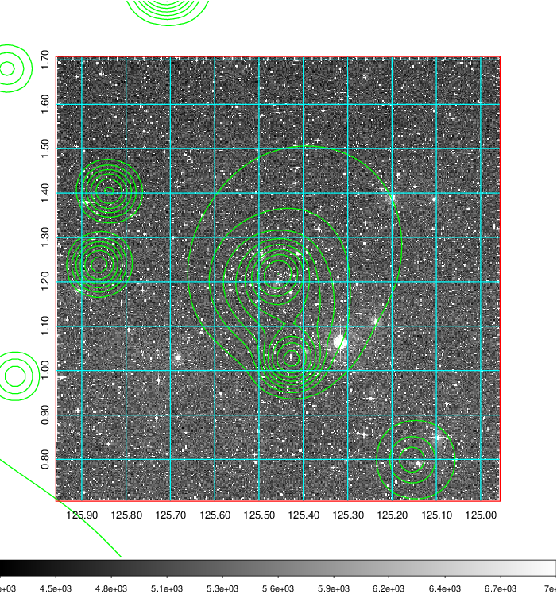 Blue circle for optical clusters;  Magenta circle for XSZ clusters;  all with r=1Mpc;  Only GC with Delta_z<0.01 are shown.  |

|[known Abell/XSZ clusters](../image/286/286_gc.pdf) | [2MASS image](../image/286/286_2mass.pdf)      |[SDSS image](../image/286/286_sdss.pdf)   |
|-------------------|-------------------|-------------------|
|  Magenta, blue and green circles  for optical, X-ray and SZ clusters  respectively, with redshift of clusters  labelled. The radius of circles  are 1Mpc.|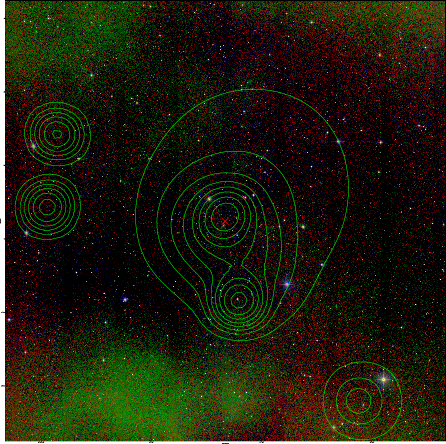  | 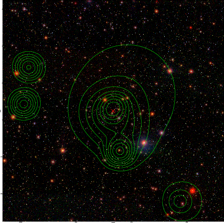  |

