

### 287

|Name|RAJ2000[deg]|DEJ2000[deg] |Ext[arcmin]| Ext,ml | z | z_src| C|GC(XSZ,Delta_z<0.01)| GC(OPT,Delta_z<0.01)|GC| R_sig[arcmin] | R500[arcmin] | R500[Mpc]| CRsig[c/s] | CR500[c/s] |L500[1E44 erg/s]|F500[1E-12 erg/s/cm^2]| M500[1E14 Msun]|Tx[keV]|Cnt_sig|Beta|Rc[arcmin]|Comment|Alias|
|---|---|---|---|---|---|------|---|--------|---------|----------|---|---|---|---|---|---|---|---|---|---|---|---|---|---|
|287| 125.542| 47.098| 0.71| 25.68| 0.1266(0.005)| z1, z_xsz| B| F20, MCXC, SPI, XB| A, N, RM, W| A, C, F20, MCXC, N, SPI, W, XB| 39.610| 8.433| 1.146| 0.458(0.083)| 0.405(0.073)| 3.198(0.261)| 7.601(0.620)| 4.84(0.19)| 5.90(0.15)| 309.8| 0.546(-0.009+0.009)| 0.159(-0.035+0.087)| -| k003|

|[RASS image](../image/287/287_img.pdf)|[filtered image](../image/287/287_fil.pdf)|[Segment image](../image/287/287_seg.pdf)|
|-------------------|--------------------|-------------------|
| 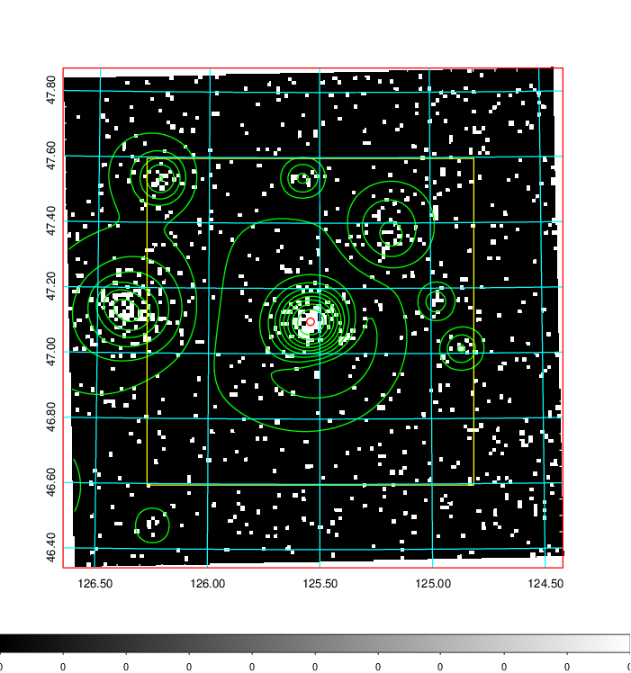  | 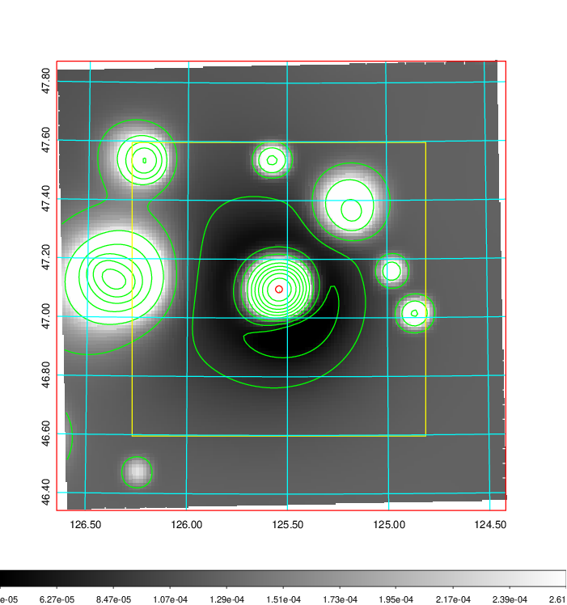   | 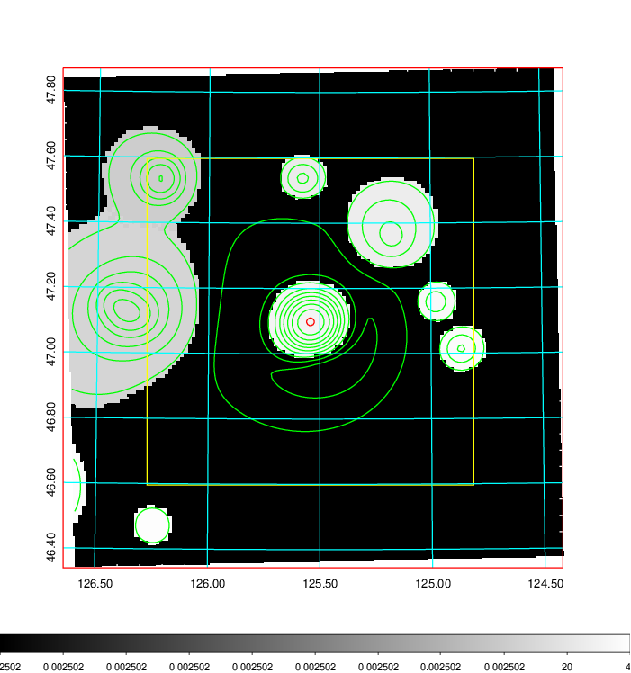  |

|[Exposure image](../image/287/287_mex.pdf)| [nH image](../image/287/287_nh.pdf)| [Planck image](../image/287/287_p.pdf)|
|-------------------|--------------------|-------------------|
|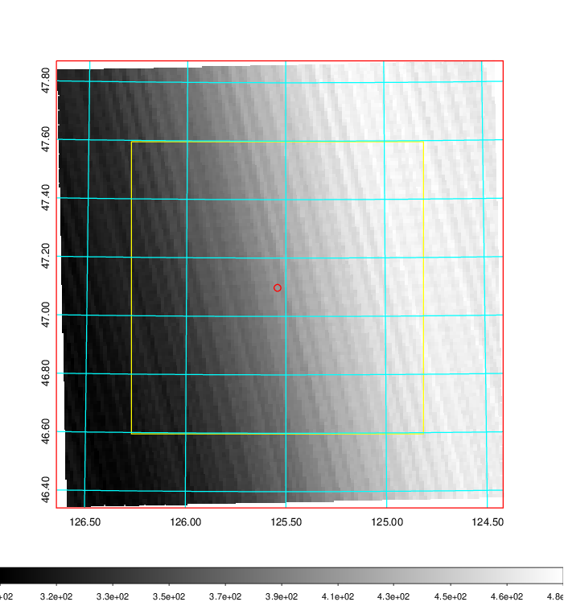   | 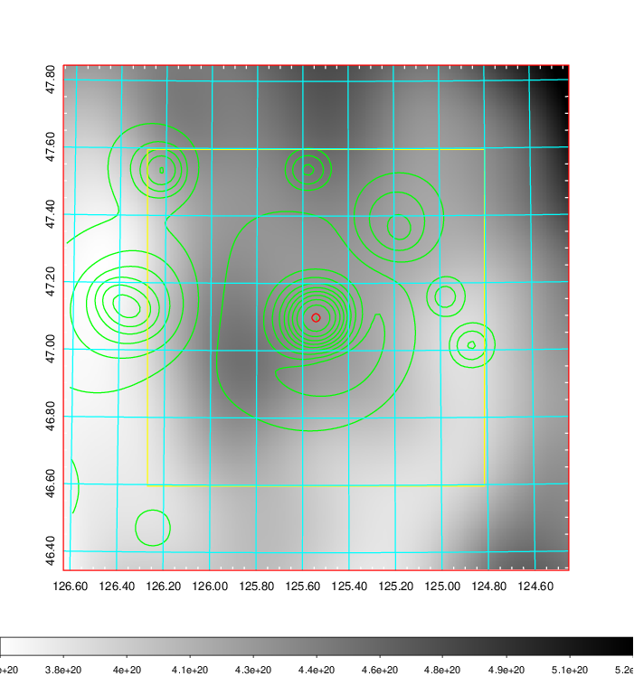    | 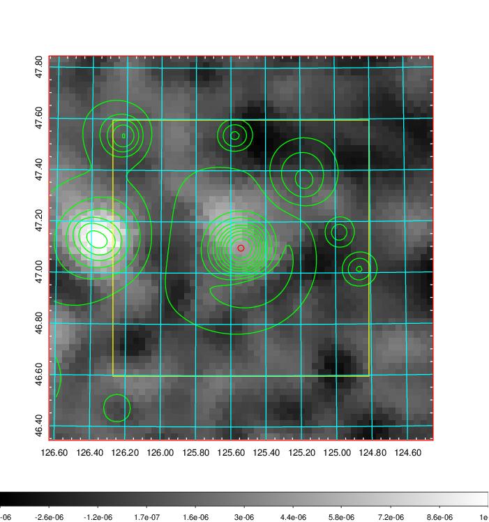 |

|[Redshift Histogram](../image/287/287_zg.pdf) | [DSS image(z1)](../image/287/287_dss_z1.pdf)      |  [DSS image(z2)](../image/287/287_dss_z2.pdf)    |
|-------------------|--------------------|-------------------|
|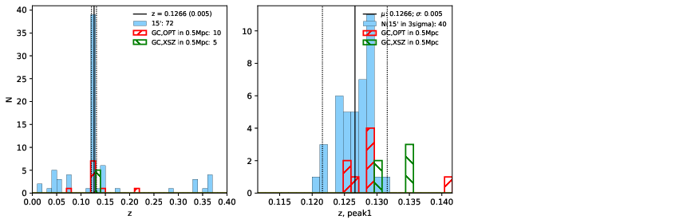 |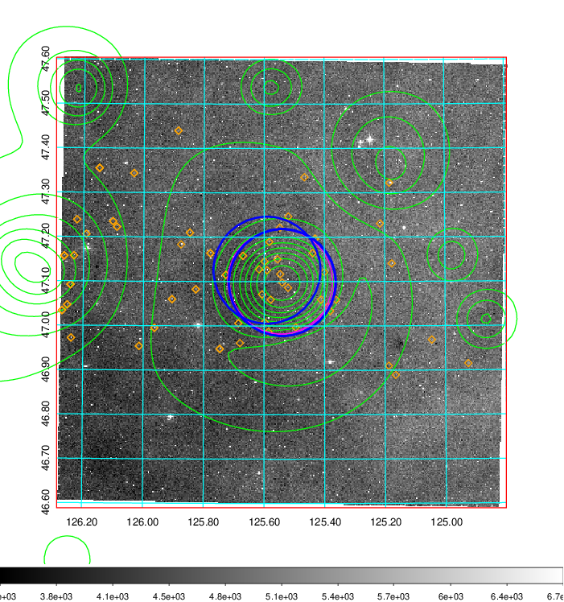  Blue circle for optical clusters;  Magenta circle for XSZ clusters;  all with r=1Mpc;  Only GC with Delta_z<0.01 are shown. | 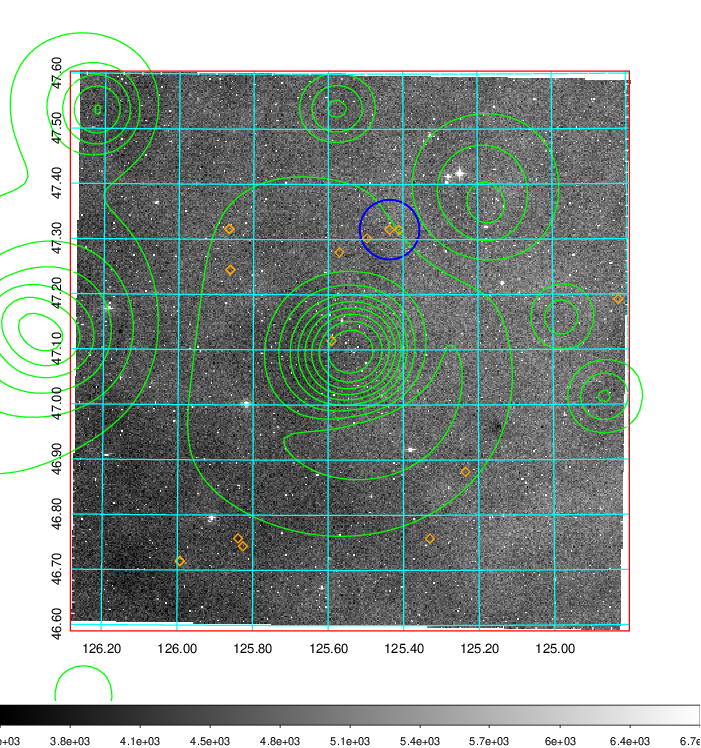 Blue circle for optical clusters;  Magenta circle for XSZ clusters;  all with r=1Mpc;  Only GC with Delta_z<0.01 are shown.  |

|[known Abell/XSZ clusters](../image/287/287_gc.pdf) | [2MASS image](../image/287/287_2mass.pdf)      |[SDSS image](../image/287/287_sdss.pdf)   |
|-------------------|-------------------|-------------------|
|  Magenta, blue and green circles  for optical, X-ray and SZ clusters  respectively, with redshift of clusters  labelled. The radius of circles  are 1Mpc.|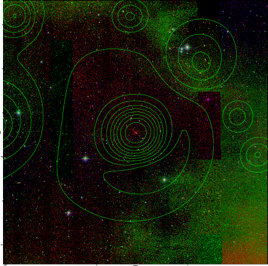  | 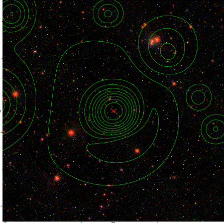  |

