

### 288

|Name|RAJ2000[deg]|DEJ2000[deg] |Ext[arcmin]| Ext,ml | z | z_src| C|GC(XSZ,Delta_z<0.01)| GC(OPT,Delta_z<0.01)|GC| R_sig[arcmin] | R500[arcmin] | R500[Mpc]| CRsig[c/s] | CR500[c/s] |L500[1E44 erg/s]|F500[1E-12 erg/s/cm^2]| M500[1E14 Msun]|Tx[keV]|Cnt_sig|Beta|Rc[arcmin]|Comment|Alias|
|---|---|---|---|---|---|------|---|--------|---------|----------|---|---|---|---|---|---|---|---|---|---|---|---|---|---|
|288| 125.773| 4.354| 6.31| 83.92| 0.0298(0.005)| z2, z_xsz| B| MCXC, Tar| N, Zw| C, F20, MCXC, N, Tar, W| 12.700| 16.094| 0.576| 0.250(0.056)| 0.261(0.059)| 0.086(0.012)| 4.238(0.564)| 0.56(0.04)| 1.51(0.07)| 81.7| 0.865(-0.150+0.097)| 10.286(-1.850+1.426)| -| k547|

|[RASS image](../image/288/288_img.pdf)|[filtered image](../image/288/288_fil.pdf)|[Segment image](../image/288/288_seg.pdf)|
|-------------------|--------------------|-------------------|
| 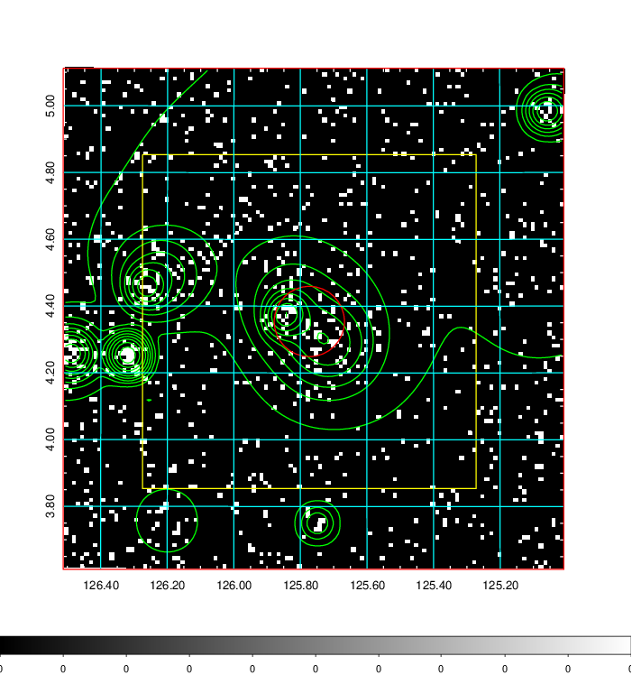  | 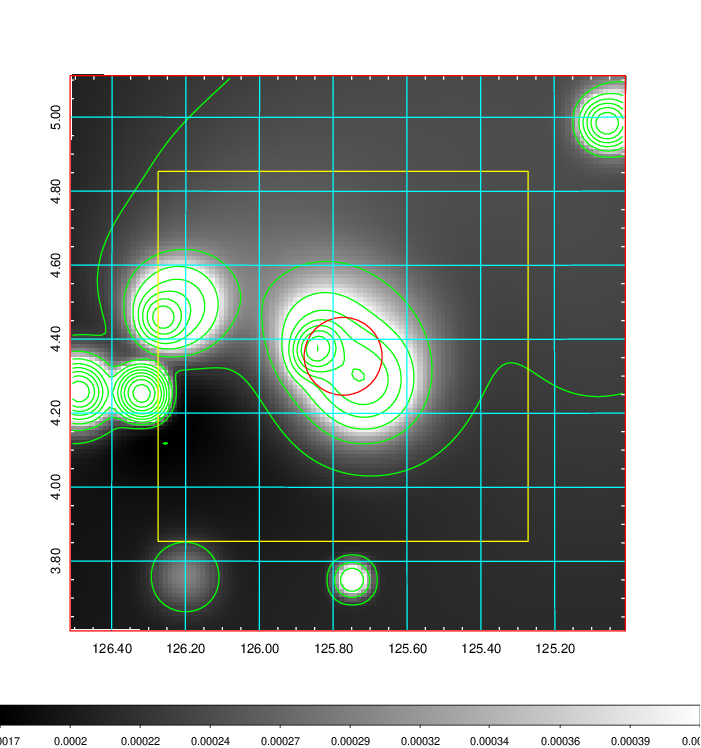   | 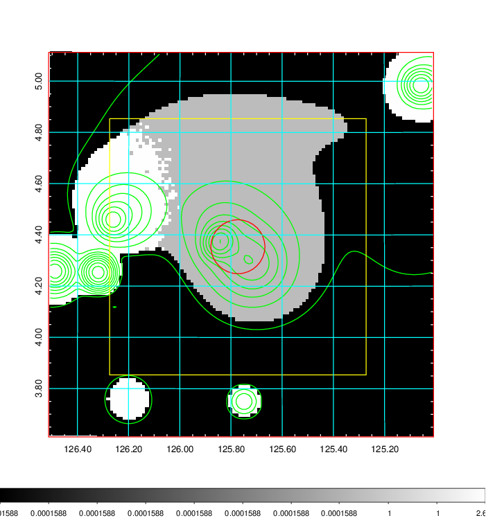  |

|[Exposure image](../image/288/288_mex.pdf)| [nH image](../image/288/288_nh.pdf)| [Planck image](../image/288/288_p.pdf)|
|-------------------|--------------------|-------------------|
|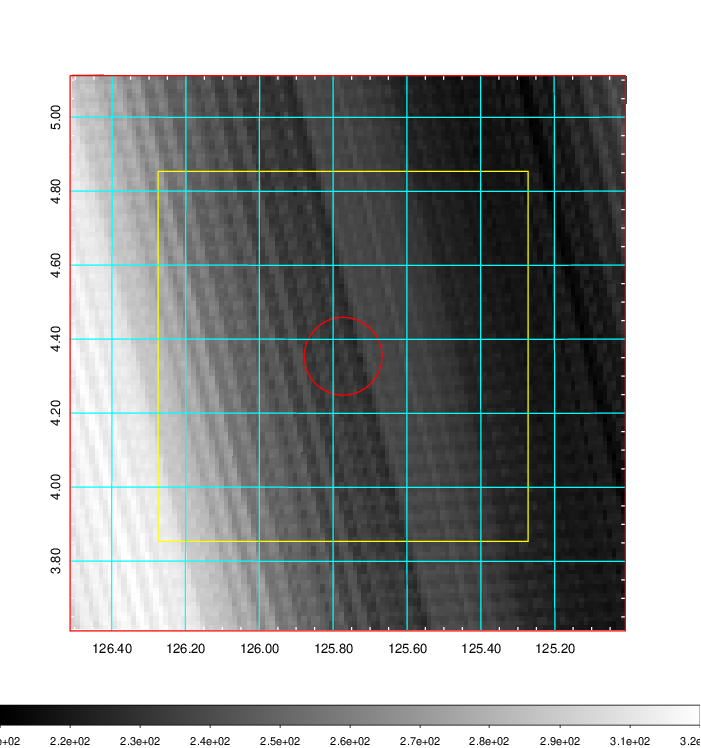   | 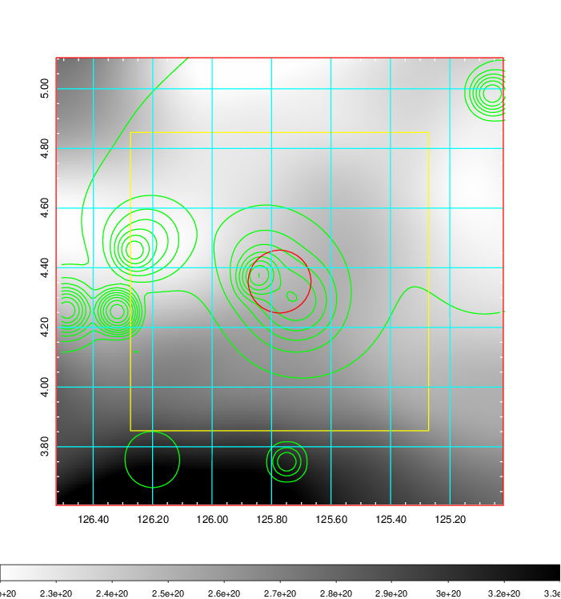    | 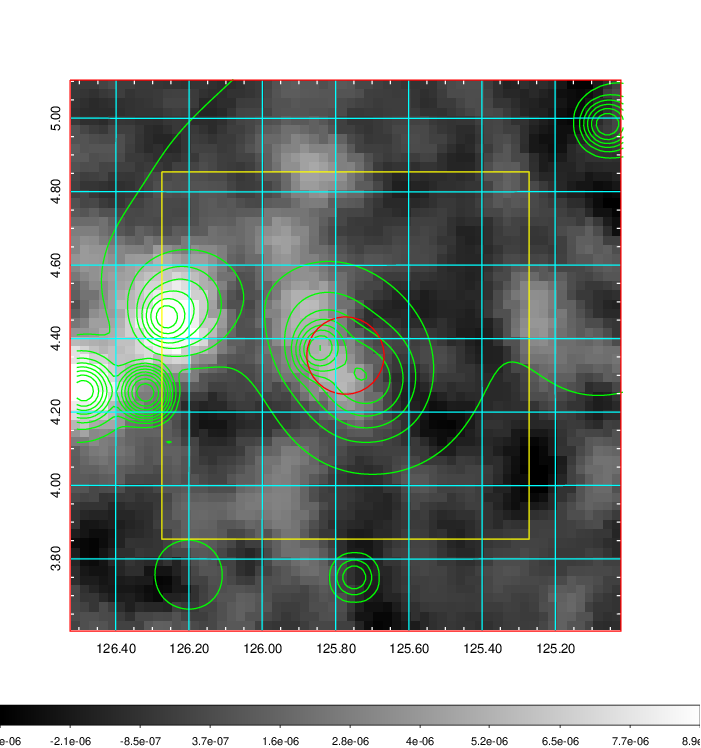 |

|[Redshift Histogram](../image/288/288_zg.pdf) | [DSS image(z1)](../image/288/288_dss_z1.pdf)      |  [DSS image(z2)](../image/288/288_dss_z2.pdf)    |
|-------------------|--------------------|-------------------|
|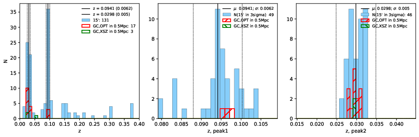 |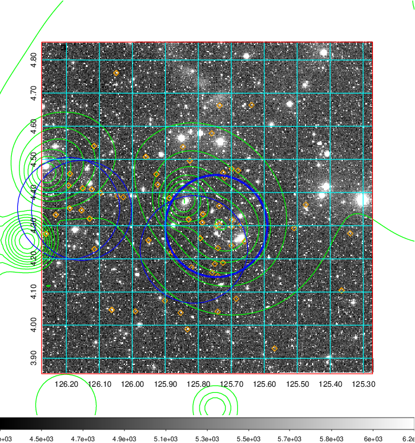  Blue circle for optical clusters;  Magenta circle for XSZ clusters;  all with r=1Mpc;  Only GC with Delta_z<0.01 are shown. | 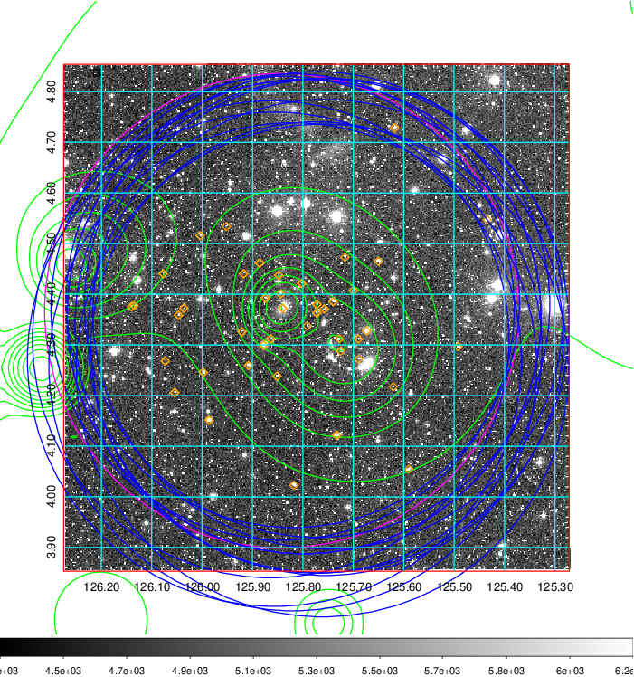 Blue circle for optical clusters;  Magenta circle for XSZ clusters;  all with r=1Mpc;  Only GC with Delta_z<0.01 are shown.  |

|[known Abell/XSZ clusters](../image/288/288_gc.pdf) | [2MASS image](../image/288/288_2mass.pdf)      |[SDSS image](../image/288/288_sdss.pdf)   |
|-------------------|-------------------|-------------------|
|  Magenta, blue and green circles  for optical, X-ray and SZ clusters  respectively, with redshift of clusters  labelled. The radius of circles  are 1Mpc.|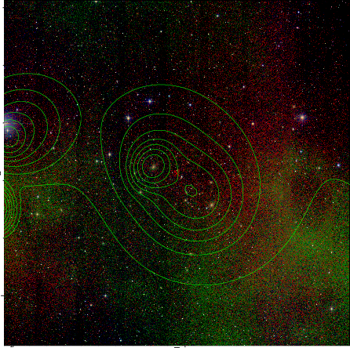  | 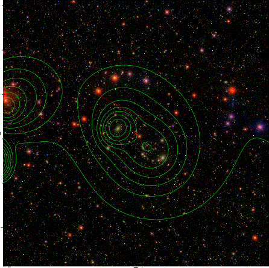  |

