

### 289

|Name|RAJ2000[deg]|DEJ2000[deg] |Ext[arcmin]| Ext,ml | z | z_src| C|GC(XSZ,Delta_z<0.01)| GC(OPT,Delta_z<0.01)|GC| R_sig[arcmin] | R500[arcmin] | R500[Mpc]| CRsig[c/s] | CR500[c/s] |L500[1E44 erg/s]|F500[1E-12 erg/s/cm^2]| M500[1E14 Msun]|Tx[keV]|Cnt_sig|Beta|Rc[arcmin]|Comment|Alias|
|---|---|---|---|---|---|------|---|--------|---------|----------|---|---|---|---|---|---|---|---|---|---|---|---|---|---|
|289| 126.179| 8.592| 15.47| 34.40| 0.0825(0.005)| z1,| G| -| -| A, C, N, W| 33.670| 9.524| 0.887| 0.308(0.121)| 0.275(0.109)| 0.863(0.533)| 5.120(3.163)| 2.15(0.66)| 3.52(0.69)| 153.8| 0.567(-0.050+0.121)| 10.825(-2.268+4.346)| An Abell cluster with no $z$ and offset = 0.60 Mpc(6.42 arcmin)| t542|

|[RASS image](../image/289/289_img.pdf)|[filtered image](../image/289/289_fil.pdf)|[Segment image](../image/289/289_seg.pdf)|
|-------------------|--------------------|-------------------|
| 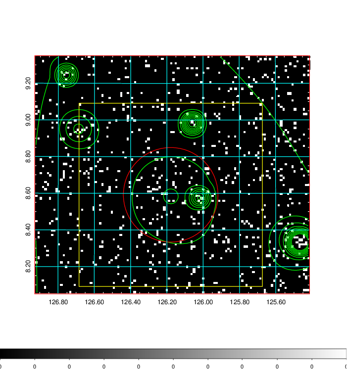  | 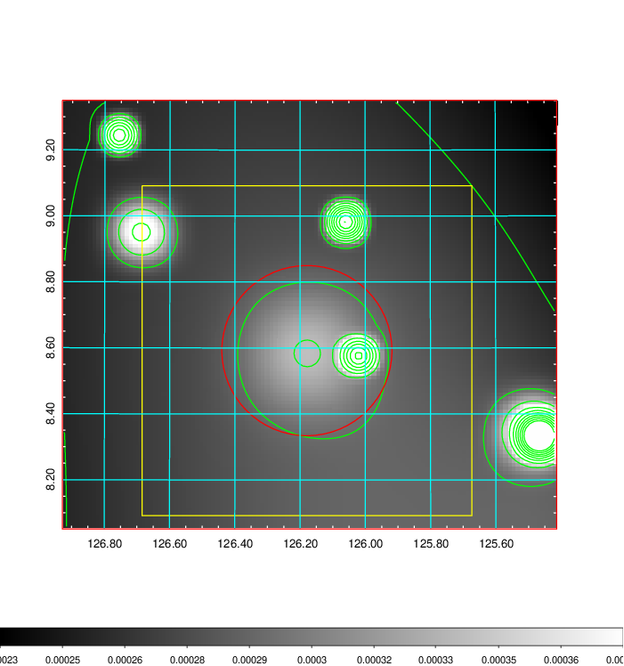   | 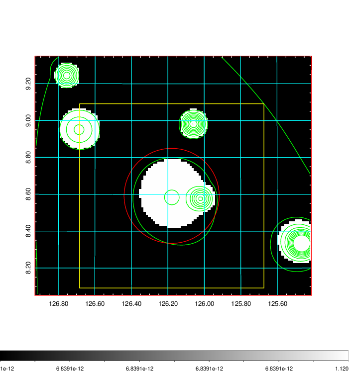  |

|[Exposure image](../image/289/289_mex.pdf)| [nH image](../image/289/289_nh.pdf)| [Planck image](../image/289/289_p.pdf)|
|-------------------|--------------------|-------------------|
|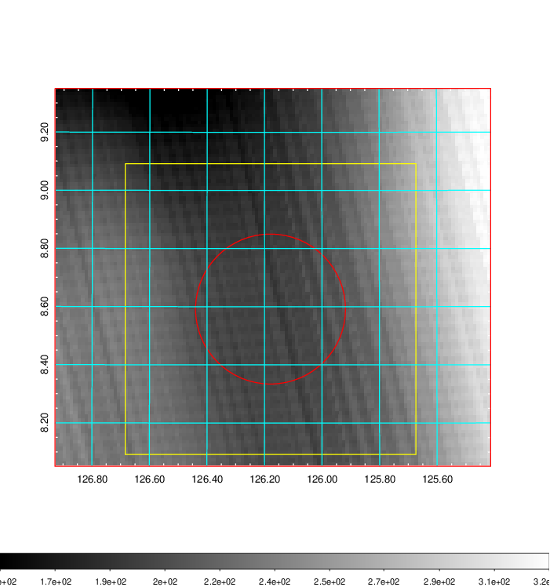   | 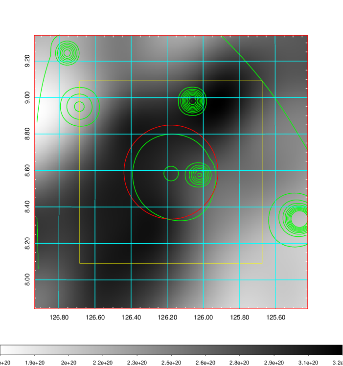    | 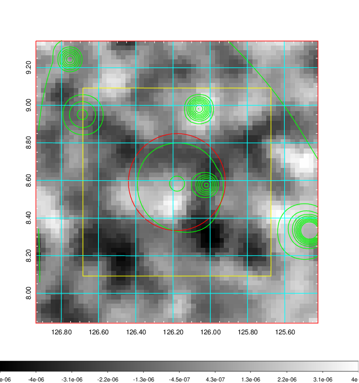 |

|[Redshift Histogram](../image/289/289_zg.pdf) | [DSS image(z1)](../image/289/289_dss_z1.pdf)      |  [DSS image(z2)](../image/289/289_dss_z2.pdf)    |
|-------------------|--------------------|-------------------|
|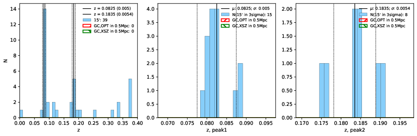 |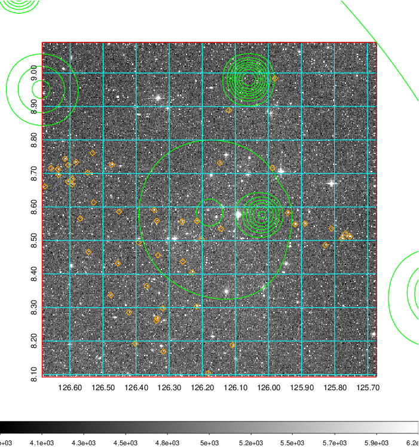  Blue circle for optical clusters;  Magenta circle for XSZ clusters;  all with r=1Mpc;  Only GC with Delta_z<0.01 are shown. | 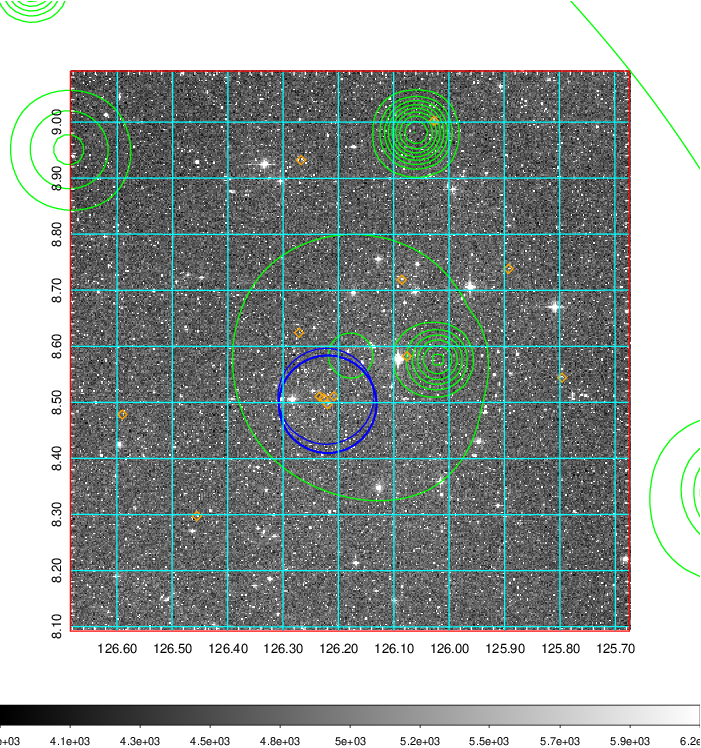 Blue circle for optical clusters;  Magenta circle for XSZ clusters;  all with r=1Mpc;  Only GC with Delta_z<0.01 are shown.  |

|[known Abell/XSZ clusters](../image/289/289_gc.pdf) | [2MASS image](../image/289/289_2mass.pdf)      |[SDSS image](../image/289/289_sdss.pdf)   |
|-------------------|-------------------|-------------------|
|  Magenta, blue and green circles  for optical, X-ray and SZ clusters  respectively, with redshift of clusters  labelled. The radius of circles  are 1Mpc.|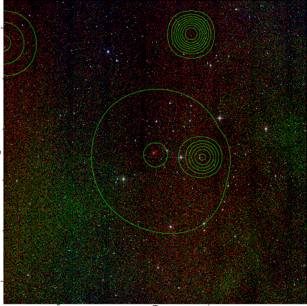  | 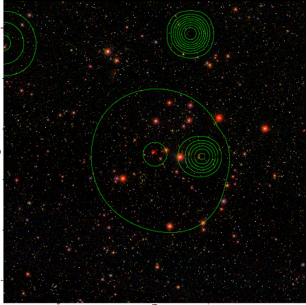  |

