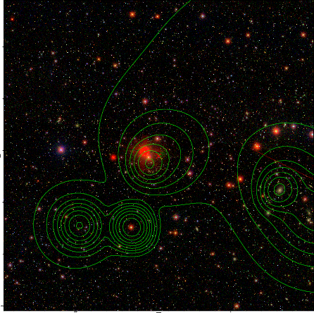

### 290

|Name|RAJ2000[deg]|DEJ2000[deg] |Ext[arcmin]| Ext,ml | z | z_src| C|GC(XSZ,Delta_z<0.01)| GC(OPT,Delta_z<0.01)|GC| R_sig[arcmin] | R500[arcmin] | R500[Mpc]| CRsig[c/s] | CR500[c/s] |L500[1E44 erg/s]|F500[1E-12 erg/s/cm^2]| M500[1E14 Msun]|Tx[keV]|Cnt_sig|Beta|Rc[arcmin]|Comment|Alias|
|---|---|---|---|---|---|------|---|--------|---------|----------|---|---|---|---|---|---|---|---|---|---|---|---|---|---|
|290| 126.232| 4.483| 3.94| 34.89| 0.2238(0.007)| z2, z_xsz| B| F20| W| A, C, F20, N, PSZ2, Tar, W| 28.720| 5.946| 1.284| 0.304(0.117)| 0.268(0.104)| 7.933(2.512)| 5.364(1.698)| 7.53(1.11)| 8.01(0.76)| 202.0| 0.523(-0.017+0.033)| 4.734(-0.629+0.990)| An SZ cluster with $z$ = 0.2328 and offset = 0.73 Mpc(3.35 arcmin), an Abell cluster with no $z$ and offset = 0.68 Mpc(3.11 arcmin)| k472|

|[RASS image](../image/290/290_img.pdf)|[filtered image](../image/290/290_fil.pdf)|[Segment image](../image/290/290_seg.pdf)|
|-------------------|--------------------|-------------------|
|   |    |   |

|[Exposure image](../image/290/290_mex.pdf)| [nH image](../image/290/290_nh.pdf)| [Planck image](../image/290/290_p.pdf)|
|-------------------|--------------------|-------------------|
|   |     |  |

|[Redshift Histogram](../image/290/290_zg.pdf) | [DSS image(z1)](../image/290/290_dss_z1.pdf)      |  [DSS image(z2)](../image/290/290_dss_z2.pdf)    |
|-------------------|--------------------|-------------------|
| |  Blue circle for optical clusters;  Magenta circle for XSZ clusters;  all with r=1Mpc;  Only GC with Delta_z<0.01 are shown. |  Blue circle for optical clusters;  Magenta circle for XSZ clusters;  all with r=1Mpc;  Only GC with Delta_z<0.01 are shown.  |

|[known Abell/XSZ clusters](../image/290/290_gc.pdf) | [2MASS image](../image/290/290_2mass.pdf)      |[SDSS image](../image/290/290_sdss.pdf)   |
|-------------------|-------------------|-------------------|
|  Magenta, blue and green circles  for optical, X-ray and SZ clusters  respectively, with redshift of clusters  labelled. The radius of circles  are 1Mpc.|  |   |

