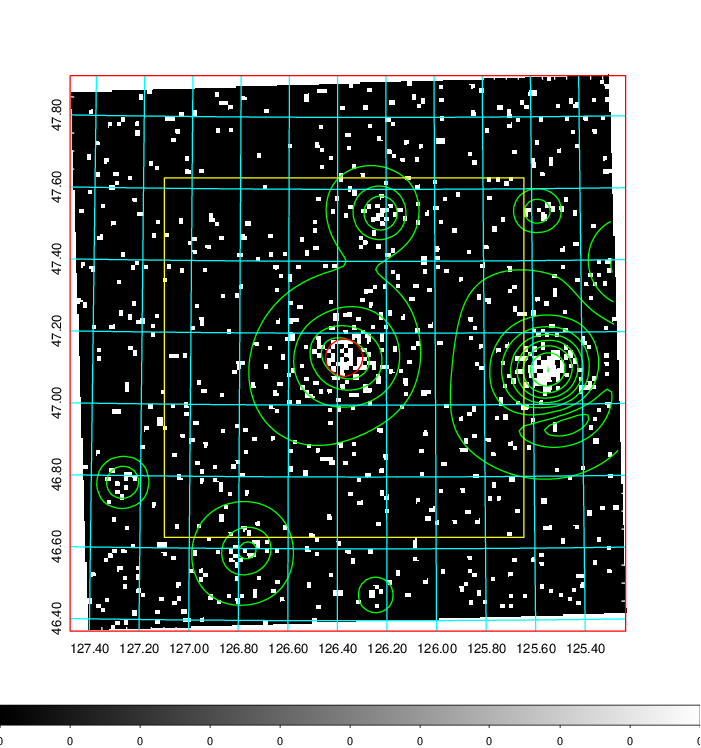
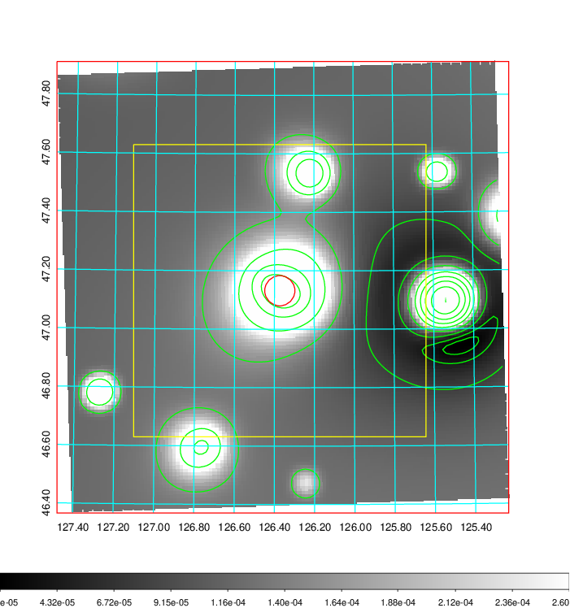
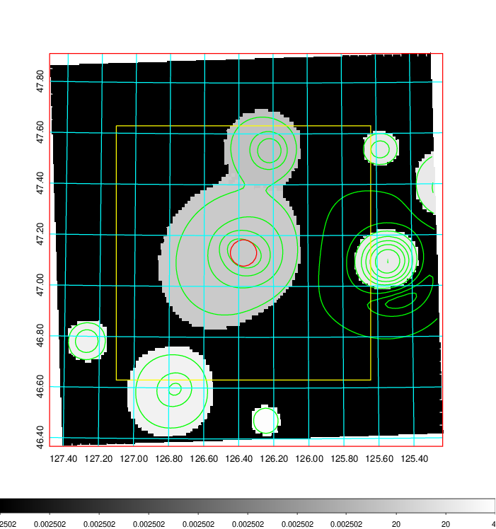
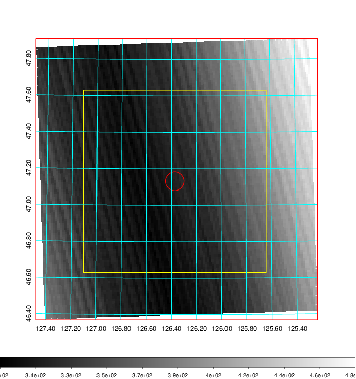
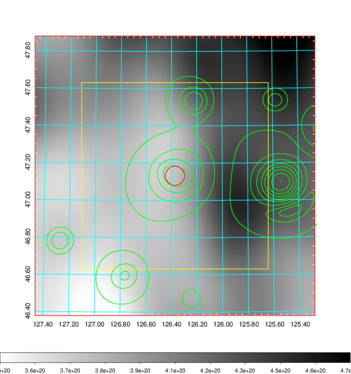
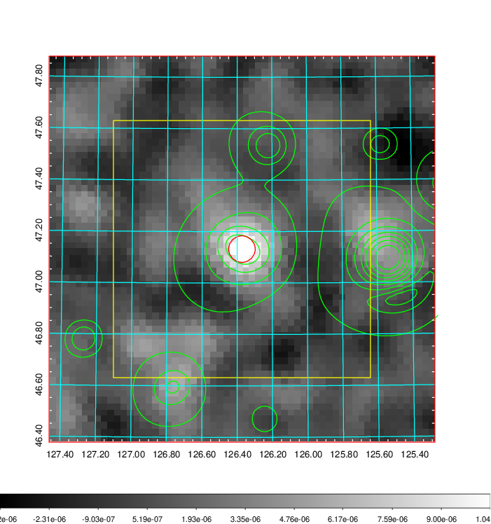
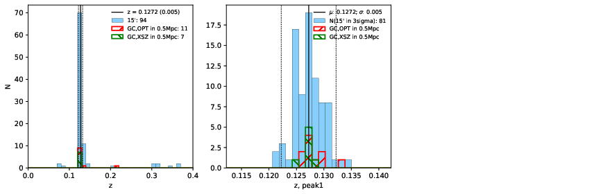
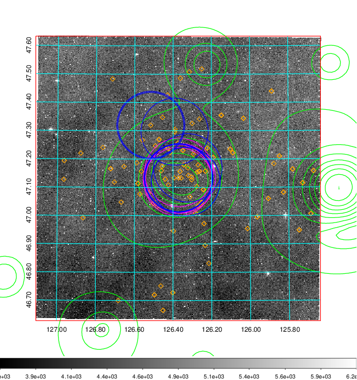
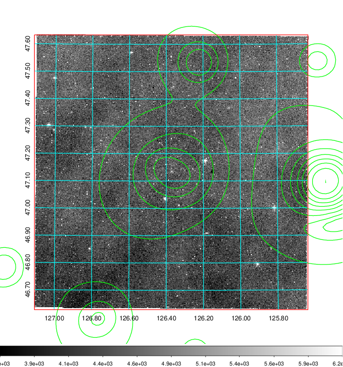
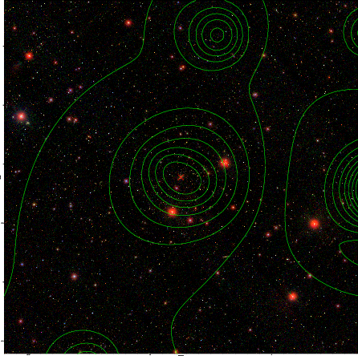

### 291

|Name|RAJ2000[deg]|DEJ2000[deg] |Ext[arcmin]| Ext,ml | z | z_src| C|GC(XSZ,Delta_z<0.01)| GC(OPT,Delta_z<0.01)|GC| R_sig[arcmin] | R500[arcmin] | R500[Mpc]| CRsig[c/s] | CR500[c/s] |L500[1E44 erg/s]|F500[1E-12 erg/s/cm^2]| M500[1E14 Msun]|Tx[keV]|Cnt_sig|Beta|Rc[arcmin]|Comment|Alias|
|---|---|---|---|---|---|------|---|--------|---------|----------|---|---|---|---|---|---|---|---|---|---|---|---|---|---|
|291| 126.373| 47.132| 3.10| 109.91| 0.1272(0.005)| z1, z_xsz| B| F20, MCXC, PSZ2, SPI, Tar, XB| A, C, N, RM, W, Zw| A, C, F20, MCXC, N, PSZ2, SPI, Tar, W, XB| 10.262| 8.080| 1.103| 0.351(0.044)| 0.339(0.043)| 2.717(0.166)| 6.390(0.389)| 4.31(0.13)| 5.49(0.10)| 105.9| 0.897(-0.109+0.073)| 5.779(-0.843+0.589)| -| k385|

|[RASS image](../image/291/291_img.pdf)|[filtered image](../image/291/291_fil.pdf)|[Segment image](../image/291/291_seg.pdf)|
|-------------------|--------------------|-------------------|
|   |    |   |

|[Exposure image](../image/291/291_mex.pdf)| [nH image](../image/291/291_nh.pdf)| [Planck image](../image/291/291_p.pdf)|
|-------------------|--------------------|-------------------|
|   |     |  |

|[Redshift Histogram](../image/291/291_zg.pdf) | [DSS image(z1)](../image/291/291_dss_z1.pdf)      |  [DSS image(z2)](../image/291/291_dss_z2.pdf)    |
|-------------------|--------------------|-------------------|
| |  Blue circle for optical clusters;  Magenta circle for XSZ clusters;  all with r=1Mpc;  Only GC with Delta_z<0.01 are shown. |  Blue circle for optical clusters;  Magenta circle for XSZ clusters;  all with r=1Mpc;  Only GC with Delta_z<0.01 are shown.  |

|[Previous-identified clusters](../image/291/291_gc.pdf) | [2MASS image](../image/291/291_2mass.pdf)      |[SDSS image](../image/291/291_sdss.pdf)   |
|-------------------|-------------------|-------------------|
|  Green, magenta, and blue circles  for optical, X-ray and SZ clusters  respectively, with redshift of clusters  labelled. The radius of circles  are 1Mpc.|  |   |

