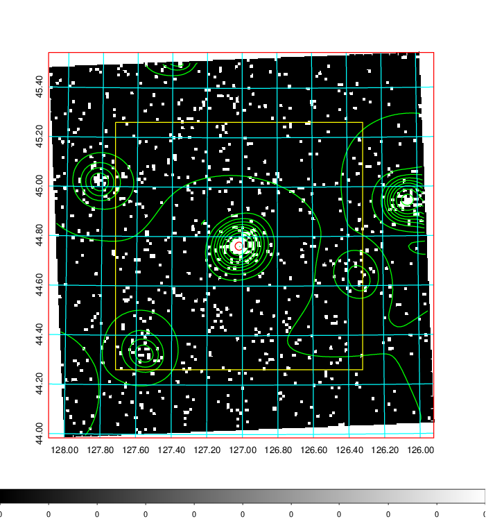
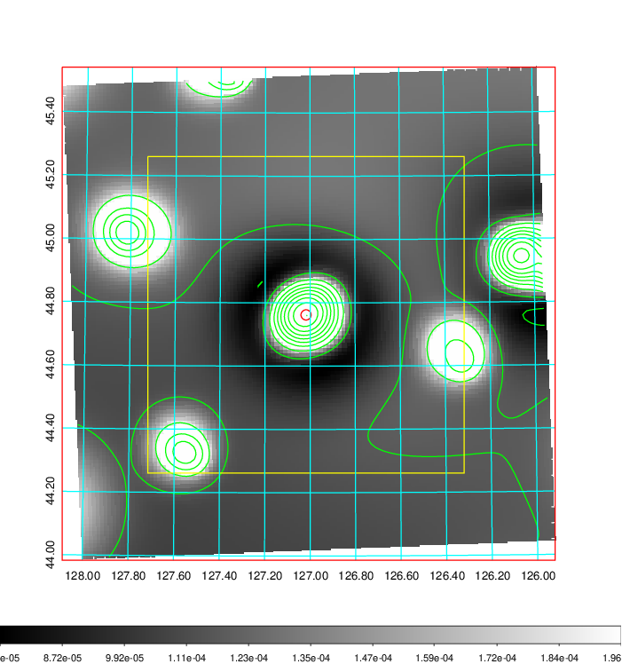
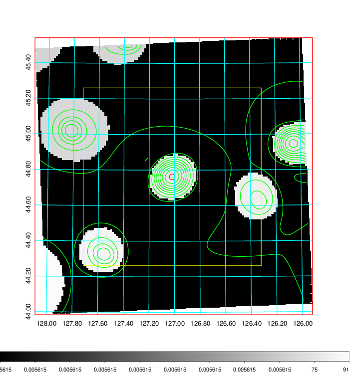
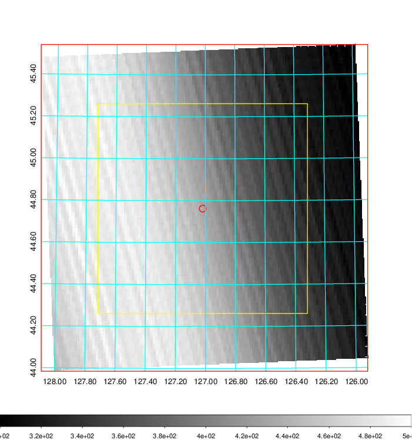
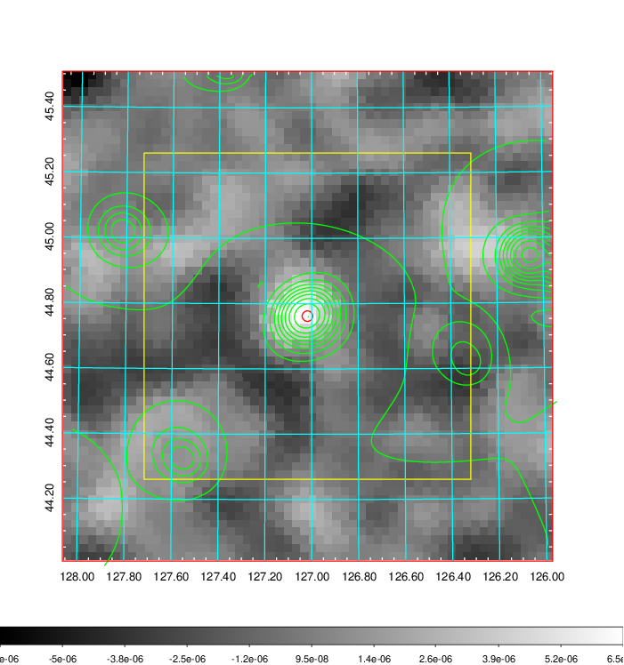
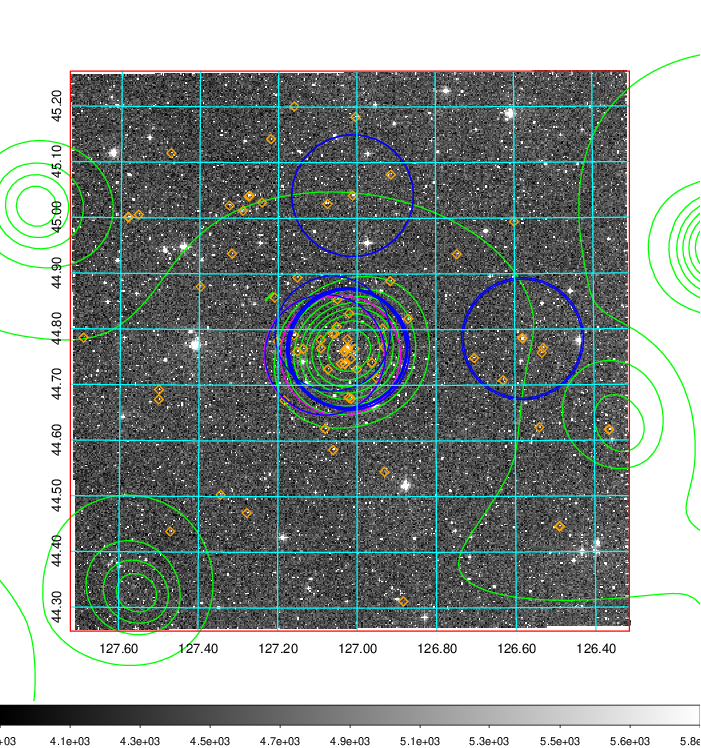
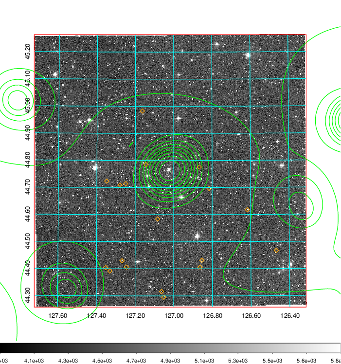
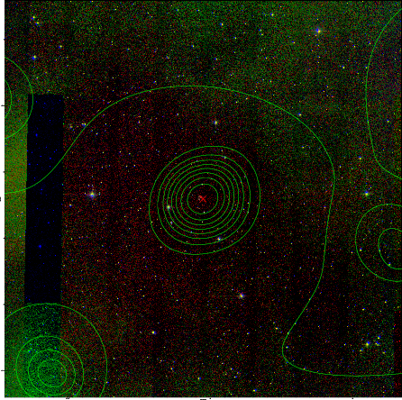

### 292

|Name|RAJ2000[deg]|DEJ2000[deg] |Ext[arcmin]| Ext,ml | z | z_src| C|GC(XSZ,Delta_z<0.01)| GC(OPT,Delta_z<0.01)|GC| R_sig[arcmin] | R500[arcmin] | R500[Mpc]| CRsig[c/s] | CR500[c/s] |L500[1E44 erg/s]|F500[1E-12 erg/s/cm^2]| M500[1E14 Msun]|Tx[keV]|Cnt_sig|Beta|Rc[arcmin]|Comment|Alias|
|---|---|---|---|---|---|------|---|--------|---------|----------|---|---|---|---|---|---|---|---|---|---|---|---|---|---|
|292| 127.018| 44.762| 0.97| 28.03| 0.1450(0.005)| z1, z_xsz| B| F20, MCXC, PSZ2, SPI, Tar| A, N, RM, W| A, C, F20, MCXC, N, PSZ2, SPI, Tar, W| 4.900| 7.004| 1.068| 0.216(0.033)| 0.232(0.035)| 2.518(0.168)| 4.456(0.297)| 3.99(0.13)| 5.27(0.11)| 89.4| 0.926(-0.089+0.054)| 2.496(-0.382+0.312)| -| k031|

|[RASS image](../image/292/292_img.pdf)|[filtered image](../image/292/292_fil.pdf)|[Segment image](../image/292/292_seg.pdf)|
|-------------------|--------------------|-------------------|
|   |    |   |

|[Exposure image](../image/292/292_mex.pdf)| [nH image](../image/292/292_nh.pdf)| [Planck image](../image/292/292_p.pdf)|
|-------------------|--------------------|-------------------|
|   |     |  |

|[Redshift Histogram](../image/292/292_zg.pdf) | [DSS image(z1)](../image/292/292_dss_z1.pdf)      |  [DSS image(z2)](../image/292/292_dss_z2.pdf)    |
|-------------------|--------------------|-------------------|
| |  Blue circle for optical clusters;  Magenta circle for XSZ clusters;  all with r=1Mpc;  Only GC with Delta_z<0.01 are shown. |  Blue circle for optical clusters;  Magenta circle for XSZ clusters;  all with r=1Mpc;  Only GC with Delta_z<0.01 are shown.  |

|[known Abell/XSZ clusters](../image/292/292_gc.pdf) | [2MASS image](../image/292/292_2mass.pdf)      |
|-------------------|-------------------|
|  Magenta, blue and green circles  for optical, X-ray and SZ clusters  respectively, with redshift of clusters  labelled. The radius of circles  are 1Mpc.|  |

|[PS1 image](../image/292/292_ps1.pdf)            |
|-------------------|
|   |
