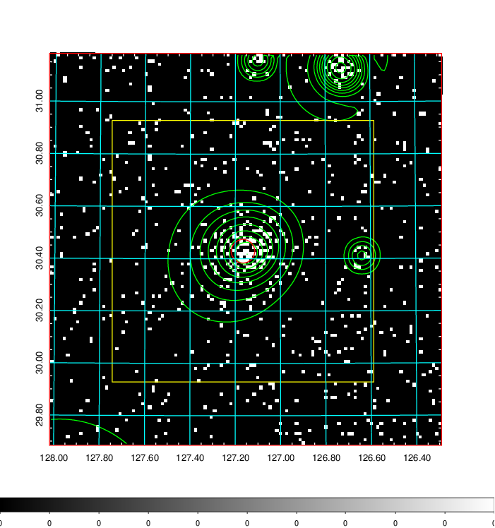
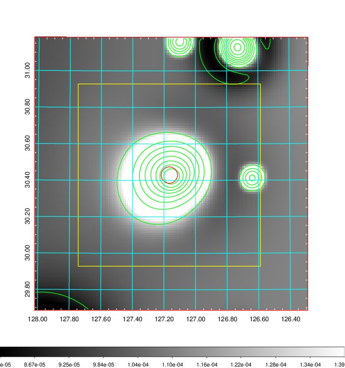
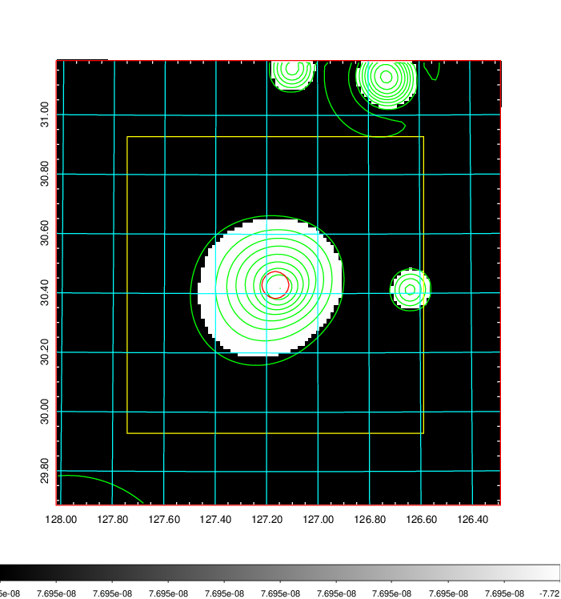
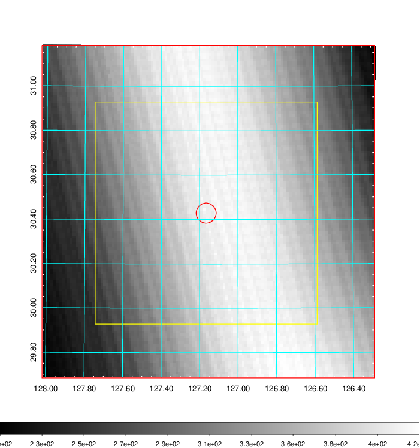
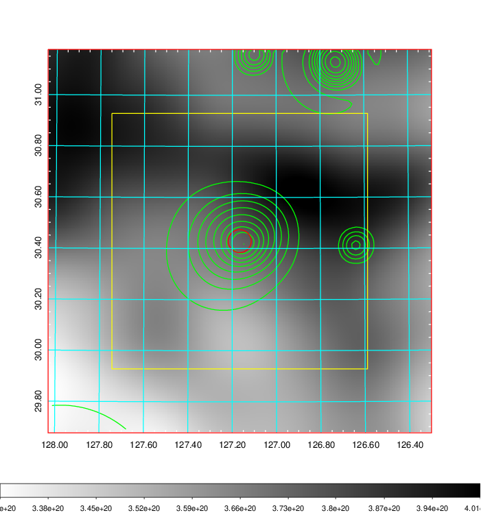
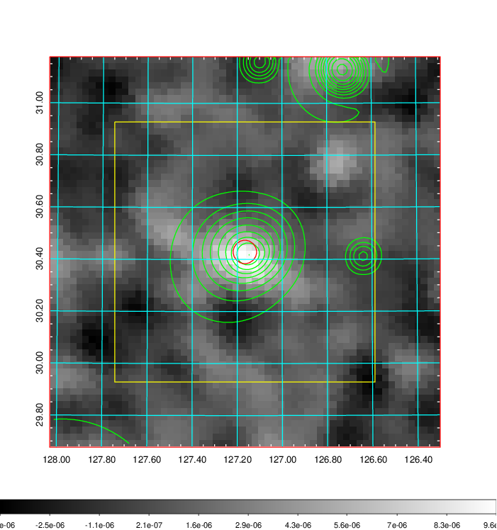
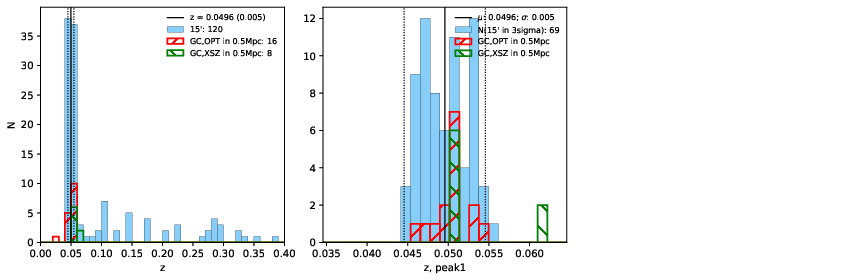
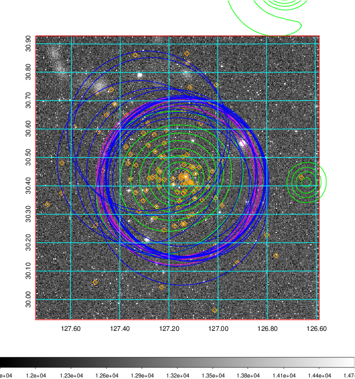
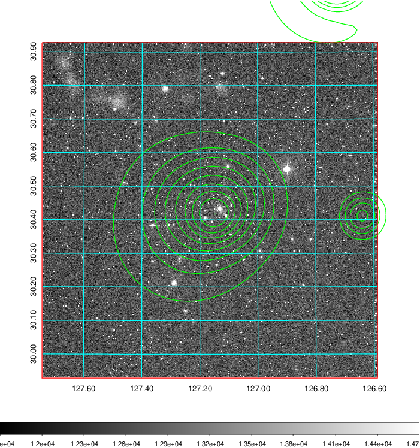
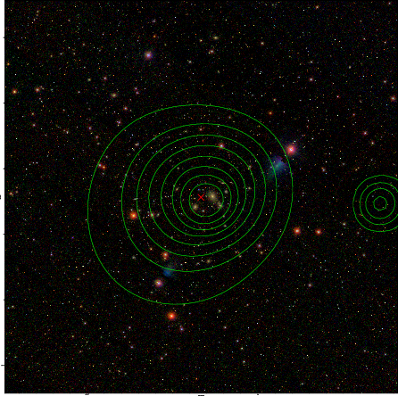

### 293

|Name|RAJ2000[deg]|DEJ2000[deg] |Ext[arcmin]| Ext,ml | z | z_src| C|GC(XSZ,Delta_z<0.01)| GC(OPT,Delta_z<0.01)|GC| R_sig[arcmin] | R500[arcmin] | R500[Mpc]| CRsig[c/s] | CR500[c/s] |L500[1E44 erg/s]|F500[1E-12 erg/s/cm^2]| M500[1E14 Msun]|Tx[keV]|Cnt_sig|Beta|Rc[arcmin]|Comment|Alias|
|---|---|---|---|---|---|------|---|--------|---------|----------|---|---|---|---|---|---|---|---|---|---|---|---|---|---|
|293| 127.166| 30.429| 2.70| 91.65| 0.0496(0.005)| z1, z_xsz| B| L03, MCXC, PSZ2, Tar, XB| A, N, W| A, F20, L03, MCXC, N, PSZ2, SPI, Tar, W, XB| 10.262| 12.946| 0.754| 0.315(0.037)| 0.329(0.039)| 0.338(0.021)| 5.808(0.369)| 1.28(0.04)| 2.53(0.05)| 118.6| 0.889(-0.112+0.079)| 5.653(-0.870+0.622)| -| k338|

|[RASS image](../image/293/293_img.pdf)|[filtered image](../image/293/293_fil.pdf)|[Segment image](../image/293/293_seg.pdf)|
|-------------------|--------------------|-------------------|
|   |    |   |

|[Exposure image](../image/293/293_mex.pdf)| [nH image](../image/293/293_nh.pdf)| [Planck image](../image/293/293_p.pdf)|
|-------------------|--------------------|-------------------|
|   |     |  |

|[Redshift Histogram](../image/293/293_zg.pdf) | [DSS image(z1)](../image/293/293_dss_z1.pdf)      |  [DSS image(z2)](../image/293/293_dss_z2.pdf)    |
|-------------------|--------------------|-------------------|
| |  Blue circle for optical clusters;  Magenta circle for XSZ clusters;  all with r=1Mpc;  Only GC with Delta_z<0.01 are shown. |  Blue circle for optical clusters;  Magenta circle for XSZ clusters;  all with r=1Mpc;  Only GC with Delta_z<0.01 are shown.  |

|[Previous-identified clusters](../image/293/293_gc.pdf) | [2MASS image](../image/293/293_2mass.pdf)      |[SDSS image](../image/293/293_sdss.pdf)   |
|-------------------|-------------------|-------------------|
|  Green, magenta, and blue circles  for optical, X-ray and SZ clusters  respectively, with redshift of clusters  labelled. The radius of circles  are 1Mpc.|  |   |

