

### 294

|Name|RAJ2000[deg]|DEJ2000[deg] |Ext[arcmin]| Ext,ml | z | z_src| C|GC(XSZ,Delta_z<0.01)| GC(OPT,Delta_z<0.01)|GC| R_sig[arcmin] | R500[arcmin] | R500[Mpc]| CRsig[c/s] | CR500[c/s] |L500[1E44 erg/s]|F500[1E-12 erg/s/cm^2]| M500[1E14 Msun]|Tx[keV]|Cnt_sig|Beta|Rc[arcmin]|Comment|Alias|
|---|---|---|---|---|---|------|---|--------|---------|----------|---|---|---|---|---|---|---|---|---|---|---|---|---|---|
|294| 127.750| 65.859| 1.59| 153.45| 0.1827(0.006)| z1, z_xsz| B| MCXC, PSZ2, Tar, XB| A, N, W| A, C, MCXC, N, PSZ2, Tar, W, XB| 7.825| 7.577| 1.396| 0.538(0.041)| 0.536(0.041)| 9.623(0.249)| 10.241(0.265)| 9.28(0.11)| 8.98(0.07)| 226.7| 0.937(-0.075+0.045)| 3.901(-0.398+0.272)| -| k136|

|[RASS image](../image/294/294_img.pdf)|[filtered image](../image/294/294_fil.pdf)|[Segment image](../image/294/294_seg.pdf)|
|-------------------|--------------------|-------------------|
| 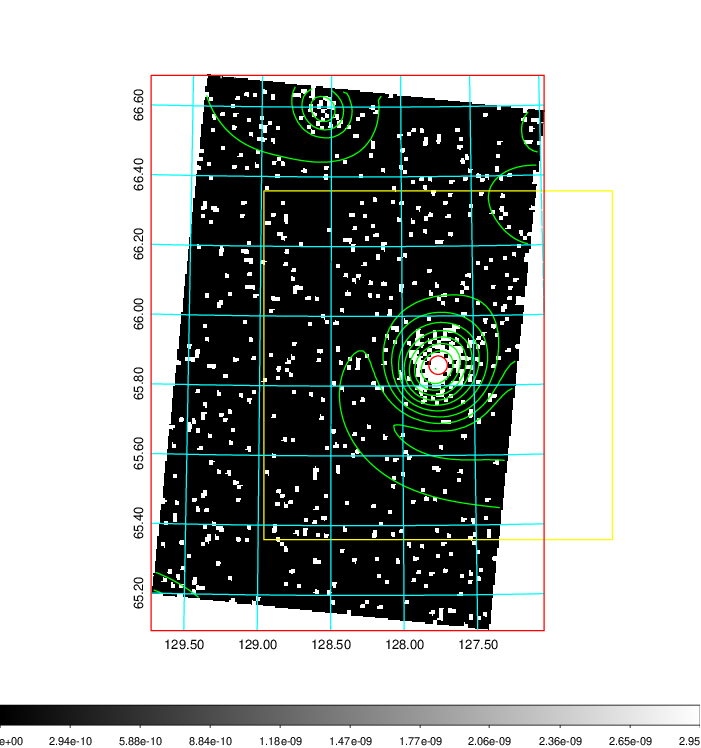  | 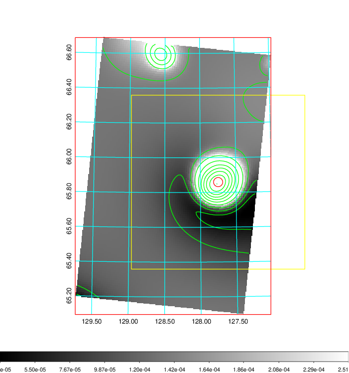   | 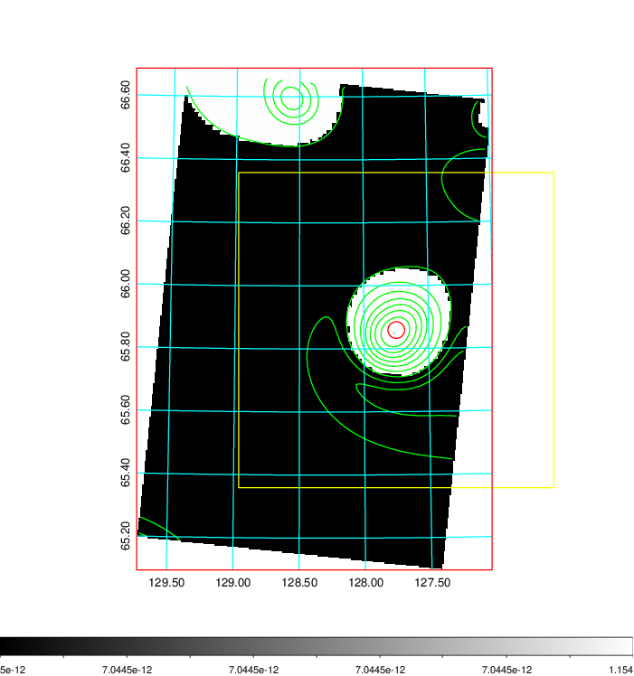  |

|[Exposure image](../image/294/294_mex.pdf)| [nH image](../image/294/294_nh.pdf)| [Planck image](../image/294/294_p.pdf)|
|-------------------|--------------------|-------------------|
|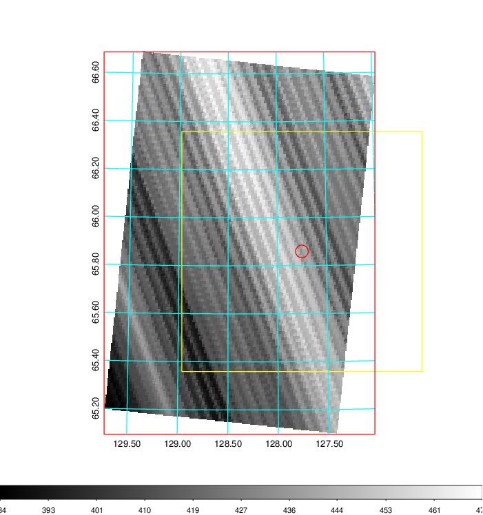   | 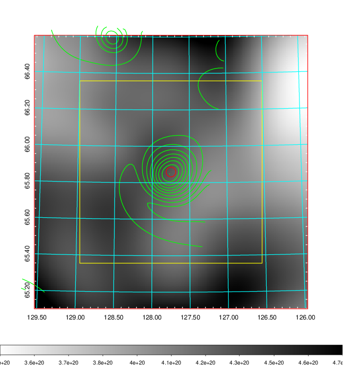    | 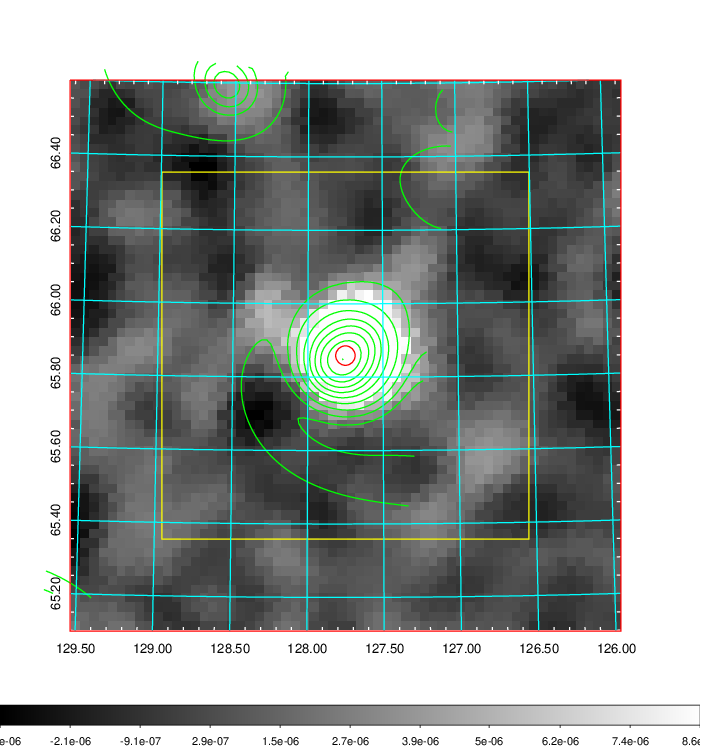 |

|[Redshift Histogram](../image/294/294_zg.pdf) | [DSS image(z1)](../image/294/294_dss_z1.pdf)      |  [DSS image(z2)](../image/294/294_dss_z2.pdf)    |
|-------------------|--------------------|-------------------|
|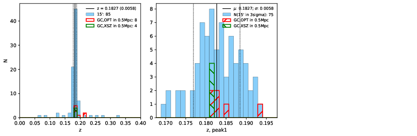 |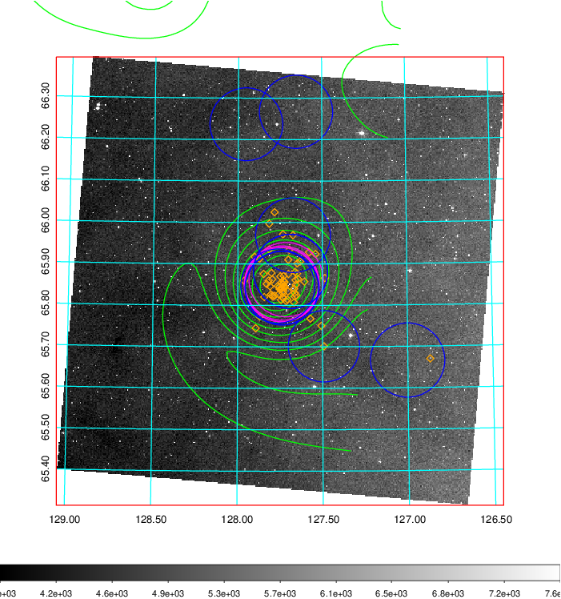  Blue circle for optical clusters;  Magenta circle for XSZ clusters;  all with r=1Mpc;  Only GC with Delta_z<0.01 are shown. | 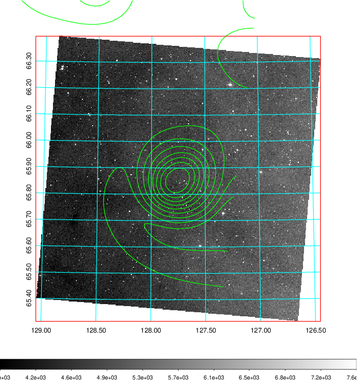 Blue circle for optical clusters;  Magenta circle for XSZ clusters;  all with r=1Mpc;  Only GC with Delta_z<0.01 are shown.  |

|[Previous-identified clusters](../image/294/294_gc.pdf) | [2MASS image](../image/294/294_2mass.pdf)      |[SDSS image](../image/294/294_sdss.pdf)   |
|-------------------|-------------------|-------------------|
|  Green, magenta, and blue circles  for optical, X-ray and SZ clusters  respectively, with redshift of clusters  labelled. The radius of circles  are 1Mpc.|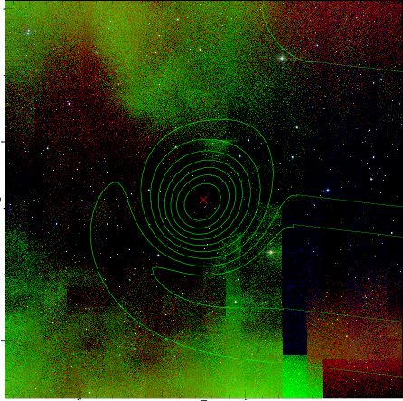  | 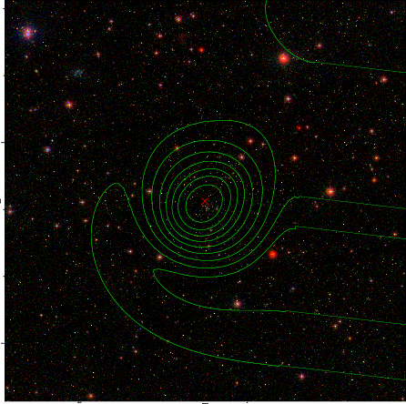  |

