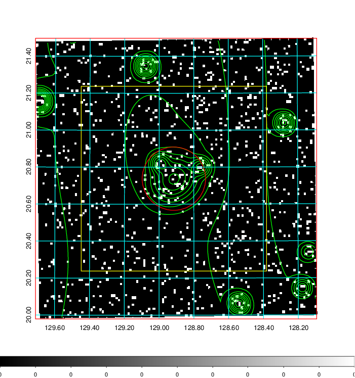
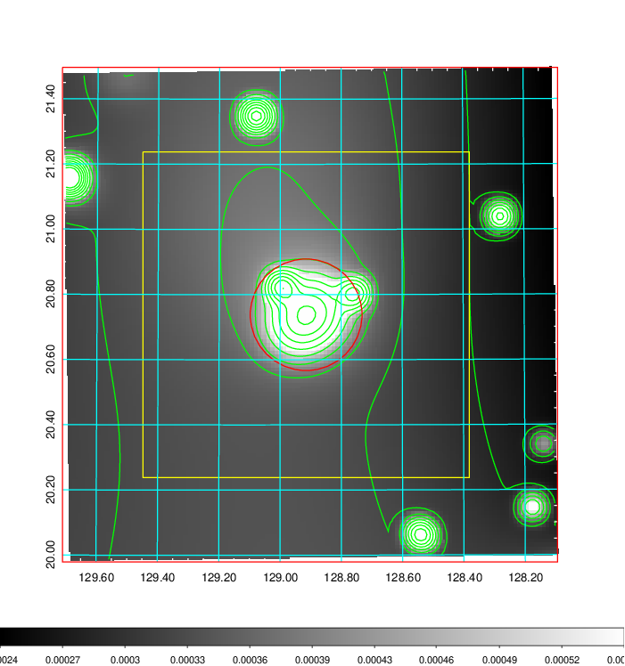
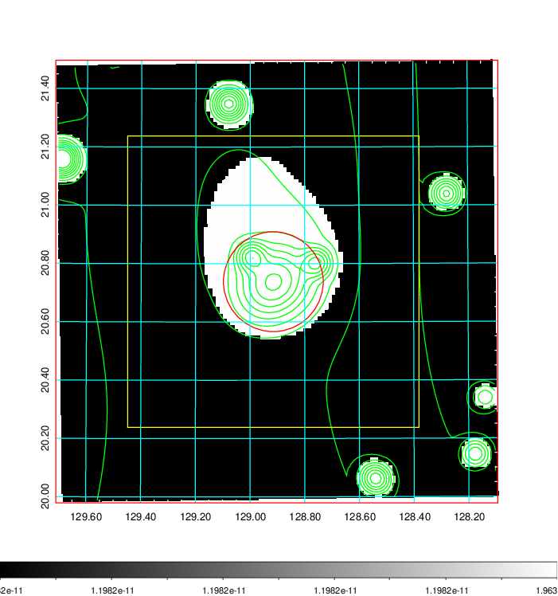
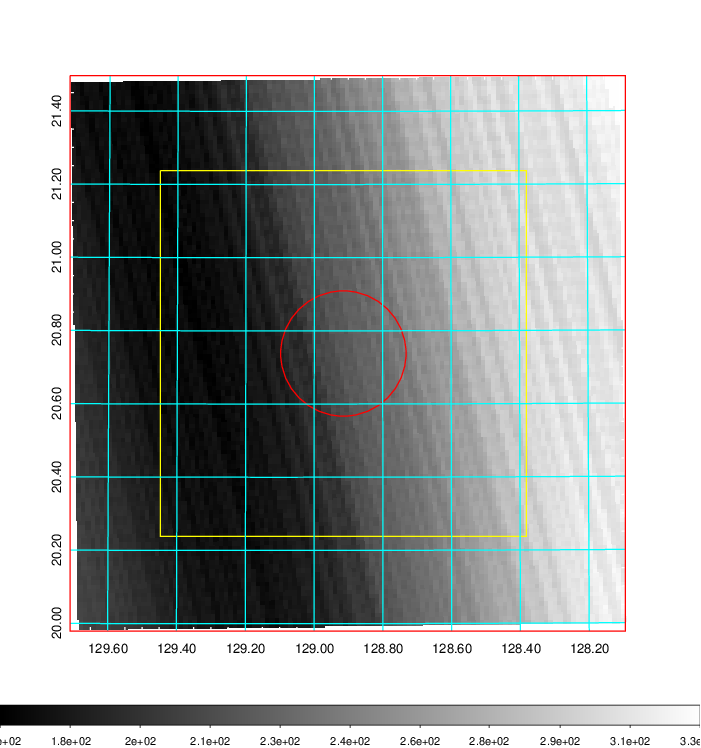
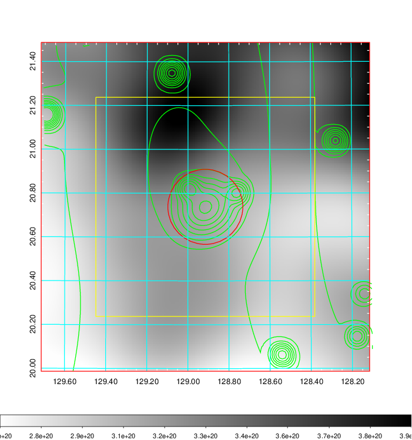
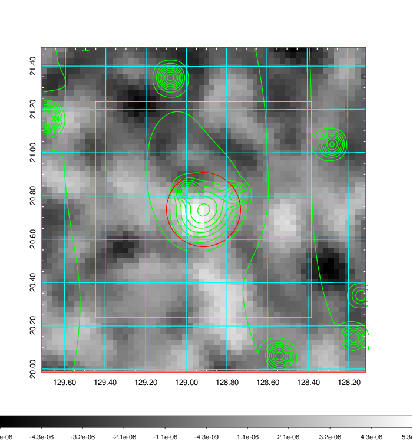
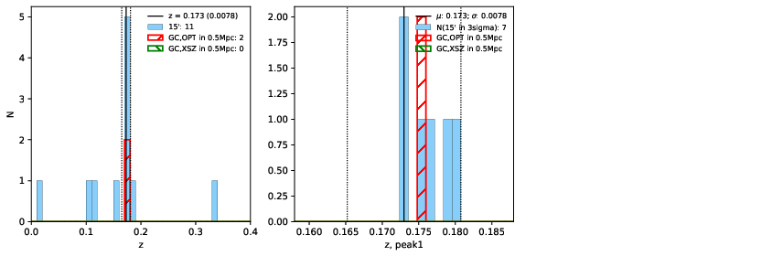
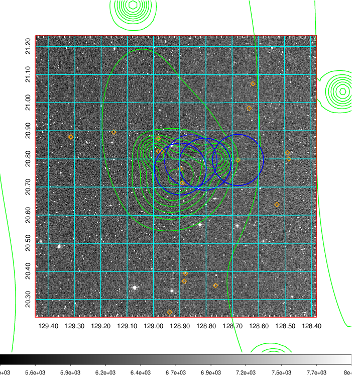
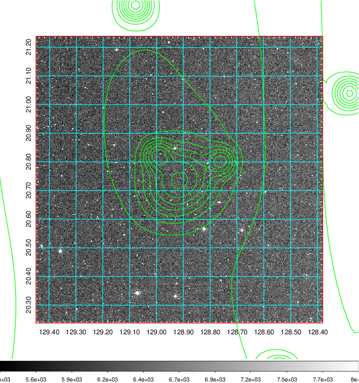
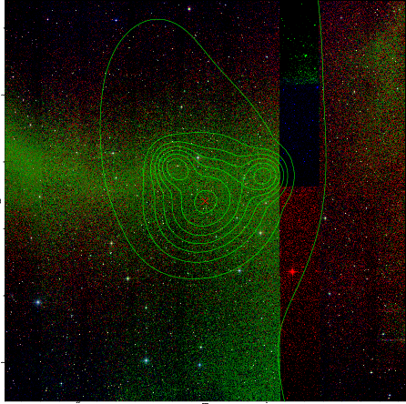

### 295

|Name|RAJ2000[deg]|DEJ2000[deg] |Ext[arcmin]| Ext,ml | z | z_src| C|GC(XSZ,Delta_z<0.01)| GC(OPT,Delta_z<0.01)|GC| R_sig[arcmin] | R500[arcmin] | R500[Mpc]| CRsig[c/s] | CR500[c/s] |L500[1E44 erg/s]|F500[1E-12 erg/s/cm^2]| M500[1E14 Msun]|Tx[keV]|Cnt_sig|Beta|Rc[arcmin]|Comment|Alias|
|---|---|---|---|---|---|------|---|--------|---------|----------|---|---|---|---|---|---|---|---|---|---|---|---|---|---|
|295| 128.915| 20.738| 10.28| 29.61| 0.1730(0.008)| z1, z_opt| S| -| N, W| C, N, W| 11.238| 4.610| 0.813| 0.050(0.058)| 0.045(0.052)| 0.713(0.349)| 0.856(0.419)| 1.81(0.44)| 3.27(0.50)| 50.6| 0.873(-0.144+0.091)| 4.587(-1.090+1.029)| -| t450|

|[RASS image](../image/295/295_img.pdf)|[filtered image](../image/295/295_fil.pdf)|[Segment image](../image/295/295_seg.pdf)|
|-------------------|--------------------|-------------------|
|   |    |   |

|[Exposure image](../image/295/295_mex.pdf)| [nH image](../image/295/295_nh.pdf)| [Planck image](../image/295/295_p.pdf)|
|-------------------|--------------------|-------------------|
|   |     |  |

|[Redshift Histogram](../image/295/295_zg.pdf) | [DSS image(z1)](../image/295/295_dss_z1.pdf)      |  [DSS image(z2)](../image/295/295_dss_z2.pdf)    |
|-------------------|--------------------|-------------------|
| |  Blue circle for optical clusters;  Magenta circle for XSZ clusters;  all with r=1Mpc;  Only GC with Delta_z<0.01 are shown. |  Blue circle for optical clusters;  Magenta circle for XSZ clusters;  all with r=1Mpc;  Only GC with Delta_z<0.01 are shown.  |

|[Previous-identified clusters](../image/295/295_gc.pdf) | [2MASS image](../image/295/295_2mass.pdf)      |[SDSS image](../image/295/295_sdss.pdf)   |
|-------------------|-------------------|-------------------|
|  Green, magenta, and blue circles  for optical, X-ray and SZ clusters  respectively, with redshift of clusters  labelled. The radius of circles  are 1Mpc.|  |   |

