

### 296

|Name|RAJ2000[deg]|DEJ2000[deg] |Ext[arcmin]| Ext,ml | z | z_src| C|GC(XSZ,Delta_z<0.01)| GC(OPT,Delta_z<0.01)|GC| R_sig[arcmin] | R500[arcmin] | R500[Mpc]| CRsig[c/s] | CR500[c/s] |L500[1E44 erg/s]|F500[1E-12 erg/s/cm^2]| M500[1E14 Msun]|Tx[keV]|Cnt_sig|Beta|Rc[arcmin]|Comment|Alias|
|---|---|---|---|---|---|------|---|--------|---------|----------|---|---|---|---|---|---|---|---|---|---|---|---|---|---|
|296| 129.466| 25.104| 18.78| 362.33| 0.0284(0.005)| z1, z_xsz| B| MCXC| N| C, F20, MCXC, N, W| 39.675| 21.851| 0.747| 1.030(0.108)| 0.959(0.101)| 0.315(0.033)| 17.052(1.802)| 1.22(0.07)| 2.44(0.08)| 663.7| 0.511(-0.008+0.018)| 11.282(-0.661+0.926)| -| k578|

|[RASS image](../image/296/296_img.pdf)|[filtered image](../image/296/296_fil.pdf)|[Segment image](../image/296/296_seg.pdf)|
|-------------------|--------------------|-------------------|
| 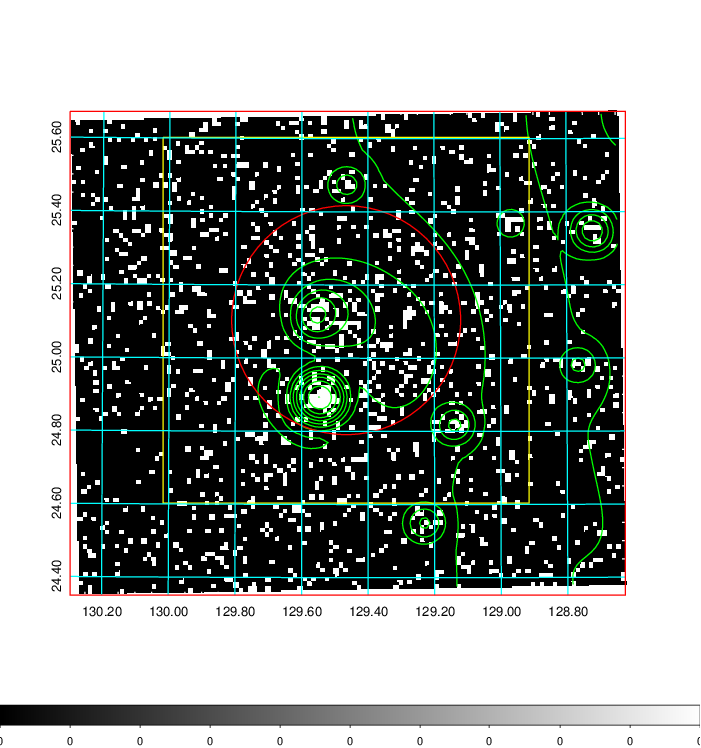  | 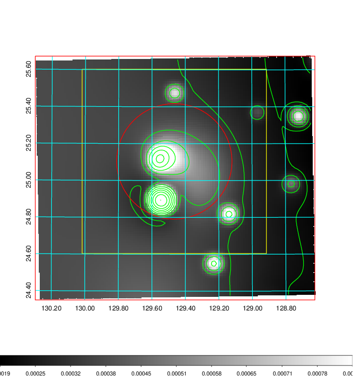   | 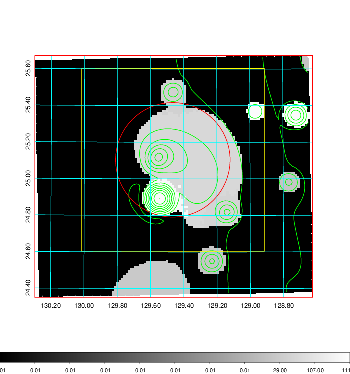  |

|[Exposure image](../image/296/296_mex.pdf)| [nH image](../image/296/296_nh.pdf)| [Planck image](../image/296/296_p.pdf)|
|-------------------|--------------------|-------------------|
|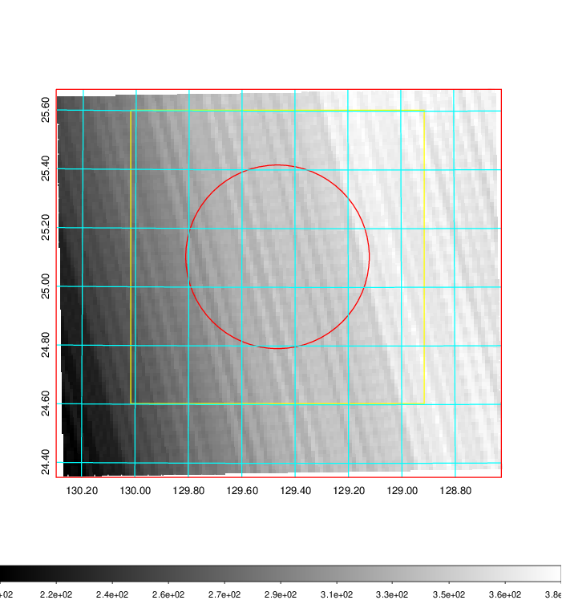   | 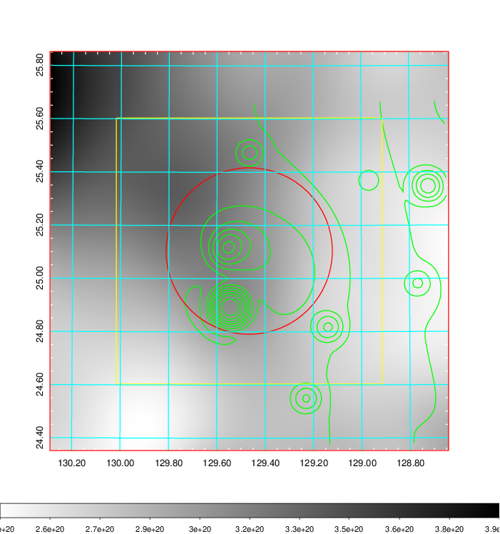    | 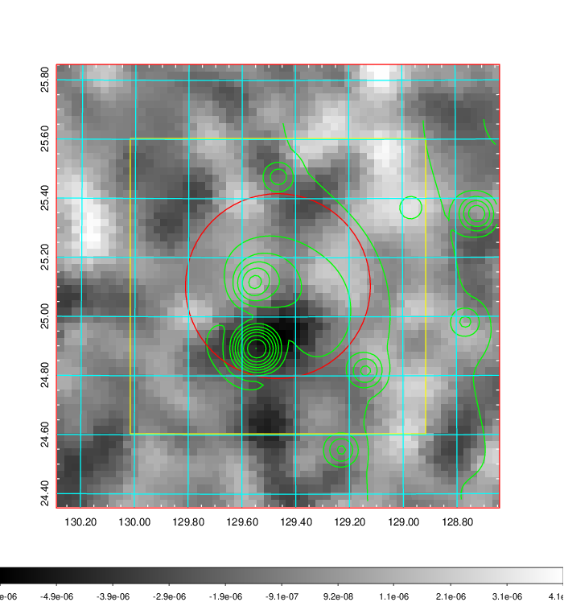 |

|[Redshift Histogram](../image/296/296_zg.pdf) | [DSS image(z1)](../image/296/296_dss_z1.pdf)      |  [DSS image(z2)](../image/296/296_dss_z2.pdf)    |
|-------------------|--------------------|-------------------|
|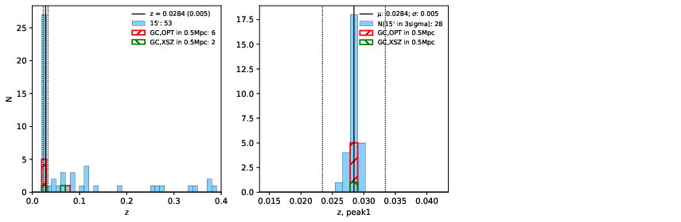 |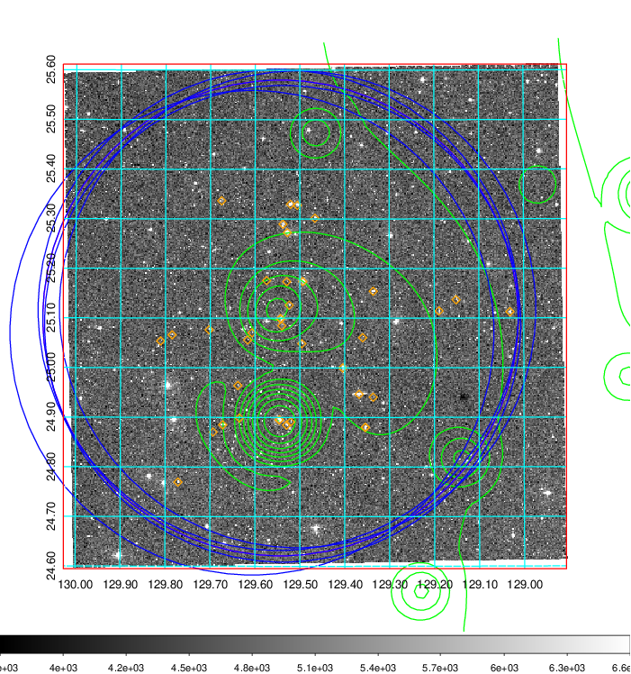  Blue circle for optical clusters;  Magenta circle for XSZ clusters;  all with r=1Mpc;  Only GC with Delta_z<0.01 are shown. | 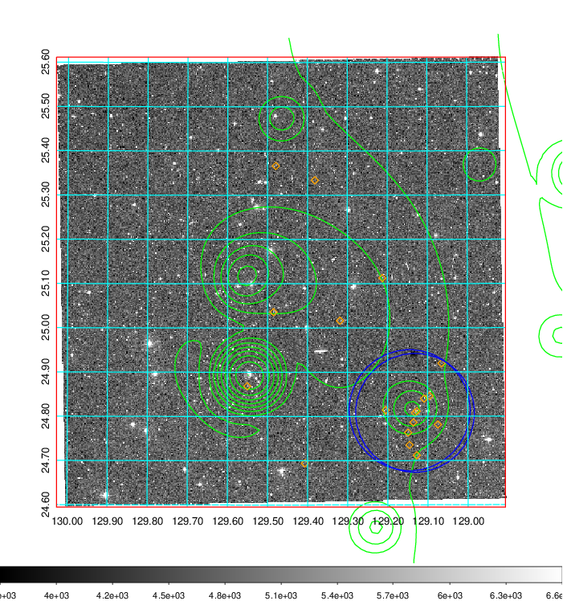 Blue circle for optical clusters;  Magenta circle for XSZ clusters;  all with r=1Mpc;  Only GC with Delta_z<0.01 are shown.  |

|[known Abell/XSZ clusters](../image/296/296_gc.pdf) | [2MASS image](../image/296/296_2mass.pdf)      |[SDSS image](../image/296/296_sdss.pdf)   |
|-------------------|-------------------|-------------------|
|  Magenta, blue and green circles  for optical, X-ray and SZ clusters  respectively, with redshift of clusters  labelled. The radius of circles  are 1Mpc.|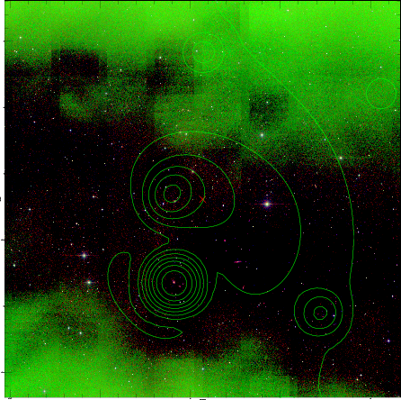  | 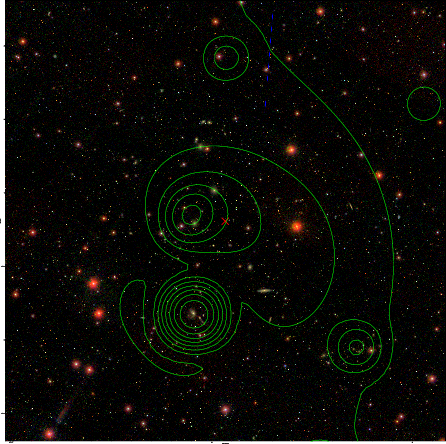  |

