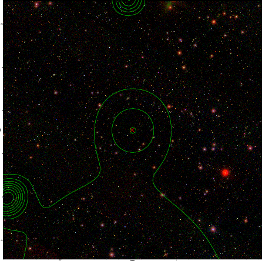

### 298

|Name|RAJ2000[deg]|DEJ2000[deg] |Ext[arcmin]| Ext,ml | z | z_src| C|GC(XSZ,Delta_z<0.01)| GC(OPT,Delta_z<0.01)|GC| R_sig[arcmin] | R500[arcmin] | R500[Mpc]| CRsig[c/s] | CR500[c/s] |L500[1E44 erg/s]|F500[1E-12 erg/s/cm^2]| M500[1E14 Msun]|Tx[keV]|Cnt_sig|Beta|Rc[arcmin]|Comment|Alias|
|---|---|---|---|---|---|------|---|--------|---------|----------|---|---|---|---|---|---|---|---|---|---|---|---|---|---|
|298| 130.439| 26.593| 7.63| 26.14| 0.0881(0.005)| z1,| G| -| -| A, L03, N, W| 11.238| 7.378| 0.729| 0.100(0.056)| 0.095(0.053)| 0.326(0.142)| 1.682(0.732)| 1.20(0.26)| 2.46(0.34)| 42.4| 0.766(-0.171+0.161)| 4.672(-1.538+1.575)| An X-ray cluster with $z$ = 0.0894 and offset = 0.87 Mpc(8.72 arcmin); likely be a sub-structure of the nearby Abell cluster (Ledlow03)| t382|

|[RASS image](../image/298/298_img.pdf)|[filtered image](../image/298/298_fil.pdf)|[Segment image](../image/298/298_seg.pdf)|
|-------------------|--------------------|-------------------|
|   |    |   |

|[Exposure image](../image/298/298_mex.pdf)| [nH image](../image/298/298_nh.pdf)| [Planck image](../image/298/298_p.pdf)|
|-------------------|--------------------|-------------------|
|   |     |  |

|[Redshift Histogram](../image/298/298_zg.pdf) | [DSS image(z1)](../image/298/298_dss_z1.pdf)      |  [DSS image(z2)](../image/298/298_dss_z2.pdf)    |
|-------------------|--------------------|-------------------|
| |  Blue circle for optical clusters;  Magenta circle for XSZ clusters;  all with r=1Mpc;  Only GC with Delta_z<0.01 are shown. |  Blue circle for optical clusters;  Magenta circle for XSZ clusters;  all with r=1Mpc;  Only GC with Delta_z<0.01 are shown.  |

|[known Abell/XSZ clusters](../image/298/298_gc.pdf) | [2MASS image](../image/298/298_2mass.pdf)      |[SDSS image](../image/298/298_sdss.pdf)   |
|-------------------|-------------------|-------------------|
|  Magenta, blue and green circles  for optical, X-ray and SZ clusters  respectively, with redshift of clusters  labelled. The radius of circles  are 1Mpc.|  |   |

