

### 300

|Name|RAJ2000[deg]|DEJ2000[deg] |Ext[arcmin]| Ext,ml | z | z_src| C|GC(XSZ,Delta_z<0.01)| GC(OPT,Delta_z<0.01)|GC| R_sig[arcmin] | R500[arcmin] | R500[Mpc]| CRsig[c/s] | CR500[c/s] |L500[1E44 erg/s]|F500[1E-12 erg/s/cm^2]| M500[1E14 Msun]|Tx[keV]|Cnt_sig|Beta|Rc[arcmin]|Comment|Alias|
|---|---|---|---|---|---|------|---|--------|---------|----------|---|---|---|---|---|---|---|---|---|---|---|---|---|---|
|300| 131.272| 27.775| 87.05| 49.52| 0.0847(0.005)| z1, z_xsz| B| L03| N, RM, W| A, C, F20, L03, N, SPI, W| 12.700| 8.095| 0.772| 0.138(0.070)| 0.130(0.066)| 0.406(0.169)| 2.280(0.950)| 1.42(0.30)| 2.73(0.36)| 40.8| 0.667(-0.124+0.201)| 4.046(-1.501+2.050)| -| t723|

|[RASS image](../image/300/300_img.pdf)|[filtered image](../image/300/300_fil.pdf)|[Segment image](../image/300/300_seg.pdf)|
|-------------------|--------------------|-------------------|
| 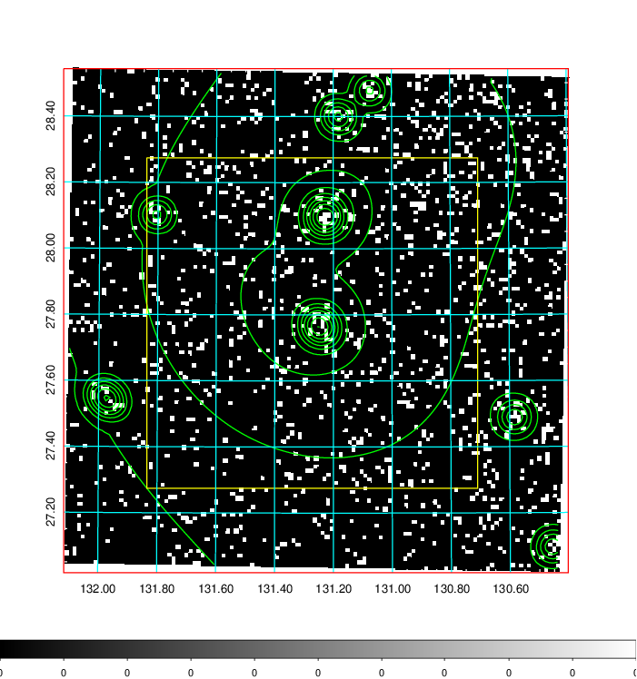  | 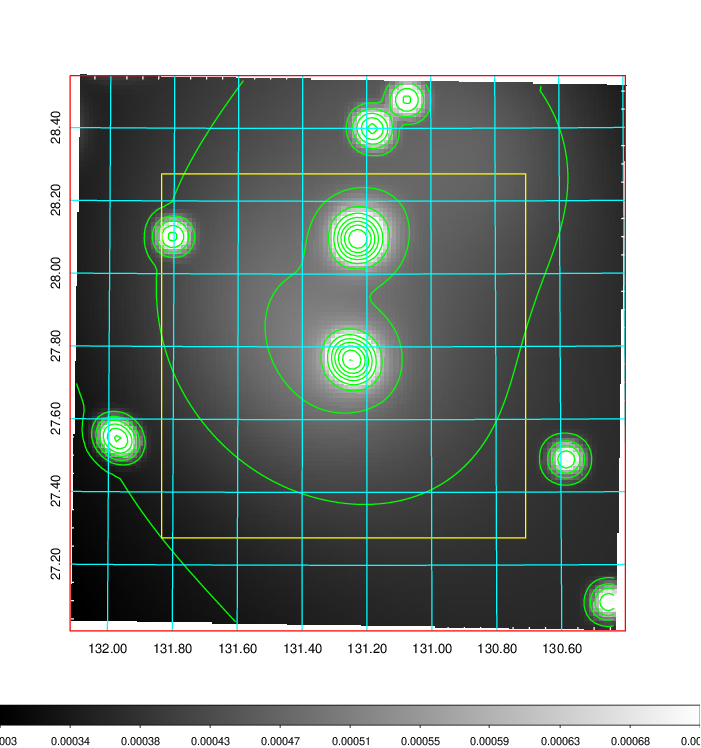   | 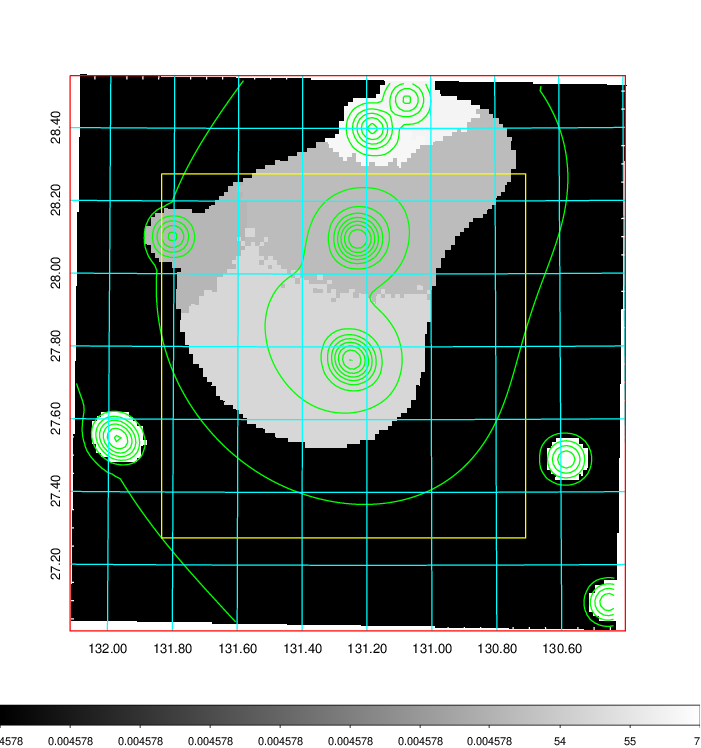  |

|[Exposure image](../image/300/300_mex.pdf)| [nH image](../image/300/300_nh.pdf)| [Planck image](../image/300/300_p.pdf)|
|-------------------|--------------------|-------------------|
|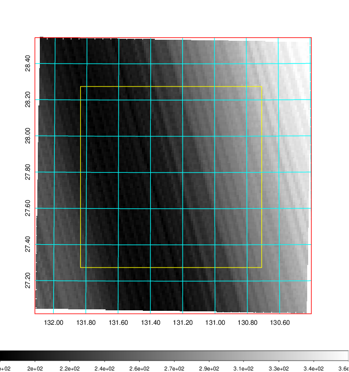   | 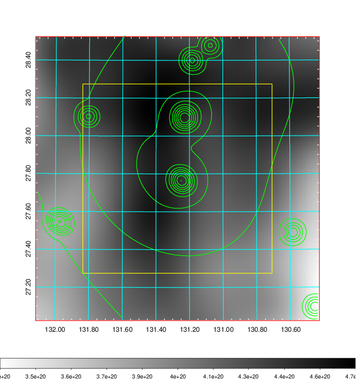    | 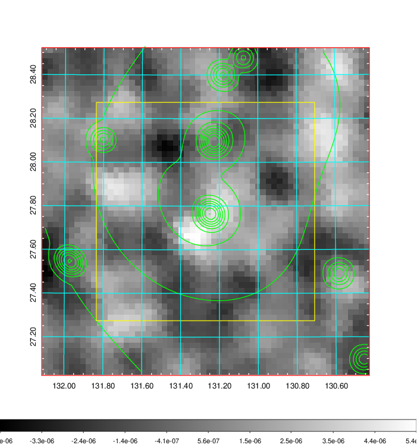 |

|[Redshift Histogram](../image/300/300_zg.pdf) | [DSS image(z1)](../image/300/300_dss_z1.pdf)      |  [DSS image(z2)](../image/300/300_dss_z2.pdf)    |
|-------------------|--------------------|-------------------|
|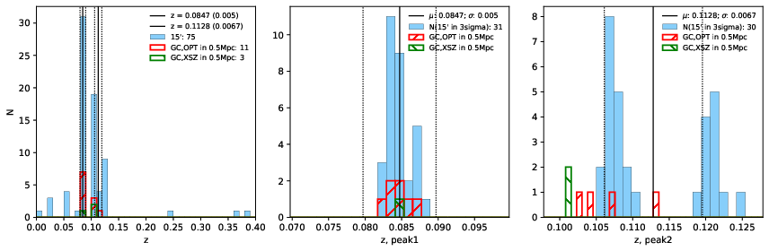 |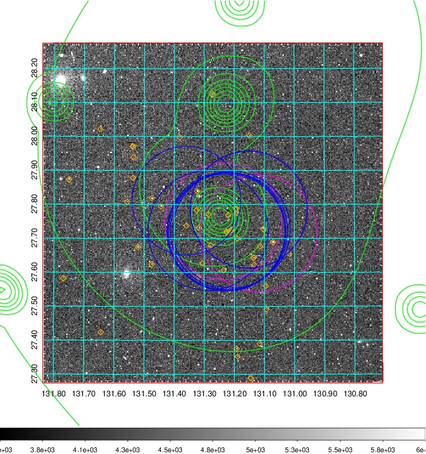  Blue circle for optical clusters;  Magenta circle for XSZ clusters;  all with r=1Mpc;  Only GC with Delta_z<0.01 are shown. | 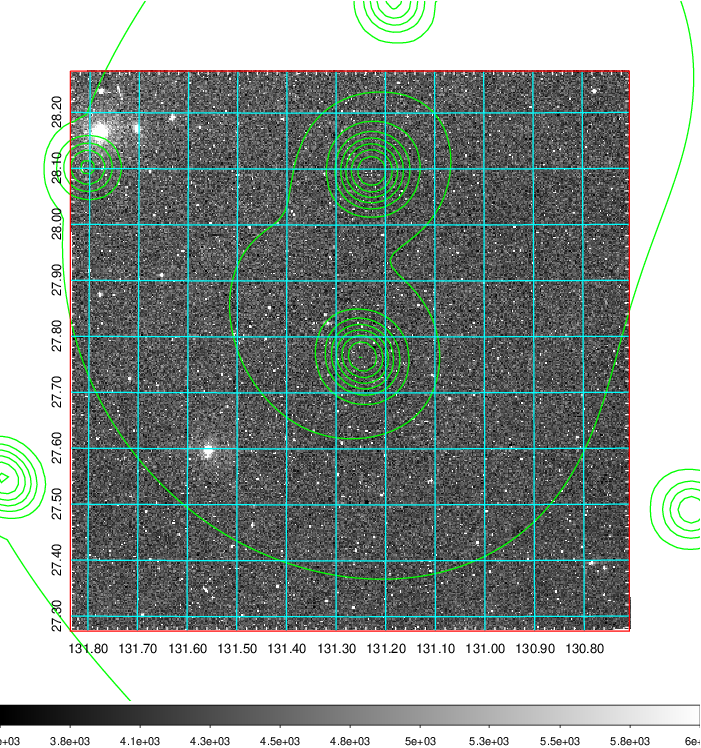 Blue circle for optical clusters;  Magenta circle for XSZ clusters;  all with r=1Mpc;  Only GC with Delta_z<0.01 are shown.  |

|[known Abell/XSZ clusters](../image/300/300_gc.pdf) | [2MASS image](../image/300/300_2mass.pdf)      |[SDSS image](../image/300/300_sdss.pdf)   |
|-------------------|-------------------|-------------------|
|  Magenta, blue and green circles  for optical, X-ray and SZ clusters  respectively, with redshift of clusters  labelled. The radius of circles  are 1Mpc.|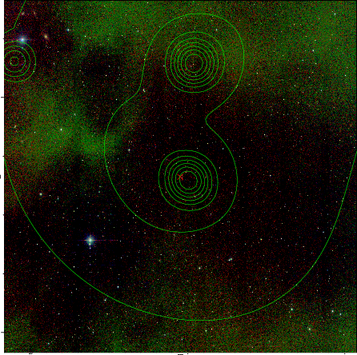  | 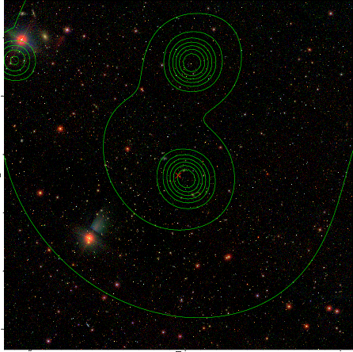  |

