

### 301

|Name|RAJ2000[deg]|DEJ2000[deg] |Ext[arcmin]| Ext,ml | z | z_src| C|GC(XSZ,Delta_z<0.01)| GC(OPT,Delta_z<0.01)|GC| R_sig[arcmin] | R500[arcmin] | R500[Mpc]| CRsig[c/s] | CR500[c/s] |L500[1E44 erg/s]|F500[1E-12 erg/s/cm^2]| M500[1E14 Msun]|Tx[keV]|Cnt_sig|Beta|Rc[arcmin]|Comment|Alias|
|---|---|---|---|---|---|------|---|--------|---------|----------|---|---|---|---|---|---|---|---|---|---|---|---|---|---|
|301| 131.951| 29.848| 6.89| 25.26| 0.1045(0.005)| z1,| G| -| -| A, N, W| 47.035| 10.930| 1.257| 1.033(0.173)| 0.917(0.154)| 4.917(3.432)| 17.656(12.323)| 6.25(2.10)| 6.86(1.47)| 468.5| 0.502(-0.002+0.006)| 15.435(-0.395+0.840)| likely c4, the cluster with $z$ = 0.1051 is not the source of X-ray emission.| t341|

|[RASS image](../image/301/301_img.pdf)|[filtered image](../image/301/301_fil.pdf)|[Segment image](../image/301/301_seg.pdf)|
|-------------------|--------------------|-------------------|
| 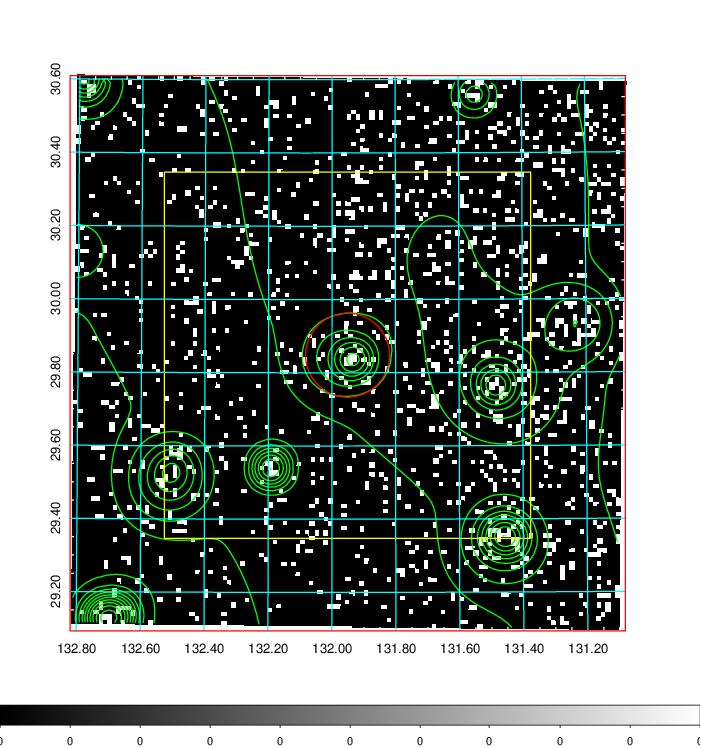  | 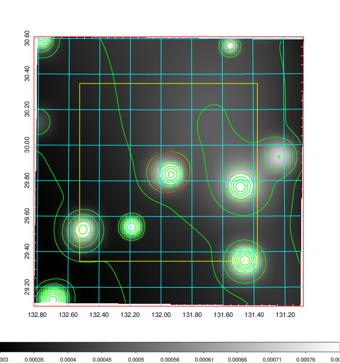   | 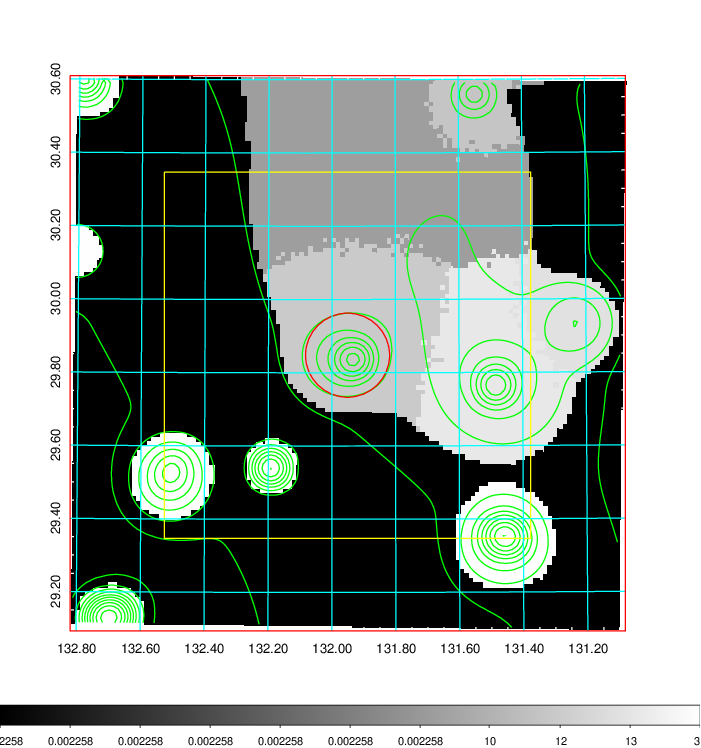  |

|[Exposure image](../image/301/301_mex.pdf)| [nH image](../image/301/301_nh.pdf)| [Planck image](../image/301/301_p.pdf)|
|-------------------|--------------------|-------------------|
|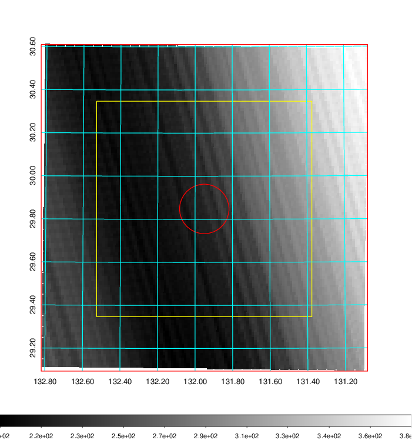   | 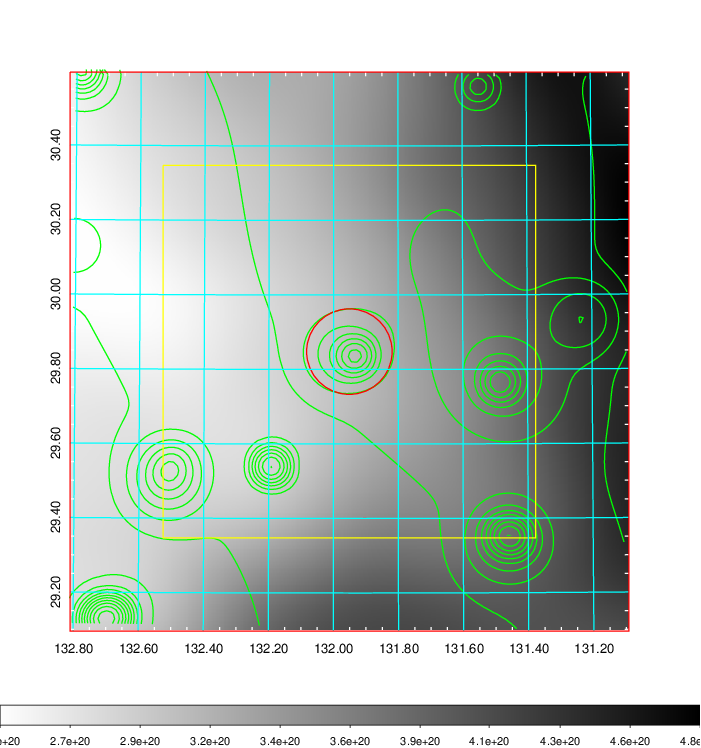    | 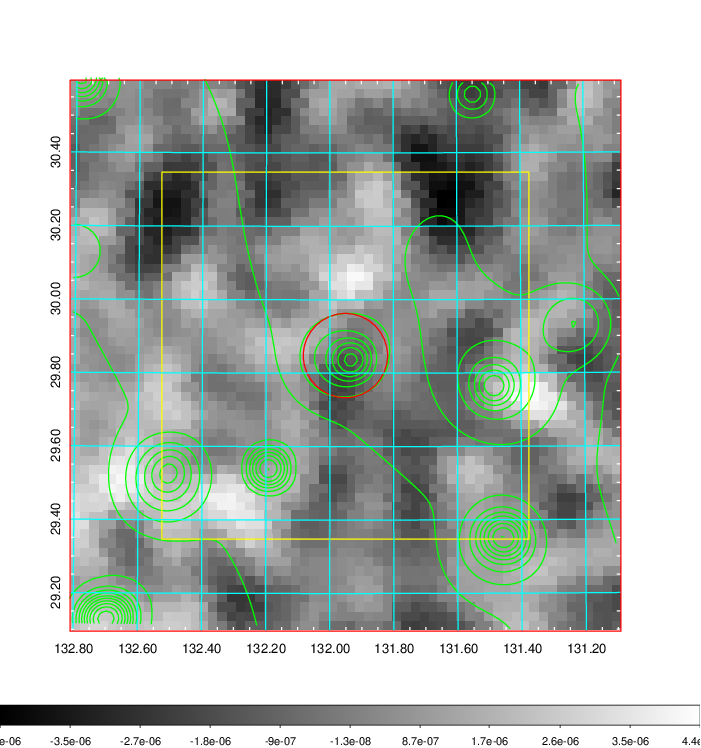 |

|[Redshift Histogram](../image/301/301_zg.pdf) | [DSS image(z1)](../image/301/301_dss_z1.pdf)      |  [DSS image(z2)](../image/301/301_dss_z2.pdf)    |
|-------------------|--------------------|-------------------|
|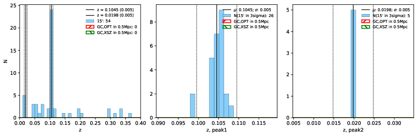 |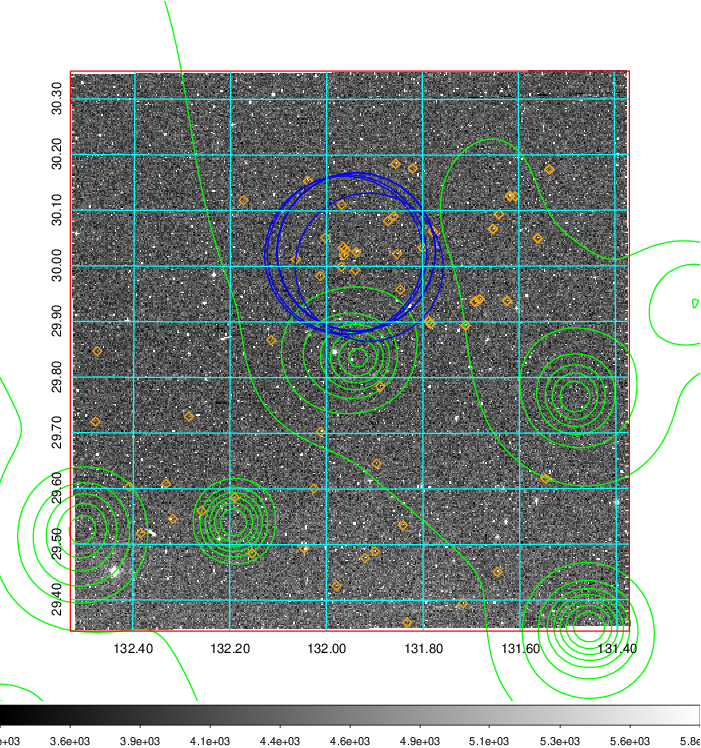  Blue circle for optical clusters;  Magenta circle for XSZ clusters;  all with r=1Mpc;  Only GC with Delta_z<0.01 are shown. | 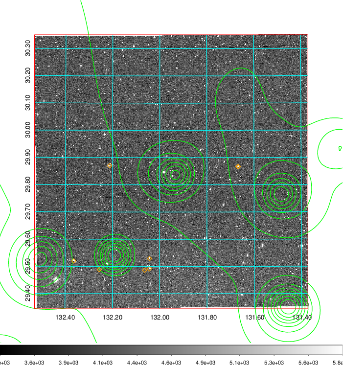 Blue circle for optical clusters;  Magenta circle for XSZ clusters;  all with r=1Mpc;  Only GC with Delta_z<0.01 are shown.  |

|[known Abell/XSZ clusters](../image/301/301_gc.pdf) | [2MASS image](../image/301/301_2mass.pdf)      |[SDSS image](../image/301/301_sdss.pdf)   |
|-------------------|-------------------|-------------------|
|  Magenta, blue and green circles  for optical, X-ray and SZ clusters  respectively, with redshift of clusters  labelled. The radius of circles  are 1Mpc.|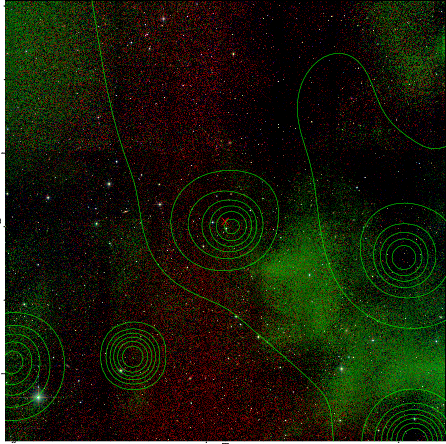  | 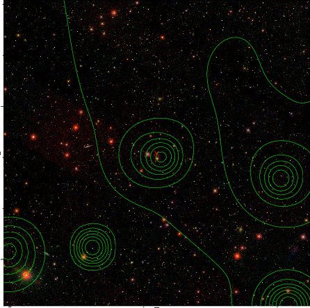  |

