

### 302

|Name|RAJ2000[deg]|DEJ2000[deg] |Ext[arcmin]| Ext,ml | z | z_src| C|GC(XSZ,Delta_z<0.01)| GC(OPT,Delta_z<0.01)|GC| R_sig[arcmin] | R500[arcmin] | R500[Mpc]| CRsig[c/s] | CR500[c/s] |L500[1E44 erg/s]|F500[1E-12 erg/s/cm^2]| M500[1E14 Msun]|Tx[keV]|Cnt_sig|Beta|Rc[arcmin]|Comment|Alias|
|---|---|---|---|---|---|------|---|--------|---------|----------|---|---|---|---|---|---|---|---|---|---|---|---|---|---|
|302| 132.541| 32.843| 13.58| 28.49| 0.0662(0.005)| z1, z_xsz| B| F20| N| C, F20, N| 44.065| 14.254| 1.086| 1.225(0.161)| 1.102(0.145)| 2.231(0.806)| 21.038(7.599)| 3.88(0.69)| 5.04(0.57)| 601.5| 0.502(-0.003+0.007)| 18.968(-0.446+0.561)| -| t516|

|[RASS image](../image/302/302_img.pdf)|[filtered image](../image/302/302_fil.pdf)|[Segment image](../image/302/302_seg.pdf)|
|-------------------|--------------------|-------------------|
| 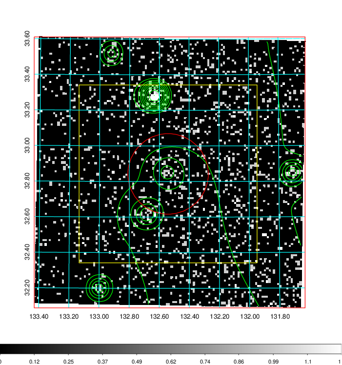  | 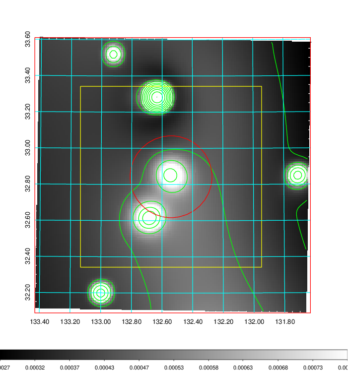   | 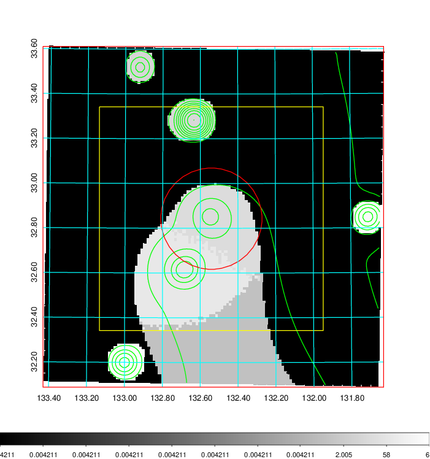  |

|[Exposure image](../image/302/302_mex.pdf)| [nH image](../image/302/302_nh.pdf)| [Planck image](../image/302/302_p.pdf)|
|-------------------|--------------------|-------------------|
|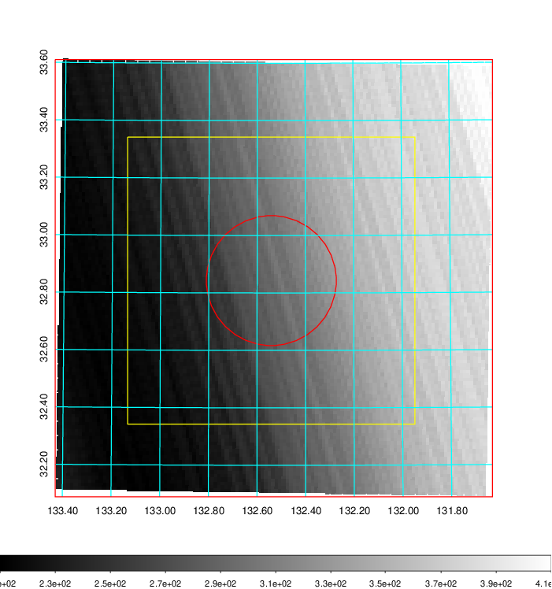   | 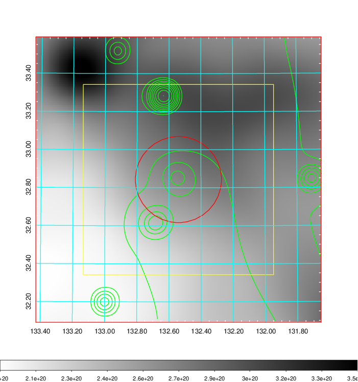    | 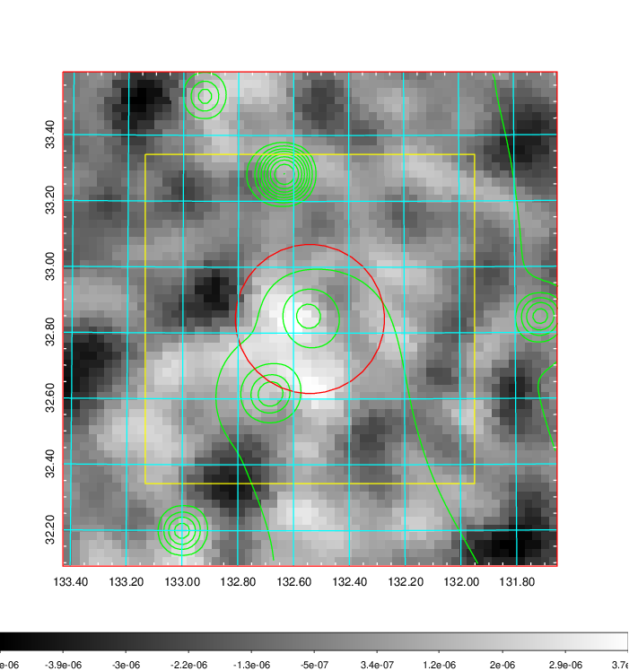 |

|[Redshift Histogram](../image/302/302_zg.pdf) | [DSS image(z1)](../image/302/302_dss_z1.pdf)      |  [DSS image(z2)](../image/302/302_dss_z2.pdf)    |
|-------------------|--------------------|-------------------|
|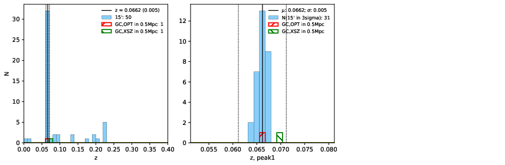 |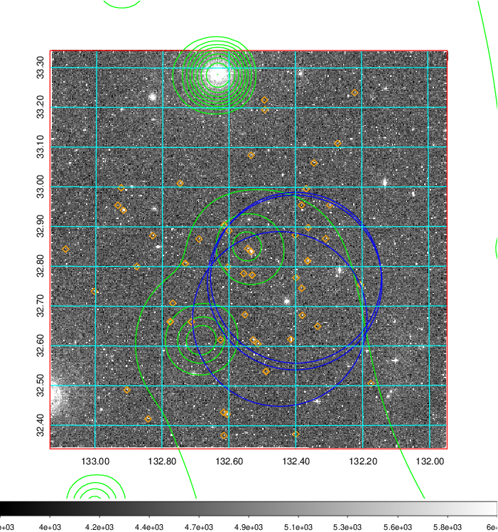  Blue circle for optical clusters;  Magenta circle for XSZ clusters;  all with r=1Mpc;  Only GC with Delta_z<0.01 are shown. | 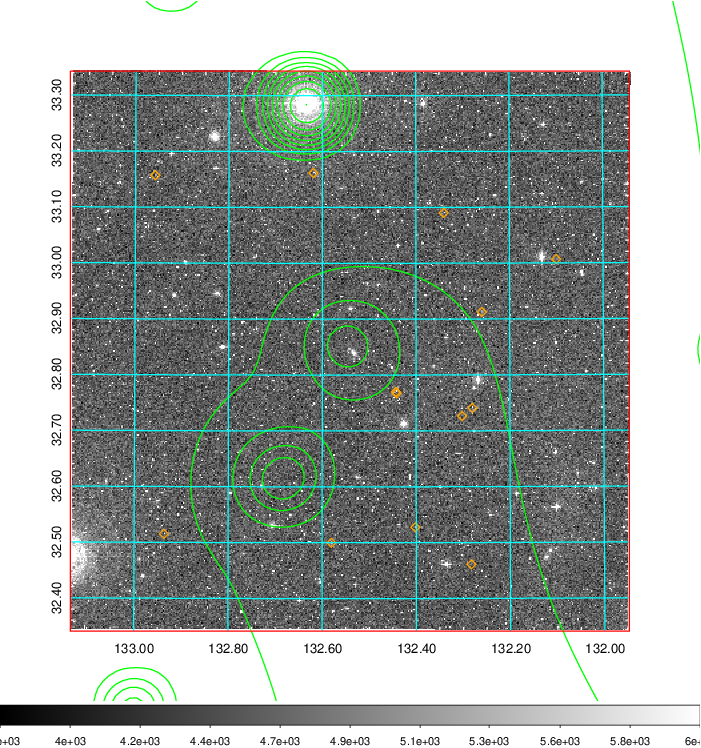 Blue circle for optical clusters;  Magenta circle for XSZ clusters;  all with r=1Mpc;  Only GC with Delta_z<0.01 are shown.  |

|[Previous-identified clusters](../image/302/302_gc.pdf) | [2MASS image](../image/302/302_2mass.pdf)      |[SDSS image](../image/302/302_sdss.pdf)   |
|-------------------|-------------------|-------------------|
|  Green, magenta, and blue circles  for optical, X-ray and SZ clusters  respectively, with redshift of clusters  labelled. The radius of circles  are 1Mpc.|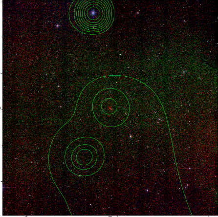  | 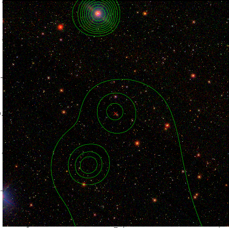  |

