

### 303

|Name|RAJ2000[deg]|DEJ2000[deg] |Ext[arcmin]| Ext,ml | z | z_src| C|GC(XSZ,Delta_z<0.01)| GC(OPT,Delta_z<0.01)|GC| R_sig[arcmin] | R500[arcmin] | R500[Mpc]| CRsig[c/s] | CR500[c/s] |L500[1E44 erg/s]|F500[1E-12 erg/s/cm^2]| M500[1E14 Msun]|Tx[keV]|Cnt_sig|Beta|Rc[arcmin]|Comment|Alias|
|---|---|---|---|---|---|------|---|--------|---------|----------|---|---|---|---|---|---|---|---|---|---|---|---|---|---|
|303| 132.548| 36.070| 2.11| 28.65| 0.3779(0.005)| z1, z_xsz| B| F20, MCXC, PSZ2, SPI, Tar| C, N, RM, W, Zw| C, F20, MCXC, N, PSZ2, SPI, Tar, W| 9.288| 4.208| 1.310| 0.148(0.040)| 0.135(0.037)| 13.474(1.829)| 2.729(0.370)| 9.50(0.57)| 9.76(0.38)| 72.0| 0.747(-0.145+0.160)| 3.259(-1.111+1.038)| -| k238|

|[RASS image](../image/303/303_img.pdf)|[filtered image](../image/303/303_fil.pdf)|[Segment image](../image/303/303_seg.pdf)|
|-------------------|--------------------|-------------------|
| 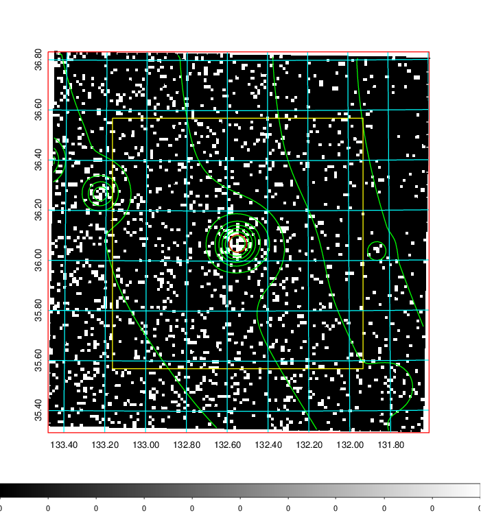  | 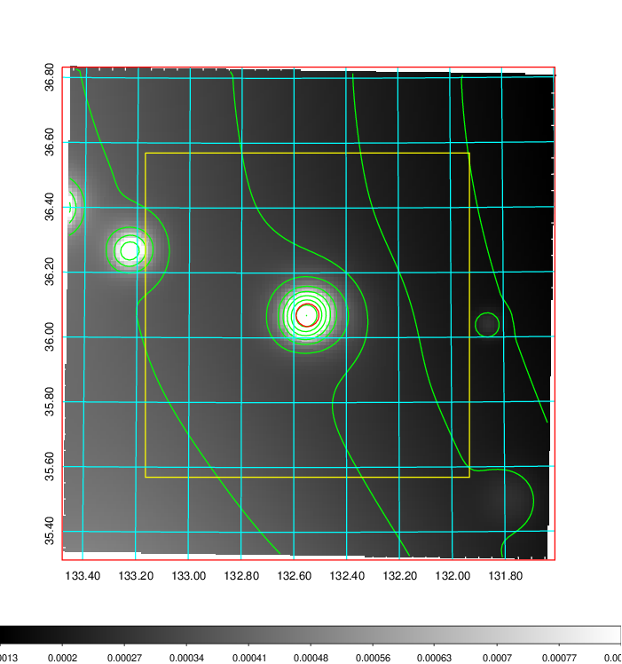   | 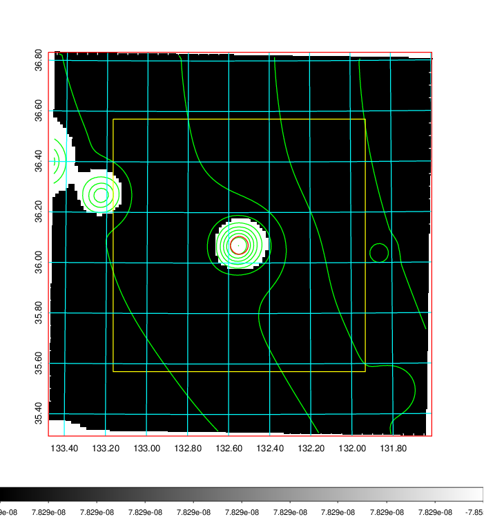  |

|[Exposure image](../image/303/303_mex.pdf)| [nH image](../image/303/303_nh.pdf)| [Planck image](../image/303/303_p.pdf)|
|-------------------|--------------------|-------------------|
|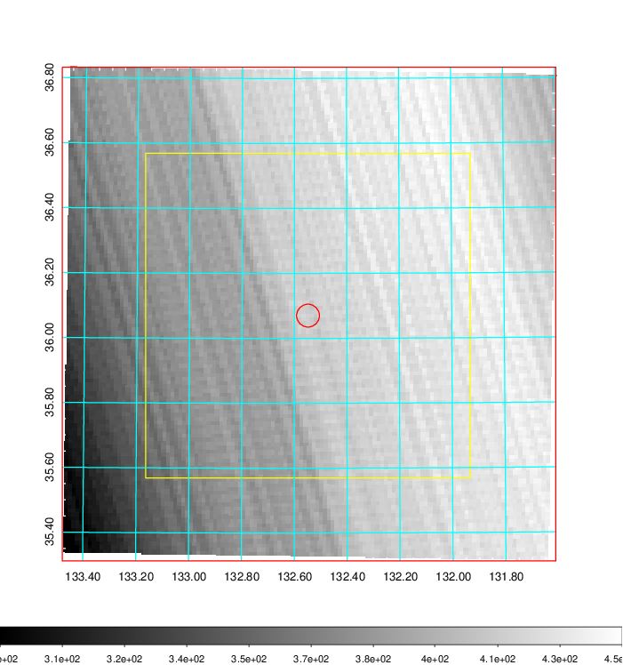   | 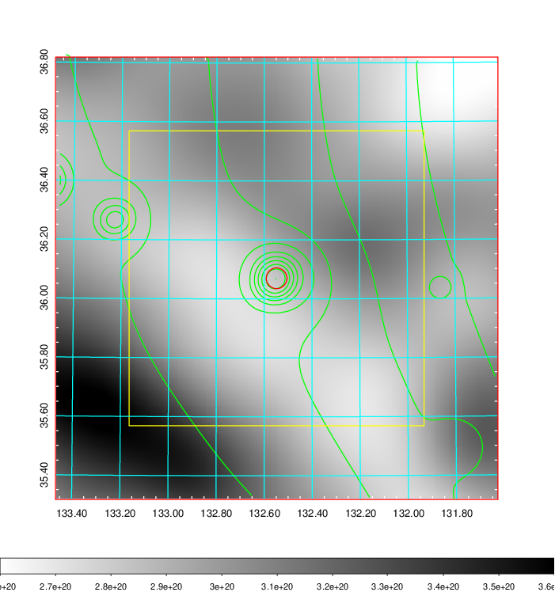    | 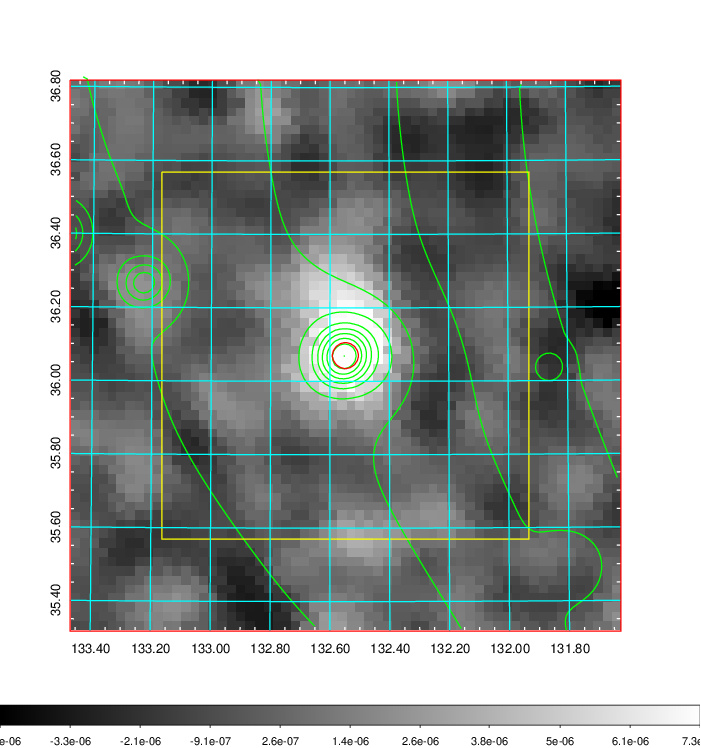 |

|[Redshift Histogram](../image/303/303_zg.pdf) | [DSS image(z1)](../image/303/303_dss_z1.pdf)      |  [DSS image(z2)](../image/303/303_dss_z2.pdf)    |
|-------------------|--------------------|-------------------|
|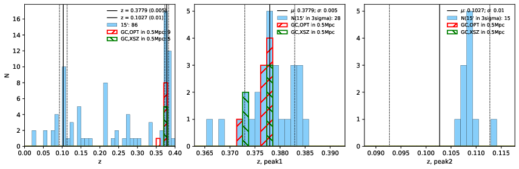 |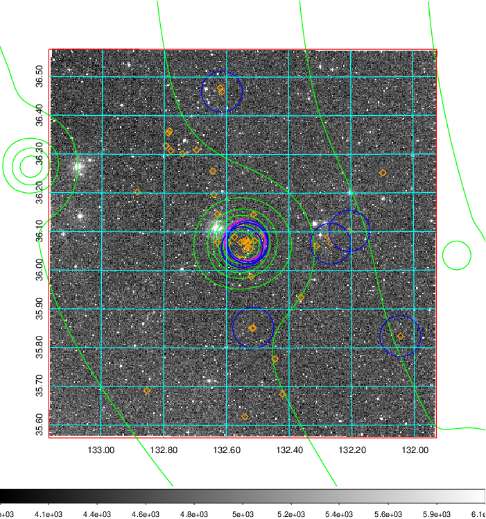  Blue circle for optical clusters;  Magenta circle for XSZ clusters;  all with r=1Mpc;  Only GC with Delta_z<0.01 are shown. | 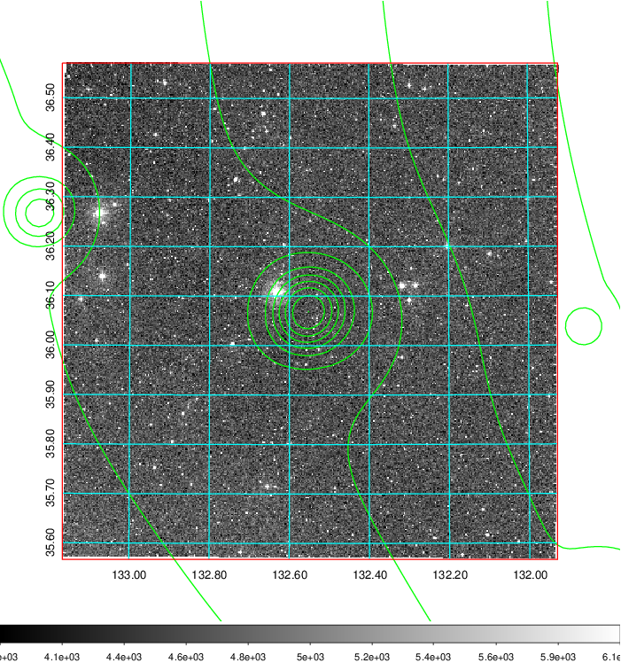 Blue circle for optical clusters;  Magenta circle for XSZ clusters;  all with r=1Mpc;  Only GC with Delta_z<0.01 are shown.  |

|[Previous-identified clusters](../image/303/303_gc.pdf) | [2MASS image](../image/303/303_2mass.pdf)      |[SDSS image](../image/303/303_sdss.pdf)   |
|-------------------|-------------------|-------------------|
|  Green, magenta, and blue circles  for optical, X-ray and SZ clusters  respectively, with redshift of clusters  labelled. The radius of circles  are 1Mpc.|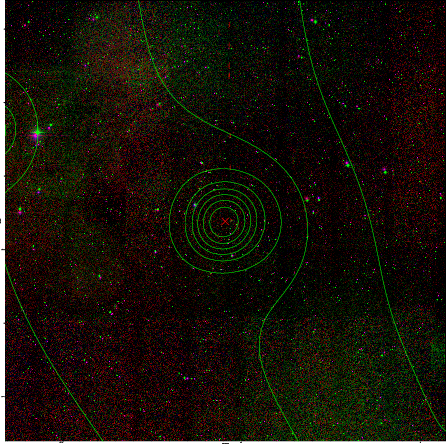  | 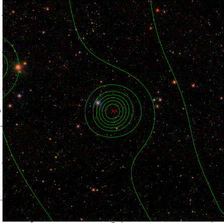  |

