

### 304

|Name|RAJ2000[deg]|DEJ2000[deg] |Ext[arcmin]| Ext,ml | z | z_src| C|GC(XSZ,Delta_z<0.01)| GC(OPT,Delta_z<0.01)|GC| R_sig[arcmin] | R500[arcmin] | R500[Mpc]| CRsig[c/s] | CR500[c/s] |L500[1E44 erg/s]|F500[1E-12 erg/s/cm^2]| M500[1E14 Msun]|Tx[keV]|Cnt_sig|Beta|Rc[arcmin]|Comment|Alias|
|---|---|---|---|---|---|------|---|--------|---------|----------|---|---|---|---|---|---|---|---|---|---|---|---|---|---|
|304| 133.682| 63.778| 1.90| 34.19| 0.1196(0.005)| z1, z_xsz| B| F20| -| C, F20, W| 7.825| 5.980| 0.774| 0.070(0.026)| 0.068(0.025)| 0.444(0.104)| 1.193(0.279)| 1.48(0.17)| 2.83(0.21)| 26.2| 0.880(-0.139+0.087)| 6.850(-1.256+1.098)| -| t054|

|[RASS image](../image/304/304_img.pdf)|[filtered image](../image/304/304_fil.pdf)|[Segment image](../image/304/304_seg.pdf)|
|-------------------|--------------------|-------------------|
| 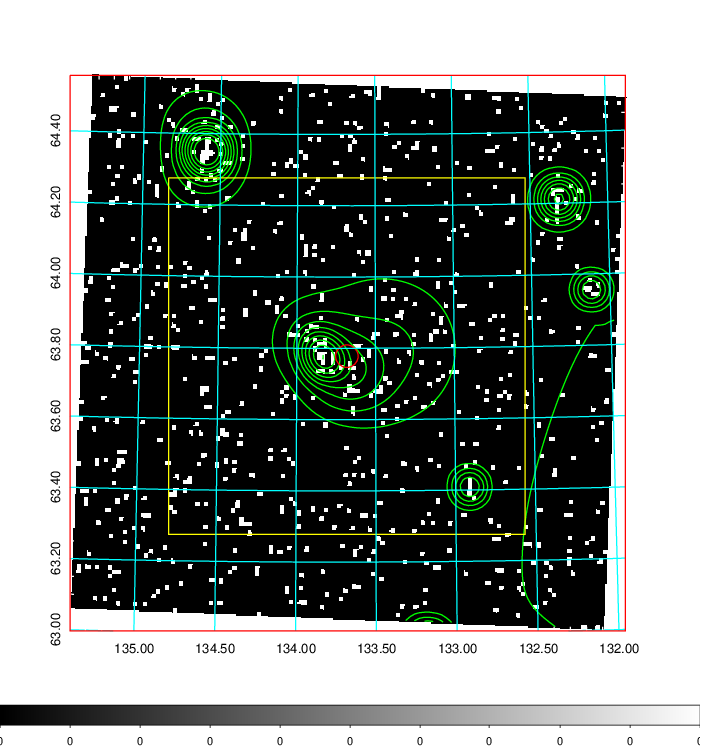  | 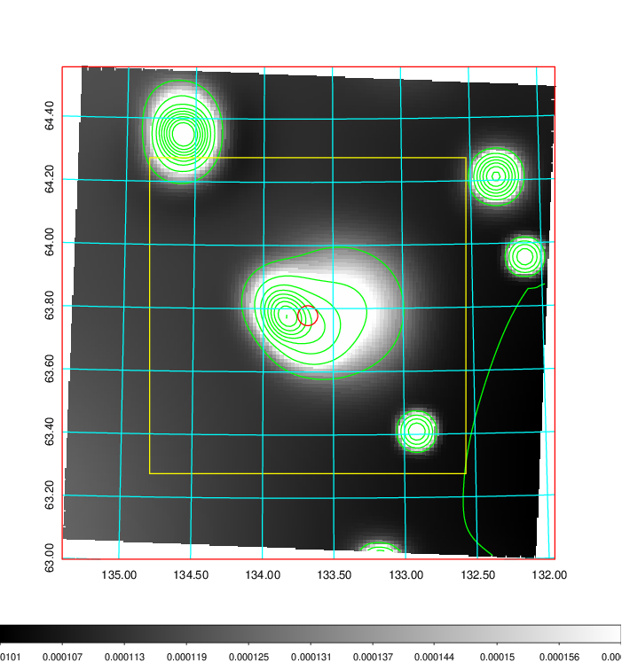   | 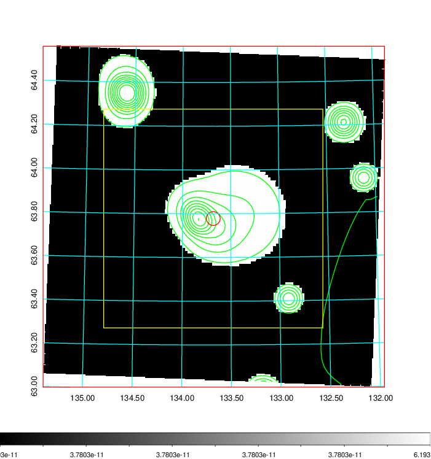  |

|[Exposure image](../image/304/304_mex.pdf)| [nH image](../image/304/304_nh.pdf)| [Planck image](../image/304/304_p.pdf)|
|-------------------|--------------------|-------------------|
|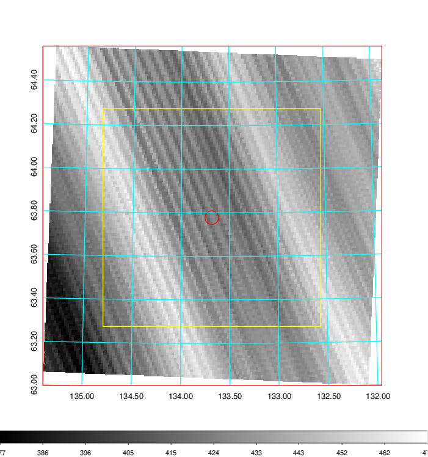   | 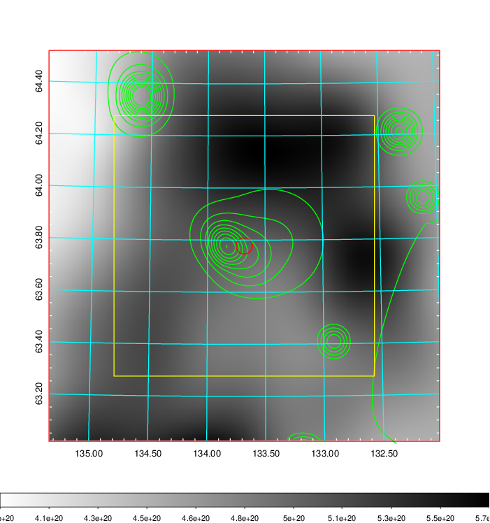    | 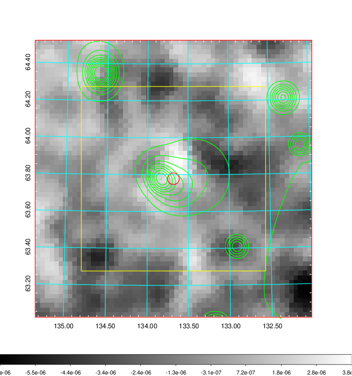 |

|[Redshift Histogram](../image/304/304_zg.pdf) | [DSS image(z1)](../image/304/304_dss_z1.pdf)      |  [DSS image(z2)](../image/304/304_dss_z2.pdf)    |
|-------------------|--------------------|-------------------|
|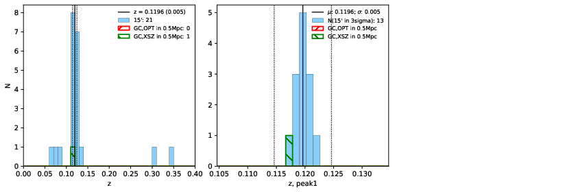 |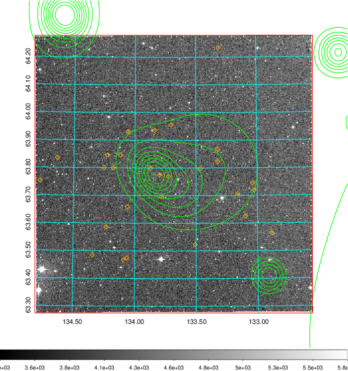  Blue circle for optical clusters;  Magenta circle for XSZ clusters;  all with r=1Mpc;  Only GC with Delta_z<0.01 are shown. | 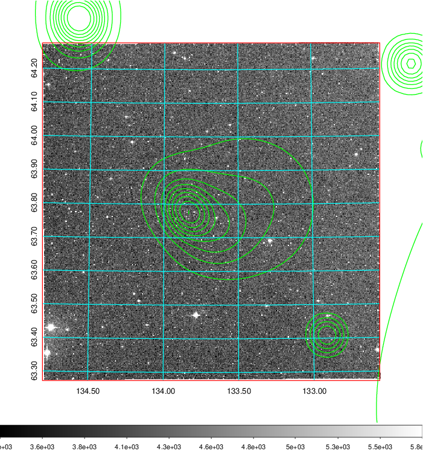 Blue circle for optical clusters;  Magenta circle for XSZ clusters;  all with r=1Mpc;  Only GC with Delta_z<0.01 are shown.  |

|[known Abell/XSZ clusters](../image/304/304_gc.pdf) | [2MASS image](../image/304/304_2mass.pdf)      |[SDSS image](../image/304/304_sdss.pdf)   |
|-------------------|-------------------|-------------------|
|  Magenta, blue and green circles  for optical, X-ray and SZ clusters  respectively, with redshift of clusters  labelled. The radius of circles  are 1Mpc.|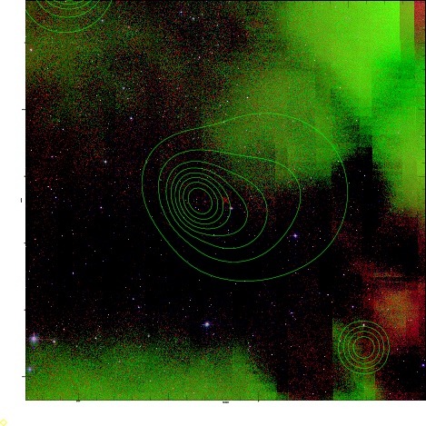  | 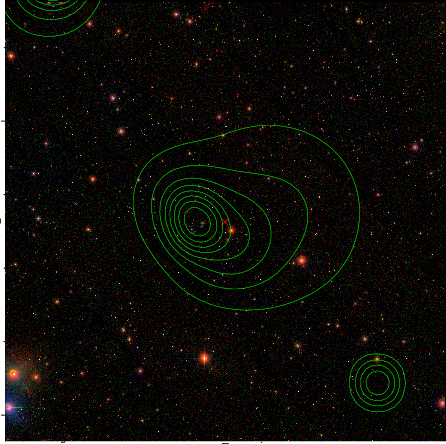  |

