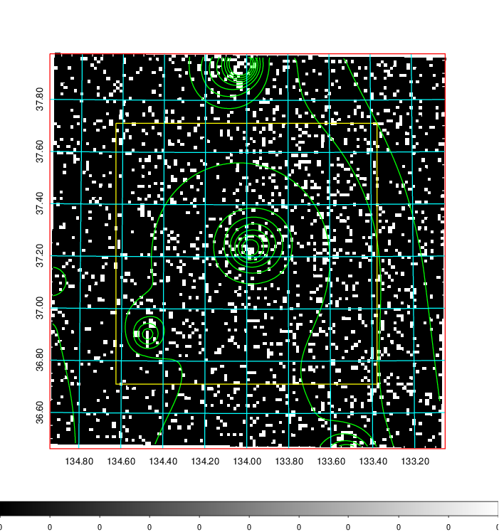
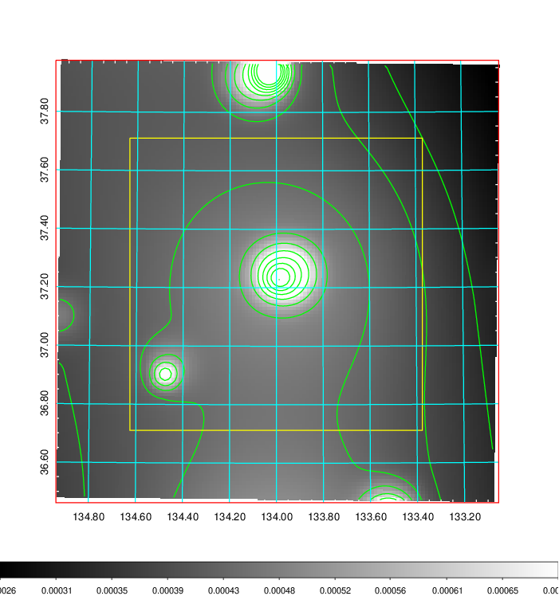
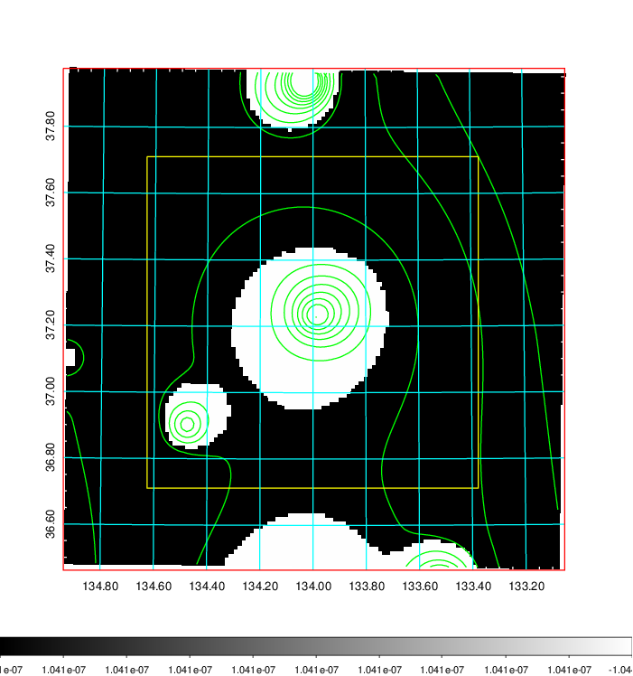
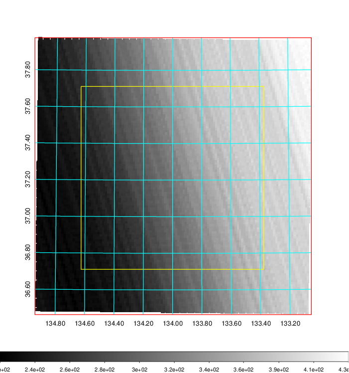
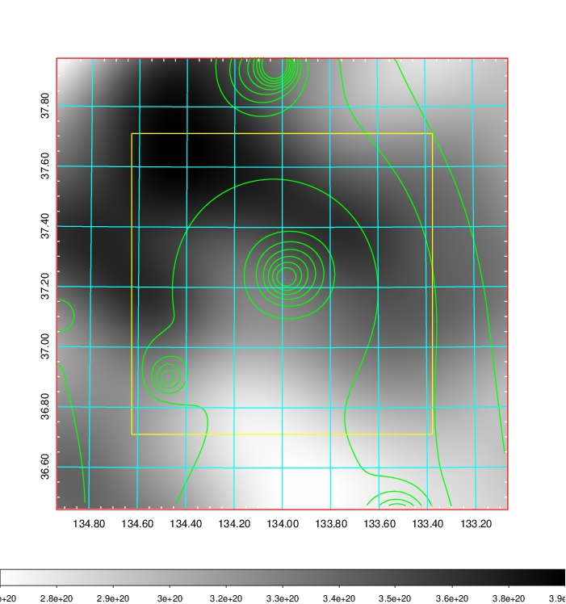
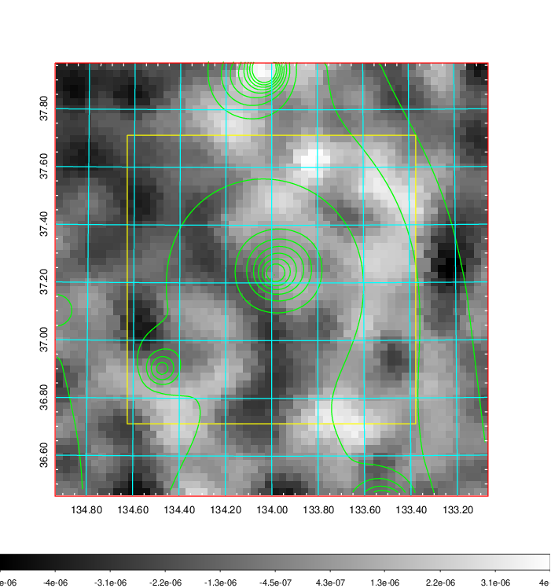
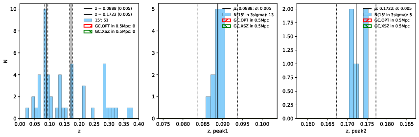
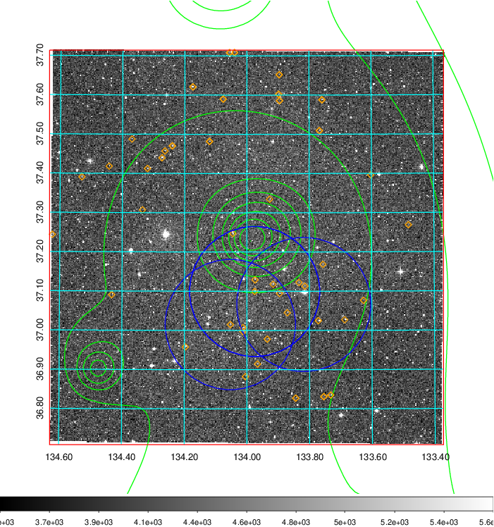
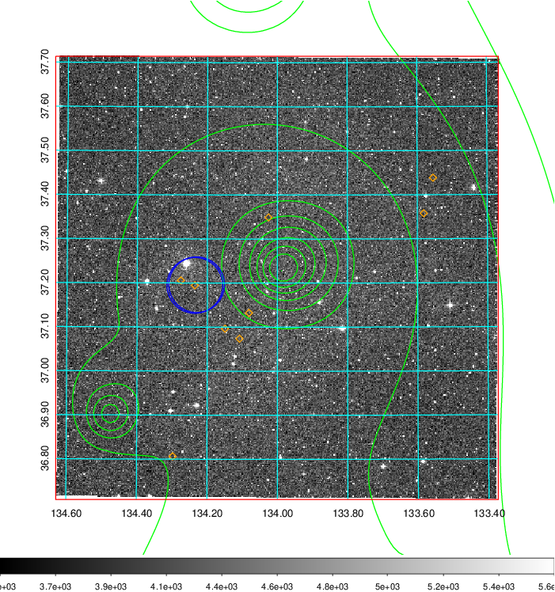
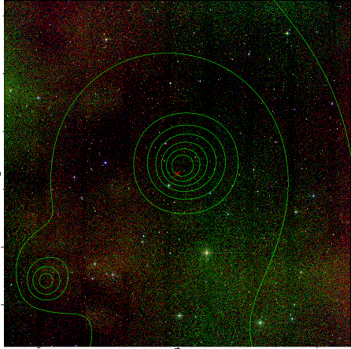

### 305

|Name|RAJ2000[deg]|DEJ2000[deg] |Ext[arcmin]| Ext,ml | z | z_src| C|GC(XSZ,Delta_z<0.01)| GC(OPT,Delta_z<0.01)|GC| R_sig[arcmin] | R500[arcmin] | R500[Mpc]| CRsig[c/s] | CR500[c/s] |L500[1E44 erg/s]|F500[1E-12 erg/s/cm^2]| M500[1E14 Msun]|Tx[keV]|Cnt_sig|Beta|Rc[arcmin]|Comment|Alias|
|---|---|---|---|---|---|------|---|--------|---------|----------|---|---|---|---|---|---|---|---|---|---|---|---|---|---|
|305| 134.001| 37.212| 94.07| 117.73| 0.0888(0.005)| z1,| G| -| -| C, N, W| 28.650| 9.955| 0.991| 0.445(0.108)| 0.402(0.098)| 1.480(0.511)| 7.516(2.595)| 3.01(0.52)| 4.35(0.47)| 318.6| 0.520(-0.015+0.037)| 10.327(-1.178+1.248)| -| t726|

|[RASS image](../image/305/305_img.pdf)|[filtered image](../image/305/305_fil.pdf)|[Segment image](../image/305/305_seg.pdf)|
|-------------------|--------------------|-------------------|
|   |    |   |

|[Exposure image](../image/305/305_mex.pdf)| [nH image](../image/305/305_nh.pdf)| [Planck image](../image/305/305_p.pdf)|
|-------------------|--------------------|-------------------|
|   |     |  |

|[Redshift Histogram](../image/305/305_zg.pdf) | [DSS image(z1)](../image/305/305_dss_z1.pdf)      |  [DSS image(z2)](../image/305/305_dss_z2.pdf)    |
|-------------------|--------------------|-------------------|
| |  Blue circle for optical clusters;  Magenta circle for XSZ clusters;  all with r=1Mpc;  Only GC with Delta_z<0.01 are shown. |  Blue circle for optical clusters;  Magenta circle for XSZ clusters;  all with r=1Mpc;  Only GC with Delta_z<0.01 are shown.  |

|[known Abell/XSZ clusters](../image/305/305_gc.pdf) | [2MASS image](../image/305/305_2mass.pdf)      |
|-------------------|-------------------|
|  Magenta, blue and green circles  for optical, X-ray and SZ clusters  respectively, with redshift of clusters  labelled. The radius of circles  are 1Mpc.|  |

|[PS1 image](../image/305/305_ps1.pdf)            |
|-------------------|
|   |
