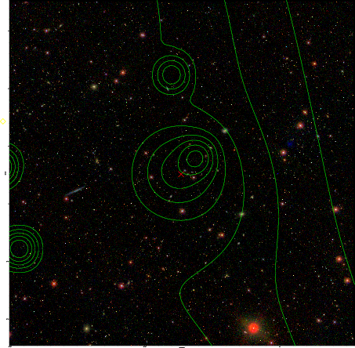

### 307

|Name|RAJ2000[deg]|DEJ2000[deg] |Ext[arcmin]| Ext,ml | z | z_src| C|GC(XSZ,Delta_z<0.01)| GC(OPT,Delta_z<0.01)|GC| R_sig[arcmin] | R500[arcmin] | R500[Mpc]| CRsig[c/s] | CR500[c/s] |L500[1E44 erg/s]|F500[1E-12 erg/s/cm^2]| M500[1E14 Msun]|Tx[keV]|Cnt_sig|Beta|Rc[arcmin]|Comment|Alias|
|---|---|---|---|---|---|------|---|--------|---------|----------|---|---|---|---|---|---|---|---|---|---|---|---|---|---|
|307| 134.363| 39.257| 11.84| 58.08| 0.0941(0.005)| z1,| G| -| -| N, W| 32.600| 8.253| 0.865| 0.218(0.096)| 0.194(0.086)| 0.825(0.391)| 3.707(1.754)| 2.02(0.48)| 3.40(0.51)| 343.6| 0.754(-0.138+0.154)| 7.564(-2.022+1.960)| -| t484|

|[RASS image](../image/307/307_img.pdf)|[filtered image](../image/307/307_fil.pdf)|[Segment image](../image/307/307_seg.pdf)|
|-------------------|--------------------|-------------------|
|   |    |   |

|[Exposure image](../image/307/307_mex.pdf)| [nH image](../image/307/307_nh.pdf)| [Planck image](../image/307/307_p.pdf)|
|-------------------|--------------------|-------------------|
|   |     |  |

|[Redshift Histogram](../image/307/307_zg.pdf) | [DSS image(z1)](../image/307/307_dss_z1.pdf)      |  [DSS image(z2)](../image/307/307_dss_z2.pdf)    |
|-------------------|--------------------|-------------------|
| |  Blue circle for optical clusters;  Magenta circle for XSZ clusters;  all with r=1Mpc;  Only GC with Delta_z<0.01 are shown. |  Blue circle for optical clusters;  Magenta circle for XSZ clusters;  all with r=1Mpc;  Only GC with Delta_z<0.01 are shown.  |

|[known Abell/XSZ clusters](../image/307/307_gc.pdf) | [2MASS image](../image/307/307_2mass.pdf)      |[SDSS image](../image/307/307_sdss.pdf)   |
|-------------------|-------------------|-------------------|
|  Magenta, blue and green circles  for optical, X-ray and SZ clusters  respectively, with redshift of clusters  labelled. The radius of circles  are 1Mpc.|  |   |

