

### 308

|Name|RAJ2000[deg]|DEJ2000[deg] |Ext[arcmin]| Ext,ml | z | z_src| C|GC(XSZ,Delta_z<0.01)| GC(OPT,Delta_z<0.01)|GC| R_sig[arcmin] | R500[arcmin] | R500[Mpc]| CRsig[c/s] | CR500[c/s] |L500[1E44 erg/s]|F500[1E-12 erg/s/cm^2]| M500[1E14 Msun]|Tx[keV]|Cnt_sig|Beta|Rc[arcmin]|Comment|Alias|
|---|---|---|---|---|---|------|---|--------|---------|----------|---|---|---|---|---|---|---|---|---|---|---|---|---|---|
|308| 134.588| 38.510| 29.72| 184.80| 0.0929(0.005)| z1, z_opt| S| -| A, N, RM, W| A, C, F20, N, SPI, W| 23.712| 8.933| 0.926| 0.298(0.104)| 0.270(0.095)| 1.120(0.431)| 5.169(1.988)| 2.47(0.47)| 3.85(0.47)| 226.7| 0.690(-0.128+0.186)| 10.708(-3.095+3.653)| -| t638|

|[RASS image](../image/308/308_img.pdf)|[filtered image](../image/308/308_fil.pdf)|[Segment image](../image/308/308_seg.pdf)|
|-------------------|--------------------|-------------------|
| 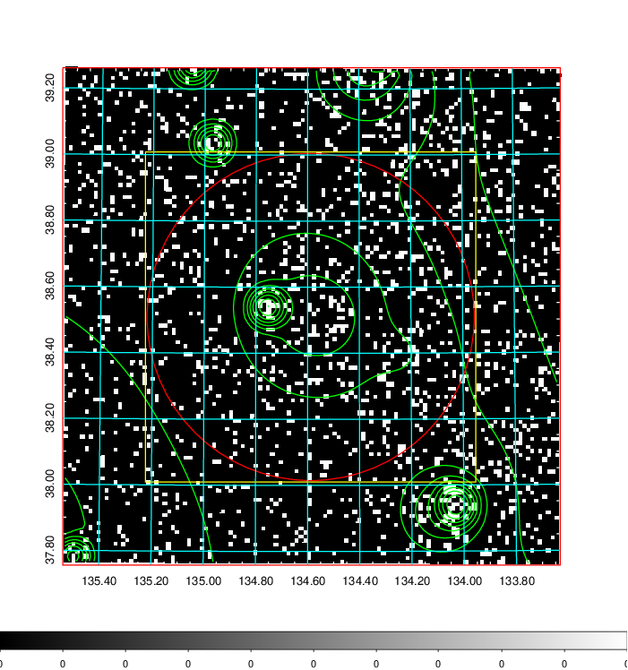  | 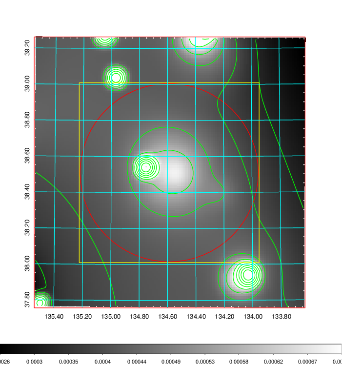   | 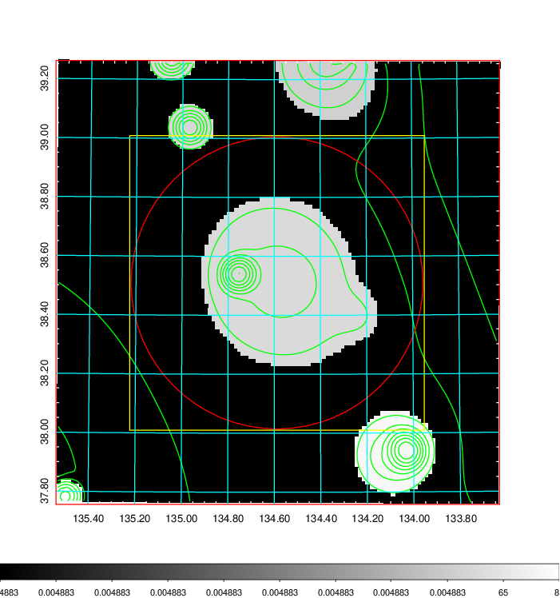  |

|[Exposure image](../image/308/308_mex.pdf)| [nH image](../image/308/308_nh.pdf)| [Planck image](../image/308/308_p.pdf)|
|-------------------|--------------------|-------------------|
|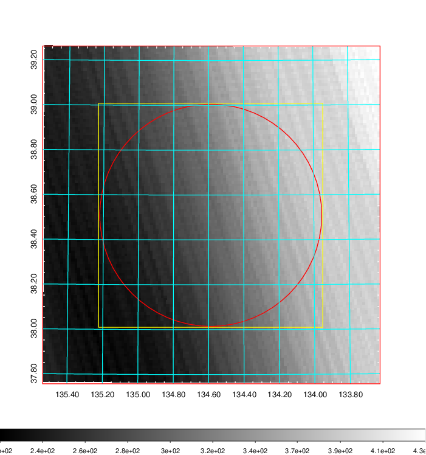   | 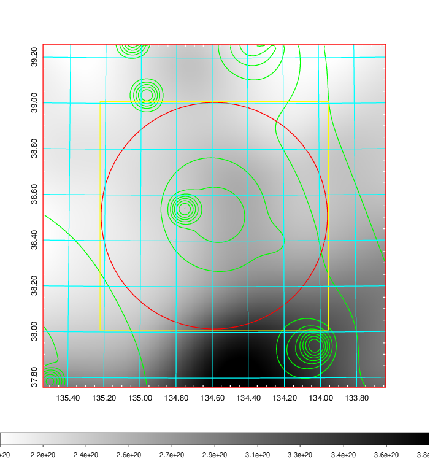    | 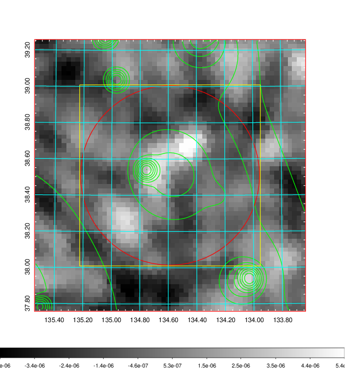 |

|[Redshift Histogram](../image/308/308_zg.pdf) | [DSS image(z1)](../image/308/308_dss_z1.pdf)      |  [DSS image(z2)](../image/308/308_dss_z2.pdf)    |
|-------------------|--------------------|-------------------|
|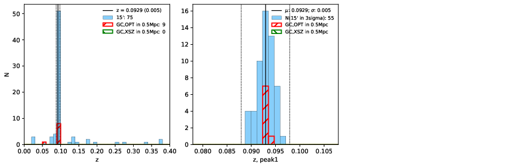 |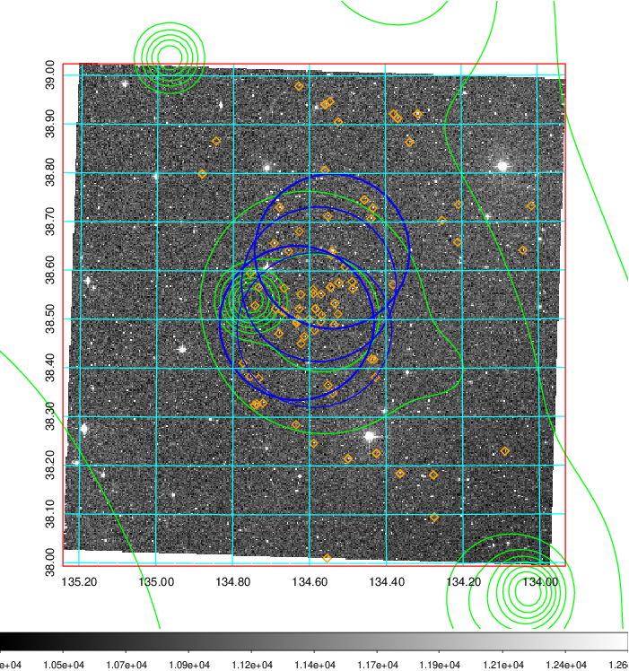  Blue circle for optical clusters;  Magenta circle for XSZ clusters;  all with r=1Mpc;  Only GC with Delta_z<0.01 are shown. | 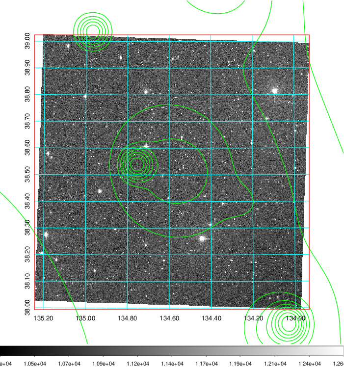 Blue circle for optical clusters;  Magenta circle for XSZ clusters;  all with r=1Mpc;  Only GC with Delta_z<0.01 are shown.  |

|[Previous-identified clusters](../image/308/308_gc.pdf) | [2MASS image](../image/308/308_2mass.pdf)      |[SDSS image](../image/308/308_sdss.pdf)   |
|-------------------|-------------------|-------------------|
|  Green, magenta, and blue circles  for optical, X-ray and SZ clusters  respectively, with redshift of clusters  labelled. The radius of circles  are 1Mpc.|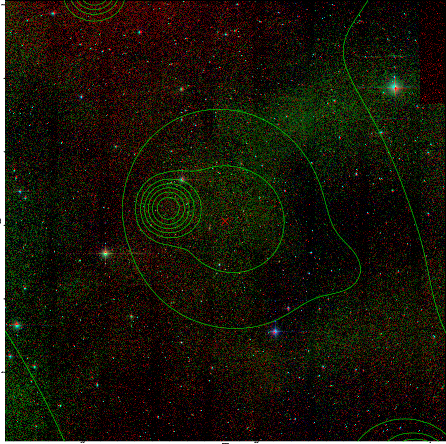  | 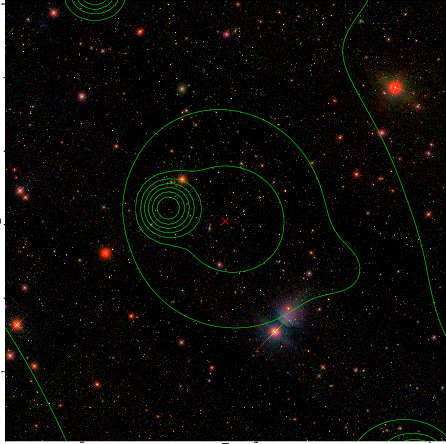  |

