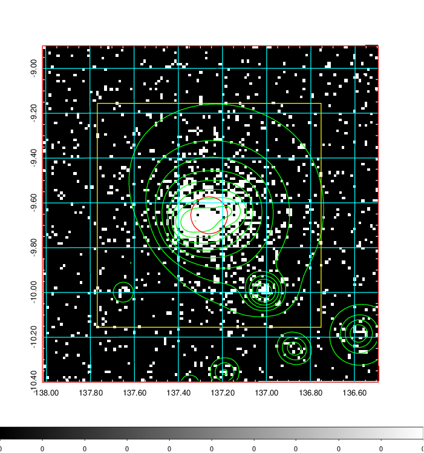
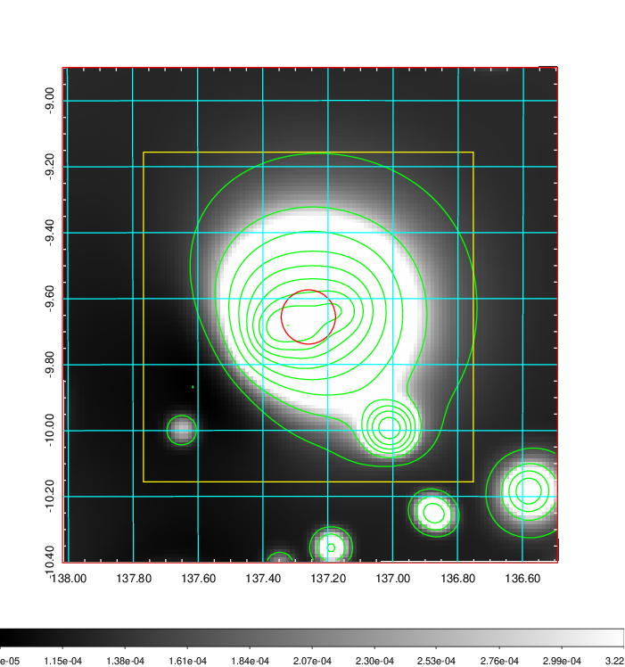
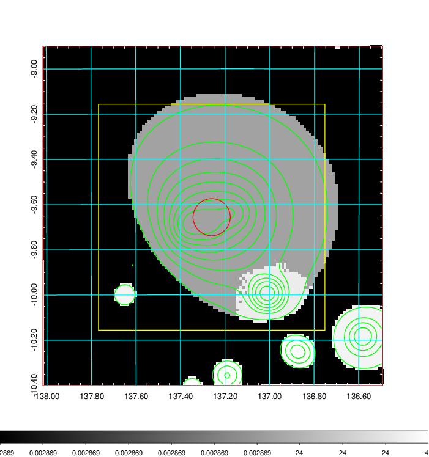
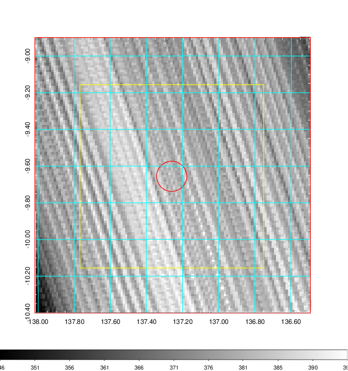
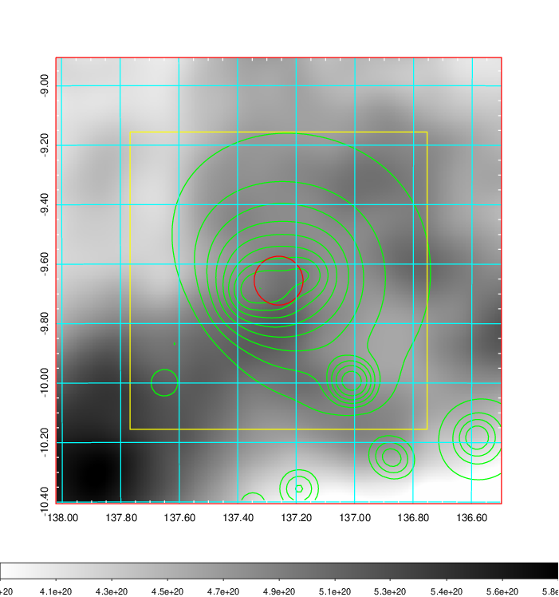
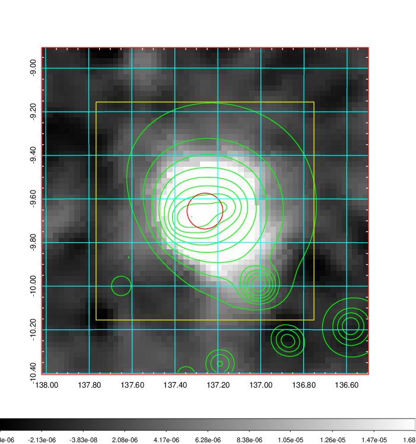
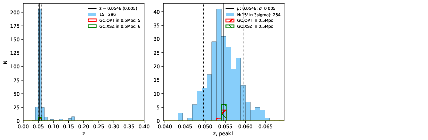
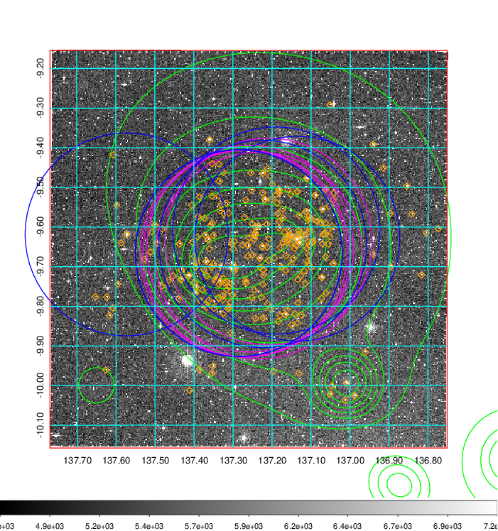
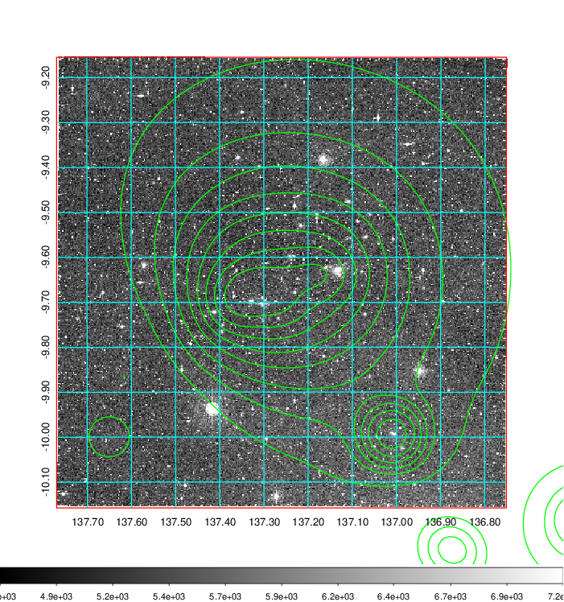
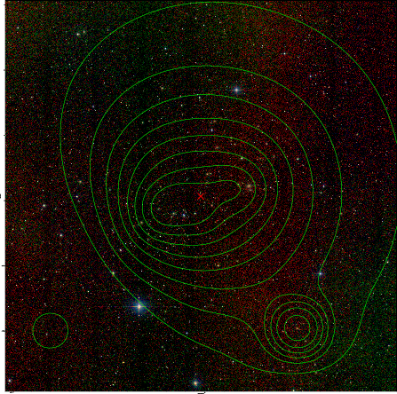

### 309

|Name|RAJ2000[deg]|DEJ2000[deg] |Ext[arcmin]| Ext,ml | z | z_src| C|GC(XSZ,Delta_z<0.01)| GC(OPT,Delta_z<0.01)|GC| R_sig[arcmin] | R500[arcmin] | R500[Mpc]| CRsig[c/s] | CR500[c/s] |L500[1E44 erg/s]|F500[1E-12 erg/s/cm^2]| M500[1E14 Msun]|Tx[keV]|Cnt_sig|Beta|Rc[arcmin]|Comment|Alias|
|---|---|---|---|---|---|------|---|--------|---------|----------|---|---|---|---|---|---|---|---|---|---|---|---|---|---|
|309| 137.260| -9.656| 4.93| 2992.63| 0.0546(0.005)| z1, z_xsz| B| L03, MCXC, PSZ2, Tar, XB| A, N, W| A, L03, MCXC, N, PSZ2, Tar, W, XB| 27.662| 19.407| 1.236| 2.950(0.105)| 2.813(0.100)| 3.675(0.048)| 51.787(0.678)| 5.66(0.04)| 6.35(0.03)| 1253.2| 0.946(-0.041+0.035)| 9.263(-0.476+0.385)| -| k520|

|[RASS image](../image/309/309_img.pdf)|[filtered image](../image/309/309_fil.pdf)|[Segment image](../image/309/309_seg.pdf)|
|-------------------|--------------------|-------------------|
|   |    |   |

|[Exposure image](../image/309/309_mex.pdf)| [nH image](../image/309/309_nh.pdf)| [Planck image](../image/309/309_p.pdf)|
|-------------------|--------------------|-------------------|
|   |     |  |

|[Redshift Histogram](../image/309/309_zg.pdf) | [DSS image(z1)](../image/309/309_dss_z1.pdf)      |  [DSS image(z2)](../image/309/309_dss_z2.pdf)    |
|-------------------|--------------------|-------------------|
| |  Blue circle for optical clusters;  Magenta circle for XSZ clusters;  all with r=1Mpc;  Only GC with Delta_z<0.01 are shown. |  Blue circle for optical clusters;  Magenta circle for XSZ clusters;  all with r=1Mpc;  Only GC with Delta_z<0.01 are shown.  |

|[known Abell/XSZ clusters](../image/309/309_gc.pdf) | [2MASS image](../image/309/309_2mass.pdf)      |
|-------------------|-------------------|
|  Magenta, blue and green circles  for optical, X-ray and SZ clusters  respectively, with redshift of clusters  labelled. The radius of circles  are 1Mpc.|  |

|[PS1 image](../image/309/309_ps1.pdf)            |
|-------------------|
|   |
