

### 310

|Name|RAJ2000[deg]|DEJ2000[deg] |Ext[arcmin]| Ext,ml | z | z_src| C|GC(XSZ,Delta_z<0.01)| GC(OPT,Delta_z<0.01)|GC| R_sig[arcmin] | R500[arcmin] | R500[Mpc]| CRsig[c/s] | CR500[c/s] |L500[1E44 erg/s]|F500[1E-12 erg/s/cm^2]| M500[1E14 Msun]|Tx[keV]|Cnt_sig|Beta|Rc[arcmin]|Comment|Alias|
|---|---|---|---|---|---|------|---|--------|---------|----------|---|---|---|---|---|---|---|---|---|---|---|---|---|---|
|310| 137.287| 10.999| 1.66| 64.03| 0.1649(0.005)| z1, z_xsz| B| F20, XB| N, RM, W| A, C, F20, MCXC, N, PSZ2, Tar, W, XB| 8.312| 6.991| 1.186| 0.309(0.040)| 0.301(0.039)| 4.368(0.224)| 5.831(0.299)| 5.57(0.14)| 6.52(0.10)| 107.6| 0.896(-0.105+0.073)| 3.404(-0.584+0.423)| -| k150|

|[RASS image](../image/310/310_img.pdf)|[filtered image](../image/310/310_fil.pdf)|[Segment image](../image/310/310_seg.pdf)|
|-------------------|--------------------|-------------------|
| 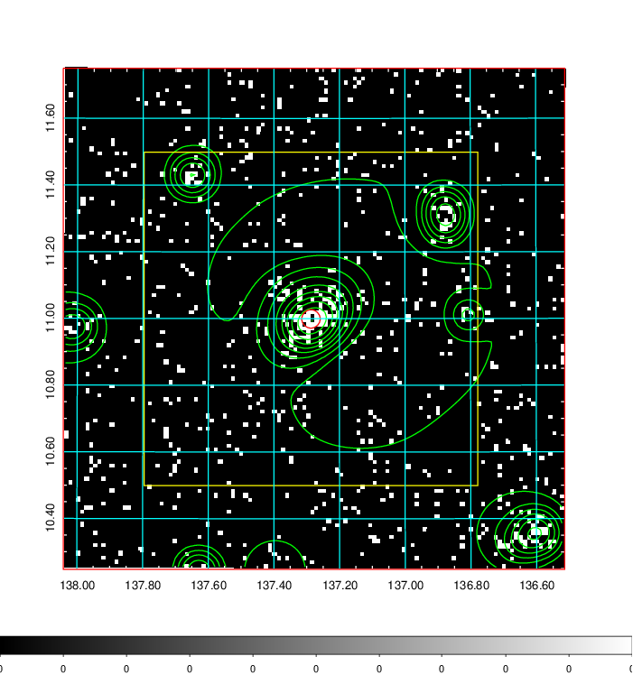  | 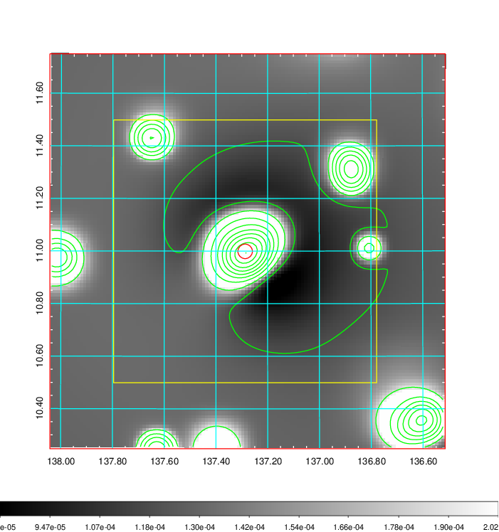   | 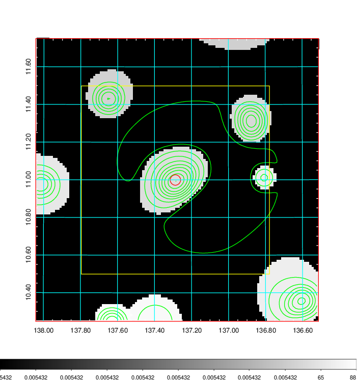  |

|[Exposure image](../image/310/310_mex.pdf)| [nH image](../image/310/310_nh.pdf)| [Planck image](../image/310/310_p.pdf)|
|-------------------|--------------------|-------------------|
|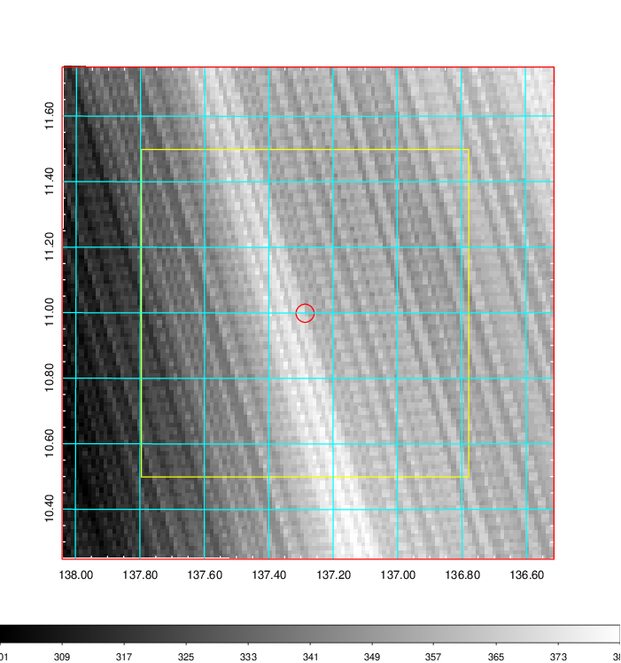   | 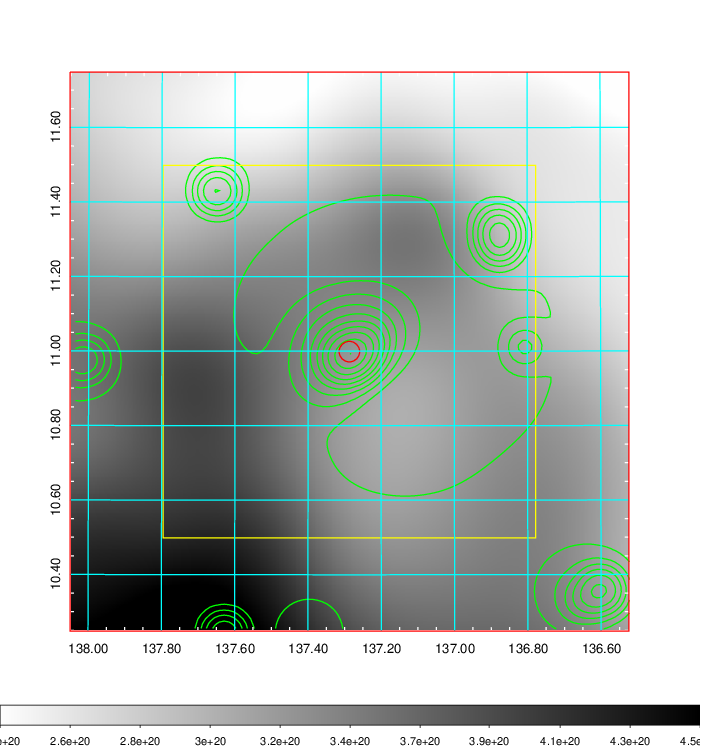    | 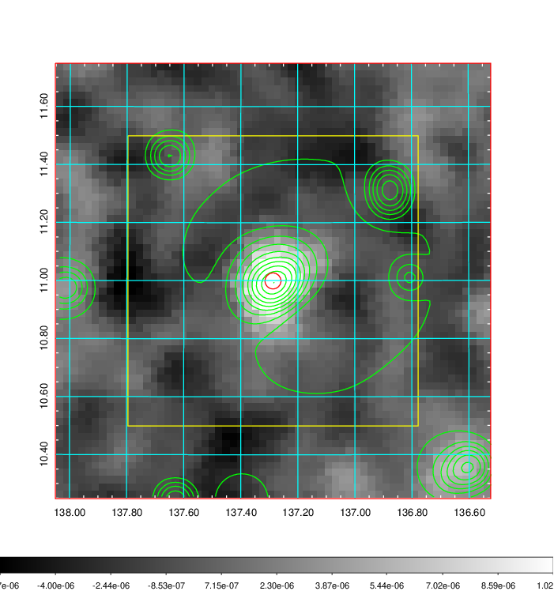 |

|[Redshift Histogram](../image/310/310_zg.pdf) | [DSS image(z1)](../image/310/310_dss_z1.pdf)      |  [DSS image(z2)](../image/310/310_dss_z2.pdf)    |
|-------------------|--------------------|-------------------|
|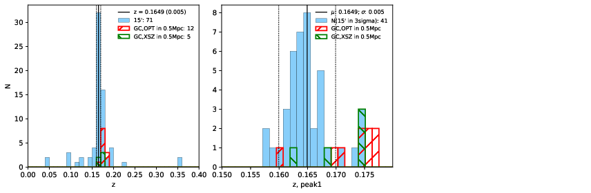 |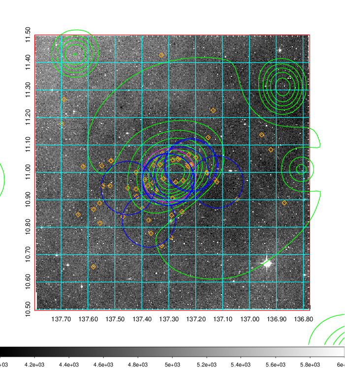  Blue circle for optical clusters;  Magenta circle for XSZ clusters;  all with r=1Mpc;  Only GC with Delta_z<0.01 are shown. | 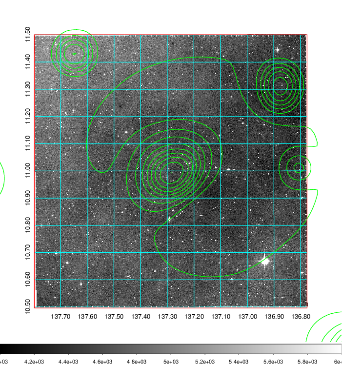 Blue circle for optical clusters;  Magenta circle for XSZ clusters;  all with r=1Mpc;  Only GC with Delta_z<0.01 are shown.  |

|[known Abell/XSZ clusters](../image/310/310_gc.pdf) | [2MASS image](../image/310/310_2mass.pdf)      |[SDSS image](../image/310/310_sdss.pdf)   |
|-------------------|-------------------|-------------------|
|  Magenta, blue and green circles  for optical, X-ray and SZ clusters  respectively, with redshift of clusters  labelled. The radius of circles  are 1Mpc.|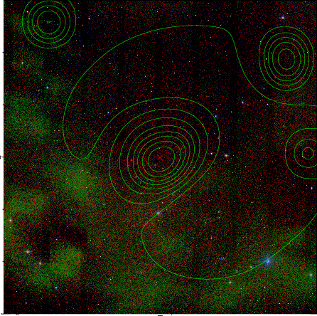  | 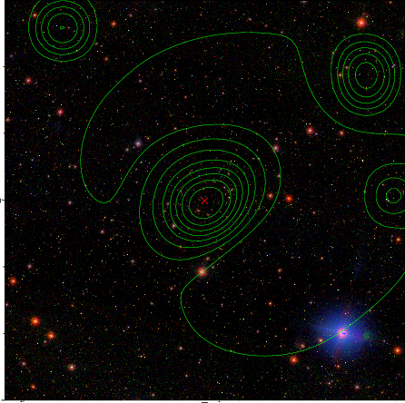  |

