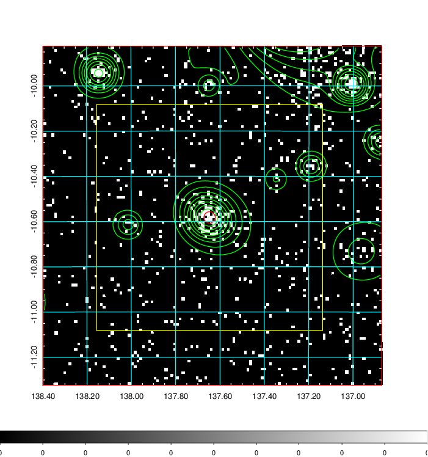
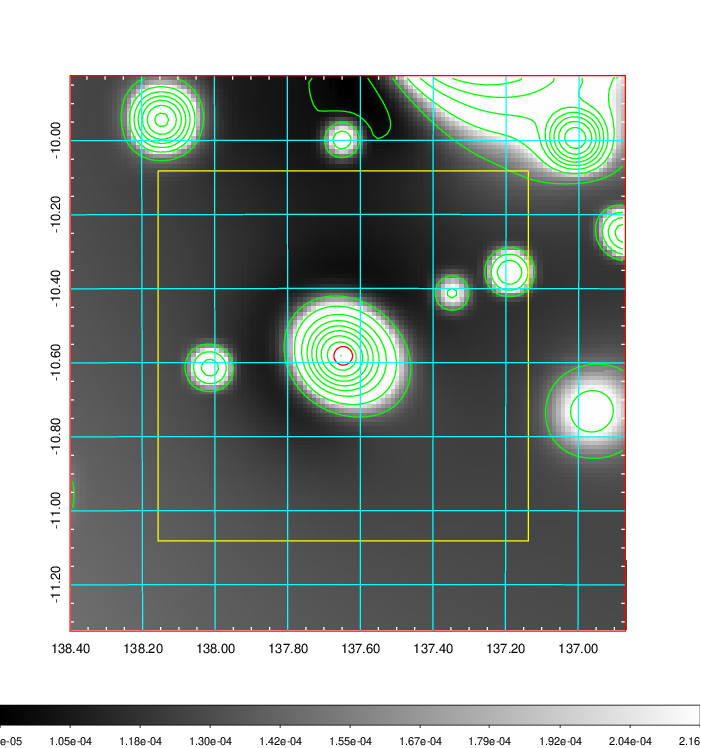
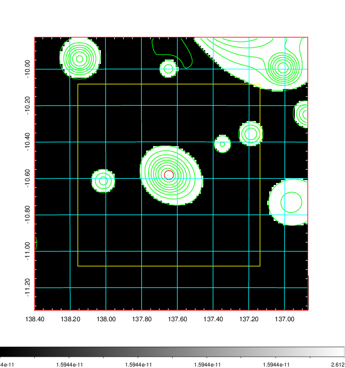
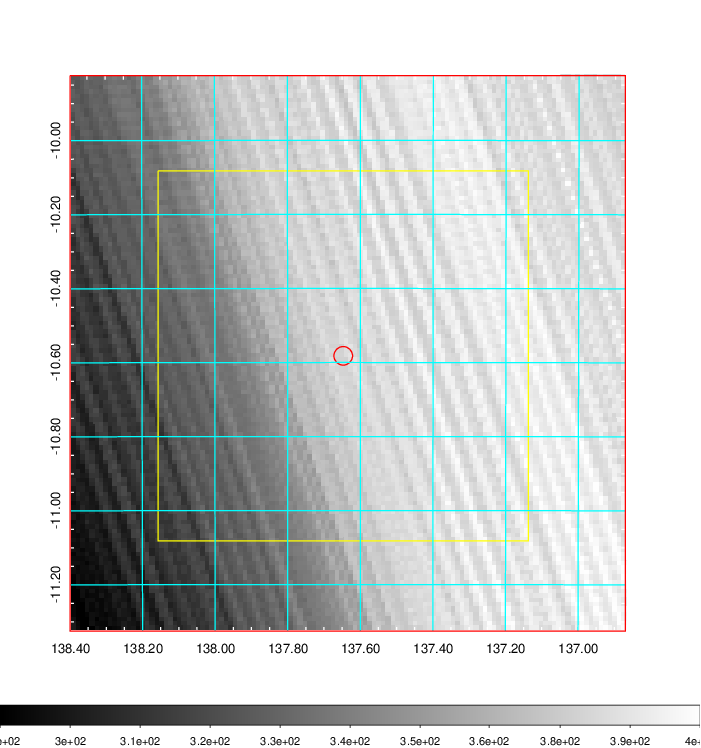
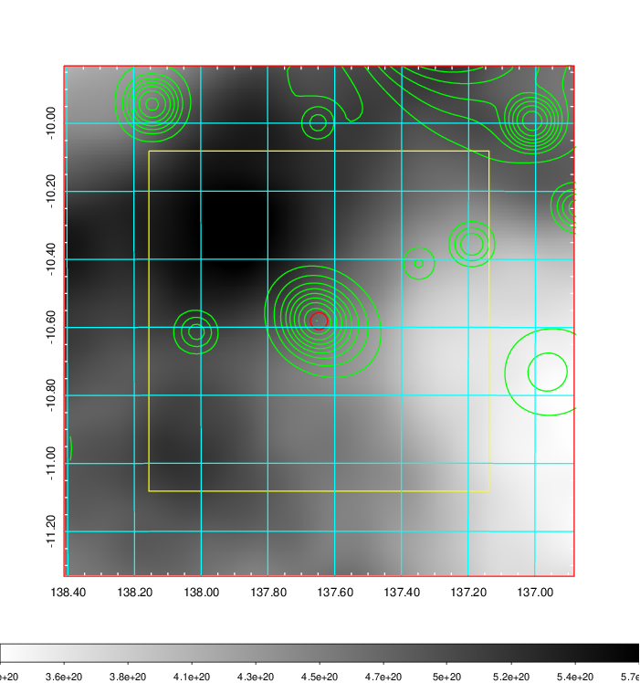
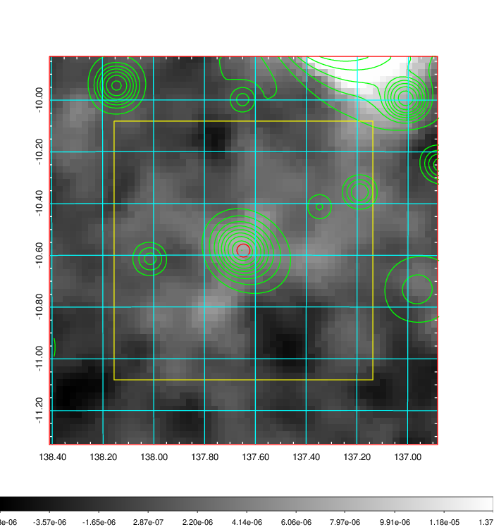
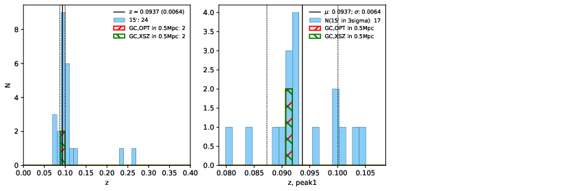
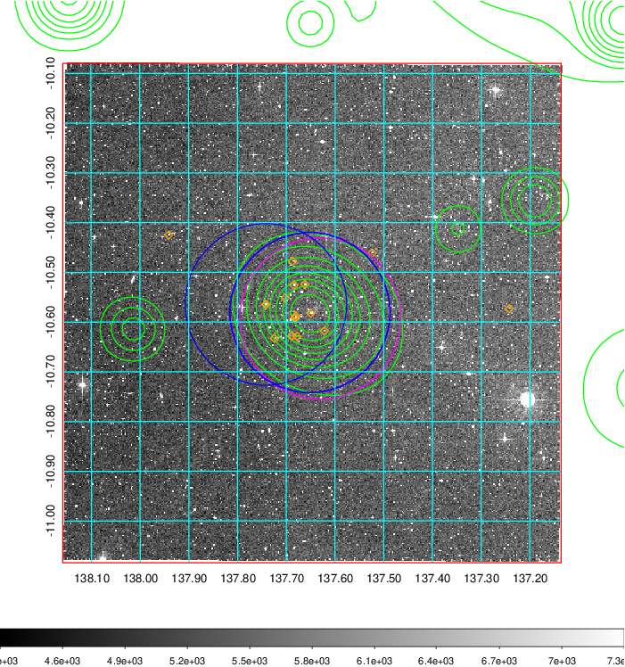
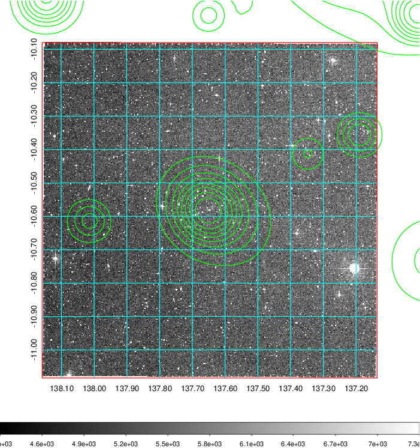
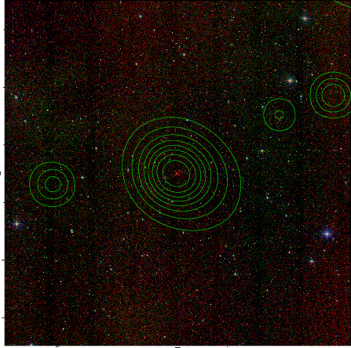

### 311

|Name|RAJ2000[deg]|DEJ2000[deg] |Ext[arcmin]| Ext,ml | z | z_src| C|GC(XSZ,Delta_z<0.01)| GC(OPT,Delta_z<0.01)|GC| R_sig[arcmin] | R500[arcmin] | R500[Mpc]| CRsig[c/s] | CR500[c/s] |L500[1E44 erg/s]|F500[1E-12 erg/s/cm^2]| M500[1E14 Msun]|Tx[keV]|Cnt_sig|Beta|Rc[arcmin]|Comment|Alias|
|---|---|---|---|---|---|------|---|--------|---------|----------|---|---|---|---|---|---|---|---|---|---|---|---|---|---|
|311| 137.647| -10.582| 1.51| 50.84| 0.0937(0.006)| z1, z_xsz| B| MCXC, XB| A| A, MCXC, W, XB| 9.775| 8.940| 0.934| 0.269(0.038)| 0.266(0.037)| 1.066(0.069)| 4.830(0.313)| 2.53(0.08)| 3.91(0.08)| 97.1| 0.874(-0.120+0.087)| 3.458(-0.696+0.505)| -| k117|

|[RASS image](../image/311/311_img.pdf)|[filtered image](../image/311/311_fil.pdf)|[Segment image](../image/311/311_seg.pdf)|
|-------------------|--------------------|-------------------|
|   |    |   |

|[Exposure image](../image/311/311_mex.pdf)| [nH image](../image/311/311_nh.pdf)| [Planck image](../image/311/311_p.pdf)|
|-------------------|--------------------|-------------------|
|   |     |  |

|[Redshift Histogram](../image/311/311_zg.pdf) | [DSS image(z1)](../image/311/311_dss_z1.pdf)      |  [DSS image(z2)](../image/311/311_dss_z2.pdf)    |
|-------------------|--------------------|-------------------|
| |  Blue circle for optical clusters;  Magenta circle for XSZ clusters;  all with r=1Mpc;  Only GC with Delta_z<0.01 are shown. |  Blue circle for optical clusters;  Magenta circle for XSZ clusters;  all with r=1Mpc;  Only GC with Delta_z<0.01 are shown.  |

|[known Abell/XSZ clusters](../image/311/311_gc.pdf) | [2MASS image](../image/311/311_2mass.pdf)      |
|-------------------|-------------------|
|  Magenta, blue and green circles  for optical, X-ray and SZ clusters  respectively, with redshift of clusters  labelled. The radius of circles  are 1Mpc.|  |

|[PS1 image](../image/311/311_ps1.pdf)            |
|-------------------|
|   |
