

### 312

|Name|RAJ2000[deg]|DEJ2000[deg] |Ext[arcmin]| Ext,ml | z | z_src| C|GC(XSZ,Delta_z<0.01)| GC(OPT,Delta_z<0.01)|GC| R_sig[arcmin] | R500[arcmin] | R500[Mpc]| CRsig[c/s] | CR500[c/s] |L500[1E44 erg/s]|F500[1E-12 erg/s/cm^2]| M500[1E14 Msun]|Tx[keV]|Cnt_sig|Beta|Rc[arcmin]|Comment|Alias|
|---|---|---|---|---|---|------|---|--------|---------|----------|---|---|---|---|---|---|---|---|---|---|---|---|---|---|
|312| 138.025| 13.674| 3.52| 29.02| 0.1798(0.005)| z1, z_xsz| B| F20| C, N, RM, W| C, F20, N, W| 9.775| 5.165| 0.940| 0.091(0.035)| 0.084(0.033)| 1.426(0.267)| 1.572(0.295)| 2.82(0.26)| 4.30(0.25)| 32.5| 0.919(-0.107+0.059)| 7.043(-0.925+0.851)| -| t167|

|[RASS image](../image/312/312_img.pdf)|[filtered image](../image/312/312_fil.pdf)|[Segment image](../image/312/312_seg.pdf)|
|-------------------|--------------------|-------------------|
| 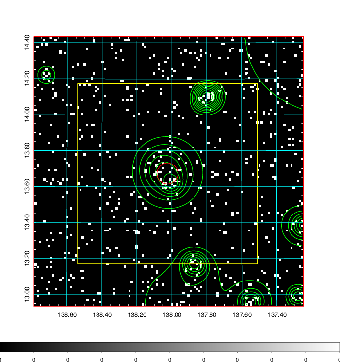  | 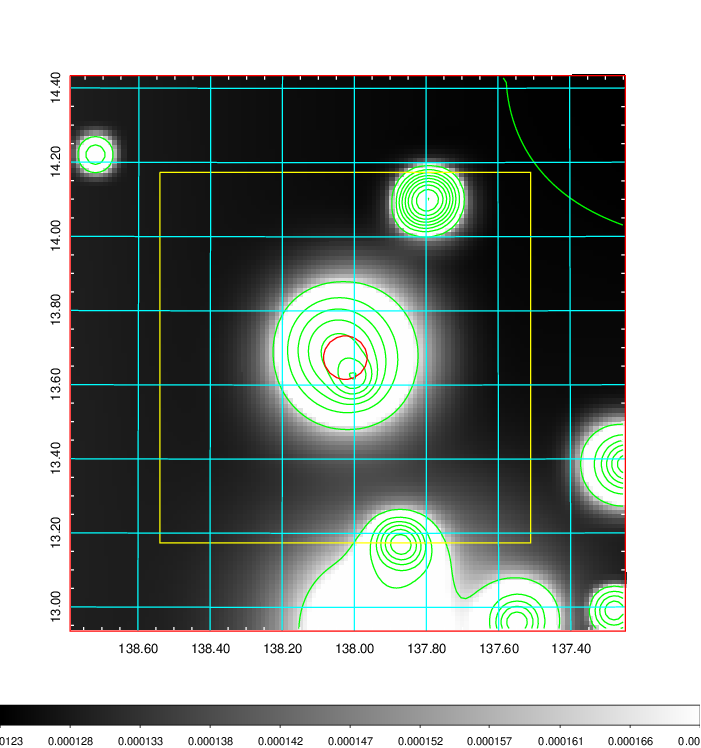   | 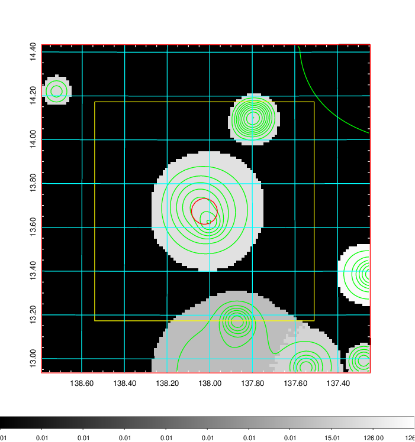  |

|[Exposure image](../image/312/312_mex.pdf)| [nH image](../image/312/312_nh.pdf)| [Planck image](../image/312/312_p.pdf)|
|-------------------|--------------------|-------------------|
|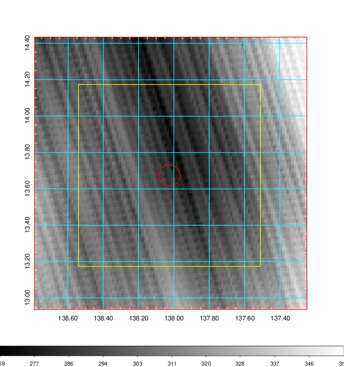   | 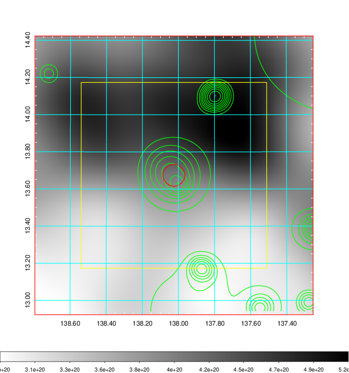    | 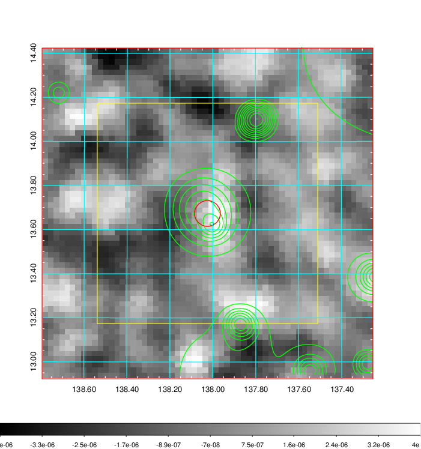 |

|[Redshift Histogram](../image/312/312_zg.pdf) | [DSS image(z1)](../image/312/312_dss_z1.pdf)      |  [DSS image(z2)](../image/312/312_dss_z2.pdf)    |
|-------------------|--------------------|-------------------|
|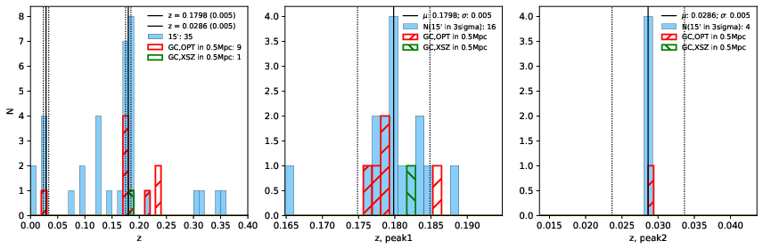 |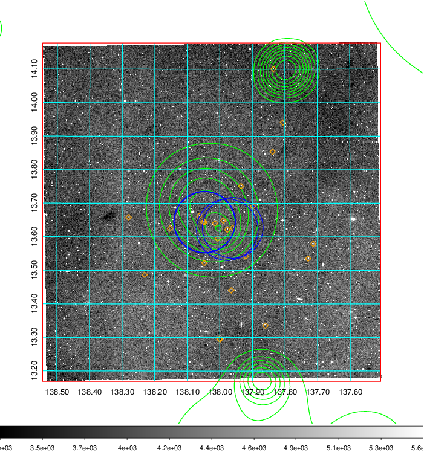  Blue circle for optical clusters;  Magenta circle for XSZ clusters;  all with r=1Mpc;  Only GC with Delta_z<0.01 are shown. | 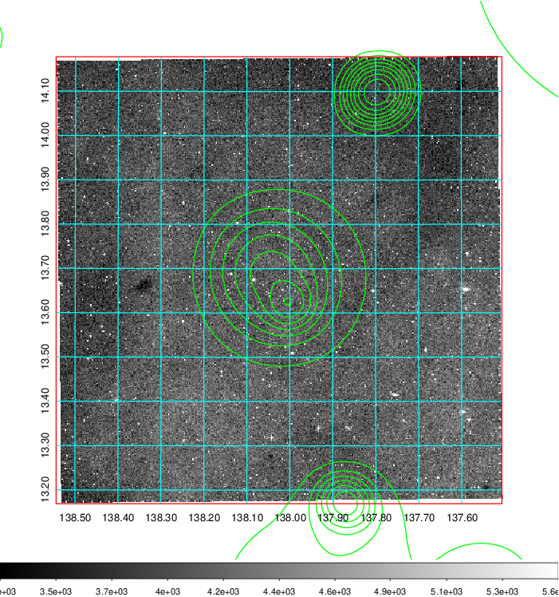 Blue circle for optical clusters;  Magenta circle for XSZ clusters;  all with r=1Mpc;  Only GC with Delta_z<0.01 are shown.  |

|[known Abell/XSZ clusters](../image/312/312_gc.pdf) | [2MASS image](../image/312/312_2mass.pdf)      |[SDSS image](../image/312/312_sdss.pdf)   |
|-------------------|-------------------|-------------------|
|  Magenta, blue and green circles  for optical, X-ray and SZ clusters  respectively, with redshift of clusters  labelled. The radius of circles  are 1Mpc.|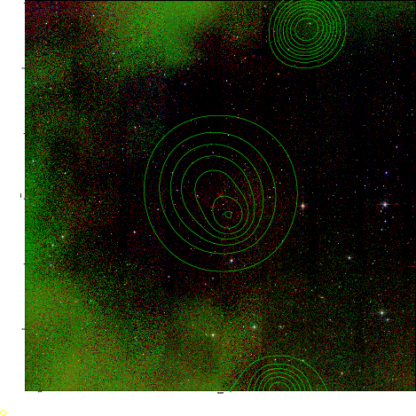  | 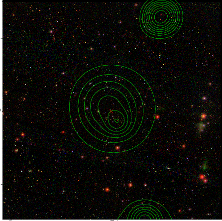  |

